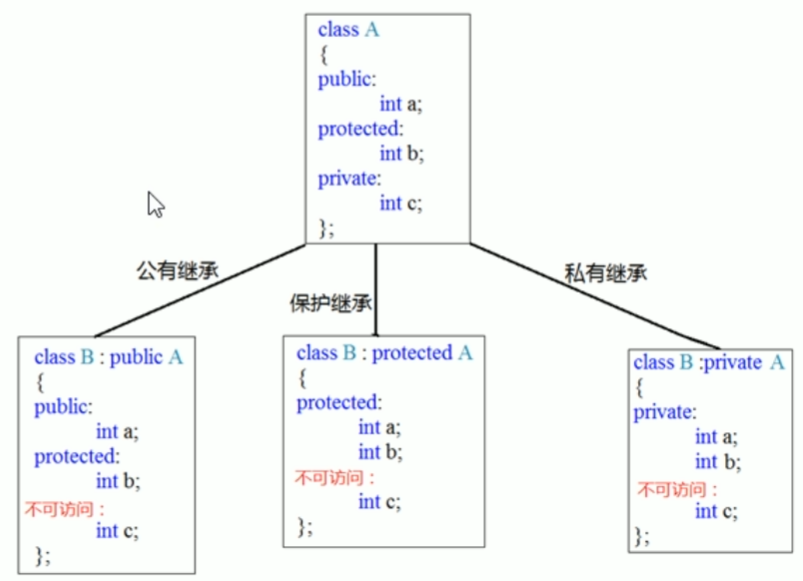

# 1.C语言概述


1.**编译器**把**源代码(.c)**转换成**中间代码(.obj)**。

2.**链接器**把中间代码和其他代码**合并**，生成**可执行文件(.exe)**。

3.链接器只会把程序中要用到的库函数代码提取出来。


**预处理指令：**

通常，C编译器在编译前会对源代码做一些准备工作，即预处理。


**声明：**

声明把特定**标识符**和计算机**内存中的特定位置**联系起来，同时也确定了储存在某个位置的**数据类型**。

C语言中，所有变量必须先声明才能使用。


## 2.数据类型


1.无论把数字写成16，020或0x10，存储该数的方式都相同，因为计算机内部都以**二进制**进行编码。


2.以十进制，八进制，十六进制打印十进制数100：

```c
int x = 100;
printf("dec = %d; octal = %o;hex = %x\n",x,x,x);
printf("dec = %d; octal = %#o;hex = %#x\n",x,x,x);
```

**注意：**如果要在八进制和十六进制值前显示**0和0x前缀**，要分别在转换说明中加入**#**。


3.在给函数传递参数时，C编译器把short类型的值自动转换成int类型的值。

int类型被认为是计算机处理整数类时最高效的类型。


4.**char**类用于存储字符，但char类型**实际上存储的是整数而不是字符**。


5.C语言中，用**单引号**括起来的单个字符被称为**字符常量**。编译器一旦发现'A'，就会将其转换成相应的代码值。


6.**_Bool**类型实际上也是一种**整数类型**，但原则上它仅占用**一位**存储空间。


7.C语言规定short最少16位，int最少16位，long最少32位，long long最少64位。


8.C语言用1代表true，0代表false


## 3.字符串


**strlen()**：获取字符串的长度

**sizeof()**：获取所占用的字节数


1.字符和string的区别：


2.#define的用法：

define可以定义数字常量，字符常量和字符串常量

#define NAME value

#define PI 3.14

#define BEEP '\a'

#define OOPS "Hello"


3.printf()使用变量，常量和表达式。而scanf()使用指向变量的指针。


4.scanf()允许把普通字符放在格式字符串中，除空格外的普通字符必须与输入字符串严格匹配。

除了%c，其他转换说明都会自动跳过待输入值前面所有的空白。


**5.printf()和scanf()中的*修饰符：**

printf()：用*修饰符代替字段宽度

scanf()：把*放在%和转换字符之间，会使得scanf()跳过响应的输入项。


**6.getchar()与putchar()：**

getchar()和putchar()不需要转换说明，因为他们**只处理字符**。


## 4.表达式


1.C语言规定，sizeof返回size_t类型的值，是一个无符号整数类型。


2.完整表达式：就是指这个表达式不是另一个更大表达式的子表达式。


3.逗号运算符：逗号运算符是一个**序列点**，保证了左侧子表达式的副作用在在对右侧子表达式求值之前发生。


4.**&&**是一个**序列点**，保证了左侧子表达式的副作用在在对右侧子表达式求值之前发生。


5.逻辑表达式的求值顺序是从左往右。


# 5.I/O


## 缓冲区

缓冲分为两类：完全缓冲I/O和行缓冲I/O

**完全缓冲：**指缓冲区被填满时才刷新缓冲区。缓冲区大小取决于系统

**行缓冲：**指在出现换行符时刷新缓冲区。


在C语言中，用getchar()读取文件结尾时将返回一个特殊的值，即EOF。scanf()函数检测到文件结尾时也返回EOF。通常，scanf()定义在stdio.h文件中。


## 重定向

假设要用echo_eof.c把键盘输入的内容发送到名为mywords的文件中。然后，输入以下命令并开始输入：

​	echo_eof>mywords

">" 符号是一个	重定向运算符，它创建了一个名为mywords的新文件。然后把echo_eof的输出重定向至该文件中。


这次把文件重定向到程序：

​	echo_eof < mywords

**注意：**

重定向运算符连接一个**可执行程序**和一个**数据文件**。(不能连接两个数据文件或两个可执行程序)

使用重定向运算符不能读取多个文件的输入，也不能把输出定向至多个文件。


## 字符输入

getchar()读取每个字符，包括空格，制表符和换行符。

scanf()在读取数字时则会跳过空格，制表符和换行符。


通常，系统使用行缓冲输入，即当用户按下Enter键之后输入才被传送给程序。按下Enter键也传送了一个换行符，编程时要注意处理这个换行符。


# 6.指针和数组


1.在C中，可以通过&运算符访问地址，通过*运算符获得地址上的值。


2.如果不初始化数组，则和普通变量一样，其中存储的都是垃圾值。

如果部分初始化数组，则剩余的元素会被初始化为0。


3.指针+1指的是增加一个储存单元。


4.**int *ar**形式和**int ar[]**形式都是表示ar是一个**指向int的指针**。但是int ar[]只能用于声明形式参数。


## 指针的操作


**赋值：**可以把地址赋给指针。地址应该与指针类型兼容，不能把double类型的地址赋给int类型的指针。

**解引用：***运算符给出地址上储存的值。

**取址：**&运算符给出指针本身的地址。

**指针与整数相加/相减：**整数会和指针所指向类型的大小相乘，然后把结果与初始地址相加。

**指针求差：**可以计算出两个元素之间的距离。单位是数组类型的单位。


## const与指针

**常量指针：**本质上是指针。但指向的是常量。

指针的指向可以改变。但不能通过该指针改变指向的变量的值。

```c
const double * p1;	
double const* p1;
//无论是指针表示法还是数组表示法，都不允许使用p1改变它所指向数据的值。
```


**指针常量：**指针本身是常量，因此指向的地址不可以变化。但地址所对应的内容可以变化。

```c
int* const p1;
//注意:const修饰的是p1指针，因此指针的指向不可以改变。
```


**关于指针赋值和const需要注意的规则：**

不能把带有const数据的地址赋给普通指针。因为普通指针可以改变数组的值。

```c
double rates[5];
const double locked[4];
```


## 二维数组指针

```c
int zippo[4][2];
zippo				->	二维数组首元素的地址(每个元素都是内含两个int类型元素的一维数组)
zippo+2			->	二维数组的第三个元素(即一维数组)的地址
*(zippo+2)		->	二维数组第三个元素的首元素地址
*(zippo+2)+1	->	二维数组第三个元素的第二个元素的地址
*(*(zippo+2)+1)	->	二维数组的第三个一维数组元素的第二个int类型元素的值，即zippo[2][1]
```


二维数组的指针：

```c
int (*pz)[2];	//pz指向一个内含两个int类型值的数组
pz = zippo;
```


**C和C++关于const的区别：**

```c
const int y;
const int * p2 = &y;
int * p1;
p1 = p2;	//C++中不允许这样做，但是C可能只给出警告
```

C++不允许把const指针赋给非const指针。


**注意：**

```c
int sum(int ar[][], int rows);	//错误的声明
int sum(int ar[][4], int rows);	//有效声明
//一般而言，声明一个指向N维数组 的指针时，只能省略最左边方括号中的值
//因为第1对方括号只用于表明这是一个指针，而其他的方括号则用于描述指针所指向数据对象的类型。
```


**数组总结：**

对于传统的C数组，必须用常量表达式指明数组的大小，所以数组大小在编译之前已经确定。

C99/C11新增了变长数组，可以用变量表示数组大小。这意味着变长数组的大小延迟到程序运行时才确定。


# 7.字符串函数


**puts()**：该函数只显示字符串，而且自动在显示的字符串尾加上换行符。


## 字符串数组


**1.字符串字面量(字符串常量)**

用双括号括起来的内容称为字符串字面量(string literal),也叫字符串常量。

双引号中的字符和编译器自动加入末尾的**\0**字符，都作为字符串储存在内存中。


**注意：**字符串常量属于**静态存储类别**，这说明如果在函数中使用字符串常量，该字符串只会被储存一次，在**整个程序的生命期内存在**。


**2.字符串数组**

定义字符串数组时，必须让编译器知道需要多少空间。

```c
const char m1[40] = "Limit yourself to one line's worth.";	//const表明不会更改这个字符串
//指定数组大小时，要确保数组的元素个数至少比字符串长度多1
//所有未被使用的元素被初始化为\0
```

还可以使用指针表示法创建字符串：

```c
const char * pt1 = "Something is pointing at me";
```


**3.数组和指针**

数组形式和指针形式有何不同？

当把程序载入内存时，也载入了程序中的字符串。字符串存储在静态存储区。

但是，当程序在开始运行时才会为该数组分配内存。

**总结：**初始化**数组**把静态存储区的字符串拷贝到数组中，而初始化**指针**只能把字符串的地址拷贝给指针。


**4.数组和指针的区别**

```c
char heart[] = "I love Twillie!";
const char *head = "I love Millie!";
//区别:只有指针表示法可以进行递增操作
while(*(head)!='\0')
    putchar(*(head++));
```

如果打算修改字符串，就不要用指针指向字符串字面量。


## 字符串输入


**gets()：**它读取整行输入，直到遇到换行符，然后丢弃换行符，存储其余字符，并在字符末尾添加上一个空字符

**注意：**因为gets()函数无法判断输入的字符串的长度，所以存在安全隐患。建议使用代替品。


**1.fgets()函数：**

```c
//fgets()函数的第2个参数指明了读入字符的最大数量
//如果fgets()读到一个换行符，会把它存储在字符串中
//fgets()的第3个参数指明要读入的文件。如果读入从键盘输入的数据，则以stdin作为参数

//fputs()函数的第2个参数指明要写入的文件，如果要显示在显示器上，应使用stdout作为参数
#define STLEN 14
char words[STLEN];
fgets(words,STLEN,stdin);	//从键盘读入数据
fputs(words,stdout);
//fgets()函数返回指向char的指针。该函数返回的地址与传入的第1个参数相同
//fgets()函数如果读到文件结尾，他将返回一个空指针。
```

读入并显示用户输入的内容，直到fgets()读到文件结尾或空行(即首字符为换行符)

```c
while(fgets(words,STLEN,stdin)!=NULL && words[0]!= '\n')
    fputs(words,stdout);
```

注意：系统使用缓冲的I/O，这意味着用户按下Return后，就在输入中增加了一个换行符。


**2.gets_s()函数：**

C11新增的gets_s()与fgets()类似。

```c
gets_s(words,STLEN);
//gets_s()只从标准输入中读取数据，因此不需要第三个参数。
//如果gets_s()读取到换行符，会丢弃它而不是储存。
```


**scanf()函数：**

scanf()函数返回一个整数值，该值等于scanf()成功读取的项数或EOF


## 字符串输出

C有三个标准库函数用于打印字符串：puts()，fputs()，printf()


**1.puts()函数：**

```c
//puts()在显示字符串时会自动在其末尾添加一个换行符
//该函数在遇到空字符时就停止输出
puts("I am an argument to puts().");//用双引号括起来的内容是字符串常量，且被视为该字符串的地址
```


**2.fputs()函数：**

fputs()函数是puts()针对文件定制的版本。

```c
//1.fputs()的第2个参数指明要写入数据的文件。如果要打印在显示器上，可以用stdout
//2.fputs()不会在输出的末尾添加换行符

```


**3.printf()函数：**

printf()不会自动在每个字符串末尾添加换行符。


## 字符串函数

C库提供了多个处理字符串的函数，这些函数的原型放在string.h头文件中。


### strlen()函数

strlen()函数用于统计字符串的长度。


### **strcat()函数**

strcat()函数接收两个字符串作为参数，用于**拼接字符串**。

```c
//该函数把第2个字符串的备份附加在第一个字符串末尾
//并把拼接后的新字符串作为第1个字符串
//char* strcat(char *str1,char *str2)
strcat(flower,addon);
```


strncat()函数

strcat()函数无法检查第1个数组是否能容纳第2个字符串。

第三个参数指定了最大添加字符数。

```c
//char* strncat(char *str1, char *str2, int size)
strncat(bug,addon,available);
```


### **strcmp()函数**

strcmp()函数**比较的是字符串**，不是整个数组。

strcmp()的返回值：**相等返回0**。第一个字符串大于第二字符串返回正数，反之返回负数。

```c
#define ANSWER "Grant"	//第2个字符串
char try[SIZE];	//第1个字符串
strcmp(try,ANSWER);
//strcmp()会比较try中第1个空字符前面的部分。
//所以，可以用strcmp()比较储存在不同大小数组中的字符串。
```


**strncmp()函数：**

此函数可以指定比较的字符数

```c
int i = strncmp(list[i], "astro", 5);
//比较list[i]和"astro"的前五个字符
```


### **strcpy()函数**

如果pts1和pts2都是指向字符串的指针，那么下面拷贝的是地址而不是字符串本身：

```c
pts2 = pts1;
```

如果希望拷贝整个字符串，要使用strcpy()函数。

strcpy()返回一个**char*指针**，即第1个字符的地址

```c
//函数原型：char* strcpy(char* string1, char* string2)
strcpy(string1,string2);
//把字符串2的内容拷贝到字符串1数组中
//strcpy()接收两个字符串指针作为参数
//第一个参数不必指向数组的开始
strcpy(copy+7,orig);
```


**strncpy()函数：**

strcpy()同样不能检查目标空间是否能容纳源字符串副本。因此使用strncpy()更安全

```c
strncpy(target,source,n);
//把source中的n个字符或空字符之前的字符拷贝至target处。
```


### sprintf()函数

该函数与printf()类似，但是它把数据写入字符串，而不是打印在显示器。

因此，该函数可以把多个元素组成一个字符串。

```c
//sprintf()第1个参数是目标字符串的地址，其余参数和printf()相同ice
char first[20];
char last[20];
char formal[30];
double price;
sprintf(formal,"%s,%s,%d",last,first,price);
```


## 命令行参数

C编译器允许main()没有参数或者有两个参数。

main()有两个参数时：

第1个参数是命令行中的字符串数量。

第2个参数负责存放字符串数组的地址。

如果系统允许：就把程序本身的名字赋给argv[0]，然后把第1个字符串赋给argv[1]，以此类推。


# 8.内存管理

一般而言，那些**指定对象**的表达式被称为**左值**。

如果可以使用左值改变对象中的值，该左值就是一个**可修改的左值**。


不同的存储类别具有不同的存储期，作用域和链接。


## 储存类别

### 作用域

作用域描述程序中**可访问标识符的区域**。

一个C变量的作用域可以是块作用域，函数作用域，函数原型作用域或文件作用域。


1.定义在函数外面的变量，具有文件作用域。从它的定义处到该文件的末尾可见。

文件作用域变量也称为全局变量。


**翻译单元和文件：**

编译器**源代码文件**和**所有的头文件**都看成是一个**单独文件**。这个文件被称为**翻译单元**。描述一个具有文件作用域的变量时，它的实际可见范围是整个翻译单元。


### 链接

C变量有三种链接属性：**外部链接**，**内部链接**，**无链接**。

具有块作用域，函数作用域的变量都是**无链接变量**。

static修饰的文件作用域变量是**内部链接**。

没有static修饰的文件作用域变量是**外部链接**。

```c
int giants = 5;	//文件作用域，外部链接
static int dodgers = 3; //文件作用域，内部链接
int main()
{
    ...
}
...
```


### 存储期

存储期描述了对象的生命周期。

静态存储期，线程存储期，自动存储期，动态分配存储期。


**静态存储期：**在程序的执行期间一直存在。如文件作用域变量。

**线程存储期：**从被声明时到线程结束一直存在。

**自动存储期：**块作用域的变量通常有自动存储期。当程序进入定义这些变量的块时，分配内存。退出块时，释放变量分配的内存。

**注意：**给块作用域变量加上static，也能拥有静态存储期。

```c
void more(int number)
{
    int index;	//自动存储期
    static in ct = 0;	//静态存储期，
    return 0;
}
```


**自动变量**

关键字auto是存储类别说明符。auto关键字在C++中的用法完全不同。


**寄存器变量**

变量通常储存在计算机内存中。概括的说，储存在最快的可用内存中。由于**寄存器变量储存在寄存器而非内存中，所以无法获取寄存器变量的地址。**

寄存器变量基本和自动变量一样。块作用域，无链接，自动存储期。

```c
register int quick;
```


**块作用域的静态变量**

具有块作用域。但是程序离开他们所在的函数后，这些变量不会消失。也就是说：这种变量具有**块作用域**，**无链接**，但是有**静态存储期**。

```c
void trystat()
{
    int fade = 1;	//每次调用时fade都是1
    static int stay = 1;	//每次调用时stay都+1
    printf("fade=%d and stay=%d\n",fade++,stay++);
}
//静态变量和外部变量在程序被载入内存时已经执行完毕
```


**外部链接的静态变量**
外部链接的静态变量具有文件作用域，外部链接和静态存储期。

如果一个源代码文件使用的外部变量定义在另一个源文件中，则必须用**extern**在该文件中声明该变量。


外部变量如果没有被初始化，他们会被自动初始化为0。


### **存储类别说明符**

auto, register, static, extern, _Thread_local, typedef


### 函数存储类别

可以是外部函数(默认)或静态函数，内联函数。

```c
double gamma(double);	//外部函数
static double beta(int,int);	//静态函数
extern double delta(double,int);	//内联函数
```

通常的做法是，使用extern关键字声明定义在其他文件中的函数。


## malloc/free

该函数接受一个参数：所需的内存字节数。

```c
void* malloc(size_t size);	//函数原型
//该函数返回一个通用指针
//如果malloc()分配内存失败，将返回空指针
double * ptd;
ptd = (double*)malloc(30 * sizeof(double));
```


使用一个指针，调用malloc()来创建数组。这种方法可以创建动态数组。

这种数组和普通数组不同，可以在程序运行时选择数组的大小和分配内存。

```c
double item[n];
ptd = (double*)malloc(n*sizeof(double));
```


通常，malloc()和free()要配套使用。free()函数的参数是之前malloc()返回的地址。

**动态内存的存储期是从调用malloc()到调用free()为止。**


```c
void* calloc(size_t num,size_t size);
//Allocates a block of memory for an array of num elements, each of them size bytes long, and initializes all its bits to zero.
//calloc()函数会把块中所有位设置为0
```


**const：**

简而言之，const放在*左侧任意位置，限定了指针指向的数据不能改变。

const放在*的右侧，限定了指针本身不能改变。

```c
const float* pf;	//指针指向的内容不能改变
float const * pfc;	//同上

float* const pt;	//pt是一个const指针，地址不能改变
```


**注意：**如果一个指针仅用于给函数访问值，应该将它声明为一个指向**const限定类型的指针**。


## volatile

volatile限定符告诉计算机，代理(而不是变量所在的程序)可以改变该变量的值。通常被用于硬件地址以及在其他程序或同时运行的线程中共享数据。


为何ANSI委员把volatile关键字放入标准？原因是它涉及编译器的优化。


## restrict

restrict关键字允许编译器优化某部分代码。它只能用于指针。

表明该指针是访问数据对象的唯一且初始的方式。

考虑两个函数原型：

```c
void* memcpy(void* restrict s1,const void* restrict s2,size_t n);
void* memmove(void* s1,const void* s2,size_t n);
```

这两个函数都从位置s2把n个字节拷贝到s1。

memcpy()要求两个位置不重叠。

memmove()函数允许重叠。

**restrict关键字刚好满足了memcpy()不重叠的要求。**


## _Atomic

**(C11)**

当一个线程对一个原子类型的对象执行原子操作时，其他线程不能访问该对象。

```c
//int hogs = 12;可以替换成：
_Atomic int hogs;	//hogs是一个原子类型的变量
atomic_store(&hogs,12);	//stdatomic.h中的宏
```

这里，在hogs中储存12是一个原子过程，其他线程不能访问hogs。


# 9.文件I/O

文件通常是磁盘或固态硬盘上的一段已命名的存储区。


**文本模式和二进制模式**

如果文件最初使用二进制编码的**字符**(ASCII或Unicode)表示文本，该文件就是**文本文件**。


如果文件中二进制值代表机器语言代码或者**数值数据**或**图片**或者**音乐编码**，该文件就是一个**二进制文件**，其中包含二进制内容。


I/O**的级别**

底层的I/O使用操作系统提供的基本I/O服务。

标准高级I/O使用C库的标准包和stdio.h头文件定义。


## 标准I/O

标准I/O相对于底层I/O可移植。

输入和输出都是缓冲的。也就是说，一次转移一大块信息而不是一字节信息。


### 1.fopen()

**fopen()**函数打开文件。

```c
/*
参数1:待打开文件的名称(字符串地址)
参数2:待打开文件的模式(字符串)
返回值:返回文件指针
*/
fopen(argv[1],"r");	//以读模式打开文件
fopen(argv[1],"w");	//以写模式打开文件
```


### 2.getc()/putc()

和getchar()，putchar()函数类似。

不同的是，要告诉getc()和putc()函数使用哪个文件。

```c
//从标准输入中获取一个字符
ch = getchar();

//从fp指定的文件中获取一个字符
ch = getc(fp);
//把字符ch放入FILE指针fpout指定的文件中
putc(ch,fpout);
```


### 3.fclose()

fclose()函数关闭fp指定的文件，必要时刷新缓冲区。

```c
//对于较正式的程序，应该检查文件是否关闭成功，fclose()函数返回0，否则返回EOF
if(fclose(fp)!=0)
    printf("Error in closing file!");
```


### 4.fprintf()

fprintf()和fscanf()函数的工作方式与printf()和scanf()类似，区别在于前者需要**一个参数指定待处理文件**。

```c
while(fscanf(fp,"%s",words)==1)
{
    puts(words);
    fprintf(fp,"%s\n",words);
}
```


### 5.fgets()

fgets()函数读取输入知道第一个换行符的后面。

fgets()在遇到EOF时将返回NULL值。

```c
/*
第一个参数：表示储存输入位置的地址
第二个参数：表示待输入字符串的大小
第三个参数：文件指针，指定待读取的文件
*/
fgets(buf,STLEN,fp);
```


**fputs()**函数接收两个参数

```c
//第一个参数：字符串的地址
//第二个参数：文件指针
fputs(buf,fp);
```

**注意：**由于fputs()保留了换行符，fputs()就不会再添加换行符。


### 6.fseek()

**随机访问**。有了fseek()函数，便可把文件看作是数组，在fopen()打开的文件中移动到任意字节处。

```c
/*
int fseek(FILE* stream, long int offset, int origin);
第一个参数：FILE指针，指向待查找的文件
第二个参数：偏移量，表示从起始点开始要移动的距离
第三个参数：模式，该参数确定起始点
如果一切正常，fseek()的返回值是0，出现错误返回值为-1
*/
fseek(fp,0L,SEEK_END);		//定位到文件末尾
fseek(fp,-10L,SEEK_END);	//从文件结尾回退10个字节


/*
long ftell(FILE* stream);	//返回当前流的位置索引
*/
long last = ftell(fp);	//拿到文件最后一个字符
```


### 7.fgetpos()

fseek()和ftell()潜在的问题是，它们都把文件大小限制在long类型能表示的范围内。

两个处理较大文件的新定位函数：fgetpos()和fsetpos()。

这两个函数使用新类型：fpos_t，文件定位类型。

```c
int fgetpos(FILE* restrict stream, fpos_t* restrict pos);

int fsetpots(FILE* stream, const fpos_t *pos);
//调用该函数时，使用pos指向位置上的fpos_t类型值来设置文件指针指向该文件指定的位置。
//如果成功，返回0。如果失败返回非0
```


## 标准I/O的机理

通常，使用标准I/O的第一步是调用fopen()打开文件。

C程序会自动打开3种标准文件。fopen()打开一个文件，还创建一个缓冲区，以及一个包含文件和缓冲区数据的结构。

另外，fopen()返回一个指向该结构的指针。我们说fopen()函数"打开一个流"。

由于stdio.h系列的所有输入函数都是用相同的缓冲区，所以调用任何一个函数都将从上一次函数停止调用的位置开始。


## 其他标准I/O


### 1.ungetc()

此函数把指定的字符放回输入流中。如果把一个字符放回输入流，下次调用标准输入函数时将读取该字符。

例：假设要读取下一个冒号之前的所有字符。可以用getchar()或getc()函数读取到冒号，然后用ungetc()把冒号放回到输入流中。

```c
//prototype
int ungetc(int c, FILE* fp);

ch = getchar();		//读取一个字符
ungetc(ch,stdin);	//把读取到的字符放回输入流
```


### 2.fflush()

调用fflush()函数引起输出缓冲区中所有的未写入数据被发送到fp指定的输出文件。这个过程称为刷新缓冲区。

如果fp是空指针，所有输出缓冲区都被刷新。

在输入流使用fflush()函数的效果是未定义的。

```c
//prototype
int fflush(FILE* fp);
```


### 3.setvbuf()

该函数创建了一个供标准I/O函数替换使用的缓冲区。在打开文件后且未对流进行其他操作之前，调用该函数。

```c
//prototype
int setvbuf(FILE* restrict fp, char* restrict buf, int mode, size_t size);
/*
参数1:指针fp识别待处理的流
参数2:buf指向待使用的存储区。如果buf值不是NULL，则必须(自动)创建一个缓冲区。
参数3:mode:_IOFBF表示完全缓冲(缓冲区满时刷新)，_IOLBF表示行缓冲(写入一个换行符时)，_IONBF表示无缓冲
参数4:变量size告诉setvbuf()数组的大小
如果操作成功，函数返回0。失败返回一个非零值
*/
```


为保证数组在储存前后一致，最精确的做法是使用与计算机相同的位组合来储存。因此，double类型的值应该储存在一个double大小的单元中。

如果以程序所用的表示法把数据储存在文件中，则称以**二进制形式储存数据**。

实际上，所有的数据都是以二进制形式储存的。

如果文件中的所有数据都被解释成字符码，则称改文件包含文本数据。

如果部分或所有的数据都被解释成二进制形式的数值数据，则称改文件包含二进制数据。


### 4.fwrite() 

此函数把**二进制数据**写入文件。

```c
//prototype
size_t fwrite(const void* restrict ptr, size_t size, size_t nmemb, FILE* restrict fp);
/*
参数1:指针ptr是待写入数据块的地址
参数2:size表示待写入数据块的大小(字节为单位)
参数3:nmemb表示待写入数据块的数量
参数4:fp指定待写入的文件
返回值:返回成功写入项的数量，正常情况下返回值就是nmemb
*/
//例如：要保存一个大小为256字节的数据对象，可以这样做：
char buffer[256];
fwrite(buffer,256,1,fp);	//把一块256字节的数据从buffer写入文件
```


### 5.fread()

该函数用于读取被fwrite()写入文件的数据。参数列表和fwrite()函数相同。

```c
//prototype
size_t fread(const void* restrict ptr, size_t size, size_t nmemb, FILE* restrict fp)；
/*
参数1:指针ptr是待读取文件在内存中的地址
参数2:size表示待写入数据块的大小(字节为单位)
参数3:nmemb表示待写入数据块的数量
参数4:fp为待读取的文件
返回值:返回成功读取项的数量，正常情况下返回值就是nmemb
*/
//例如：要回复上例中保存的内含10个double类型值的数组，可以这样做：
double earnings[10];
fread(earnings,sizeof(double),10,fp);	//该调用把10个double大小的值拷进earnings数组中
```


### 6.foef()

如果标准输入函数返回EOF，则通常表明函数已达到文件结尾。然而，出现读取错误时，函数也会返回EOF。

**foef()**和**ferror()**函数用于区分这两种情况。

当上一次调用检测到文件尾时，foef()函数返回一个非零值。

当读或写出现错误，ferror()函数返回一个非零值。


**总结：**

如果要在不损失精度的前提下保存或回复数值数据，请使用二进制模式以及fread()和fwrite()函数。

如果打算保存文本信息并创建能在普通文本编辑器查看的文本，请使用文本模式和函数(如getc()和fprintf())。

对于Linux和Unix系统，这两种模式完全相同。


# 10.结构体

如果把结构声明置于函数的外部，那么该声明之后的所有函数都能使用它的标记。例如，在程序的另一个函数中，可以这样声明：

```c
struct book dickens;
```


## 结构体声明

就计算机而言，下面的声明：

```c
struct book library;
```

是以下声明的简化：

```c
struct book{
    char title[MAXTITL];
    char author[AXAUTL];
    float value;
} library;
```

简而言之，**声明结构的过程和定义结构变量的过程可以组合成一个步骤。**

如下所示，组合后的结构声明和结构变量定义不需要使用结构标记：

```c
struct{
    char title[MAXTITL];
    char author[MAXAUTL];
    float value;
} library;
```

然而，如果打算多次使用结构模板，就要使用带标记的形式。


## 初始化

结构变量可以这样初始化：

```c
struct book library = {
    "The Pious Pirate",
    "Renee Vivotte",
    1.95
};
```

简而言之，我们使用在一对花括号中括起来的初始化列表进行初始化，各初始化项用逗号分隔。


注意：如果初始化静态存储期的变量，必须使用常量值。


## 结构指针


**声明和初始化结构指针**

```c
struct guy *him;
```

该声明并未创建一个新的结构，但是指针him现在可以指向任意现有的guy类型的结构。

例如，如果barney是一个guy类型的结构，可以这样写：

```c
him = &barney;
```

**注意：**和数组不同的是，结构名并不是结构的地址，因此要在结构名前面加上&运算符。


**指针访问结构成员：**

```c
//如果him == &barney,那么him->income 即是 barney.income
//如果him == &fellow[0], 那么him->income 即是 fellow[0].income
him->income;	//指针访问成员
barney.income;
//barney.income == (*him).income == him->income		假设him==&barney
```


**传递结构的地址**

如果需要在被调函数中修改主调函数中成员的值，就要传递成员的地址。

```c
//定义一个结构
struct funds
{
    char bank[FUNDLEN];
    double bankfund;
    char save[FUNDLEN];
    double savefund;
};
//定义一个使用到结构指针的函数
double sum(const struct funds *money)
{
    return (money->bankfund + money->savefund);
}
//使用结构指针作为函数的参数
sum(&stan);
```


## 其他结构特性


现在的C允许把一个结构赋值给另一个结构。但是数组不能这样做。

```c
o_data = n_data;	//把一个结构赋值给另一个结构
struct names right_field = {"Ruthie","George"};
struct names captain = right_field;	//把一个结构初始化为另一个结构
```

函数还能把结构作为返回值返回。


## 复合字面量

可以把复合字面量作为函数的参数。

如果函数接受一个结构，可以把复合字面量作为实际参数传递：

```c
struct rect
{
    double x;
    double y;
};
//函数定义
double rect_area(struct rect r)
{
    return r.x * r.y;
}
//函数调用
area = rect_area((struct rect){10.5,20.0});	//把复合字面量作为实际参数
```


## 伸缩型数组成员

**条件：**伸缩型数组成员必须是结构的最后一个成员

```c
struct flex{
    int count;
    double average;
    double scores[];	//伸缩型数组成员
};
```

假设用scores表示一个内含5个double类型值的数组，可以这样做：

```c
struct flex *pf;	//声明一个指针
//请求为一个结构和一个数组分配存储空间
pf = malloc(sizeof(struct flex)+5*sizeof(double));
```


**结构保存到文件:**

```c
fwrite(&primer,sizeof(struct book),1,pbooks);
```

以二进制表示法储存数据的缺点是，不同的系统可能使用不同的二进制表示法。


## 联合

union是一种数据类型，它能在同一个内存空间中储存不同的数据类型。

其典型的用法是：

设计一种表以储存既无规律，事先也不知道顺序的混合类型。使用联合类型的数组，其中的联合都大小相等，每个联合可以储存各种数据类型。

```c
//声明一个联合
union hold{
    int digit;
    double bigfl;
    char letter;
};
```

以上形式声明的结构可以储存一个int类型，一个double类型和char类型。

然而，声明的**联合**只能储存一个int类型**或**者一个double类型**或**一个char类型的值。

```c
union hold valA;
valA.letter = 'R';

union hold valB = valA;
union hold valC = {88};
union hold valD = {.bigfl = 118.2};
```


**总结：**

间接成员运算符：->

该运算符和指向结构或联合的指针一起使用，标识结构或联合的一个成员。


## 枚举

可以使用枚举类型声明**符号名称来表示整型常量**。

枚举的目的是提高程序的可读性。语法与结构相同

```c
enum spectrum{red,orange,yellow,green,blue,violet};
enum spectrum color;
color = blue;
//枚举符，如red,blue。是int类型常量
```

**默认值：**

默认情况下，枚举列表中的常量都被赋予0,1,2等。

**赋值：**

在枚举声明中，可以为枚举常量指定整数值：

```c
enum levels{low = 100, medium = 500, high = 2000};
```


## namespace

共享名称空间。相同作用域中变量和标记的名称可以相同。下面的代码不会引起冲突：

```c
struct rect{
    double x;
    double y;
}
int rect;
```

注意：C++中不允许这样做，因为它把标记名和变量名放在相同的名称空间中。


## typedef

利用typedef可以为某一类型自定义名称。这方面与#define类似，但是两者有3处不同：

1. typedef创建的符号名只受限于类型，不能用于值。
2. typedef由编译器解释，不是预处理器。
3. 在其受限范围内，typedef比#define更灵活。

```c
typedef unsigned char BYTE;
//随后，便可使用BYTE来定义变量
BYTE X,Y[10],*z;
```

该定义的作用于取决于typedef定义所在的位置。

通常，typedef定义中用大写字母表示被定义的名称。


```c
typedef char * STRING;
```

没有typedef关键字，编译器将把STRING识别为一个指向char的指针变量。

有了typedef关键字，编译器这把STRING解释成一个类型的标识符，该类型是指向char的指针。

因此：

```c
STRING name, sign;
//相当于
char *name, *sign;
```


用typedef来命名一个结构类型时，可以省略该结构的标签：

```c
typedef struct{
    double x;
    double y;
}rect;
//假设这样使用typedef定义的类型名：
rect r1 = {3.0,6.0};
rect r2;
```


## 其他复杂声明

```c
int board[8][8];	//声明一个内含int数组的数组
int **ptr;			//声明一个指向指针的指针，被指向的指针指向int
int *risks[10];		//声明一个内含10个元素的数组，每个元素都是一个指向int的指针。
int *oof[3][4];		//声明一个3x4的二维数组，每个元素都是指向int的指针
int (*uuf)[3][4];	//声明一个指向3X4二维数组的指针，该数组中内含int类型值
int (*uof[3])[4];	//声明一个内含3个指针元素的数组，其中每个指针都指向一个内含4个int类型元素的数组。
```


**理解*, (), []的优先级：**

1. 数组名后面的[]和函数名后面的()具有相同的优先级。它们比*(解引用运算符)优先级高。因此下面声明的risk是一个指针数组，不是指向数组的指针：

```c
int * risks[10];
```

2.[]和()都是从左往右结合。因此goods是一个由12个内含50个int类型值的数组组成的二位数组。而不是一个由50个内含12个int类型值的数组组成的二维数组：

```c
int goods[12][50];
//把以上的规则应用于下面的声明：
int * oof[3][4];
//[3]比*的优先级高，由于从左往右结合，所以[3]先和oof结合。
//因此，oof首先是一个内含3个元素的数组，每个元素内含4个元素的数组。
//*说明这些元素都是指针。
//最后int说明了这四个元素都是指向int的指针。
```

简而言之，oof是一个3x4的二维数组，每个元素都是指向int的指针。编译器要为12个指针预留空间。


```c
int (*uuf)[3][4];
//圆括号使得*先与uuf结合，说明uuf是一个指针。
//因此uuf是一个指向3X4的int类型二维数组的指针。编译器要为一个指针预留空间。
```


根据这些规则，还可以声明：

```c
char * fump(int);		//返回字符指针的函数
char (* frump)(int);	//指向函数的指针，该函数的返回值类型为char
char (* flump[3])(int);	//内含3个指针的数组，每个指针都指向返回类型为char的函数
```


## 函数和指针

函数指针常用作另一个函数的参数，告诉函数要使用哪一个函数。

例如，排序数组涉及比较两个元素，以确定先后。如果元素是字符或结构，就要调用函数进行比较。C库中的qsort()函数可以处理任意类型的数组，但是要告诉qsort()使用哪个函数来比较元素。

为此，qsort()函数的参数列表中，有一个参数接收指向函数的指针。然后，qsort()函数使用该函数提供的方案进行排序。


函数也有地址，因为函数的机器语言实现由载入内存的代码组成。指向函数的指针中储存着函数代码的起始处的地址。

声明一个数据指针时，必须声明指针所指向的数据类型。**声明一个函数指针时，必须声明指针指向的函数类型**。

为了指明函数类型，要指明**函数签名**(返回值类型和形参类型)。例如：

```c
void ToUpper(char *);	//把字符串中的字符转换成大写字符
//下面声明一个指针pf指向该函数类型：
void (*pf)(char *);		//pf是一个指向函数的指针
```

**提示：**要声明一个指向特定类型函数的指针。可以先声明一个该类型的函数。然后把函数名替换成(*pf)形式的表达式，然后pf就成为指向该类型函数的指针。

声明了函数指针后，可以把类型匹配的函数地址赋给它。在这种上下文中，函数名可以用于表达函数的地址：

```c
void ToUpper(char *);
```


考虑下面的函数原型：

```c
void show(void (*fp)(char *),char * str);
//声明了两个形参：fp和str。
//fp是一个函数指针，str是一个数据指针。
//fp指向的函数接受char*类型的参数，其返回类型为void
//str指向一个char类型的值。
//因此，可以这样调用函数：
show(ToLower,mis);	//show()使用ToLower()函数
show(pf,mis);		//show()使用pf指向的函数

//show()函数的定义
void show(void (*fp)(char *), char * str)
{
    (*fp)(str);	//把所选函数作用于str
    puts(str);	//显示结果
}
```


顺带一提，把带返回值的函数作为参数传递给另一个函数有两种不同的方法：

```c
function1(sqrt);	//传递sqrt()函数的地址
function2(sqrt());	//传递sqrt()函数的返回值
```


# 11.位操作


## 按位逻辑运算符

不要把这些运算符与**常规逻辑运算符**(**&&,||和!**)混淆，常规的逻辑运算符操作的是整个值。


**1.按位取反：~**

```c
val = ~val;
```


**2.按位与：&**

```c
val = val & 0377;
```


**3.按位或：|**

```c
val |= 0377;
```


**4.按位异或：^**

```c
//两个位相同结果为0，两个位不同结果位1
val ^= 0377;
```


**用法：掩码**

按位与运算符常用于掩码(mask)，所谓掩码指的是一些设置位开或关的组合。

```c
#define MASK 2
flags = flags & MASK;
```

只有1号位为1，把flags中除1号位以外的所有位都设置为0。一号位不变。这个过程叫做使用掩码。


按位与的一种常见用法：

```c
ch &= oxff;
//这个掩码保持ch中最后8位不变，其他位都设置为0
//不管ch原来是8位，16位或者更多，最终的值都被修改为一个8位字节。(因为0xff超过8位的部分都是0)
```


**用法：打开位**

有时，需要打开一个值中的特定位，同时保持其他位不变。

```c
flags |= MASK;
//这种方法根据MASK中为1的位，把flags中对应的位设置为1，其他位不变。
```


**用法：关闭位**

在不影响其他位的情况下关闭指定的位。

```c
flags = flags & ~MASK;
//由于MASK除一号位为1以外，其他位都为0.所以~MASK除一号位为0以外，其他位都为1。
```


**用法：切换位**

```c
flags ^= MASK;
//flags中与MASK对应为1的位变换了，与MASK对应为0的位不变。
// 00001111	flags
// 10110110	MASK
// 10111001	RESULT
```


**用法：检查位的值**

例如：flags中1号位是否被设置为1？不能这样直接比较flags和MASK：

```c
if(flags == MASK)
    puts("Wow!");	//不能正常工作
//这样比较的不是某一位，而是整个数
```

因此，必须覆盖flags中的其他位，只用1号位和MASK比较：

```c
if((flags & MASK)==MASK)
    puts("Wow!");
```


## 移位运算符


**1.左移：<<**

左侧运算对象移出左末端位的值丢失，用0填充空出的位置。

```c
number << 2;	//number中的位向左移动两位
```

**注意：**该操作产生一个新的对象，不改变其运算对象。

```c
stonk <<= 2;	//这个操作会改变stonk的值
```


**2.右移：>>**

左侧运算对象移出右末端位的值丢失，对于无符号类型，用0填充空出的位置。对于有符号类型，其结果取决于机器。空出的位可用0填充，或者用符号位(最左端的位)的副本填充

```c
int sweet = 16;
int ooows;
ooosw = sweet >> 3;	//sweet的值不变，仍然是16
sweet >>= 3;		//sweet的值改变为2
```


**3.用法：移位运算符**

移位运算符针对2的幂提供快速有效的乘法和除法：

```c
number << n;	//number乘以2的n次幂
number << n;	//如果number为非负，则用number除以2的n次幂
```

这些移位运算符类似于在十进制中移动小数点来乘以或者除以10


## 位字段

操控位的第2种方法是位字段(bit field)。该字段是一个signed int或unsigned int类型变量中的一组相邻的位。

位字段通过一个结构声明来建立，该结构声明位每个字段提供标签，并确定字段的宽度。

例如，下面的声明建立了一个4个1位的字段：

```c
struct{
    unsigned int autfd : 1;
    unsigned int bldfc : 1;
    unsigned int undln : 1;
    unsigned int itals : 1;
}prnt;
```

根据该声明，prnt包含4个1位的字段。现在，可以通过普通的结构成员运算符(.)单独给这些字段赋值：

```c
prnt.itals = 0;
prnt.undln = 1;
```

由于每个字段恰好为1位，所以只能为其赋值1或者0。变量prnt被储存在int大小的内存单元中，但是本例中只使用了其中的4位。


字段不限制1位大小，也可以使用如下的代码：

```c
struct{
    unsigned int code1 : 2;
    unsigned int code2 : 2;
    unsigned int code3 : 8;
}prcode;
//以上代码创建了两个2位的字段和一个8位的字段。可以这样赋值：
prcode.code1 = 0;
prcode.code2 = 3;
prcode.code3 = 102;
//注意确保所赋的值不超过可容纳的范围
```


# 12.C预处理器

C预处理器在程序执行之前查看程序。

**注意：**

预处理器**不做计算**，**不求值**，**只替换字符序列**。


## 明示常量

```c
//#define 宏 替换体
#define TWO 2
#define FOUR TWO*TWO
#define PX printf("X is %d\n",x)
```


```c
#define LIMIT 20
const int LIM = 50;

static int data1[LIMIT];	//有效
static int data2[LIM];		//无效，C语言中无效
```

C++中可以把const值作为常量表达式的一部分。


**重定义常量**

假设先把LIMIT定义为20，稍后在文件中又把它定义为25。这个过程称为重定义常量。


**在#define中使用参数**

在#define中使用参数可以创建外形和作用与函数类似的**类函数宏**。

```c
#define SQUARE(X)
z = SQUARE(2);
```

这看上去像函数调用，但是它的行为和函数调用完全不同。

**总结：**

函数调用在程序运行时会把参数的值传递给函数。

宏调用在编译之前把参数记号传递给程序。


**预处理器粘合剂：##运算符**

```c
#define XNAME(n) x##n
//宏XNAME(4)将展开为x4
```


## #include

当预处理器发现#include指令时，会查看后面的文件名并把文件的内容包含到当前文件中。

包含一个大型头文件不一定显著的增加程序的大小。在大部分情况下，头文件的内容是编译器生成最终代码时所需的信息，而不是添加到最终代码中的材料。


```c
extern int status;	//在头文件中
```

这行代码会出现在包含了该头文件的文件中，这样使用该系列函数的文件都能使用这个变量。


需要包含头文件的另一种情况是，使用具有文件作用域，内部链接和const限定符的变量或数组。

const防止值被意外修改，static意味着每个包含该头文件的文件都获得一份副本。因此，不需要再一个文件中进行定义式声明，在其他文件中进行引用式声明。


**#undef指令**

这个指令用于取消已定义的#define指令。

```c
#define LIMIT 40	//定义指令
#undefine LIMIT		//取消定义
//即使原来没有定义LIMIT,取消LIMIT的定义仍然有效
```


## 条件编译

**#ifdef，#else和#endif，#ifndef，#elif指令**


## 预定义宏


```c
printf("The file is %s.\n",__FILE__);
printf("The date is %s.\n",__DATE__);
printf("The time is %s.\n",__TIME__);
```


**#error**

让预处理器发出一条错误消息，该消息包含指令中的文本

```c
#if __STDC_VERSION__ != 201112L
#error Not C11
#endif
```


## 内联函数

通常，函数调用都有一定的开销，因为函数的调用过程包括简历调用，传递参数，跳转到函数代码并返回。

使用宏使代码内联，可以避免这样的开销。

C99和C11标准：把函数编程内联函数建议尽可能快地调用该函数，其具体效果有实现定义。

```c
//内联函数的定义与调用该函数的代码必须在同一个文件中。
//因此，最简单的方法是使用函数说明符inline和存储类别说明符static
inline static void eatline()
{
    ...
}
```

编译器优化内联函数必须知道该函数定义的内容。这意味着内联函数定义与函数调用必须在同一个文件中。

鉴于此，一般情况下内联函数都具有内部链接。

因此，如果程序有多个文件都要使用某个内联函数，那么这些文件中都必须包含该内联函数的定义。

最简单的方法就是，把内联函数定义放入头文件中，并在使用该内联函数的文件中包含该头文件即可。


# 13.C库

如何访问C库取决于实现，下面介绍三种可能的方法。


**1.自动访问**

在一些系统中，只需编译程序，就可使用一些常用的库函数。


**2.文件包含**

如果函数被定义为宏，name可以通过#include指令包含定义宏函数的文件。


**3.库包含**

必须通过编译时选项显式指定这些库。这个过程与包含头文件不同，同文件提供函数声明或原型，而库告诉系统到哪里找函数代码。


## 数学库


## 通用工具库

通用工具库包含各种函数，包括随机数生成器，查找和排序函数，转换函数和内存管理函数。

rand()，srand()，malloc()，free()函数，这些原型都在stdlib.h头文件中。


**exit()和atexit()函数：**

在main()返回系统时将自动调用exit()函数。


**axexit()函数的用法：**

这个函数使用函数指针。要使用atexit()函数，只需把退出时要调用的函数地址传递给atexit()即可。

当调用exit()时就会执行这些函数。


**exit()函数的用法：**

exit()执行完atexit()指定的函数后，会完成一些清理工作：刷新所有输出流，关闭所有打开的流和关闭由标准I/O函数tmpfile()创建的临时文件。

然后exit()把控制权返回主机环境。


**qsort()函数：**

对于较大型的数组而言，**快速排序**方法是最有效的排序算法之一。

它把数组不断分成更小的数组，直到变成单元素数组。

```c
//qsort()函数原型
void qsort(void *base, size_t nmemb, size_t size,int (*compar)(const void*, const void*));
/*
	第1个参数：是指针，指向待排序数组的首元素
	第2个参数：待排序项的数量
	第3个参数：每个元素的大小，比如：sizeof(double)
	第4个参数：一个指向函数的指针，这个函数用于确定排序的顺序。
*/
```

**mycomp()的定义：**

qsort()的原型中规定了比较函数的形式：

```c
//mycomp函数原型
int (*compar)(const void *, const void *);

//mycomp函数定义,按从小到大的顺序
int mycomp(*compar)(const void * p1, const void * p2)
{
    //使用指向double类型的指针访问值
    const double * a1 = (const double *)p1;
    const double * a2 = (const double *)p2;
    if(*a1<*a2)
        return -1;
    else if(*a1==*a2)
        return 0;
    else
        return 1;
}
```


## **C与C++中的void***

C和C++对待指向void的指针所有不同。

C++中要求把void*指针赋给任何类型的指针时必须进行强制类型转换，而C没有这样的要求。

例如：

```c
struct names{
    char first[40];
    char last[40];
};
struct names staff[100];
//如何调用qsort？
qsort(staff,100,sizeof(struct names),comp);
//这里comp是比较函数的函数名，那么应该如何编写这个函数?
//假设先按姓排，再按名排序
int comp(const void *p1, const void *p2)
{
    //得到正确类型的指针
    const struct names *ps1 = (const struct names *)p1;
    const struct names *ps2 = (const struct names *)p2;
    int res;
    res = strcmp(ps1->last,ps2-?last);	//比较姓
    if(res!=0)
        return res;
    else //如果同姓，比较名
        return strcmp(ps1->first,ps2->first);
}
```

该函数使用strcmp()函数进行比较，strcmp()的返回值与比较函数的要求相匹配，注意，通过指针访问结构成员时必须使用->运算符。


## 断言库

assert.h头文件支持的断言库是一个用于辅助调试程序的小型库。

他由assert()宏组成，接受一个整型表达式作为参数，如果表达式求值为假(非零)，assert()宏就在错误流(stderr)中写入一条错误信息，并调用abort()函数终止程序。


**assert的用法：**

在求平方根前，改程序断言z是否大于或者0

```c
puts("Enter a pair of numbers (0 0 to quit):");
while(scanf("%lf%lf",&x,&y)==2&&(x!=0||y!=0))
{
    z = x*x - y*y;	//应该用+
    assert(z>=0);
    printf("answer is %f\n",sqrt(z));
    puts("Next pair of numbers: ");
}
```

用if语句也能完成类似的任务：

```c
if(z<0)
{
    puts("z less than 0");
    abort();
}
```

但是，使用**assert()有几个好处**：

1.它不仅能自动识别文件和出问题的行号

2.还有一种无序更改代码就能开启或关闭assert的机制：如果认为已经排序了程序的bug，就可以把下面的宏定义写在包含assert.h的位置前面：

```c
#define NDEBUG
```

并重新编译程序，这样编译器就会禁用文件中所有的assert()语句。


**_Static_assert(C11)**

assert()表达式是在运行时进行检查。

C11新增了一个新特性，_Static_assert声明，可以在编译时检查assert()表达式。因此，_Static_assert可以导致程序无法通过编译。

```c
//第一个参数是整形常量表达式，第二个参数是一个字符串
//如果第一个表达式求值为0，编译器就会显示字符串，而且不编译该程序。
_Static_assert(CHAR_BIT==16,"16-bit char falsely assumed");
```


## memcpy()和memmove()

不能把一个数组赋给另一个数组，所以要通过循环把数组中的每个元素赋给另一个数组相应的元素。

有一个例外的情况是：使用strcpy()和strncpy()函数来处理字符数组。

memcpy()和memmove()函数提供类似的方法处理任意类型的数组。

```c
//strcpy()假设两个内存区域之间没有重叠
void *memcopy(void *restrict s1, const void *restrict s2, size_t n);
void *memmove(void *s1, const void *s2, size_t n);
```

由于这两个函数设计用于处理任何数据类型，所以他们的参数都是指向void的指针。

C允许把任何类型的指针赋给void*类型的指针。因此，这两个函数使用第三个参数指明待拷贝的字节数。


# 14.类和对象


## 封装

**封装的意义一：**

- 将属性和行为作为一个整体，表现生活中的事物
- 将属性和行为加以权限控制


类中的**属性**和**行为**，统一称为**成员**。

属性：成员属性/成员变量

行为：成员函数


**封装的意义二：**

类在设计时，可以把属性和行为放在不同的权限下，加以控制

访问权限有三种：

1. **public：**成员，类内类外都可以访问
2. **protected：**成员，**类内可以**访问  **子类可以**访问 **类外不可以**访问
3. **private：**成员，只有**类内**可以访问 


### **struct和class的区别**

C++中，**struct**和**class**唯一的区别在于**默认访问权限不同**。

- struct默认权限为公共
- class默认权限位私有


**成员属性设置为私有的好处：**

1. 可以自己控制读写权限
2. 对于写可以检测数据的有效性

注：可以把成员属性设置为私有，然后根据自身需求提供对外的公共接口来读/写成员属性，比如：

```cpp
class A{
private:
    //姓名，可读可写
    string m_Name;
    //年龄，只读
    int m_Age;
    //情人，只写
    string m_Lover;
public:
    //设置姓名
    void setName(string name)
    {
        m_Name = name;
    }
    //获取姓名
    string getName()
    {
        return m_Name;
    }
};
```


### 对象初始化

**为什么要初始化和清理？**

一个对象或者变量**没有初始状态**，对其使用后果也是未知。

同样的使用完一个对象或变量，**没有及时清理**，也会造成一定的安全问题。


**构造函数和析构函数**

这两个函数会被编译器**自动调用**，完成**对象初始化和清理**工作。

**注：**如果我们不提供构造和析构，编译器会提供一个空的实现。


**构造函数：**主要作用在于创建对象时位对象的成员属性赋值，构造函数由**编译器自动调用**，无需手动调用。

**析构函数：**主要作用在于对象销毁前**系统自动调用**，执行一些清理工作。


**构造函数语法：**

```cpp
className(){}
```

**析构函数语法：**

```cpp
~className(){}
```


**普通构造函数：**

```cpp
Person(Person p)
{
}
```


**拷贝构造函数：**

```cpp
Person(const Person &p)
{  
}
```


**注：**非静态成员变量，如果已经在头文件中声明，则在源文件中不需要定义 ，可以直接赋值。


#### **构造函数调用**

**1.括号法：**

```cpp
Person p1;
Person p2(10);	//有参构造函数
Person p3(p2);	//拷贝构造函数
//注意：调用默认构造函数时，不要加()，会被编译器当成函数的声明：Person p1();
```

**2.显式法：**

```cpp
Person p1 = Person(10);	//有参构造
Person p2 = Person(p1);	//拷贝构造
```

**3.隐式转换法：**

```cpp
Person p4 = 10;	//相当于 Person p4 = Person(10);
```


#### **拷贝构造调用时机**

1.使用一个已经创建完毕的对象来初始化一个新对象

```cpp
Person p1(20);
Person p2(p1);
```

2.值传递的方式给函数参数传值

```cpp
Person p;
doWork(p);
```

3.值方式返回局部对象

```cpp
Person doWork2()
{
    Person p1;
	return p1; 
}
```


**构造函数调用规则**

只要创建一个类，C++编译器会给每个类都添加至少**3个函数**

**1.默认构造函数**(函数体为空)

**2.默认析构函数**(函数体为空)

**3.默认拷贝构造函数**(对属性进行拷贝)


#### 深拷贝与浅拷贝

**浅拷贝：**简单的赋值拷贝操作

**深拷贝：**在堆区重新申请空间，进行拷贝操作

```cpp
~Person()
{
    if(m_Height!=NULL)
    {
        delete m_Height;
        m_Height = NULL;
    }
}

{
    Person p1(18,160);
    Person p2(p1);
    //p1,p2都会自动调用析构函数
}
```

如果利用编译器提供的拷贝构造函数，会做浅拷贝操作。

带来的问题：**堆区的内存重复释放**。

**解决方法：**自己重写一个深拷贝构造函数。

```cpp
//自己实现一个深拷贝构造函数
Person(const Person &p)
{
    m_Height = p.m_Height;	//编译器的默认实现
    //深拷贝操作
    m_Height = new int(*p.Height);
}
```

**总结：**如果属性有在堆区开辟的，一定要自己提供深拷贝构造函数，防止浅拷贝带来的问题


#### 类对象作为成员

当其他类对象作为本类成员，构造时先构造类对象，再构造自身，析构的顺序相反。


### 静态成员


#### 静态成员变量

- 所有对象共享同一份数据
- 在**编译阶段**分配内存
- 类内声明，类外初始化

```cpp
//类内声明
class Person
{
public:
    static int m_A;
};

//类外初始化
int Person::m_A = 100;
```


#### 静态成员函数

- 所有对象共享同一个函数
- 静态成员函数只能访问**静态成员变量**


### 对象特性

**1.成员变量和成员函数分开存储**

```cpp
Person p;
//空对象占用内存空间为:1
```


**2.const修饰成员函数**

**常函数：**

- 成员函数后加const后称为常函数
- 常函数内不可以修改成员属性
- 成员属性声明时加关键字mutable，在常函数中依然可以修改

```cpp
void showPerson() const
{
    //在成员函数后加const，修饰的是this指针，让this指向的值也不可以修改。
    //this指针的本质是指针常量：指针的指向是不可以修改的
}
```


**常对象：**

- 声明对象前加const称该对象为常对象
- 常对象只能调用常函数

```cpp
const Person p;
```


### 友元

#### 全局函数做友元

在类中声明友元全局函数

```cpp
class Building
{
    friend void goodGay(Building *building);
public:
    std::string m_SittingRoom;
private:
    std::string m_BedRoom;
};
//这样就可以通过goodGay友元函数访问类的私有属性了
void goodGay(Building *building)
{
    cout << "访问: "<< building->m_BedRoom <<endl;
}
```


#### 类做友元

```cpp
class Building
{
    //这个类可以访问Building的私有成员
    friend class GoodGay;
public:
private:
};
```


#### 成员函数做友元

```cpp
class Building
{
    //告诉编译器GoodGay类下的visit成员函数可访问私有成员
    friend void GoodGay::visit();
};
```


### 运算符重载

对已有运算符重新定义，赋予其另一种功能，以适应不同的数据类型。

**1.加号运算符重载**

```cpp
class Person
{
public:
	Person operator+(Person &p)
	{
    Person temp;
    temp.m_A = this->m_A + p.m_A;
    temp.m_B = this->m_B + p.m_B;
    return temp;
	}
    
    int m_A;
    int m_B;
};
```

 

**2.左移运算符重载**

```cpp
//通常不会用成员函数重载左移运算符
ostream& operator<<(ostream &cout, Person &p)
{
    cout << "m_A" << p.m_A << endl;
    return cout;
}
```


**3.递增运算符重载**

**前置递增：**

```cpp
MyInteger& operator++()
{
    ++m_Num;
    return *this;
}
```

**后置递增：**

```cpp
MyInteger operator++(int)
{
    //先记录当时结果
    MyInteger temp = *this;
    //再递增
    m_Num++;
    //最后将记录的结果返回
    ++m_Num;
    return temp;
}
```


**4.赋值运算符重载**

C++编译器至少给一个类添加4个函数

1.默认构造函数

2.默认析构函数

3.默认拷贝构造函数

4.赋值运算符`operator=`对属性进行值拷贝

```cpp
Person& operator=(Person &p)
{
    //编译器提供的默认浅拷贝
    //m_Age = p.m_Age;
    //先判断是否有属性在堆区，先释放干净再深拷贝
    if(m_Age!=NULL)
    {
        delete m_Age;
        m_Age = NULL;
    }
    //深拷贝
    m_Age = new int(*p.m_Age); 
    return *this;
}
```


**5.关系运算符重载**

```cpp
bool operator==(Person &p)
{
    if(this->name==p.name &&this->age==p.age)
    {
        return true;
    }
    return false;
}
```


**6.函数调用运算符重载**

由于重载后使用的方式非常像函数的调用，因此称为仿函数。

```cpp
void operator()(string test)
{
    cout << test << endl;
}
```


## 继承

**好处：**减少重复代码

```cpp
class Python:public BasePage
{
public:
    void content();
};
class Cpp:public BasePage
{
public:
    void content();
};
```


### 继承方式

- 公共继承
- 保护继承
- 私有继承



**规则：**

1.私有属性任何继承都不能访问

2.访问权限向下兼容


### 同名成员处理

子类想要调用父类的成员属性或成员函数，需要加作用域：

**同名成员属性处理：**

```cpp
Son s;
cout << s.Base::m_A << endl;
```

**同名成员函数处理：**

```cpp
s.Base::func();
```

**注：**子类的同名成员函数会隐藏掉父类中所有同名成员函数。


**同名静态成员的处理：**

静态成员可以通过**对象**访问或**类名**访问。

```cpp
//通过子类访问父类的成员属性
cout << Son::Base::m_A << endl;

//通过子类访问父类的成员函数
Son::Base::func();
```


### 多继承语法

C++允许一个类继承多个类

语法：

```cpp
//class 子类:继承方式 父类1, 继承方式 父类2
class Son:public dad, public mom
{
    
};
```


## 多态

父类引用指向子类对象。

多态的实现原理：地址晚绑定。


**多态满足条件：**

1.存在继承

2.子类重写父类的虚函数

**重写：**函数返回值类型，函数名，参数列表完全相同


### vfptr

虚函数表指针

当子类重写父类的虚函数，子类中的虚函数表内部会替换成子类的虚函数地址。

当父类的指针/引用指向子类对象时，发生多态。

```cpp
class Animal
{
public:
    //虚函数
    virtual void speak()
    {
        cout << "animal is speaking~" <<endl;
    }
};

class Cat:public Animal
{
public:
    //重写
    virtual void speak()
    {
        cout << "Cat is meowing~" << endl;
    }
}
```


### 纯虚函数

在多态中，通常父类中虚函数的实现是毫无意义的，主要都是调用子类重写的内容。

因此，可以将虚函数改为纯虚函数。

语法：

```cpp
virtual 返回值类型 函数名(参数列表) = 0;
```

当一个类有了**纯虚函数**，这个类也称为**抽象类**。


**抽象类特点：**

- 无法实例化对象
- 子类必须重写抽象类中的纯虚函数，否则也是抽象类


### 虚析构

多态使用时，如果子类中有属性开辟到堆区，那么父类指针在释放时无法调用子类的析构代码。

由于是多态，因此父类指针在析构的时候，不会调用子类中析构函数，导致子类如果有堆区数据，会造成内存泄漏。

**解决方法：**将父类中的析构函数改为**虚析构**或**纯虚析构**。

```cpp
//虚析构
virtual ~Animal()
{
    cout << "Animal析构函数调用" << endl;
}
```

```cpp
//纯虚析构
virtual ~Animal() = 0;
Animal::~Animal(){}
```


纯虚析构需要声明，也需要实现。

由于有了纯虚析构，这个类也成了抽象类。


# 15.引用

引用：给变量起别名

语法：

```cpp
数据类型 &别名 = 原名;
int &b = a;
```


**引用注意事项：**

1.引用必须初始化

2.引用一旦初始化，就不可以更改


## 引用做函数参数

**作用：**函数传参时，可以利用引用的技术让形参修饰实参

**优点：**可以简化指针修改实参


**引用传递：**

```cpp
//函数原型
int mySwap(int &a, int &b)
{
    int temp = a;
    a = b;
    b = temp;
}
//函数调用
mySwap(a,b); //引用传递，形参会修饰实参。相当于给实参起了个别名，它们都操作同一块内存
```


## 引用做函数返回值

**注意：**

1. 不要返回局部变量的引用
2. 函数的调用可以作为左值


## 引用的本质

引用的本质在C++内部实现是一个指针常量

```cpp
int& ref = a;
//自动转换为 int* const ref = &a; 指针的指向不可改变
ref = 20;	//内部发现ref是引用，自动转换为 *ref = 20;
```


## 常量引用

**作用：**修饰形参，防止误操作

在函数形参列表中，可以加**const修饰形参**，防止形参改变实参。

```cpp
void showValue(const int &val)
{
    cout << "val = " << val << endl;
}
```


# 16.多线程

任务切换(task switching)

并发(concurrency)

硬件并发(hardware concurrency)


**多进程并发**

将应用程序分为多个独立的进程，在同一时刻运行。

**缺点：**

1.进程间通信设置复杂，速度慢。（因为操作系统会在进程间提供保护措施，防止一个进程修改另一个进程的数据）。

2.需要时间启动进行，操作系统需要内部资源管理进程。


**多线程并发**

进程中的线程都共享地址空间。

如果数据要被多个线程访问，程序员必须确保每个线程所访问到的数据是一致的。


## 创建线程方法


### 函数创建线程

每个程序至少有一个线程：执行main()函数的线程，其余线程有其各自的**入口函数**。

C++线程库启动线程，可以归结为构造**std::thread对象：**

```cpp
void do_some_work();
std::thread my_thread(do_some_work);
```


#### join

```cpp
std::thread myObj(myprint);	//创建了线程，线程执行起点
myObj.join();	//程序员希望主线程阻塞，等待子线程执行完
```

**注意：**

一个书写良好的程序：应该是主线程等待子线程执行完毕后，自己才能最终退出。


#### detach

**传统规律：**主线程有义务等待子线程结束，自己再退出。

**detach：**分离，主线程不和子线程汇合，主线程不必等待子线程结束。


一旦detach之后，与主线程关联的thread对象就会失去与主线程的关联，此时子线程就会**驻留在后台运行**。

**主线程与子线程失去联系，交由后台管理(守护线程)**。


#### joinable

**判断**是否可以成功使用join()或detach()：返回true或false

```cpp
thread mytObj(myprint);
if(mytObj.joinable())
{
    //可以join
    mytObj.join(); 
}
else
{
    //不能join
    mytObj.detach();
}
```


### 类创建线程

```cpp
class TA
{
public:
    void operator()()	//仿函数，是一种可调用对象
    {
        cout << "我的线程operator()开始" <<endl;
        //...
        cout << "我的线程operator()结束" <<endl;
    }
};
```

```cpp
int main()
{
    TA ta;
    thread mytobj(ta); //ta:可调用对象
}
```


### lambda创建线程

```cpp
auto mylamthread = []{
    cout << "我的线程3开始执行了" << endl;
    // ...
    cout << "我的线程3执行结束了" << endl;
}
thread mytobj(mylamthread);
mytobj.join();
cout << "I love California" << endl;
```


## 线程传参

```cpp
void myprint(const int &i,char *pmybuf)
{
    cout << i << endl;
    cout << pmybuf <<endl;
    return;
}


int main()
{
thread mytobj(myprint,mvar,mybuf);
mytobj.join();
cout << "Hello, World" << endl;
return 0;
}
```


