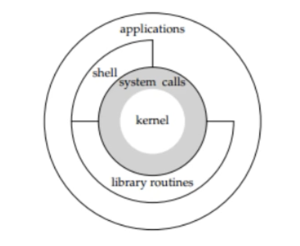
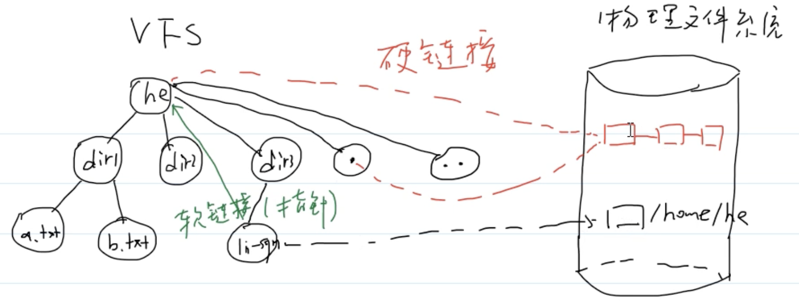

# 大纲


## 1.Linux


**Ubuntu系统**

熟悉Ubuntu操作系统的基本知识和常用命令

在x86/ARM体系结构上进行开发，了解不同体系结构的特点和差异


**Linux操作系统知识**

Linux基本概念和原理(进程管理，内存管理，文件系统，设备驱动等)

深入了解Linux的进程间通信机制(如管道，套接字，信号等)

​	

**Linux系统函数知识**

系统常用函数(比如文件操作，进程管理，网络编程，webserver项目)


**Linux相关性能分析和优化知识**

了解Linux性能分析工具和优化技术，识别和解决系统性能瓶颈

工具如top，iotop，strace，perf等性能分析和排查问题


## 2.C++


**基础语法**

变量，数据类型，运算符，条件语句，循环语句等


**C++特性**

面向对象编程(OOP)，类和对象，继承，多态

智能指针，线程库，C++常用特性


**模板编程**

了解模板的基本语法，函数模板，类模板，模板特化等


**常见标准库**

boost，STL库


## 3.计算机通识

数据结构，设计模式，计算机网络，操作系统


## 4.自动驾驶领域技术栈


**项目构建工具**

cmake，bazel


### **ROS**

ros教程：https://wiki.ros.org/

ros基本原理：

- Nodes：ROS系统由多个节点组成，每个节点代表一个进程，可以是传感器，控制算法等。节点之间通过Messages进行通信。
- Topics：主题是节点之间进行异步通信的方式，一个节点可以Publish消息到一个主题，其他节点可以通过Subscribe该主题来接收消息。
- Services：服务是节点之间进行同步通信的方式，一个节点可以提供一个服务，其他节点可以请求该服务来获取特定的信息或执行特定操作。
- Parameter Server：参数服务器是一个分布式的键值存储系统，用于存储和共享配置参数和运行时参数。节点可以从参数服务器中读取和写入参数。
- Messages：ROS使用基于消息的通信模型，消息是以特定格式定义的数据结构，用于在节点间传递信息。消息可以是标准类型(int，string等)，也可以是自定义的复杂数据类型。


*发布订阅模型，消息序列化协议*


**ROS相关源码**

roscpp：https://wiki.ros.org/roscpp


### Apollo

Cyber

1.通信模块：intra，shm，fastdds

2.序列化协议：protobuf


### DDS

常见：fastdds：https://github.com/eProsima/Fast-DDS


# CMake


## 最简单demo

```cmake
# cmake 最低版本需求
cmake_minimum_required(VERSION 3.22)

# 工程名称
project(cmake_study)

# 设置
set(CMAKE_CXX_STANDARD 11)

# 编译源码生成目标
add_executable(cmake_study main.cpp)
```


## CMakeLists 变量篇

我们可以使用 `SET(set)` 来定义变量

**语法** ：`SET(VAR [VALUE] [CACHE TYPE DOCSTRING [FORCE]]) `

**指令功能** : 用来显式的定义变量 

**例子** : `SET (SRC_LST main.c other.c)` 

**说明**: 用变量代替值，例子中定义 `SRC_LST` 代替后面的字符串。


我们可以使用 `${NAME}` 来获取变量的名称。


### **cmake常用变量**

| 环境变量名                                                   | 描述                                                         |
| :----------------------------------------------------------- | ------------------------------------------------------------ |
| `CMAKE_SOURCE_DIR`, `PROJECT_SOURCE_DIR`, `<projectname>_SOURCE_DIR` | 工程顶层目录。                                               |
| `CMAKE_CURRENT_SOURCE_DIR`                                   | 当前处理的 CMakeLists.txt 所在的路径                         |
| `CMAKE_CURRRENT_BINARY_DIR`                                  | 如果是 `in-source` 编译,它跟 CMAKE_CURRENT_SOURCE_DIR 一致,如果是 `out-of-source` 编译,他指的是 target 编译目录。 |
| `EXECUTABLE_OUTPUT_PATH` , `LIBRARY_OUTPUT_PATH`             | 最终目标文件存放的路径。                                     |
| `PROJECT_NAME`                                               | 通过 PROJECT 指令定义的项目名称。                            |
|                                                              |                                                              |


### **cmake 编译选项**

| **编译控制开关名**  | **描述**                                                |
| ------------------- | ------------------------------------------------------- |
| `BUILD_SHARED_LIBS` | 使用 `ADD_LIBRARY` 时生成动态库                         |
| `BUILD_STATIC_LIBS` | 使用 `ADD_LIBRARY` 时生成静态库                         |
| `CMAKE_C_FLAGS`     | 设置 C 编译选项,也可以通过指令 ADD_DEFINITIONS()添加。  |
| `CMAKE_CXX_FLAGS`   | 设置 C++编译选项,也可以通过指令 ADD_DEFINITIONS()添加。 |


### cmake常用指令


- **ADD_DEFINITIONS**

语法 : `ADD_DEFINITIONS(-DENABLE_DEBUG -DABC)`

向 C/C++编译器添加 `-D` 定义. 如果你的代码中定义了`#ifdef ENABLE_DEBUG #endif`,这个代码块就会生效。


- **ADD_DEPENDENCIES**

语法: `ADD_DEPENDENCIES(target-name depend-target1 depend-target2 ...)`

定义 target 依赖的其他 target, 确保在编译本 target 之前,其他的 target 已经被构建。


- **AUX_SOURCE_DIRECTORY**

语法 : `AUX_SOURCE_DIRECTORY(dir VARIABLE)`

作用是发现一个目录下所有的源代码文件并将列表存储在一个变量中,这个指令临时被用来自动构建源文件列表。因为目前 cmake 还不能自动发现新添加的源文件。

比如 :

```cmake
AUX_SOURCE_DIRECTORY(. SRC_LIST)
ADD_EXECUTABLE(main ${SRC_LIST})
```


- **ADD_SUBDIRECTORY**

语法 : `ADD_SUBDIRECTORY(NAME)` 添加一个文件夹进行编译，该文件夹下的 CMakeLists.txt 负责编译该文件夹下的源码. NAME是想对于调用add_subdirectory的CMakeListst.txt的相对路径．


- **include_directories**

语法 : `include_directories([AFTER|BEFORE] [SYSTEM] dir1 [dir2 ...])`

将给定目录添加到编译器用来搜索包含文件的目录中。相对路径被解释为相对于当前源目录。

包含目录添加到 `INCLUDE_DIRECTORIES` 当前`CMakeLists`文件的目录属性。它们也被添加到`INCLUDE_DIRECTORIES`当前`CMakeLists`文件中每个目标的target属性。目标属性值是生成器使用的属性值。


- **ink_libraries**

语法 : `link_libraries([item1 [item2 [...]]] [[debug|optimized|general] <item>] ...)`

将库链接到以后添加的所有目标。


- **ADD_EXECUTABLE**

语法 : `ADD_EXECUTABLE(<name> [source1] [source2 ...])`

利用源码文件生成目标可执行程序。


- **ADD_LIBRARY**

语法 : `ADD_LIBRARY(<name> [STATIC | SHARED | MODULE] [source1] [source2 ...])`

根据源码文件生成目标库。

`STATIC`,`SHARED` 或者 `MODULE` 可以指定要创建的库的类型。 STATIC库是链接其他目标时使用的目标文件的存档。 SHARED库是动态链接的，并在运行时加载


### cmake控制指令

- **IF 指令**

```cmake
if(<condition>)
  <commands>
elseif(<condition>) # optional block, can be repeated
  <commands>
else()              # optional block
  <commands>
endif()

#####

IF(var),如果变量不是:空,0,N, NO, OFF, FALSE, NOTFOUND 或<var>_NOTFOUND 时,表达式为真。
IF(NOT var ),与上述条件相反。
IF(var1 AND var2),当两个变量都为真是为真。
IF(var1 OR var2),当两个变量其中一个为真时为真。
IF(COMMAND cmd),当给定的 cmd 确实是命令并可以调用是为真。
IF(EXISTS dir)或者 IF(EXISTS file),当目录名或者文件名存在时为真。
IF(file1 IS_NEWER_THAN file2),当 file1 比 file2 新,或者 file1/file2 其中有一个不存在时为真,文件名请使用完整路径。
IF(IS_DIRECTORY dirname),当 dirname 是目录时,为真。
IF(variable MATCHES regex)
IF(string MATCHES regex)
```


- **FOREACH 指令**

语法:

```cmake
foreach(<loop_var> <items>)
  <commands>
endforeach()
```

其中`<items>`是以分号或空格分隔的项目列表。记录foreach匹配和匹配之间的所有命令endforeach而不调用。 一旦endforeach评估，命令的记录列表中的每个项目调用一次`<items>`。在每次迭代开始时，变量loop_var将设置为当前项的值。


- **WHILE 指令**

语法:

```cmake
while(<condition>)
  <commands>
endwhile()
```

while和匹配之间的所有命令 endwhile()被记录而不被调用。 一旦endwhile()如果被评估，则只要为`<condition>`真，就会调用记录的命令列表。


# GDB


## 0.调试前的准备

gcc编译源码时，编译后的可执行文件不会包含源程序代码。

如果打算编译后的程序可以调试，编译的时候需要加`-g`的参数：

```shell
gcc -g test.cpp -o test
```


## 1.基本调试命令

| 命令     | 命令缩写 | 命令说明                         |
| -------- | -------- | -------------------------------- |
| list     | list     | 查看源代码                       |
| break    | b        | 在某行设置断点                   |
| run      | r        | 运行程序，遇到断点会停下来       |
| next     | n        | 执行当前行的语句                 |
| print    | p        | 显示变量值                       |
| continue | c        | 继续运行程序，直到遇到下一个断点 |
| step     | s        | 进入某一个具体的函数调试         |
| bt       | bt       | 查看函数的调用栈                 |


**watchpoint**

观察变量是否变化

```shell
# 设置watchpoint
# 先找到要观察的变量的地址
(gdb) p &i
# 然后观察这个地址
(gdb) watch *0x7fffffffdfcc
```

这样每次变量变的时候，gdb都会打印信息

info watchpoints 查看当前的watchpoint有哪些


## 2.调试core文件

Linux设置的默认的权限：core-file-size = 0，所以默认不会生成core文件

`ulimit -a`：显示目前资源限制的设定

`ulimit -c unlimited`：解除当前资源的限制


使用core文件步骤：

1.解开资源的权限

2.运行程序，发生崩溃

3.gdb运行 + 当前程序 + core文件，比如：`gdb ./test core.19761`


## 3.调试正在运行的程序

1.后台运行该程序：./test &

2.gdb调试程序：    gdb -p pid


## 4.调试多进程程序

调试父进程：`set follow-fork-mode parent`	（默认）

调试子进程：`set follow-fork-mode child`


设置调试模式：`set detach-on-fork [on/off]` 	默认是on

on表示调试当前进程时，其他的进程继续运行

off表示调试调试当前进程时，其他的进程被gdb挂起


查看调试的进程：`info inferiors`

切换当前调试的进程：`inferior pid`


## 5.调试多线程程序

在shell中执行：

查看当前运行的轻量级进程：`ps -aL|grep xxx`

查看主线程和新线程的关系：`pstree -p 主线程id`


进入gdb调试：

查看当前线程的信息：`info threads`

切换到某个线程：`thread 线程id`

只运行当前线程：`set scheduler-locking on`

运行所有的线程：`set scheduler-locking off`

指定线程执行某gdb命令：`thread apply 线程id 某个命令`

全部线程执行某gdb命令：`thread apply all 某个命令`


## 6.服务程序运行日志

设置断点和单步跟踪可能会严重干扰**多线(进)程**之间的竞争状态，导致看到的是一个假象。

既然调试者的调试行为干扰了程序的运行，怎么办？还得用log日志！


# Linux


## **网络设置**


**确定本机网络状态的步骤：**

1.测试外网：ping www.baidu.com

2.测试路由器：ping 192.168.124.1

3.测试本机网络环境：ping 127.0.0.1


**桥接模式和NAT模式**

桥接模式：虚拟机和宿主机处在同一个网段

NAT模式：宿主机会创建一个虚拟路由器供Linux虚拟机使用，也就是说虚拟机单独于宿主机处于另一个网段(相当于内网了)。

ps：内网可以访问外网，外网一般不可访问内网


## **Linux架构图**



**内核**

1.管理硬件资源(CPU, 内存, 外设)

文件管理，内存管理，进程调度，网络通信，硬件驱动

2.为上层应用软件提供运行环境


**系统调用**

内核对上层应用程序提供的接口


**库函数**

对系统调用再进行一次包装(主要是方便程序员使用)


**shell**

它是一个命令解析器

本质上是一个程序，可以解析命令，执行命令/脚本


## 用户子系统

**特权用户**(根用户，超级用户)：root

**普通用户：**

sudoers，临时拥有特权用户的权限

其他用户，不能申请特权


**查看所有用户：**

```shell
cat /etc/passwd
```


**添加用户：**

```shell
sudo useradd -m -s /bin/bash 用户名
# -m表示创建家目录 -s指定shell程序
```


**删除用户：**

```shell
#-r:删除用户的家目录
sudo userdel -r 用户名
```


**切换用户：**

```shell
#switch user
su 用户名
```


**设置密码：**

```shell
sudo passwd 用户名
```


## 文件子系统


**虚拟文件系统(VFS)**

根目录：`/`


**显示当前目录：**

```shell
#显示当前shell进程的工作目录
pwd
```


**切换目录：**

```shell
#切换到当前用户的家目录
cd ~

#回到上一次的目录
cd -
```


### Linux目录结构

| 名字     | 描述                                  |
| -------- | ------------------------------------- |
| **bin**  | **二进制文件**(可执行程序)            |
| **dev**  | **设备文件**(外部设备)                |
| **home** | **普通用户**家目录的根目录            |
| **root** | **root用户**的家目录                  |
| **sbin** | 和系统相关的可执行程序(system binary) |
| **var**  | 经常发生变化的文件(比如日志文件)      |
| **etc**  | 配置文件                              |
| **lib**  | 库文件                                |
| **proc** | 进程映射文件(process)                 |


### **文件类型和权限**

```shell
-rwxrwxr-x  1 ubuntu ubuntu    15960 Feb  1 10:34 add
drwxrwxr-x  2 ubuntu ubuntu     4096 Dec 19 23:32 backup
drwxrwxr-x 17 ubuntu ubuntu     4096 Apr  1 08:54 code
drwxrwxr-x  2 ubuntu ubuntu     4096 Jan 16 21:06 ds
drwxrwxr-x 23 ubuntu ubuntu     4096 Mar 18 09:53 gdb-14.2
-rw-r--r--  1 ubuntu ubuntu 24111936 Mar 18 09:39 gdb-14.2.tar.xz
########################################################################################################
-rw-r--r--					1 			ubuntu 		ubuntu 24111936 	Mar 18 09:39 gdb-14.2.tar.xz
```

文件类型和权限	硬链接个数	用户名	组名	文件大小	最近修改时间	文件名


第一列代表文件的类型，剩下的9个字符代表了文件的读写权限。

剩下9个字符，分为**三组**：第一组代表该用户自己，第二组代表同组其他成员的权限，第三组代表其他用户的权限


**文件类型**

**d**: directory

-: file

**l** : symbolic link(符号链接，软链接)

**c **: 字符设备(键盘)

**b** : 块设备(硬盘)

**p** : 管道文件(进程间通信)

**s** : 套接字文件


**权限**

r : read

w : write

x : execute

-: 没有对应的权限


**硬链接个数**

数字代表了硬链接的个数


### 通配符

| 符号     | 描述                         |
| -------- | ---------------------------- |
| *        | 可以匹配任意多个字符         |
| ?        | 可以匹配任意一个字符         |
| [char]   | 可以匹配集合内的任意一个字符 |
| [!char]  | 可以匹配集合外的任意一个字符 |
| [0-9]    | 数字                         |
| [a-z]    | 小写字母                     |
| [A-Za-z] | 字母                         |


### 链接

**硬链接和软连接的区别？**

硬链接相当于一个别名，可以通过 he .直接访问到物理文件系统中对应的文件

软连接相当于C语言的指针，类似于windows的快捷方式，通过物理文件系统中对应文件的路径来间接访问目标文件




**创建硬链接和软连接**

```shell
ln a.txt link_hard				#创建硬链接
ln -s ../b.txt link_sym		#创建软链接
```


**怎么确定你创建的硬链接指向的就是同一个物理文件实体？**

```shell
ls -li	#通过该命令来查看文件的inode
```


**用硬链接还是软链接？**

硬链接没办法为文件夹创建链接，但软链接可以


### 查找文件(find)

**locate**	-	locate file by name

**which**	-	locate a command(可执行程序)	**which命令只能查找用户的PATH环境变量指定的目录中搜索**


**find**

```shell
#基本语法
find [路径] [选项] [表达式]

#按名称指定目录查找文件
find /home/usr/ -name "sample.txt"

#搜索特定大小以上的文件
find / -type f -size +50M

#根据用户和组查找
find / -user username "sample.txt"
```


### 权限

chmod	-	change file mode bits

1.文字设定法

```shell
# 文字设定法 u代表user g代表group o代表others a代表all
chmod [ugoa][+=-][rwx] filename/dir

chmod u+x hello.py	#给当前用户添加执行权限
chmod a+x	hello.py	#给所有用户添加执行权限
chmod a=x hello.py  #所有用户都只有执行权限
```


2.数字设定法

```shell
chmod 664 hello.py
```


### 查看文件(cat)

**文件描述符**(非负整数)

| 名称   | 解释         | 关联设备 | 文件描述符值 |
| ------ | ------------ | -------- | ------------ |
| stdin  | 标准输入     | 键盘     | 0            |
| stdout | 标准输出     | 显示器   | 1            |
| stderr | 标准错误输出 | 显示器   | 2            |


**重定向**

| 符号 | 描述                 |
| ---- | -------------------- |
| >    | 标准输出重定向       |
| <    | 标准输入重定向       |
| 2>   | 标准错误重定向       |
| >>   | 标准输出重定向(追加) |


### **正则表达式与grep**

**基本单位：**普通字符，转义字符，任意字符，集合，()

**基本操作：**

| 操作 | 符号 | 描述           |
| ---- | ---- | -------------- |
| 连接 |      | ab连接         |
| 重复 | ?    | 重复零次或1次  |
|      | +    | 重复一次或多次 |
|      | *    | 重复任意次数   |


grep - print lines that match patterns

```shell
#找到a.txt中包含r或者o的行号并打印
grep -nE "[ro]+" a.txt
#找到a.txt中包含ro的行号并打印
grep -nE "(ro)+" a.txt
```


### xargs

`xargs` 是一个非常实用的命令行工具，它可以将标准输入（stdin）数据转换成命令行参数。`xargs` 能够读取来自管道（|）或者标准输入的数据，并将这些数据作为参数提供给其他命令执行。

`xargs` 的基本作用是接受输入数据，并将其分割成合理的片段，然后将这些片段作为参数传递给其他命令。它通常与 `find`、`grep` 等命令结合使用，用于处理那些生成大量输出的命令。

语法：

```shell
xargs [选项] [命令 [初始参数]]
#与 find 命令结合删除文件:
find /path/to/dir -type f -name "*.bak" -print | xargs rm
```


### 常用命令

删除空目录：

```shell
#可以一次性删除多个空目录
rmdir dir1 dir2
```


查看隐藏文件夹：

```shell
ls -a
```


复制文件或文件夹：

```shell
#把文件复制到目录中
cp file dir
#把文件复制到文件中，不存在则创建，存在则覆盖
cp file file
```


移动文件/文件夹/重命名：

```shell
mv a.txt b.txt	#a.txt重命名为b.txt
```


删除文件或文件夹：

```shell
rm -i a.txt b.txt		#删除文件，-i带提示

rm -r dir2					#通过递归-r可以删除文件夹
```


## vim

VIM有三种模式：

普通模式(命令模式)	编辑模式	视图模式


普通模式---------->插入模式

i：插入到光标的前面		I：插入到行首

a：插入到光标的后面	       A：插入到行尾

o：插入到下一行		      O：插入到前一行


### **光标移动**

| 命令     | 描述               |
| -------- | ------------------ |
| ctrl + f | 下一页             |
| ctrl + b | 上一页             |
| ctrl + u | 上半页             |
| ctrl + d | 下半页             |
| H        | 页首               |
| L        | 页的最后一行的行首 |
| gg       | 文件的开始         |
| G        | 文件的末尾         |
| w        | 到下一个单词       |
| d        | 上一个单词         |
| n+       | 往前走n行          |
| n-       | 往回走n行          |
| nG       | 去往n行            |


### **命令模式下编辑文本**

| 命令   | 描述               |
| ------ | ------------------ |
| x      | 删除一个字符(剪切) |
| dd     | 删除一行           |
| ndd    | 删除n行            |
| :x,y d | 删除从x-y行        |
| d^     | 删除到行首         |
| d$     | 删除到行尾         |
| dw     | 删除一个单词       |
| ndw    | 删除n个单词        |
| dts    | 删除到s字符        |


**复制粘贴：**

| 命令     | 描述            |
| -------- | --------------- |
| p        | 粘贴paste       |
| u        | 撤销修改undo    |
| ctrl + r | 恢复修改recover |
| yy       | 拷贝一行        |
| nyy      | 拷贝n行         |
| :x,y y   | 拷贝x-y行       |
| yw       | 拷贝一个单词    |
| nyw      | 拷贝n个单词     |


