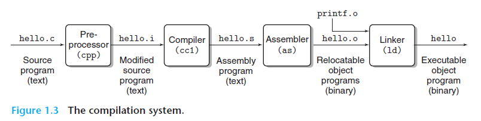
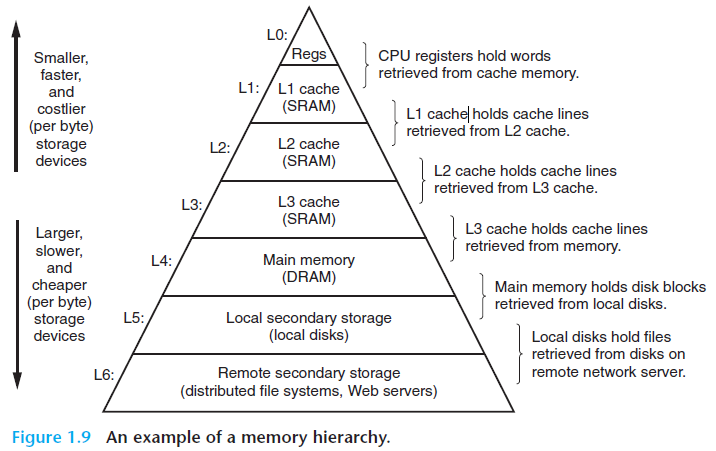

# Tour of Computer System

**preprocessor -> compiler -> assembler -> linker**



```shell
gcc -o hello hello.c
```


处理器从**内存**中读取信息的速度远大于从**硬盘**读取信息的速度。


为了解决这个问题，程序设计者提出了一个更小，更快的存储设备的概念--**缓存**。




**操作系统负责管理硬件：**

neither program access the **keyboard**, **display**, or **main memory** directly.
