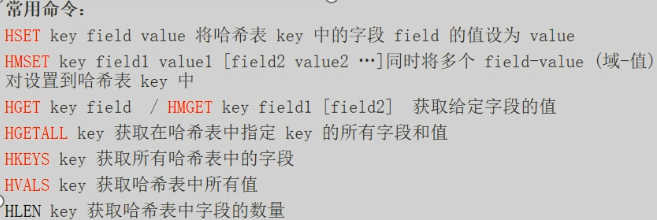

# 0.Makefile


**make的工作方式**

GNU的make工作时的执行步骤如下：（想来其它的make也是类似）

1. 读入所有的Makefile。
2. 读入被include的其它Makefile。
3. 初始化文件中的变量。
4. 推导隐式规则，并分析所有规则。
5. 为所有的目标文件创建依赖关系链。
6. 根据依赖关系，决定哪些目标要重新生成。
7. 执行生成命令。


## 宏

**$@**	表示目标文件

**$?**	表示比目标还要新的依赖文件列表

**$<**	表示第一个依赖文件

**$***	表示目标模式中%以及之前的部分

```makefile
hello : main.cpp hello.cpp factorial.cpp
	$(CC) $(CFLAGS) $@.cpp $(LDFLAGS) -o $@
```


## 定义依赖性

```makefile
hello : main.o factorial.o hello.o
	$(CC) main.o factorial.o hello.o -o hello
```

在这里，我们告诉hello依赖main.o，factorial.o，hello.o，所以每当有任何变化，这些目标文件将采取行动。


同时我们会告诉如何准备.o文件，所以以下依赖也必须定义：

```makefile
main.o : main.cpp functions.h
	$(CC) -c main.cpp
	
factorial.o : factorial.cpp functions.h
	$(CC) -c factorial.cpp

hello.o : hello.cpp functions.h
	$(CC) -c hello.cpp
```


**利用特殊宏对makefile进行优化：**

```makefile
LDFLAGS = -lstdc++

hello : main.o factorial.o hello.o
	$(CC) $? $(LDFLAGS) -o $@

main.o :  main.cpp functions.h
	$(CC) -c main.cpp

factorial.o : factorial.cpp functions.h
	$(CC) -c factorial.cpp

hello.o : hello.cpp functions.h
	$(CC) -c hello.cpp
```


**makefile的隐含规则：**

main.o会默认依赖main.cpp，所以以上的makefile文件可以继续简化：

```makefile
LDFLAGS = -lstdc++

hello: main.o factorial.o hello.o
	$(CC) $^ $(LDFLAGS) -o $@

main.o: functions.h
	$(CC) -c main.cpp

factorial.o: functions.h
	$(CC) -c factorial.cpp

hello.o: functions.h
	$(CC) -c hello.cpp
```


## 条件指令


`ifeq`：相等则执行指令。

`ifneq`：不相等则执行指令。

`ifdef`：定义则执行指令。

`ifndef`：未定义则执行指令。

`else`

`endif`：指令结束条件。每一个条件必须于endif结束。


**用条件指令执行跨平台编译：**

```makefile
libs_for_gcc = -lgnu
normal_libs = 

foo: $(objects)

ifeq ($(CC),gcc)
	$(CC) -o foo $(objects) $(libs_for_gcc)
else
	$(CC) -o foo $(objects) $(normal_libs)
endif
```


## 赋值指令

`=`	直接赋值

`+=`	追加和修改

`:=`	忽略之前的赋值

`?=`	如果前面没有定义，则定义生效


## 文件重新编译

当依赖项比目标新的时候，会触发重新编译。


有些业务场景需要避免重新编译，可以使用

```shell
make -t
```


## make递归使用

假设，你有一个子目录，子目录都有其自己的makefile，并且您希望所在目录的makefile中运行make子目录：

```makefile
subsystem:
	cd subdir && $(MAKE)
	
或者

subsystem:
	$(MAKE) -C subdir
```


**通信变量到子make**

导出特定变量的到子make：

```makefile
export variable...
```


阻止导出：

```makefile
unexport variable...
```


## 头文件在不同目录

声明头文件的路径

```makefile
INCLUDES = -I "/home/zjs/header"
CC = gcc
LIBS = -lm
CFLAGS = -g -Wall
OBJ = main.o factorial.o hello.o

hello: $(OBJ)
	${CC} ${CFLAGS} ${INCLUDES} -o $@ ${OBJ} ${LIBS}
.o.cpp
	${CC} ${CFLAGS} ${INCLUDES} -c $<
```


## 例子

```makefile
OBJS = main.o factorial.o hello.o
CFLAGS = -Wall -g
INCLUDES = -I .
LIBS = -lstdc++

hello: ${OBJS}
	${CC} ${CFLAGS} -o $@ $^ ${LIBS}

.o:.cpp
	${CC} ${CFLAGS} ${INCLUDES} -c $<

clean:
	@rm -f *.o hello
```


# 1.Linux

Linux内核架构图


**内核：**

1.管理硬件资源：CPU，内存，外设

文件管理，内存管理，进程调度，网络通信，硬件驱动

2.为上层应用软件提供运行环境


**系统调用：**内核对上层应用程序提供的接口

**库函数：**对系统调用进行包装，方便程序使用

**shell：**命令解析器，本质是一个程序，用来解析命令，执行命令


## 用户子系统

**特权用户：**root，拥有最高的权限

**普通用户：**

1.sudoers，临时拥有特权用户的权限

2.其他用户


查看所有的用户：

```shell
cat /etc/passwd
```

添加用户：

```shell
sudo useradd -m -s /bin/bash 用户名
# -m 指定家目录
# -s /bin/bash 指定bash为默认的shell
```

删除用户：

```shell
sudo userdel 用户名
```

切换用户：

```shell
su 用户名
```

更改密码：

```shell
sudo passwd 用户名
```


## 文件子系统

虚拟文件系统(VFS)


**bin**(binary)：可执行程序

**dev**(device)：设备文件

**home**：普通用户家目录的根目录

**root**：root用户的家目录

**sbin**(system binary)：和系统相关的可执行程序

**var**(variable)：一般放经常变化的文件，比如日志文件

**etc**：配置文件

**lib**：库文件

**proc**(process)：进程映射文件


打印当前工作目录：

```shell
pwd
```

切换目录：

```shell
cd /	#切换到根目录
cd ~	#切换到家目录
cd ..
cd -	#回到上一次的目录
```

查看环境变量：

```shell
env
```


### 查看文件 ls -l

```shell
ls -l
```

`drwxr-xr-x  19 root root  3940 Sep 15 09:17 dev/`

文件权限|硬链接个数|用户名|用户所属组名|文件大小|修改时间|文件名

**d**：directory

**r**：read

**w**：write

**x**：execute

**-**：没有对应权限

注意：rwx-r-xr-x三组权限，user-group-others


**-**：file

**l**：symbolic link(软链接)

**c**：字符设备

**b**：块设备(硬盘)

**p**：管道文件(进程间通信)

**s**：套接字文件


### 通配符

*****：可以匹配任意多个字符

**?**：可以匹配任意一个字符

**集合：**

[characters]：匹配集合内的任意一个字符	[abc]

[!characters]：匹配集合外的任意一个字符	[!abc]

**类：**

[0-9]：数字

[a-z]：小写字母

[A-Za-z]：字母


### 链接

ln - make links between files

**硬链接**：硬链接是在文件系统中创建一个额外的索引节点（inode），该索引节点与原始文件的索引节点相同。这意味着硬链接与原始文件实际上位于相同的物理位置，它们共享相同的数据块。

**软链接：**是一种特殊类型的文件，它包含对另一个文件或目录的路径的引用。

创建软链接：

```shell
ln -s /home/photos/a.jpg /home/documents/b.jpg
```

请注意，软链接不会复制文件或目录的内容，它只是一个路径的引用。


### 查找文件

**locate**	-find files by name

```shell
locate studio.h
```


**which**	-locate a command(只能查找一个可执行程序)

```shell
which sshd
```


**find**	-search for files in a directory hierachy

1.根据名字查找：

-name "pattern"	

```shell
find / -name "stdio.h"
```

-a(and)	-o(or)	!(逻辑取反)

```shell
#查找linux内核文件夹下所有.c和.h文件
find linux-5.16.12/ -name "*.c" -o -name "*.h"
```

2.根据类型查找：

-type 类型

```shell
#查找当前目录下的所有普通文件
find . -type f
#查找当前目录下名字含有soft并且类型是符号链接的文件
find . -name "*soft*" -a -type l
```

3.根据权限查找：

-perm

```shell
#查找当前目录下权限为664的文件
find . -perm 664
```


### 命令的组合

```shell
mkdir dir4; cd dir4
#把找到的文件依次执行ls -l命令
find /usr/include -name "stdio.h" -exec ls -l {}
```


### 权限

chmod	- change file mode bits


**(1)文字设定法**

`chmod [ugoa][+=-][rwx] file/dir`

```shell
chmod a+x hello.py			#所有类型的用户添加可执行权限
chmod u=r,g=rw,o=r a.txt	
```


### 查看文件

**cat**	- concatenate files and print the standard output

| 文件描述符 |              |        | 文件描述符 |
| ---------- | ------------ | ------ | ---------- |
| stdin      | 标准输入     | 键盘   | 0          |
| stdout     | 标准输出     | 显示器 | 1          |
| stderr     | 标准错误输出 | 显示器 | 2          |


```shell
cat > d.txt		#可在d.txt输入
```

**echo**	- display a line a text


**head/tail**	- 显示头或尾的信息

```shell
tail -n 10 d.txt	#显示最后10行的信息
```


**file**	- determine file type

```shell
file d.txt	#查看文件详细信息
```


**iconv**	- convert text from one character to another

```shell
iconv -f gbk -t utf-8 d.txt 	#从gbk改为utf8编码
```


**grep**	- searches  for  PATTERNS  in  each  FILE.

-E	--正则表达式--

-i	 --忽略项--

-n	--line-number

```shell
#搜索以t开头，以n结尾的单词
grep -nE "\<t[^ ]*e\>" The_Holy_Bible.txt
```


## git


### 生成公钥

```shell
cd ~		#1.退出到用户主目录
cd .ssh/	#2.进入ssh隐藏文件夹
ssh-keygen	#3.生成ssh公钥
```

#4.把公钥添加到github里


### 上传代码

1.修改本地仓库

2.add(将修改添加到缓存，stage)

3.commit(确实修改，将修改的东西更新到本地仓库)

4.pull(把远程仓库的代码拉取下来)

5.解决冲突(ctrl+X)

6.push(上传到远程仓库)


## vim


**vim有三种模式：**

1.普通模式

2.编辑模式

3.视图模式


### 命令模式

**光标移动：**

```shell
ctrl + f:	上一页 forward
ctrl + b:	下一页 backward
H:			页首
L:			页的最后一行
```


**命令模式下编辑文本：**

```shell
#删除
dd:		删除一行
dnd:	删除n行
D:		删除到行位(比如可以删掉注释)
u:		撤销操作
#拷贝
yy:		拷贝一行
#查找和替换
/regex
```


## 编译链


```shell
gcc hello.c -o hello	# -o:给目标文件起名
```

生成汇编代码：

```shell
gcc -E hello.c -o hello.i	#预处理后的文件
gcc -S hello.i -o hello.s	#汇编文件
# 或者直接生成汇编代码
gcc -S hello.c -o hello.s
```


**汇编常用命令**

```assembly
push	#入栈
pop		#出栈
mov		#移动(赋值)
lea		#(load effective address)加载有效地址
call	#函数调用
ret		#函数返回

%rbp	#base pointer 栈帧基址寄存器
%rsp	#stack pointer 栈顶寄存器
%eax	#返回值
```

注意：

以%开头的都是表示**寄存器**

一个栈帧的大小 = %rbp - %rsp


### 生成静态库

1.生成目标文件

```shell
gcc -c add.c -o add.o
```

2.打包成静态库文件

```shell
ar crsv libadd.a add.o
```

3.移动到系统库目录

```shell
sudo cp libadd.a /usr/lib
```

4.加上链接

```shell
gcc test.o -o test -ladd
```


### 生成动态库

1.编译成目标文件，加上`-fPIC`(相对地址→位置无关代码)

```shell
gcc add.c -o add.o -fPIC
```

2.打包

```shell
gcc -shared add.o -o libadd.so
```

3.移动到系统库目录

```shell
sudo cp libadd.so /usr/lib
```

4.加上链接

```shell
gcc test.o -o test -ladd
```


### gcc其他选项

-D：相当于#define DEBUG

```shell
gcc test.c -D DEBUG
```

-I：增加头文件搜索路径

```shell
gcc src/test.c -I include/
```

-O：编译优化

-Wall：开启警告

```shell
gcc src/test.c -I include/ -Wall
```


### gdb

1.用gdb的时候不要开优化，加上`-O0`

2.汇编指令里没有变量的名字，需要补充调试信息`-g`


**gdb的命令**					 

| 命令                               | 描述               |
| ---------------------------------- | ------------------ |
| `list/l [文件名:][行号]|[函数名]`  | 看文件内容         |
| `run/r`                            | 运行程序           |
| `break/b [文件名:][行号]|[函数名]` | 打断点             |
| `continue/c`                       | 继续运行           |
| `step/s`                           | 单步调试           |
| `next/n`                           | 单步调试(跳过函数) |
| `finish`                           | 跳出本次函数调用   |
| `info break/ib`                    | 查看断点信息       |
| `delete [num]`                     | 删除断点           |
| `ignore [num] [count]`             | 忽略num断点count次 |


**在gdb中查看监视**

| 命令            | 描述             |
| --------------- | ---------------- |
| print/p 表达式  | 打印表达式的信息 |
| display 表达式  | 打印表达式的信息 |
| info display    | 展示display信息  |
| undisplay [num] | 取消监视         |


**检查崩溃的程序**

黑匣子：**core文件**(程序崩溃时刻内存的堆栈)

```shell
ulimit -c unlimited
./error1
```

如果显示不出来core文件：

```shell
su root		#切换到root用户
echo core > /proc/sys/kernel/core_pattern
gdb error1 core.1417038
```


空指针导致的崩溃：


栈溢出导致的崩溃：


### makefile

makefile增量编译生成代码。

一种"目标-依赖"，只有目标不存在/目标比依赖旧，才会执行命令。


1.名字必须是Makefile/makefile

2.规则的集合：依赖文件(0-n个)→目标文件(1个)，每个命令前必须写个<tab>键

3.把最终生成的文件作为第一个规则的目标


**makefile基本使用**

```makefile
main:main.o add.o
	gcc main.o add.o -o main
main.o:main.c
	gcc -c main.c -o main.o
add.o:add.c
	gcc -c add.c -o add.o
.PHONY:clean rebuild
clean:
	rm -f main.o add.o main
rebuild:clean main
```


**变量**

**1.自定义变量**：变量名:=值	所有值都是字符串类型

**2.预定义变量**	

**3.自动变量**：同一个变量名，值会随着规则变化而变化

```makefile
OUT:=main
OBJS:=main.o add.o
CC:=gcc
$(OUT):$(OBJS)
	$(cc) $^ -o $@
main.o:main.c
	$(cc) -c $^ -o $@
add.o:add.c
	$(cc) -c $^ -o $@
.PHONY:clean rebuild
clean:
	$(RM) $(OUT) $(OBJS)
rebuild:clean main
```


**用百分号字符管理格式关系**

%：用在第二个规则中，按格式从第一个规则的依赖来匹配


## 文件

狭义：存储在外部存储介质上的数据集合

广义：速度慢，容量大，持久存储


**文件类型：**

普通文件，目录文件，软链接

字符设备文件	鼠标

块设备文件	    磁盘	

管道文件		通信

socket	            网络通信


### **fopen**

`FILE *fopen(const char *pathname, const char *mode);`

| 模式 | 描述                         |
| ---- | ---------------------------- |
| "a"  | append，只写追加             |
| "a+" | 读写追加，打开时处于文件开始 |


### **改变文件权限**

chmod, fchmod, fchmodat - change permissions of a file

`int chmod(const char *pathname, mode_t mode);`

```c
mode_t mode;
sscanf(argv[1],"%o",&mode);
int ret = chmod(argv[2],mode);
```


### **获取工作目录**

getcwd, getwd, get_current_dir_name - get current working directory

`#include <unistd.h>`

`char *getcwd(char *buf, size_t size);`


### **改变工作目录**

chdir, fchdir - change working directory

`#include <unistd.h>`

`int chdir(const char *path);`


### **目录流**

目录流（Directory Stream）是一个计算机编程术语，通常用于操作系统和文件系统编程中。它是一个与文件目录相关的数据结构，用于表示一个目录中的所有文件和子目录的信息。目录流允许程序员以一种有序的方式访问目录中的内容，并执行各种文件和目录操作，如查找、创建、删除文件和目录等。


**打开目录**

opendir, fdopendir - open a directory

`#include <sys/types.h>`
`#include <dirent.h>`

`DIR *opendir(const char *name);`


**目录项**

```c
struct dirent {
ino_t d_ino;       /* Inode number 磁盘*/
off_t d_off;       /*next指针*/
unsigned short d_reclen;    /*本结构体的大小*/
unsigned char  d_type;      /*文件类型 */
char d_name[256]; /*文件的名字*/
};
```

readdir - read a directory

`struct dirent *readdir(DIR *dirp);`


### **无缓冲文件IO**

不带用户态缓冲，但是有内核文件缓冲区


文件描述符**fd**


**open**

open, openat, creat - open and possibly create a file

```c
#include <sys/types.h>
#include <sys/stat.h>
#include <fcntl.h>

int open(const char *pathname, int flags);
int open(const char *pathname, int flags, mode_t mode);
```


**read**

`#include <unistd.h>`

`ssize_t read(int fildes, void *buf, size_t nbyte);`


**write**

pwrite, write — write on a file

`#include <unistd.h>`

`ssize_t write(int fildes, const void *buf, size_t nbyte);`


### 性能问题

linux系统文件函数和c语言库函数的性能上的区别：


使用文件流：

优势：零碎的写入，也可以保证少量的系统调用

劣势：拷贝次数更多


buf越大越好，减少状态切换的次数。


### 内存映射


mmap

在**用户态空间**分配一片内存，该内存直接和外部设备建立映射。

使用*或[]读写内存，**等价于读写文件**。


**内存映射的限制：**

1.文件大小固定(ftruncate)

2.只能是磁盘文件

3.建立映射之前要先open


**函数定义：**

mmap, munmap - map or unmap files or devices into memory

```c
#include <sys/mman.h>
void *mmap(void *addr, size_t length, int prot, int flags, int fd, off_t offset);
int munmap(void *addr, size_t length);
```


### **IO多路复用**

**管道**

named pipe/FIFO

是**进程间通信机制**在文件系统的映射。

`mkfifo`

一个管道的建立需要两个资源，一边开读端，一边开写端。


**两根管道不合适的打开顺序，可能会导致死锁：**

A先打开管道1的读端，B先打开管道2的读端，会发生死锁。

因为A在等待B打开管道1的写端，B在等待A打开管道2的写端。

这是一个循环等待的过程，死锁。


**select函数**

```c
#include <sys/select.h>

int select(int nfds, fd_set *readfds, fd_set *writefds,
fd_set *exceptfds, struct timeval *timeout);

void FD_CLR(int fd, fd_set *set);
int  FD_ISSET(int fd, fd_set *set);	//询问操作
void FD_SET(int fd, fd_set *set);	//加入监听
void FD_ZERO(fd_set *set);			//清空集合
```

**fd_set：**监听集合，整个数组大小1024bytes(1024个文件)，位图。

**轮询：**polling

**回调：**callback


1.创建fd_set

2.设置合适的监听

3.调用select函数，会让进程阻塞

4.当监听的fd中有任何一个就绪时，则select就绪

5.轮流询问所有监听的fd是否就绪(FD_ISSET询问操作)


**select的劣势**


## 进程

在**某一个时刻**，多个进程同时运行，称为**并行**。

在**某一段时间**，多个进程同时运行，称为**并发**。


**进程：**正在运行的程序，os(内存和cpu)资源分配的基本单位。

**pid：**是一个正整数，给用户来标识不同的进程。

**uid：**真实用户标识符

**euid：**有效用户标识符


### 进程的命令

**ps -elf**


**S的含义：**进程的状态


D	不可中断(不会响应信号)

I	  空闲状态

R	运行态或就绪态

S	可中断的睡眠

T	被任务控制信号暂停

t	被调试器暂停

X	死了

Z	僵尸进程(进程已终止，资源未回收)


**STIME：**启动时间

**TTY：**终端

**TIME：**cpu占用总时间

**CMD：**启动进程的命令


**ps -aux**


**VSZ：**virtual size，已经占用的虚拟内存空间

**RSS：**驻留集大小


**top**

查看进程的实时状态


**前台和后台**

**前台：**可以响应键盘中断的进程

**后台：**不可以响应...


ctrl + c 中止前台进程

kill -9 pid 杀死后台进程


后台到前台：fg

前台到后台：ctrl + z

后台暂停到后台运行：bg


**crontab**

单用户定时任务	`crontab -e`

全局定时任务	    `vim /etc/crontab`


### 1.进程的系统调用

**system**

system - execute a shell command

```c
#include <stdlib.h>
int system(const char *command);
```

虽然system是跨平台的，但是它需要创建三个进程。


**fork**

fork - create a child process

fork() ：creates  a  new process by duplicating the calling process.

```c
#include <sys/types.h>
#include <unistd.h>

pid_t fork(void);
```

可以通过fork的返回值来走向不同的父子进程分支。

```c
int main(){
    pid_t = pid;
    pid = fork();
    if(pid==0){
        printf("I am child, pid=%d\n",getpid());
    }
    else{
        printf("I am parent	, pid=%d\n",getpid());
        sleep(1);
    }
}
```


### 2.僵尸进程

进程的退出，资源由其父进程回收。

如果子进程终止的时候，父进程一直不调用wait，会导致僵尸进程。

僵尸进程：终止了但资源未回收。


**摧毁僵尸进程1：wait()函数**

为了摧毁子进程，父进程应主动请求获取子进程的返回值。

```c++
#include <sys/wait.h>
pid_t wait(int * statloc);	//成功时返回终止的子进程ID,失败时返回-1
```

调用此函数时如果已有子进程终止，那么**子进程终止时传递的返回值**(exit函数的参数值，main函数的返回值)将保存到该函数的参数所指内存空间。

但函数参数指向的单元中还包括其他信息，因此需要通过下列宏进行分离。

`WIFEXITED`子进程正常终止时返回"真"true

`WEXITSTATUS`返回子进程的返回值

```cpp
if(WIFEXITED(status)){
    puts("Normal termination!");
    printf("Child pass num: %d", WEXITSTATUS(status));	//那么返回值是多少？
}
```


**销毁僵尸进程2：waitpid()函数**

wait函数会引起程序阻塞，还可以考虑调用waitpid函数。这是防止僵尸进程的第二种方法，也是防止阻塞的方法。

```cpp
#include <sys/wait.h>

pid_t waitpid(pid_t pid, int * statloc, int options);	//成功时返回终止的子进程ID,失败时返回-1
//pid: 等待终止的目标子进程的ID,若传递-1,则与wait函数相同,可以等待任意子进程终止。
//statloc: 与wait函数的statloc参数具有相同含义。
//options: 传递头文件sys/wait.h中声明的常量WNOHANG,即使没有终止的子进程也不会进入阻塞状态,而是返回0并退出函数。
```


### 3.信号处理

问题：子进程究竟何时终止？调用waitpid函数后要无休无止的等待吗？

父进程往往像子进程一样繁忙，因此不能只调用waitpid函数以等待子进程终止。接下来讨论解决方案：

**子进程终止的识别主体是操作系统。**因此，若操作系统能把如下信息告诉正在忙于工作的父进程，将有助于构建高效的程序。

此时的父进程暂时放下工作，处理子进程终止相关事宜。由此，引入**信号**的概念。


#### **signal函数**

进程发现自己的子进程结束时，请求操作系统调用特定函数。

```cpp
#include <signal.h>

void (*signal(int signo, void (*func)(int)))(int);	//为了在产生信号时调用,返回之前注册的函数指针。
//函数名：signal
//参数：int signo, void(*func)(int)
//返回类型：参数为int型，返回void型函数指针
```

调用上述函数时，第一个参数为特殊情况信息，第二个参数为特殊情况下将要调用的函数的指针。

发生第一个参数代表的情况时，调用第二个参数所指的函数。

`SIGALRM`：已到通过调用alarm函数注册的时间。

`SIGINT`：输入CTRL+C。

`SIGCHLD`：子进程终止。


**例：**

子进程终止则调用mychild函数

此时mychild函数的参数应为int，返回值类型为void。只有这样才能成为signal函数的第二个参数。

另外，常数SIGCHLD定义了子进程终止的情况，应成为signal函数的第一个参数。如下：

```c++
signal(SIGCHLD, mychild);
```


先介绍alarm函数：

```cpp
#include <unistd.h>
unsigned int alarm(unsigned int seconds);	//返回0或以秒为单位的距SIGALRM信号发生所剩时间
```

如果调用该函数的同时向它传递一个正整数参数，响应时间(秒)后将产生SIGALRM信号。

如果传递0，则之前对SIGALRM信号的预约将取消。

```cpp
#include <stdio.h>
#include <unistd.h>
#include <signal.h>

void timeout(int sig){
    if(sig == SIGALRM){
        puts("Time Out!");
    }
    alarm(2);
}

void keycontrol(int sig){
    if(sig == SIGINT)
        puts("CTRL+C pressed");
}

int main(){
    int i;
    signal(SIGALRM,timeout);
    signal(SIGINT, keycontrol);
    alarm(2);

    for(i=0;i<3;i++){
        puts("wait...");
        sleep(100);
    }
    return 0;
<<<<<<< HEAD
=======
}
```

运行结果：

```shell
root@my_linux:/tcpip# gcc signal.c -0 signal
root@my_linux:/tcpip# ./signal
wait. . .
Time outl
wai t. . .
Time out!
wait. . .
Time out!
```

调用函数的主体的确是操作系统，但进程处于睡眠状态时无法调用函数。


#### sigaction函数

前面所学的内容足以用来编写防止僵尸进程生成的代码。

**sigaction**函数，它类似于**signal**函数，而且完全可以代替后者，也更稳定。

之所以稳定，是因为：signal 函数在UNIX 系列的不同操作系统中可能存在区别，但sigaction函数完全相同。

```cpp
#include <signal.h>
int sigaction(int signo, const struct sigaction * act, struct sigaction * oldact);	//返回0时成功，返回1失败
//signo: 传递信号信息
//act: 对应于第一个参数的信号处理函数信息
//oldact: 通过此参数获取之前注册的信号处理函数指针，若不需要则传递0
```

声明并初始化sigaction结构体变量以调用上述函数，该结构体定义如下：

```cpp
struct sigaction{
    void (*sa_handler)(int);
    sigset_t sa_mask;
    int sa_flags;
>>>>>>> 4dac9deff763e2a483997f9d1cc3652040c366ef
}
```

运行结果：

```shell
root@my_linux:/tcpip# gcc signal.c -0 signal
root@my_linux:/tcpip# ./signal
wait. . .
Time outl
wai t. . .
Time out!
wait. . .
Time out!
```

调用函数的主体的确是操作系统，但进程处于睡眠状态时无法调用函数。


#### sigaction函数

前面所学的内容足以用来编写防止僵尸进程生成的代码。

**sigaction**函数，它类似于**signal**函数，而且完全可以代替后者，也更稳定。

之所以稳定，是因为：signal 函数在UNIX 系列的不同操作系统中可能存在区别，但sigaction函数完全相同。

```cpp
#include <signal.h>
int sigaction(int signo, const struct sigaction * act, struct sigaction * oldact);	//返回0时成功，返回1失败
//signo: 传递信号信息
//act: 对应于第一个参数的信号处理函数信息
//oldact: 通过此参数获取之前注册的信号处理函数指针，若不需要则传递0
```

声明并初始化sigaction结构体变量以调用上述函数，该结构体定义如下：

```cpp
struct sigaction{
    void (*sa_handler)(int);
    sigset_t sa_mask;
    int sa_flags;
}
```


**通过sigaction函数来防止僵尸进程：**

每次有进程被创建时，操作系统都会调用read_childproc函数来等到子进程关闭，并回收资源。

代码示例：https://github.com/100568265/code_repo_C/blob/main/sigaction.c


### 基于进程的并发服务器

第一阶段：回声服务器端(父进程)通过调用accept函数受理连接请求

第二阶段：此时获取的套接字文件描述符创建并传递给子进程

第三阶段：子进程利用传递来的文件描述符提供服务


代码示例：https://github.com/100568265/code_repo_C/blob/main/echo_mpserv.c

调用**fork()**函数时复制父进程的所有资源，但套接字并非进程所有，从严格意义上说，套接字属于操作系统。只是进程拥有代表相应套接字的**文件描述符**。

示例echo_mpserv.c中的fork函数调用过程：调用fork函数后， 2个文件描述符指向同一套接字。

如图所示，一个套接字中存在2个文件描述符时，只有2个文件描述符都摧毁后，才能销毁套接字。


**分割IO**

我们已经实现的回声客户端的数据回声方式如下：

向服务端传输数据，并等待服务器端回复。无条件等待，知道接收完服务器端的回声数据后，才能传输下一批数据。


但现在可以创建多个进程，因此可以分割数据收发过程。客户端的**父进程负责收数据，子进程负责发数据**。

这样，无论是否从服务端接收完数据都可以进行传输。可以提高频繁交换数据的程序性能。

代码示例：https://github.com/100568265/code_repo_C/blob/main/echo_mpclient.c


**通过sigaction函数来防止僵尸进程：**

每次有进程被创建时，操作系统都会调用read_childproc函数来等到子进程关闭，并回收资源。

代码示例：https://github.com/100568265/code_repo_C/blob/main/sigaction.c


### 基于进程的并发服务器

第一阶段：回声服务器端(父进程)通过调用accept函数受理连接请求

第二阶段：此时获取的套接字文件描述符创建并传递给子进程

第三阶段：子进程利用传递来的文件描述符提供服务


代码示例：https://github.com/100568265/code_repo_C/blob/main/echo_mpserv.c

调用**fork()**函数时复制父进程的所有资源，但套接字并非进程所有，从严格意义上说，套接字属于操作系统。只是进程拥有代表相应套接字的**文件描述符**。

示例echo_mpserv.c中的fork函数调用过程：调用fork函数后， 2个文件描述符指向同一套接字。

如图所示，一个套接字中存在2个文件描述符时，只有2个文件描述符都摧毁后，才能销毁套接字。


**分割IO**

我们已经实现的回声客户端的数据回声方式如下：

向服务端传输数据，并等待服务器端回复。无条件等待，知道接收完服务器端的回声数据后，才能传输下一批数据。


但现在可以创建多个进程，因此可以分割数据收发过程。客户端的**父进程负责收数据，子进程负责发数据**。

这样，无论是否从服务端接收完数据都可以进行传输。可以提高频繁交换数据的程序性能。

代码示例：https://github.com/100568265/code_repo_C/blob/main/echo_mpclient.c


### 4.进程间通信

进程拥有完全独立的内存结构，因此，进程间通信只能通过其他特殊方法完成。


#### 管道

管道并非属于进程的资源，而是和套接字一样，属于**操作系统**。

```cpp
#include <unistd.h>

int pipe(int filedes[2]);	//成功返回0，失败返回-1
```

filedes[0] 通过管道**接收数据**时使用的文件描述符，即管道出口

filedes[1] 通过管道**传输数据**时使用的文件描述符，即管道入口

父进程调用该函数时将创建管道，同时获取对应出入口的文件描述符，此时父进程可以读写同一管道。

父进程需要将入口或者出口的1个**文件描述符**传递给子进程，通过**fork**函数：

```cpp
#include <stdio.h>
#include <unistd.h>
#define BUF_SIZE 30

int main(){
    int fds[2];
    char str[] = "Who are you?";
    char buf[BUF_SIZE];
    pid_t pid;

    pipe(fds);		//创建管道，fds数组中保存用于I/O的文件描述符

    pid = fork();	//调用fork，子进程将同时拥有获取的2个文件描述符。(复制的并非管道，而是文件描述符)
    if(pid == 0){
        write(fds[1],str,sizeof(str));	//通过管道传递字符串
    }
    else{
        read(fds[0],buf,BUF_SIZE);		//通过管道读取字符串
        puts(buf);
    }
    return 0;
}
```


通过一个管道可以进行**双向通信**，但是采用这种模式时必须额外小心：

```cpp
#include <stdio.h>
#include <unistd.h>
#define BUF_SIZE 30

int main(){
    int fds[2];
    char str1[] = "Who are you?";
    char str2[] = "Thank you for your message";
    char buf[BUF_SIZE];

    pid_t pid;

    pipe(fds);
    pid = fork();
    if(pid == 0){
        write(fds[1],str1,sizeof(str1));
        sleep(2);						//这里如果没有sleep，会发生错误
        read(fds[0],buf,BUF_SIZE);
        printf("Child proc output: %s \n",buf);
    }
    else{
        read(fds[0],buf,BUF_SIZE);
        printf("Parent proc output: %s \n",buf);
        write(fds[1],str2,sizeof(str2));
        sleep(3);
    }
    return 0;
}
```

"向管道传递数据时，先读的进程会把数据取走"，如果不sleep，write之后马上调用read会把自己**刚写入管道的数据又读走**


只用一个管道通信十分困难，可以说是不可能完成，因此需要创建**2个管道**：

```cpp
#include <stdio.h>
#include <unistd.h>
#define BUF_SIZE 30

int main(){
    int fds1[2], fds2[2];
    char str1[] = "Who are you?";
    char str2[] = "Thank you for your message.";
    char buf[BUF_SIZE];
    pid_t pid;

    pipe(fds1);
    pipe(fds2);
    pid = fork();
    if(pid == 0){
        write(fds1[1],str1,sizeof(str1));   //子进程可以通过fds1向父进程传输数据
        read(fds2[0],buf,BUF_SIZE);
        printf("Child proc output: %s \n",buf);
    }
    else{
        read(fds1[0],buf,BUF_SIZE);
        printf("Parent proc output: %s \n",buf);
        write(fds2[1],str2,sizeof(str2));   //父进程可以通过fds2向子进程传输数据
        sleep(3);         //没什么意义，只是为了延迟父进程终止
    }
    return 0;
}
```


#### 运用进程间通信

保存消息的回声服务器端，将回声客户端传输的字符串按序保存到文件中。

代码示例：https://github.com/100568265/code_repo_C/blob/main/echo_storeserv.c


## 线程


**进程的问题：**

1.cpu寄存器要切换

2.虚拟地址和物理地址的映射慢

3.进程间通信很麻烦


**线程：**

轻量级的进程。

是一个正在执行的程序。

同一个进程存在多个线程共享内存资源。


**用户级线程：**cpu调度由进程处理

**内核级线程：**调度由os处理


**线程的优点：**

1.减少了上下文切换的代价

2.不需要页表切换

3.线程之间通信简单(共享内存)


### 创建子线程

pthread_create - create a new thread

```c
#include <pthread.h>

int pthread_create(pthread_t *thread, const pthread_attr_t *attr, void *(*start_routine) (void *), void *arg);
//线程ID，线程属性，线程启动函数，start_routine的参数
```


**代码示例：**

主线程终止，整个进程终止

```c
#include <pthread.h>
#include <stdio.h>
#include <unistd.h>

//此函数相当于子线程的main函数
void *threadFunc(void *arg){
    printf("I am child thread, tid = %lu\n",pthread_self());
}

int main(){
    printf("I am main thread, tid = %lu\n",pthread_self());
    pthread_t tid;
    //创建子线程
    pthread_create(&tid,NULL,threadFunc,NULL);
    //sleep(1);
    return 0;
}
```

多线程想共享就用指针，想传递就用long。


### **线程的终止**

一个进程任一个线程：

1.main return

2.exit

3._exit

4.abort

5.收到信号

整个进程终止，其中的所有线程也终止了


**子线程如何只终止自己？**

从任何位置调用pthread_exit

pthread_exit - terminate calling thread

```c
#include <pthread.h>
void pthread_exit(void *retval);
//子线程的返回值
```


回收线程的资源：pthread_join - join with a terminated thread

```c
#include <pthread.h>
int pthread_join(pthread_t thread, void **retval);
```

`void** retval`：拷贝子线程的终止状态，主调函数申请`void*`的内存，join试图修改主调函数的`void*`(传递地址)


**join和exit的例子**

```c
void *threadFunc(void *arg){
	printf("child thread, tid = %lu\n",pthread_self());
	pthread_exit((void*)23456);
}
int main(){
    printf("main thread, tid = %lu\n",pthread_self());
    pthread_t tid;
    //创建子线程
    pthread_create(&tid,NULL,threadFunc,NULL);
    void* retval;	//申请了8个字节
    pthread_join(tid,&retval);	//阻塞线程直到tid线程结束
    printf("retval = %ld\n",(long)retval);
```


### 线程的取消

给另一个线程发送取消**请求**

```c
int pthread_cancel(pthread_t thread);
```

pthread_cancel不是立刻中止另一个线程

1.cancel会立刻修改目标线程的取消标志位

2.目标线程运行到一些特殊的**取消点**

3.取消点函数调用完成前会终止线程


例子：

```c
void *threadFunc(void *arg){
    printf("child thread, tid = %lu\n",pthread_self());
    pthread_exit((void*)0);
}

int main(){
    printf("main thread, tid = %lu\n",pthread_self());
    pthread_t tid;
    //创建子线程
    pthread_create(&tid,NULL,threadFunc,NULL);
    //给子线程发送一个取消信号
    pthread_cancel(tid);
    void* retval;
    //如果tid是被cancel掉的，retval就是-1
    pthread_join(tid,&retval);
    printf("child return value = %ld\n",(long)retval);
    return 0;
}
```


### 线程资源清理

push和pop必须成对出现

```c
void pthread_cleanup_push(void (*routine)(void *), void *arg);
void pthread_cleanup_pop(int execute);
```

代码示例：

```c
#include <pthread.h>
#include <stdio.h>
#include <unistd.h>
#include <stdlib.h>

void clean1(void* arg){
    printf("I am clean1\n");
    free(arg);
}
void clean2(void* arg){
    printf("I am clean2\n");
    free(arg);
}

void *threadFunc(void *arg){
    printf("child thread, tid = %lu\n",pthread_self());
    int* p1 = malloc(4);    //申请资源后马上将对应清理行为压栈
    pthread_cleanup_push(clean1,p1);
    int* p2 = malloc(4);
    pthread_cleanup_push(clean2,p2);
    pthread_exit(NULL);
    pthread_cleanup_pop(1);
    pthread_cleanup_pop(1);
}

int main(){
    printf("main thread, tid = %lu\n",pthread_self());
    pthread_t tid;
    //创建子线程
    pthread_create(&tid,NULL,threadFunc,NULL);
    pthread_join(tid,NULL);
    return 0;
}
```


### 互斥锁

一个线程可以做加锁操作：

1.若已有任何线程持有锁，加锁的线程会阻塞

2.若未加锁，则加锁，线程继续运行


```c
int pthread_mutex_init(pthread_mutex_t *mutex, const pthread_mutexattr_t, *mutexattr);	//动态初始化

int pthread_mutex_lock(pthread_mutex_t *mutex);	//加锁

int pthread_mutex_unlock(pthread_mutex_t *mutex);//解锁
```


代码示例：

1.封装共享资源(包括锁)

2.所有共享资源的访问要放入**临界区**

```c
#include <pthread.h>
#include <stdio.h>
#include <unistd.h>
#include <stdlib.h>
#define NUM 10000000

typedef struct shareRes{
    pthread_mutex_t mutex;
    int count;
}shareRes_t;

void* threadFunc(void* arg){
    shareRes_t* pShareRes = (shareRes_t*)arg;
    for(int i = 0;i < NUM; ++i){
        pthread_mutex_lock(&pShareRes->mutex);  //加锁
        ++pShareRes->count;
        pthread_mutex_unlock(&pShareRes->mutex);  //解锁
    }
}
int main(){
    shareRes_t shareRes;
    shareRes.count = 0;
    pthread_mutex_init(&shareRes.mutex,NULL);
    pthread_t tid;
    int ret = pthread_create(&tid,NULL,threadFunc,(void*)&shareRes);
    for(int i = 0;i < NUM; ++i){
        pthread_mutex_lock(&shareRes.mutex);  //加锁
        ++shareRes.count;
        pthread_mutex_unlock(&shareRes.mutex);  //解锁
    }
    pthread_join(tid,NULL);
    printf("count = %d\n",shareRes.count);
    pthread_mutex_destroy(&shareRes.mutex);
}
```


### 死锁

线程阻塞，等待永远不可能为真的条件成立。


**死锁的情况：**

**1.持有锁的线程终止了：**

在线程终止的任何分支都要解锁。

如果线程可能被cancel，在加锁之后立刻pthread_cleanup_push


**2.一个线程对同一把锁加锁两次**

解决方法：

上策：不写这种代码

中策：非阻塞加锁

```c
int pthread_mutex_trylock(pthread_mutex_t *mutex);
//未加锁状态，会加锁
//已加锁，trylock会立刻返回
```


### 条件变量

**同步：**事件的执行顺序是固定的(利用mutex实现同步)


1.设计一个条件，决定本线程是否要等待

2.如果不满足，调用**wait**使本线程陷入等待

3.此时，另外的线程会运行，直到将条件改成满足，通知(**signal**)阻塞的线程恢复就绪


**条件变量的接口**


 ```c
 #include <pthread.h>
 #include <stdio.h>
 #include <unistd.h>
 #include <stdlib.h>
 
 typedef struct shareRes_s{
     int flag;
     pthread_cond_t cond;
     pthread_mutex_t mutex;
 }shareRes_t;
 
 void* threadFunc(void *arg){
     shareRes_t* pShareRes = (shareRes_t*)arg;
     
     //先加锁
     pthread_mutex_lock(&pShareRes->mutex);
     //只有在加锁的状态下才能够使用wait
     if(pShareRes->flag == 0){
         pthread_cond_wait(&pShareRes->cond,&pShareRes->mutex);
     }
     //从wait中唤醒的话，说明前面的事件已经完成了
     puts("world");
     //记得解锁
     pthread_mutex_unlock(&pShareRes->mutex);
     pthread_exit(NULL);
 }
 
 int main(){
     //初始化锁和条件变量
     shareRes_t shareRes;
     pthread_mutex_init(&shareRes.mutex,NULL);
     pthread_cond_init(&shareRes.cond,NULL);
     shareRes.flag = 0;
 
     //创建子线程
     pthread_t tid;
     pthread_create(&tid,NULL,threadFunc,(void*)&shareRes);
 
     sleep(1);
     //先执行一个事件，然后唤醒等待在条件变量上的某个线程
     puts("Hello");
     shareRes.flag = 1;
     pthread_cond_signal(&shareRes.cond);
 
     //收尾工作，等待子线程的终止，销毁锁和条件变量
     pthread_join(tid,NULL);
     pthread_cond_destroy(&shareRes.cond);
     pthread_mutex_destroy(&shareRes.mutex);
 }
 ```


**pthread_cond_wait的内部实现**

前一半：

1.判断有没有加锁

2.把自己加入唤醒队列

3.解锁并陷入等待


后一半(收到signal之后)：

1.使自己处于就绪状态

2.醒来之后加锁

3.持有锁之后再继续运行


## 网络编程


**内核协议栈**

传输层	TCP/UDP

网络层	IP

接口层	


**交换机：**L2，扩展广播域

**路由器：**L3，跨越局域网

**IP地址：**定位不同的主机

**MAC地址：**物理地址

**端口号：**定位主机中的进程


**路由器工作原理：**

根据包的目的IP地址，做转发操作。

- 目的IP按位与genmask
- 和desination匹配
- 选择最长匹配进行转发gateway


**NAT技术：**

Network Address Translation，网络地址转换。

IP，端口转换。将内部网络的**私有IP地址**转换为外部网络的**公共IP地址**，这使得多个设备可以使用相同的公共IP地址，缓解IPv4地址枯竭问题。


### TCP

面向连接的协议，可靠，全双工，端到端。

**可靠**

1.确认机制ACK

2.缓冲区，保存已发送未确认的数据

3.定时器

4.序号，为了避免接收端收到重复包

5.ACK包括SEQ的信息


**TCP建立连接**

三次握手的过程中，确认了四个信息


**TCP断开连接**


### socket编程


**socket系统调用**

socket - create an endpoint for communication

```c
#include <sys/types.h>
#include <sys/socket.h>

int socket(int domain, int type, int protocol);
//domain: AF_INET	type:SOCK_STREAM SOCK_DGRAM 	protocol:0
```


**connect函数**

connect - initiate a connection on a socket

```c
#include <sys/types.h>
#include <sys/socket.h>

int connect(int sockfd, const struct sockaddr *addr, socklen_t addrlen);
```


**bind函数**

bind - bind a name to a socket

```c
#include <sys/types.h>          
#include <sys/socket.h>

int bind(int sockfd, const struct sockaddr *addr, socklen_t addrlen);
```

bind一般是给服务端用的。

对于bind而言，addr一定是本地地址。


**listen函数**

listen是说明让socket当做服务端来使用。

listen清空socket的文件对象，建立了半连接队列和全连接队列。


listen - listen for connections on a socket

```c
#include <sys/types.h>        
#include <sys/socket.h>

int listen(int sockfd, int backlog);
```


**accept函数**

从全连接队列中取出一个连接，构建一个新的已连接socket。

accept的本质是一个read，全连接队列若为空，accept就会阻塞。


accept, accept4 - accept a connection on a socket

```c
#include <sys/types.h>          /* See NOTES */
#include <sys/socket.h>

int accept(int sockfd, struct sockaddr *addr, socklen_t *addrlen);
//addr填本地地址/null
//后两个参数可以都填NULL，这样就不会获取客户端的信息了
```


**send函数**

send, sendto, sendmsg - send a message on a socket

send和write是拷贝数据到发送缓冲区，之后的事情由内核协议栈处理

```c
#include <sys/types.h>
#include <sys/socket.h>

ssize_t send(int sockfd, const void *buf, size_t len, int flags);
```


**recv函数**

recv, recvfrom, recvmsg - receive a message from a socket

```c
#include <sys/types.h>
#include <sys/socket.h>

ssize_t recv(int sockfd, void *buf, size_t len, int flags);
```


TCP协议是一种字节流协议，消息之间没有边界。


### I/O复用(select)

I/O复用服务器端的进程需要确认举手(收到数据)的套接字，并通过举手的套接字接收数据。


**select函数的功能和调用顺序**

select函数可以将多个文件描述符集中到一起统一监视，监视项目如下：

- 是否存在套接字接收数据？
- 无需阻塞传输数据的套接字有哪些？
- 哪些套接字发生了异常？


**设置文件描述符**

使用fd_set数组变量执行此操作，fd_set变量中注册和更改值的操作都由下列宏完成。

```cpp
FD_ZERO(fd_set *fdset);				//将fd_set变量的所有位初始化为0
FD_SET(int fd, fd_set *fdset);		//在参数fdset指向的变量中注册文件描述符fd的信息
FD_CLR(int fd, fd_set *fdset);		//从参数fdset指向的变量中清除文件描述符fd的信息
FD_ISSET(int fd, fd_Set *fdset);	//若参数fdset指向的变量中包含文件描述符fd的信息,则返回真
```


```cpp
#include <sys/select.h>
#include <sys/time.h>

int select(
	int maxfd,						//监视对象文件描述符数量
    fd_set *readset,				//将所有关注"是否存在待读取数据"的文件描述符注册到fd_set变量,并传递其地址值
    fd_set *writeset,				//将所有关注"是否可传输无阻塞数据"的文件描述符注册到fd_set变量,并传递其地址值
    fd_set *exceptset,				//将所有关注"是否发生异常"的文件描述符注册到fd_set变量,并传递其地址值
    const struct timeval *timeout	//调用select后,为防止陷入无限阻塞的状态,传递超时信息
);	//成功时返回大于0的值,失败时返回-1
```

如上，select函数用来**验证3种监视项**的变化情况。

根据监视项声明3个fd_set型变量，分别向其注册文件描述符信息，并把变量的地址值传递到上述函数的第二到第四个参数。

但在此之前，需要决定下面2件事：

- 文件描述符的监视范围
- 如何设定select函数的超时时间


代码示例：https://github.com/100568265/code_repo_C/blob/main/echo_selectserv.c


### 多种I/O函数

#### send/recv

```c++
#include <sys/socket.h>

ssize_t send(int sockfd,		//与数据传输对象的连接的套接字文件描述符
             const void *buf,	//保存待传输数据的缓冲地址值
             size_t nbytes,		//待传输的字节数
             int flags			//传输数据时指定的可选项信息
            );	//成功时返回发送的字节数，失败时返回-1
```

```cpp
#include <sys/socket.h>

ssize_t recv(int sockfd,
             void *buf,			//保存接收数据的缓冲地址值。
             size_t nbytes,		//可接收的最大字节数
             int flags
			);
```

**send&recv函数的可选项及含义：**

|    可选项     |                        含义                        | send | recv |
| :-----------: | :------------------------------------------------: | :--: | :--: |
|    MSG_OOB    |         用于传输带外数据(Out-of-band data)         |  √   |  √   |
|   MSG_PEEK    |          验证输入缓冲中是否存在接收的数据          |      |  √   |
| MSG_DONTROUTE | 数据传输过程中不参照路由表，在本地网络中寻找目的地 |  √   |      |
| MSG_DONTWAIT  |       调用I/O函数时不阻塞，用于使用非阻塞I/O       |  √   |  √   |
|  MSG_WAITALL  |       防止函数返回，直到接收全部请求的字节数       |      |  √   |


#### **标准I/O**

标准I/O的优点：

- 标准I/O函数具有良好的移植性( Portability )。

- 标准I/O函数可以利用**缓冲提高性能**。

  

使用标准I/O 函数传输数据时，经过2个缓冲。

标准I/O的缺点：

- 不容易进行双向通信
- 有时可能频繁调用fflush函数
- 需要以FILE结构体指针的形式返回文件描述符


如前所示，创建套接字时返回文件描述符，而为了使用标准I/O函数，只能将其转换为FILE结构体指针。先介绍转换方法

```cpp
#include <stdio.h>
FILE *fdopen(int fildes, const char *mode);
```


### **epoll**


**select的缺陷**

1.fd_set的本质是一个位图，容量固定1024。(可以扩容，要重新编译内核)

2.监听和就绪用的是同一个数据结构(使用困难)

3.存在多次大量从用户态到内核态的拷贝

4.采用轮询找到就绪的FD→在海量连接，少量就绪的情况下有极大的性能损耗


**IO多路复用 高性能**

1.**所有监听数据放内核态**，看成一个文件对象(避免了拷贝问题)

2.监听和就绪分离


**epoll函数**-创建文件描述符

epoll_create, epoll_create1 - open an epoll file descriptor

```c
#include <sys/epoll.h>

int epoll_create(int size);
```


**设置监听**

epoll_ctl - control interface for an epoll file descriptor

```c
#include <sys/epoll.h>

int epoll_ctl(int epfd, int op, int fd, struct epoll_event *event);
```


**陷入阻塞**

epoll_wait - wait for an I/O event on an epoll file descriptor

```c
#include <sys/epoll.h>

int epoll_wait(int epfd, struct epoll_event *events,int maxevents, int timeout);
//epoll_wait的返回值是就绪事件的个数
```


给已经打开的fd加上非阻塞属性

```c
#include <unistd.h>
#include <fcntl.h>

int fcntl(int fd, int cmd, ... /* arg */ );
```


**epoll的触发方式**


**设置socket的属性**

```c
#include <sys/types.h>          
#include <sys/socket.h>

int getsockopt(int sockfd, int level, int optname, void *optval, socklen_t *optlen);

int setsockopt(int sockfd, int level, int optname, const void *optval, socklen_t optlen);
```


### 进程池

进程池/线程池的设计思路：

1.提前创建好若干个进程

2.每当有任务到来，分配一个进程

3.任务完成后归还进程

4.整个进程池关闭的时候再销毁


**1.创建子进程**


**2.初始化tcp连接**


**3.父子进程移交连接**

在两个进程之间传递文件对象。

```c
#include <sys/types.h>
#include <sys/socket.h>

ssize_t sendmsg(int sockfd, const struct msghdr *msg, int flags);
```

除了可以传递文本内容，还可以传递控制信息


1.申请内存(堆)


### 线程池

进程池(Nginx，Chrome多进程)

**优点：**一个子进程崩溃，不影响其他子进程

**缺点：**进程间通信太过困难。消耗较多的资源


**线程池的架构**


```c
//threadPool.h
typedef struct task_s{
    int netFd;	//传递文件描述符
    struct task_s *pNext;
}task_t;

typedef struct taskQueue_s{
    task_t *pFront;	//队首指针
    task *pRear;	//队尾指针
    int size;		//队列现在的长度
    pthread_mutex_t mutex;
    pthread_cond_t cond;
}taskQueue_t;

typedef struct threadPool_s{
    pthread_t *tid;	//子线程的数组
    int threadNum;	//子线程的个数
    taskQueue_t taskQueue;
}threadPool_t;
int taskEnqueue(taskQueue_t *pTaskQueue, int netFd);	//入队声明
int taskDeQueue(taskQueue_t *pTaskQueue);
int threadPoolInit(threadPool_t *pThreadPool, int workerNum);	//初始化线程池
```

```c
//taskQueue.c
#include "threadPool.h"
int taskEnqueue(taskQueue_t *pTaskQueue, int netFd){
    task_t *pTask = (task_t*)calloc(1,sizeof(task_t));
    pTask->netFd = netFd;
    if(pTaskQueue->size == 0){
        pTaskQueue->pFront = pTask;
        pTaskQueue->pRear = pTask;
    }
    else{
        pTaskQueue->pRear->pNext = pTask;
        pTaskQueue->pRrear = pTask;
    }
    ++pTaskQueue->size;
    return 0;
}

int taskDeQueue(taskQueue_t *pTaskQueue){
    task_t *pCur = pTaskQueue->pFront;
    pTaskQueue->pFront = pCur->pNext;
    free(pCur);
    --pTaskQueue->size;
    return 0;
}

int threadPoolInit(threadPool_t *pThreadPool, int workerNum){
    pThreadPool->threadNum = workerNum;
    pThread->tid = (pthread_t*)calloc(workerNum,sizeof(pthread_t));
    pThreadPool->taskQueue.pFront = NULL;
    pThreadPool->taskQueue.pRear = NULL;
    pThreadPool->taskQueue.size = 0;
    pThread_mutex-init(&pThreadPool->taskQueue.mutex,NULL);
    pthread_cond_init(&pThreadPool->taskQueue.cond,NULL);
}
```

```c
//worker.c
#include "threadPool.h"

void* handleEvent(void *arg){
    
}
int makeWorker(threadPool_t *pThreadPool){
    for(int i = 0; i < pThreadPool->threadNum; ++i){
        pthread_create(&pThreadPool->tid[i],NULL,handleEvent,(void*)pthreadPool);
    }
}
```

```c
//main.c
#include "threadPool.h"

int main(int argc, char *argv[]){
    int workerNum = atoi(argv[3]);
    threadPool_t threadPool;
    threadPoolInit(&threadPool,workerNum);
    makeWorker(&threadPool);
    int sockFd;
    tcpInit(&sockFd,argv[1],argv[2]);	//初始化tcp连接
    int epfd = epoll_create(1);
    epollAdd(sockFd,epfd);	//把sockFd给epoll监听
}
```


# 2.C++


## 基础


### 宏定义与常量

**宏定义与常量的区别？**

1.发生的时机：

宏定义在预处理时，没有类型检查。

const常量在编译时处理

2.类型检查：

宏定义没有类型检查，只是字符串替换。(虽然也有编译阶段，但此阶段没有检查报错，运行时的错误更难检查)

const有类型检查，更安全

比如：

```cpp
#define kBase 3+4
cout << 5*kBase << endl;	//19
```


**const修饰指针**

```cpp
const int* p1 = &a;		//不能修改指针指向的值
int const * p2 = &a;	//同上

int* const p3 = &a;		//不能修改指针的指向
```

tips：从右向左看，看const修饰的是什么


### 引用

概念：给变量起个别名。

```cpp
int a = 1;
int &ref1 = a;
```

注意：引用是不能独立存在的，必须绑定到一个已存在的对象。


### 参数传递的方式

1.值传递

2.地址传递

3.引用传递


### 强制转换

`static_cast`

常见，把void*转换成其他类型的指针


`const_cast`

去除常量属性，比较诡异，少用


`dynamic_cast`

动态类型转换，只用在多态时


`reinterpret_cast`

不要轻易使用，在任意类型间转换


### inline函数

如果某些函数比较短，可以用inline关键字修饰。

inline函数的定义只能放在头文件中。

因为inline函数是在编译时区替换，还没有链接，所以找不到头文件的，不能放在源文件中。


### 输入输出流


**流中都有缓冲区**

1.全缓冲区：只有当缓冲区满的时候，才会执行刷新操作

2.行缓冲区：碰到换行符的时候，进行刷新

3.非缓冲区：不带缓冲区


### 文件IO

1.文件输入流		`ifstream`

2.文件输出流		`ofstream`

3.文件输入输出流	`fstream`


文件输入流

```cpp
ifstream filename("log.txt");	//读取文件
```


文件输出流

```cpp
ofstream filename;	
filename.open("log.txt");
ofs << "这是写入到文件的文本内容。" << std::endl;
ofs.close();
```

| 常量   | 解释                   |
| ------ | ---------------------- |
| app    | 每次写入前寻位到流结尾 |
| in     | 为读打开               |
| out    | 为写打开               |
| trunc  | 在打开时舍弃流的内容   |
| ate    | 打开后立即寻位到流结尾 |
| binary | 以二进制模式打开       |


### valgrind

内存泄露的检测工具

```shell
valgrind --tool=memcheck --leak-check=full ./a.out
```


## 面向对象


### 构造与析构

对象销毁时，一定会调用析构函数

析构作用：清理类对象成员申请的资源(堆空间)


1.栈对象生命周期结束时，会自动调用析构函数

2.全局对象在main退出时，会自动调用析构函数

3.静态对象在main退出时，会自动调用析构函数


### 对象的拷贝

对象如果未创建：一定要调用的是构造函数

复制构造函数的固定形式：

```cpp
//类名(const 类名 &);
Point pt3(pt);	//显示调用拷贝构造

Point pt4 = pt;	//完成了对象pt的复制，得到新对象pt4
```

系统创建的拷贝构造只是浅拷贝(地址传递)，会引起"double free"的问题

解决方法：

自定义拷贝构造函数(应该拷贝内容)，先申请空间，再拷贝内容


**问题：析构函数的调用与本对象的销毁时一回事吗？**

首先，对象销毁时，一定会调用析构函数。但析构函数的调用，不一定会销毁对象。


**问题：拷贝对象调用时机？**

1.一个已存在的对象初始化另一个对象。

2.当函数参数是对象，形参与实参结合时。

3.当函数的返回值是对象时，执行return语句时。


### 友元

**1.全局函数做友元：**此函数可以访问目标类里面的所有成员

```cpp
class Point{
  friend void display(const Point &pt);
 public:
 protected:
 private:
    int _ix;
    int _iy;
};

Point pt;

void display(const Point &pt){
    pt._ix = 100;
}
```

**2.成员函数做友元**


**3.类做友元：**

```cpp
class A{
  friend class B;
};
```

友元是单向的，不能被继承


### 运算符重载

形式：

```cpp
//函数返回类型 operator运算符(参数列表){
//    
//}

int add(int x, int y){}

Complex operator+(const Complex &lhs, const Complex &rhs){}
```

为了防止用户对标准类型进行运算符重载，C++规定重载的运算符的操作对象至少有一个是**自定义类型**或枚举类型。


**三种重载形式**

1.以普通函数的形式

2.以成员函数的形式

3.以友元函数的形式


**重载函数调用运算符**

必须是成员函数

```cpp
class FunctionObject{
public:
    int operator()(int x,int y){
        return x + y;
    }
}

int main(){
    int a = 3, b = 4;
    //重载了函数调用运算符的类创建的对象称为函数对象
    FunctionObject fo;
    fo(a,b);
}
```


### 继承

```cpp
class 子类类名 : public 父类类名
{
    
};
```

**1.子类在创建过程中的三个步骤：**

1.吸收父类的成员

2.改变父类的成员

3.新增成员


**2.继承的局限性：**

1.友元关系不能被继承

2.构造函数和析构函数不能被继承

3.operator new和operator delete，opeartor=不能被继承


**3.子类对父类成员的访问权限**

三种继承方式：public，protected，private


```cpp
class Point3D : public Point
{
public:
    Point3D(int ix = 0, int iy = 0, int iz = 0)
    : Point(ix,iy)//调用父类构造函数，完成父类数据成员的初始化
    ,_iz(iz)
    {
        
    }
private:
    int _iz;
}
```


**菱形继承的解决方案**

问题：数据成员的存储二义性

解决方法：使用虚拟继承

```cpp
class A{
public:
    void setNumber(long number){
        _number = number;
    }
private:
    long _number;    
};

class B:virtual public A{
    
};

class C:virtual public A{
    
};

class D
: public B
,public C
{
    
}; 

int main(){
    D d;
    d.setNumber(10);
    return 0;
}
```


**基类与派生类对象的转换**

1.可以将派生类对象赋值给基类对象

```cpp
Base base(10);
Derived derived(1111,2222);

base = derived;
```

2.将基类的引用绑定到派生类对象

```cpp
Base &ref = derived;
```

3.基类的指针可以指向派生类的对象

```cpp
Base *pbase = &derived;
```

派生类对象可以赋值给基类对象，反之不行。


### 多态

对于同一种指令，针对不同的对象，产生不一样的行为。


#### **多态的类型**

**1.静态多态：**发生时机在编译的时，包括函数重载，运算符重载，模板。

```cpp
int add(int,int);
double add(double,double);
string add(string,string);

string operator+(string,string);
Point operator+(Point,Point);
Complex operator+(Complex,Complex);
```


**2.动态多态：**发生的时机在运行时。虚函数。


#### **虚函数的概念**

当子类继承父类的时候，父类的虚函数会被子类继承，在子类中仍然是虚函数。


子类中如果想重写父类的虚函数，格式上有以下要求：

1.函数名字要相同

2.函数的参数列表要完全相同(参数个数，参数类型，参数顺序)

3.函数的返回类型要相同


**虚函数是怎么实现的？**

简单来说，就是通过一张虚函数表实现的。

当一个类中定义了一个虚函数，会在该类创建的对象的存储布局的开始位置多一个虚函数指针，该虚函数指针指向了一张虚函数表，而该虚函数表就像一个数组，表中存放的就是各虚函数的入口地址。

当子类继承了这个父类，并对虚函数进行重写，那么父类的虚函数表中相应虚函数入口地址被覆盖。


**虚函数被激活的五个条件**

1.父类要定义虚函数

2.子类要重写该虚函数

3.创建子类对象

4.用父类指针(引用)指向(绑定)子类对象

5.用父类指针调用虚函数


**哪些函数不能被设置为虚函数？**

1.非成员函数

2.静态成员函数

3.内联成员函数

4.构造函数

5.友元函数


#### 抽象类


**纯虚函数**

```cpp
//纯虚函数格式
virtual void print() const = 0;
```


声明了纯虚函数的类称为抽象类

抽象类不能创建对象

但是可以定义抽象类的指针/引用

```cpp
Derived derived;
Base &base = derived;
base.print();
```


#### 虚析构

```cpp
int main(){
    Base *pbase = new Derived("hello","world");
	pbase->print();
	
	delete pbase;	//1.执行析构函数 2.operator delete
	pbase = nullptr;
    
    return 0;
}
```

**问题：**派生类的析构函数没有执行，存在内存泄漏


**解决方法：**

基类析构函数设为**虚析构函数**。

当基类的析构函数设置为虚函数之后，派生类的析构函数自动变为虚函数，认为派生类的析构函数属于重写。此处是唯一一个函数名字不一样的重写。


#### **重载重写隐藏**

**重载：**在**同一个作用域**中，函数名字相同，参数列表不一样(单靠返回类型不能区分重载)。

**重写：**在**父类与子类**中，虚函数的名字与参数列表都要一样。

**隐藏：**发生在子类和父类中，指的是在某种情况下，子类的函数屏蔽了父类中的**同名函数**。


## C++高级


### 移动语义


**左值：**可以取地址。

**右值：**不能取地址。包括临时变量，临时对象，字面值常量。

**左值引用：**左值引用可以绑定到左值，但是不能绑定到右值。

**const左值引用：**既可以绑定到左值，又可以绑定到右值。

**右值引用：**可以识别右值，但是不能识别左值。

```cpp
int &&ref = 10;
```


`std::move()`可以把左值转换为右值，作用：表明不想再使用该左值。


### 智能指针


**RAII**

Resource Acquisition Is Initialization

这是一种利用栈对象生命周期管理程序资源(包括内存，文件句柄，锁等)的技术。


使用RAII时，一般在资源获取的同时构建对象；

在对象生存期间，资源一直保持有效；

对象析构时，资源被释放。


**RAII的特征：**

1.在构造函数中初始化资源

2.在析构函数中释放资源

3.提供若干访问资源的方法

4.不允许复制与赋值(对象语义)


实现方法：

将拷贝构造函数与赋值运算符函数删除或设置为私有


#### auto_ptr

在构造时获取某个对象的所有权，在析构时释放该对象

表面上执行的是拷贝操作，但是底层已经发生了所有权的转移，并将ap的数据成员置为空了，该智能指针存在缺陷

```cpp
int *pInt = new int(10);        //原生的裸指针
std::auto_ptr<int> ap(pInt);    //智能指针
cout << "pInt = " << pInt << endl;
cout << "ap.get() = " << ap.get() << endl;
cout << "*ap = " << *ap << en
cout << endl;
std::auto_ptr<int> ap2(ap);  //可以进行复制
cout << "*ap2 = " << *ap2 << endl;
cout << "*ap = " << *ap << endl;
```


#### unique_ptr

这是一个独享所有权的智能指针，它提供了一种严格意义上的所有权，包括：

1. 拥有它所指向的对象
2. 无法进行复制或者赋值
3. 保存指向某个对象的指针，当它本身被删除释放的时候，会使用给定的删除器删除释放它指向的对象
4. unique_ptr具有移动语义，可以作为容器的元素


#### shared_ptr

这是一个引用计数智能指针，用于共享对象的所有权

1.引进了计数器`shared_count`，用来表示当前有多少个智能指针对象共享指针指向的内存块

2.析构函数中不是直接释放指针对应的内存块，如果`shared_count`大于0则把引用计数-1，计数为0时才释放。

3.复制构造与赋值操作符只提供一般意义上的复制功能，并将计数+1


**问题：**循环引用问题，可能造成内存泄漏，可以用shared_ptr结合weak_ptr使用


#### weak_ptr

std::shared_ptr是强引用智能指针

std::weak_ptr是弱引用智能指针


强引用，只要有一个对象存在，对象就不能被释放

弱引用，并不增加对象的引用计数，但它知道对象是否存在。

​	如果存在，提升为shared_ptr，否则提升失败。

通过weak_ptr访问对象的成员的时候，要提升为shared_ptr。


weak_ptr不能直接托管裸指针，只能从shared_ptr或者其他weak_ptr赋值或复制


### 模板

```cpp
template <模板的参数列表>
函数的返回类型	函数名(函数的参数列表)
{   
}
/*--------------------------------------*/
template <typename T1, typename T2...>
```

注意：对于模板，不能将头文件与实现文件分开，否则会报错


#### **函数模板**

```cpp
template <typename T>
T add(T x, T y)
{
    return x + y;
}
```


#### 类模板

```cpp
template <typename T>
class Stack
{
private:
    T *_data;
}
```


## STL

STL包含六大基本组件

1.容器

2.迭代器

3.算法

4.适配器

5.函数对象

6.空间配置器


### 容器

序列式容器：vector，list

关联式容器：set，map

无序关联式容器：unordered_set，unordered_map


#### 序列式容器


##### **vector**

vector向量，是一个动态数组。

为了控制时间复杂度，不支持在头部进行插入和删除。


**初始化方式**

```cpp
//1.传10个4
vector<int> number(10,4);

//2.迭代器范围
int arr[10] = {1,2,3,4,5,6,7,8,9,10};
vector<int> number(arr,+arr+10);

//3.大括号的范围
vector<int> number = {1,2,3,4,5};
```


**遍历**

```cpp
//1.for循环遍历
for(size_t index = 0;index != number.size();++index){
    cout << number[index] << " ";
}

//2.迭代器遍历
vector<int>::iterator it;
for(it = number.begin(); it != number.end();++it){
    cout << *it << " ";
}

//3.增强for遍历
for(auto &elem : number){
    cout << elem << " ";
}
```


**插入与删除**

```cpp
vector<int> number = {1,3,5,7,9,4,8,6};
number.push_back(100);
number.push_back(200);

number.pop_back();
```


**vector迭代器失效**

1.插入元素

在进行insert操作时，底层已经发生了扩容，因此会导致原迭代器失效。

解决方案：每次进行insert之后，将迭代器重新置位。

```cpp
it = number.insert(it,30,200);
```

2.删除元素

```cpp
//在删除元素时，后面的元素会往前移，但指针会往后移，可能会导致删不干净的情况
vector<int> number = {1,3,5,7,6,6,9,4,8};
for(auto it = number.begin();it != number.end();){
    if(6==*it){
        it = number.erase(it);
    }
    else{
        ++it;
    }
}
```


##### deque

双向队列deque。


##### list

list是双向链表，不支持下标。


*insert函数*

```cpp
//api
//(插入位置，插入的值)
iterator insert(iterator pos, const T& value);
```


#### 关联式容器

##### set

collection of unique keys，sorted by keys


**set的基本特征：**

1.set中的元素是唯一的，不能重复

2.set是有序的，默认升序

3.set底层实现是红黑树

4.set不支持修改

5.set不支持下标


**初始化**

```cpp
//1.直接初始化
std::set<int> number = {1,2,3,6,9,2,10,56};

//2.从别的容器中提取，初始化
int arr[10] = {1,8,7,5,6,3,4,4,3,9};
set<int> number(arr,arr+10);
```


**遍历**

```cpp
//1.遍历
std::set<int>::iterator it;
for(it = number.begin();it!=number.end();++it)
{
    std::cout << *it << std::endl;
}

//2.遍历(C++11方式)
for(auto &elem:number)	//auto可以进行自动类型推导。
{
    std::cout << elem << " ";
}
```


**查找**

```cpp
std::set<int> number = {1,2,3,6,9,2,10,56};
size_t cnt1 = number.count(10);	//查找10的出现次数
```


`iterator find(const Key& key);`

按key查找一个值，并返回它的迭代器

```cpp
auto it2 = number.find(10);
if(it2 == number.end()){
    std::cout << "该元素不存在set中"  << std::endl;
}
else{
    std::cout << "该元素存在set中"  << *it2 << std::endl;
}
```


**插入**

`std::pair<iterator, bool> insert(const value_type& value);`

```cpp
pair<set<int>::iterator,bool> ret = number.insert(2);
if(ret.second){
    std::cout << "插入成功" << *ret.first << std::endl; 
}
else{
    std::cout << "插入失败，该值已存在于set中" << std::endl;
}
```


 

##### map

collection of key-value pairs, sorted by keys, keys are unique


**map的特性**

1.元素的key值是唯一的，不能重复，但是value可以相同

2.默认情况下，按照key值升序排列

3.map的底层实现也是红黑树


**初始化**

```cpp
std::map<int,std::string> number = {
	{1,"武汉"},
	{2,"北京"},
	{3,"武汉"},
	{4,"上海"},
std::pair<int,std::string>(5,"深圳")
};
```


**遍历**

```cpp
//遍历
for(auto &elem:number)
{
	std::cout << elem.first << " " <<elem.second << std::endl;
}
std::cout << std::endl;
```


**查找**

```cpp
map<string,string>::iterator it = number.find("0755");
if(it == number.end()){
    cout << "查找失败，该值不在map中" << endl;
}
else{
    cout << it->first << " " << it->second << endl;
}
```


**map的下标访问**

map的下标访问具有**查找，插入，修改**功能

```cpp
//根据key找到value
cout << number["999"] << endl;
number["022"] = "东京";
```


**插入**

```cpp
pair<map<string,string>::iterator,bool> ret = number.insert(pair<string,string>("999","taiwan"));

//打印刚才插入的值
if(ret.second){
    cout << ret.first->first << " " 
        << ret.first->second << endl;
}
else{
    cout <<"插入失败，该值存在于map中" << endl;
}
```


改进版：

```cpp
auto ret = number.insert({"999","taiwan"});
```


#### 无序关联容器

底层实现是哈希表


**1.哈希函数**

通过key值，可以找到key值对应的位置值(value)


**2.哈希函数的类型**

1.直接定址法

2.平方取中法

3.数字分析法

4.除留取余法


**3.哈希冲突**

对于不同的key值，可能得到相同的value值


**4.装载因子**


## 多线程


### C++11标准


#### 1.创建线程

**join()：**主线程阻塞，等待子线程执行完毕

```cpp
#include <iostream>
#include <thread>

void task1(){
    for(int i = 0; i < 1000000; i++){
        globalVariable++;
        globalVariable--;
    }
}

int main() {
    std::thread t1(task1);
    std::thread t2(task1);

    t1.join();
    t2.join();

    std::cout << "current value is" << globalVariable;

    return 0;
}
```


#### 2.互斥量

给可能出现线程不安全的位置加上锁，执行完后解锁

```cpp
#include <thread>
#include <mutex>

void task1(){
    for(int i = 0; i < 1000000; i++){
        mtx.lock();
        globalVariable++;
        globalVariable--;
        mtx.unlock();
    }
}
```


#### 3.死锁

什么是死锁：上锁了，但没解锁。


比如下面这个场景：

```cpp
void task1(){
    for(int i = 0; i < 1000000; i++){
        mtx.lock();
        globalVariable++;
        globalVariable--;
        
        //callAFunc();	//throw
        //if(1==1) returnl;
        
        mtx.unlock();
    }
}
```

这时候上锁了，但因为函数返回了，没有解锁。


此问题的解决方案：

使用lock_guard：它在创建的时候接收一个互斥量进行上锁，在它**被析构**的时候对它进行**解锁**。

这种做法是C++常见的**RAII(Resource Aquisition Is Initialization)**

```cpp
std::mutex mtx;
int globalVariable = 0;

void task1(){
    for(int i = 0; i < 1000000; i++){
        std::lock_guard<std::mutex> lock(mtx);
       
        globalVariable++;
        globalVariable--;
    }
}
```


lock_guard只有在对象被析构的时候才会解锁，使用unique_lock，可以在对象超出作用域之前就解锁：

```cpp
void task1(){
    for(int i = 0; i < 1000000; i++){
        std::unique_lock<std::mutex> lock(mtx);
        lock.unlock;
        
        globalVariable++;
        globalVariable--;
    }
}
```


#### **4.原子量**

可以使用atomic对存在资源竞争的变量进行改造

```cpp
#include <iostream>
#include <thread>
#include <mutex>
#include <atomic>

std::atomic<int> globalVariable(0);

void task1(){
    for(int i = 0; i < 1000000; i++){
        globalVariable++;
        globalVariable--;
    }
}
```


# 4.MySQL

没有数据库时，数据可以写入到文件里。

有了数据库，数据的组织方面会更加方便。


**数据库的分类**

关系型数据库

非关系型数据库


## mysql数据类型

数值类型，文本/二进制类型，时间日期


## 结构化查询语言


### DDL

数据定义语言。


**1.创建数据库**

```sql
CREATE DATABASE [IF NOT EXISTS] db_name;
```

**2.删除数据库**

```sql
DROP DATABASE [IF EXISTS] db_name;
```

**3.使用数据库**

```sql
USE db_name;
show tables;
```

**4.修改数据库**

```sql
#修改数据库默认字符集编码
ALTER DATABASE db_name DEFAULT CHARACTER SET gbk;
```

**5.创建表**

```sql
CREATE TABLE tab_name(
    field1 datatype,
    field2 datatype,
    field3 datatype
)[character set 字符集 collate 校对规则]
```

**6.修改表结构**

```sql
#添加字段
alter table tb_name add 字段名 datatype;
#删除一个字段
alter table tb_name drop 字段名;
#对字段名进行修改
alter table tb_name change field1 field2 datatype;
#对字段的类型进行修改
alter table tb_name modify 字段名 datatype;
#删除表
drop table tb_name;
```


### DML

Data Manipulation Language

1.在表中插入记录(INSERT)

2.修改某些列的数据(UPDATE)	

3.删除某一些数据(DELETE)


```sql
#对指定列进行数据的添加
insert into person(id,name,chinese,english) 
values(1,'jingliu',100,100);

#update语句修改表中数据
update tb_name set field1 = xxx [where ...]
update person set Physics = 100 where name = '镜流';

#复制表结构
create table newTName like oldTName;

#复制表结构+数据
create table newTName select * from oldTName;

#删除表中的数据
delete from TName [where condition];
```


### **DQL**

Data Query Language

```sql
SELECT [DISTINCT] [* ] |{column1, column2 ,..}
	FROM tb_name [where ..];
```


**枚举查询in**

```sql
select * from person where chinese in(88,70,90,66);
```


**模糊查询like**

通配符 _ ：下划线代表任意一个字符

通配符 %：百分号代表0-n个字符

```sql
select * from person where name like 'z%';
```


**排序操作---order by**

```sql
select * from person order by English desc;
```


**分页查询**

limit m,n


**连接查询**

针对多张表。

左外连接，右外连接。LEFT JOIN

内连接。	INNER JOIN

交叉连接。    JOIN


```sql
select * from person 
inner join sorder on person.id = sorder.s_id; 
```


## 数据的完整性


### **1.实体完整性**

表中的每一行数据是唯一的，不能重复出现的。通过主键来实现

```sql
create table student(
    id int primary key, 
    name varchar(20),
	Chinese int not null,
    Math int not null,
    English int not null,
);
```

**删除主键约束：**

```sql
#1.去掉自增约束
ALTER TABLE tb_name MODIFY field1 datatype;
#2.删除主键
ALTER TABLE tb_name DROP PRIMARY KEY;	
```


### **2.域完整性**

field(字段，列)

每一列必须要符合某种特定的数据类型或约束

**非空约束** NOT NULL 该字段不能为空

**唯一约束** UNIQUE 该字段不允许重复


### 3.参照完整性

外键约束 FOREIGN KEY，**外键**是另一张表的主键

```sql
ALTER tb_name 
ADD CONSTRAINT fkey FOREIGN KEY(s_id) 
REFERENCES student(id);
```


### 数据库备份/恢复

**备份：**

在终端之下 $mysqldump -u root -p 43th>43th.sql


**恢复(复制)：**

先mysql服务器上创建一个空的数据库43th

1.在命令行下：$ mysql -uroot -p 43th>43th.sql

2.进入mysql后：

​	mysql > use 43th;

​	mysql > source 43th.sql;


## 事务

构成单一逻辑工作单元的操作集合(一组命令的集合)。

**事务性质ACID：** 

Atomic：原子性，事务全部发生，或者全部不发生。

Consistency：一致性，事务结束前是一致的，事务结束后也是一致的。

Isolation：隔离性，如果两个事务同时发生，A事务要不就在B事务开始之前完成，要不就在B事务结束之后开始。

Duration：持久性，一个事务成功完成后，它对数据库的改变必须是永久的，即使出现系统故障。


### 事务的基本操作

**START TRANSACTION / BEGIN**：开启一个事务，标记事务的起点

**COMMIT**：提交事务，表示事务成功被执行

**ROLL BACK**：回滚事务，回滚到初始状态或者回滚点

**RELEASE SAVEPOINT**：删除回滚点

**SET TRANSACTION**：设置隔离级别


# 5.Redis

关系型数据库：支持表结构

非关系型数据库：不是以表结构存储数据


**Redis官网**

https://redis.io/


## Redis的三大特性

1.支持持久化

2.支持丰富数据类型

3.支持数据备份(主从复制)


**Redis的优点**

1.性能高：读11万/秒，写8万/秒

2.丰富的数据类型

3.原子性：操作是原子的，但是事务不支持原子

4.丰富的特性：发布，订阅，key过期，


## Redis常用命令

Redis默认支持16个数据库


```sql
#数据库的切换
select + 数据库编号

#查看当前数据库的大小
DBSIZE

#查看当前数据库key的多少
keys *

#删除key值
DEL key值

#清空当前数据库
flushdb

#清空所有数据库
flushall

#移动某个key值到某个数据库
move key值 数据库编号

#查看某个key值是否存在
exists key值

#查看某个变量的类型
type key值

#给某个变量设置过期时间
expire key值 时间(秒)
expire k1 10

#查看过期时间(-2：已经过期了， -1：永不过期)
ttl key值
```


## Redis常用数据类型

Redis支持5种数据类型：string(字符串)，hash(哈希)，list(列表)，set(集合)，zset(有序集合)。


### 1.string

二进制安全的，可以存任何数据

```sql
#设置命令
set k1 100
#获取命令
get k1
#获取子串
getrange k1 0 -1	#从0下标开始，获取到最后一个
#设置子串
setrange k3 0 wu
#设置值并加上过期时间
setex key值 过期时间 值
setex k1 20 600
#给值加1
incr k1
#每次可以增加指定的值
incrby key + 值
incrby k1 20
```


### 2.list

双向链表。

list是支持下标的。


### 3.set

集合，元素是唯一的，没有顺序的，底层使用**哈希**


```sql
#添加元素使用sadd
sadd myset1 1 2 3 1 2 3 4 6 8
#查看元素的个数
scard myset1
#遍历set
smembers myset1
#随机获取3个数据
srandmember myset1 3
#随机移除2个数据
spop myset2 2
#求差集
sdiff key1 key2
#取交集
sinter key1 key2
#取并集
sunion key1 key2
```


### 4.zset

sorted set数据类型。

将每个元素的前面设置一个double分数(权重)。

Redis有序集合和集合一样也是string类型元素的集合，且不允许重复的成员。

+


```sql
#添加元素并设置分数
zadd zset1 10 str1 20 str2 30 str2 40 str4
#获取集合的成员数
zcard zset1
#计算集合中指定区间的成员数(10-40)
zcount zset1 10 40
#通过索引区间返回集合内指定成员(所有成员)
zrange zset1 0 -1
```


### 5.hash

Redis的hash是一个string类型的field和value的映射表，hash特别适合用于存储对象。


key-value模式不变，但value是一个键值对：`map<key,map<kay1,value>>`

string类型可以看成是key-value类型，但是hash是key-(key2-value)



```sql
#添加一个对象到哈希表
hmset people age 27 gender men
#获取给定字段的值
hmget people age gender
#获取对象的keys
hkeys people
#获取对象的值
hvals people
```


## Redis配置文件

redis配置文件路径：`/etc/redis/6379.conf`


**启动redis服务器**

`redis-server /etc/redis/redis.conf`，会以守护进程的方式开启

`./redis-server` 不带配置文件开启redis服务器


## Redis持久化※

Redis持久化分为**RDB**持久化和**AOF**持久化。


### **分类**

**RDB(默认)**：将**数据**保存到磁盘上面(定期的将redis的数据dump到磁盘上)

**AOF(主流)**：将每次执行的写命令保存到磁盘上(原理是将Redis的操作日志以追加的方式写入文件，类似于mysql的binlog)


两种持久化方式一般都是同时开启，既能保证数据的完整性和一致性，也能保证大量数据恢复的时候，时间比较快。


## Redis事务※

Redis事务可以一次执行多个命令，本质是一组命令的集合。

一个事务的所有命令都会被序列化，按顺序的串行执行，不会被加塞。


一个事务从开始到执行会经历以下三个阶段：

- 开始事务
- 命令入队
- 执行事务


### 事务的基本操作

```sql
#开启事务
multi
#执行事务
exec

#事务的基本操作
127.0.0.1:6379[1]> keys *
(empty array)
127.0.0.1:6379[1]> set k1 200
OK
127.0.0.1:6379[1]> set k2 hello
OK
127.0.0.1:6379[1]> multi			#开启事务
OK
127.0.0.1:6379[1](TX)> get k1		#执行第一条命令
QUEUED
127.0.0.1:6379[1](TX)> get k2		#执行第二条命令
QUEUED
127.0.0.1:6379[1](TX)> set k3 300	#执行第三条命令
QUEUED
127.0.0.1:6379[1](TX)> exec			#执行事务
1) "200"
2) "hello"
3) OK
127.0.0.1:6379[1]> 
```


**总结：**

redis的每条命令是原子的

redis的事务是不保证原子性的


```sql
#取消事务，放弃执行事务块内的所有命令
DISCARD
#监视n个key，如果在事务执行前这个key被其他命令所改动，那么事务将被打断
WATCH key1
#取消watch命令对所有key的监视
UNWATCH
```


### 事务的锁机制


**悲观锁：**

每次拿数据的时候都认为别人会修改，所以在每次拿数据的时候会上锁。


**乐观锁：**

每次去拿数据的时候都不会上锁。(使用版本号或CAS机制)


## Redis主从复制

持久化侧重解决的是Redis**数据的单机备份问题**(内存-硬盘)

主从复制侧重解决数据的**多机热备**。此外，还可以实现负载均衡和故障恢复


**主从复制：**是指将一台Redis服务器的数据，复制到其他的Redis服务器。前者为master，后者为slave。


## Redis哨兵模式

Redis Sentinel是一个分布式系统。

你可以在一个架构中运行多个Sentinel进程，这些进程使用流言协议(gossip protocols)来接收关于主服务器是否下线的信息，并使用投票协议(agreement protocols)来决定是否执行自动故障迁移以及选择新的主服务器。


**哨兵的配置**

1.配置文件

```sql
sentinel monitor master6379 127.0.0.1 6379 1#监视的主机6379
```

2.启动哨兵的配置文件

`sudo redis-server /etc/redis/sentinel.conf`

3.将主机6379 shutdown

4.哨兵就会进行投票，选出新的主机


## **Redis常见问题**※


### **1.缓存雪崩**

缓存中大量的数据在同一时间失效，此时相当于没有缓存，所有对数据的请求直接走到数据库，会带来很大压力。


**解决方法：**

1.分散失效时间，让数据不在同一时间失效。

2.不设置过期时间	


### **2.缓存击穿**

当**热点数据key从缓存内失效**时，大量访问同时请求这个数据，就会将查询下沉到数据库层，导致数据库负载骤增，这种现象称为缓存击穿。


**解决方法：**

1.延长热点数据的过期时间/永不过期


### **3.缓存穿透**

**要查询的数据不存在**，每次查找都必须到底层数据库，数据库压力大。


**解决方法：**

设置一个key以及对应的value为空，并放入缓存中。

map<key,null>


## Hiredis的使用


### 安装Hiredis


**1.下载**

软件包： https://github.com/redis/hiredis.git

git下载：`git clone https://github.com/redis/hiredis.git` 


**2.解压安装**

```shell
tar -xzvf hiredis.tar.gz
cd hiredis
make
sudo make install

#更新缓存
sudo ldconfig

#相应的头文件
/usr/local/include

#相应的库文件
/usr/local/lib
```


**3.使用**

```cpp
#include <hiredis/hiredis.h>
```


**4.编译**

```cpp
g++ *.cpp -lhiredis
```


### Hiredis重要API


#### **1.连接redis数据库**

```cpp
redisContext* redisConnect(const char *ip, int port)
```

```cpp
//redisContext不是线程安全的
typedef struct redisContext{
    int err;			//错误标志，正确为0，出错时为非0
    char errstr[128];	//存放错误信息的字符串
    int fd;
    int flags;
    char *obuf;			//write buffer
    redisReader *reader;//protocol reader
} redisContext;
```


#### **2.发送请求命令**

第一个参数为连接数据库返回的值，剩余的是可变参数。

但是一般会强转为redisReply类型，便于进一步处理。

```cpp
void *redisCommand(redisContext *c, const char *format...)
```


```cpp
typedef struct redisReply
{
int type; /* 测试收到什么样的回返回 REDIS_REPLY_* */
long long integer; /* type是REDIS_REPLY_INTEGER类型，integer保存返回的值*/
int len; /* 保存str类型的长度 */
char *str; /* type是REDIS_REPLY_ERROR和REDIS_REPLY_STRING，str保存返回的值
*/
size_t elements; /* type是REDIS_REPLY_ARRAY，保存返回多个元素的数量 */
struct redisReply **element; /* 返回多个元素以redisReply对象的形式存放 */
} redisReply;
//type还可以是REDIS_REPLY_NIL，表示返回了一个零对象，没有数据可以访问。
```


通过redisReply结构体中的type变量可以确定命令执行的情况.

```cpp
#define REDIS_REPLY_STRING 1 //字符串
#define REDIS_REPLY_ARRAY 2 //数组，例如mget返回值
#define REDIS_REPLY_INTEGER 3 //数字类型
#define REDIS_REPLY_NIL 4 //空
#define REDIS_REPLY_STATUS 5 //状态，例如set成功返回的‘OK’
#define REDIS_REPLY_ERROR 6 //执行失败
```


- **REDIS_REPLY_STATUS：**

返回执行结果为状态的命令。比如set命令的返回值的类型REDIS_REPLY_STATUS，然后只有当返回信息是"OK"时，才表示该命令执行成功。可以通过reply->str得到文字信息，通过reply->len得到信息长度。


- **REDIS_REPLY_ERROR：**

返回错误。错误信息可以通过reply->str得到文字信息，通过reply->len得到信息长度。


- **REDIS_REPLY_INTEGER：**

返回整型标识。可以通过reply->integer变量得到类型为long long的值。


- **REDIS_REPLY_NIL:**

返回nil对象，说明不存在要访问的数据。


- **REDIS_REPLY_STRING:**

返回字符串标识。可以通过reply->str得到具体值，通过reply->len得到信息长度。


- **REDIS_REPLY_ARRAY:**

返回数据集标识。数据集中元素的数目可以通过reply->elements获得，每个元素是个redisReply对象，元素值可以通过reply->element[..index..].*形式获得，用在获取多个数据结果的操作。


#### 3.释放资源

释放redisCommand执行后返回的的redisReply所占用的内存。

```cpp
void freeReplyObject(1 void *reply)
```

释放redisConnect()所产生的连接

```cpp
void redisFree(redisContext *c)
```


### redis代码示例

MyRedis.h

```cpp
#pragma once

#include <hiredis/hiredis.h>
#include <iostream>
#include <string>

using std::cout;
using std::endl;
using std::string;

class MyRedis{
public:
    MyRedis();
    ~MyRedis();
    bool connect(const string &host, int port);
    string get(string key);
    void set(string key, string value);

private:
    redisContext* _pConnect;
    redisReply* _pReply;
};
```


MyRedis.cpp

```cpp
#include "MyRedis.h"

MyRedis::MyRedis(){
    cout << "MyRedis()" << endl;
}

MyRedis::~MyRedis(){
    cout << "~MyRedis()" << endl;

    if(_pConnect){
        redisFree(_pConnect);
        _pConnect = nullptr;
    }
    if(_pReply){
        freeReplyObject(_pReply);
        _pReply = nullptr;
    }
}

bool MyRedis::connect(const string& host, int port){
        _pConnect = redisConnect(host.c_str(),port);
        if(_pConnect != nullptr && _pConnect->err){
            std::cerr << "connect error : " << _pConnect->errstr << endl;
            return false;
        }
        return true;
    }    

string MyRedis::get(string key){
    _pReply = (redisReply*)redisCommand(_pConnect,"GET %s",key.c_str());
    string str = _pReply->str;
    
    freeReplyObject(_pReply);
    _pReply = nullptr;
    return str;
}

void MyRedis::set(string key, string value){
    _pReply = (redisReply*)redisCommand(_pConnect, "SET %s %s", key.c_str(), value.c_str());
    freeReplyObject(_pReply);
    _pReply = nullptr;
}
```


testRedis.cpp

```cpp
#include "MyRedis.h"
#include <memory>

using std::unique_ptr;


int main(){
    unique_ptr<MyRedis> pRedis(new MyRedis());

    if(!pRedis->connect("127.0.0.1",6379)){
        std::cerr << "connect error!" << endl;
        return 0;
    }

    pRedis->set("name","Andy");
    cout << "Get the name is " << pRedis->get("name") << endl;
}
```


# 6.网盘项目


**HTTP协议**

- 自己写一个简单的HTTP服务端 了解协议的内容
- nginx
- 利用nginx反向代理 缓存 负载均衡


**HTTP的库**

- workflow 搜狗公司的一个开源库
- 分块上传功能 redis实现缓存
- 网盘的一般功能


**分布式架构的网盘**

- 使用ceph或者OSS持久存储数据
- 使用消息队列RabbitMQ实现异步转移
- 远程过程调用rpc
- 序列化和反序列化 protobuf
- 使用现有的rpc框架 srpc(搜狗公司)
- 服务注册中心consul 分布式系统


**分布式的理论**

- 底层使用的共识协议 raft
- ACID vs BASE


## HTTP


**网络协议：**

超文本传输协议，应用层协议：基于可靠的传输层，一般是TCP


**传输模型 C/S**

(请求，响应) → 事务


**HTTP是一种无状态的协议**

<<<<<<< HEAD
把状态转移到客户端。

浏览器本地是可以存储数据的：cookie


**使用浏览器**


1.在浏览器输入网址			C          <-------->                S

2.和网页中的元素进行交互	     C         <-------->                S

3.JavaScript				      HTML <--------> JavaScript


### **http请求的组成**

**1.请求行（Request Line）：**

这是HTTP请求的第一行，包括了方法字段（GET、POST等），请求的URI（Uniform Resource Identifier），以及HTTP的版本。

例如：`GET /index.html HTTP/1.1`。


**2.请求头部（Request Headers）：**

请求头部允许客户端向服务器端传递额外的信息以及需要的请求参数。每个头部字段都是一个名称/值对，名称和值之间用冒号 `:` 分隔。

例如：`User-Agent: Mozilla/5.0 (Windows NT 10.0; Win64; x64)` 


**3.空行：**

请求头部和消息主体之间有一个必须的空行，这是HTTP协议规定的。


**4.请求主体（Request Body）：**

对于某些方法（如POST，PUT等），请求主体用于携带请求的数据。请求主体可以包含任意的数据。和请求头部一样，请求主体也是可选的。


### 请求报文


#### 方法

说明请求的行为。

在HTTP请求当中，第一行的第一个字段就是请求的方法。

- GET：用来获取资源
- POST：用来提交表单给对应的资源，这个请求通常会修改资源的状态
- HEAD：用来获取资源的首部字段，不获取响应体
- PUT：用请求的内容替换掉目标资源的内容
- DELETE：删除目标资源
- TRACE：用来做环回测试
- OPTIONS：描述目标资源的通信选项

一般情况下，GET和POST请求时最常用的。


GET 获取 输入url


POST 提交表单

	1. x-www-form-urlencoded	key1=value1&key2=value2
	1. form-data

​	a.指定一个boundry

​	b.把请求的元信息和内容放入若干个boundry之间


#### uri的路径和query

怎样解析path和query？

path由服务端解决，一般用来对应资源

query-> map<key,value>


#### http的版本

http	/0.9

​		/1.0

​		/1.1	使用最多的，支持长连接

​		/2.0

​		/3.0


#### 首部字段

通用首部字段：


自定义首部字段：


### 响应报文


#### 状态码和原因字符串

1XX	中间状态

2XX	成功

3XX	重定向

4XX	客户端错误

5XX	服务端错误


### REST风格

表示状态转换(Representational state transfer)


**怎么设计RESTful的接口？**

(增删查改不放在uri里，放在方法里)

1.行为一般有 增 删 查 改(CRUD)

2.使用url的path定位资源

3.将参数放在请求体里面(JSON或XML组织)

4.得到的响应只有关键信息(json,xml，不是html文档)

note：前端利用关键的信息，来生成页面，把视图和关键状态分离


### HTTPS实现原理

http是明文传递的，不安全的。


HTTPS = HTTP + SSL

SSL：(secure socket layer)	-> TLS


#### 两种加密方式


**对称加密：**


同一个密钥既可以做加密操作，也可以做解密操作。


**非对称加密：**


1.首先，客户端拥有公钥+私钥+原始文档

2.然后，客户端用私钥+原始文档生成密文

3.然后，客户端把密文+公钥发给服务端

4.最后，服务端用公钥+密文获得原始文档


**实现https**

握手阶段：用的非对称加密，目的是获取对称加密的密钥

传输阶段：用的是对称加密


## Nginx

是一个产品，HTTP服务端(C语言)


**事件驱动模型和基于线程模型**

性能方面而言：事件驱动模型更优


**Nginx一般的功能**


### Nginx的配置

1.先安装依赖

```shell
sudo apt install libz-dev		#安装zlib库 	处理压缩
sudo apt install libcre3-dev 	#安装pcre库 	处理正则表达式
sudo apt install libssl-dev		#安装openssl库 处理SSL连接	
```


### 启动nginx

1.在`/usr/local/nginx/sbin`下启动`nginx`

2.在浏览器访问服务器的ip


**sbin/nginx**

-v/-V	显示版本信息

-s	     发信号

-c	     指定配置文件(conf/nginx.conf)

-t	      检查配置文件的语法错误


# 7.八股文


## C++语法


### 重点

#### 1.指针和引用

指针是变量，存储的是地址。引用和原变量实质上是同一个，是变量的别名。

指针可以有多级，引用只有一级。

指针可以为空，引用不能为null切定义时必须初始化。

指针在初始化后可以改变指向，引用不能。

sizeof指针指的是指针的大小，sizeof引用是得到引用所指向原变量的大小。


#### 2.堆和栈

**1.管理方式不同。**栈有操作系统自动分配释放。堆的申请释放需要手动控制。

**2.空间大小不同。**每个进程的栈大小远远小于堆。进程栈大小Linux默认10M。理论上，进程可申请的堆大小为虚拟内存大小。

**3.分配效率不同**。栈由操作系统自动分配，会在硬件层对栈提供支持。堆则是由C++的库函数或运算符来申请和管理。堆的效率要比栈低得多。


#### 3.虚函数表

**基类的虚函数表存放在内存的什么区？虚表指针vptr的初始化时间？**

虚函数表是全局共享的元素，全局只有一个，在编译时就构造完成。

虚函数表类似一个数组，类对象中存储vptr指针指向虚函数表。

虚函数表存储函数的地址，即虚函数表的元素是指向类成员函数的指针。


Linux中，虚函数表vtable存放在只读数据段(rodata)中。


#### 4.new/malloc

new/delete是C++运算符，malloc/free是C/C++语言标椎库函数。

new自动计算要分配的空间大小，malloc需要收工计算。

new是类型安全的，malloc不是。


#### 5.new的实现

**new的实现过程：**

1.首先调用名为**operator new**的标准库函数，分配足够大的原始为类型化的内存，以保存指定类型的一个对象；

2.接下来运行该类型的一个构造函数，用指定初始化构造对象；

3.最后返回指向新分配并构造后的的对象的指针。


**delete的实现过程：**

1.delete对指针所指对象运行适当的析构函数。

2.然后调用operator delete释放该对象的内存。


#### 6.strlen和sizeof区别

编译器在**编译时**计算sizeof结果，strlen函数必须在**运行时**才计算。

sizeof计算数据类型占内存大小，strlen计算实际字符串长度。

sizeof是操作符，strlen是库函数。

sizeof 的参数可以是数据的类型，也可以是变量，而 strlen 只能以结尾为`'\0'`的字符串作参数。


#### 7.野/悬空指针

野指针：未被初始化的指针。

悬空指针：指针最初指向的内存已经被释放了的一种指针。


**产生原因和解决方法：**

野指针：指针变量没有及时初始化->定义指针变量及时初始化，要么置空。

悬空指针：指针free或delete后没有及时置空。


#### 8.struct/class

C++中的struct和class不同点：

struct默认公有，class默认私有。

struct默认public继承，class默认私有继承。


#### 9.拷贝初始化

**直接初始化：**直接调用与实参匹配的构造函数。

**拷贝初始化：**调用拷贝构造函数。拷贝初始化首先使用指定构造函数创建一个临时对象，然后用拷贝构造函数将那个临时对象拷贝到正在创建的对象。

```cpp
string str1("I am a string");	//语句1 直接初始化

string str2(str1);				//语句2 直接初始化，str1是已经存在的对象，直接调用构造函数对str2进行初始化

string str3 = "I am a string";	//语句3 拷贝初始化，先为字符串创建临时对象，再把临时对象作为参数，使用拷贝构造函数构造str3

string str4 = str1;				//语句4 拷贝初始化，这里相当于隐式调用拷贝构造函数，而不是调用赋值运算符函数
```


#### 10.初始化和赋值的区别

对于简单类型来说，初始化和赋值没什么区别。

对于类和复杂数据类型来说，这两者的区别就大了：

拷贝初始化调用的是拷贝构造函数。


#### 11.strcpy函数

`char* strcpy(char* strDest, const char* strSrc);`


#### 12.C/C++类型安全

**什么是类型安全？**

类型安全很大程度上可以等价于内存安全，类型安全的代码不会试图访问自己没被授权的内存区域。


**C的类型安全**

C只在局部上下文中表现出类型安全，比如试图将一个结构体指针转换成另一个结构体指针时，编译器将报错(除非强转)。C中不安全的操作：

printf格式输出：

```c
printf("整型输出: %d\n",10);
printf("浮点型输出: %f\n",10);	//0.000000
```

malloc函数的返回值：

malloc是C中进行内存分配的函数，它的返回类型是`void*`即空类型指针，常常有这样的用法`char* pStr=(char*)malloc(100*sizeof(char))`，这里明显做了显式的类型转换。

类型匹配的情况下没有问题，但是一旦出现

`int* pInt=(int*)malloc(100*sizeof(char))`

就很可能带来一些问题，而这样的转换C并不会提示错误。


**C++的类型安全**

- 操作符`new`返回的指针类型严格与对象匹配，而不是`void*`
- C中很多以`void*`为参数的函数可以改写为C++模板函数，而模板是支持类型检查的
- 引入const关键字代替`#define constants`，它是有类型、有作用域的，而`#define constants`只是简单的文本替换
- 一些`#define`宏可被改写为`inline`函数，结合函数的重载，可在类型安全的前提下支持多种类型， 当然改写为模板也能保证类型安全


#### 13.为什么析构函数写成虚函数

因为如果不声明成虚函数，在删除基类指针时，只会调用基类的析构函数。


由于多态性，基类指针可以指向派生类对象，如果删除该基类的指针，就会调用该指针指向的派生类析构函数，而派生类析构函数会自动调用基类的析构函数，从而完整的释放整个对象。


#### 14.重载/重写

**重载：**同一范围定义中的同名函数成员才存在重载关系。特点是函数名相同，参数类型和数目不同。

**重写：**

重写指的是在派生类中覆盖基类中的同名函数，**重写就是重写函数体**，**要求基类函数必须是虚函数**

**隐藏：**

两个函数参数相同，但是基类函数不是虚函数。**和重写的区别在于基类函数是否是虚函数。**


#### 15.多态如何实现

1.在基类的函数前加上`virtual`关键字

2.在派生类中重写该函数

运行时将会根据所指对象的实际类型来  调用相应的函数


1.编译器在发现基类中有虚函数时，会自动为每个含有虚函数的类生成一份虚表，该表是一个一维数组，虚表里保存了虚函数的入口地址。

2.编译器会在每个对象的前四个字节中保存一个虚表指针(vptr)，指向对象所属类的虚表。在构造时，根据对象的类型去初始化vptr，从而让vptr指向正确的虚表，从而调用虚函数时，能找到正确的函数。

3.在**派生类定义对象时**，程序运行会自动调用构造函数，在构造函数中创建虚表并对虚表初始化。在**构造子类对象时**，会先调动父类的构造函数。此时，编译器只看到了父类，并为父类对象初始化虚表指针指向父类的虚表；当调用子类的构造函数时，为子类对象初始化虚表指针指向子类的虚表。

4.当派生类对基类的虚函数没有重写时，派生类的虚表指针指向的是基类的虚表；当派生类对基类的虚函数重写时，派生类的虚表指针指向的是自身的虚表；当派生类中有自己的虚函数时，在自己的虚表中将此虚函数地址添加在后面。

这样，指向派生类的基类指针在运行时，就可以根据派生类对虚函数重写情况动态的进行调用，从而实现多态性。


#### 16.几种构造函数

C++中的构造函数可以分为四类：

- 默认构造函数
- 初始化构造函数(有参数)
- 拷贝构造函数
- 移动构造函数(move和右值引用)
- 委托构造函数
- 转换构造函数

默认构造函数和初始化构造函数在定义类的对象，完整对象的初始化工作

复制构造函数用于复制本类的对象

转换构造函数用于将其他类型的变量，隐式转换为本类对象


#### 17.深拷贝浅拷贝

**浅拷贝：**

浅拷贝只是拷贝一个指针，并没有开辟新的地址，**拷贝的指针和原来的指针指向同一块地址**。

如果原来的指针所指向的资源释放了，那么再释放浅拷贝的指针的资源就会出错。


**深拷贝：**

深拷贝不仅拷贝值，还开辟一块**新的空间来存放新的值**。

即使原来的对象被析构掉，释放内存了也不影响深拷贝得到的值。

在自己实现拷贝赋值的时候，如果有指针变量的话是需要自己实现深拷贝的。


```cpp
Student(const Student& s){	//拷贝构造函数
    //浅拷贝，当对象的name和传入对象的name指向相同的地址
    name = s.name;
    
    //深拷贝
    name = new char(20);
    memcpy(name,s.name,strlen(s.name));
}
```


#### 18.访问，继承权限

**public，protected和private访问和继承权限/public/protected/private的区别？**


- public的成员在类的内外部都可以访问
- protected的成员只能在类内和子类中访问
- private的成员只能在类内中访问


派生类对基类成员的访问形象有两种：

内部访问：由派生类中新增的成员函数对基类继承来的成员访问

外部访问：在派生类外部，通过派生类对象对从基类继承来的成员的访问


#### 19.代码判断大小端

大端存储：字数据的高字节存储在低地址中

小端存储：字数据的低字节存储在低地址中


小端模式：


大端模式：


**方式一：使用强制类型转换**

```cpp
int a = 0x1234;
char c = (char)a;	//只会留下低地址的部分
if (c == 0x12)
    cout << "big endian" << endl;
else if(c == 0x34)
    cout << "little endian" << endl;
```


#### 20.何时使用拷贝构造

1.用类的一个实例对象去初始化另一个对象时

2.函数的参数是类的对象时(非引用传递)

情况2的实现过程：

调用函数时先根据**传入的实参产生临时对象**，再用拷贝构造去初始化这个临时对象，在函数中与形参对应，函数调用结束后析构临时对象


#### 21.C++内存分区

堆区，栈区，自由存储区，全局/静态存储区，常量存储区和代码区。


**栈：**在执行函数时，函数内部局部变量的存储单元都可以在栈上，函数执行结束时这些存储单元自动被释放。

栈内存分配运算内置于处理器的指令集中，效率很高，但是分配的内存容量有限。

**堆：**就是由new分配的内存块，它们的释放由程序员来控制。

**自由存储区：**就是那些由 malloc 等分配的内存块，它和堆是十分相似的，不过它是用 free 来结束自己的生命的。

**全局/静态存储区：**全局变量和静态变量被分配到同一块内存中。

**常量存储区：**这是一块比较特殊的存储区，这里面存放的是常量，不允许修改。

**代码区：**存放函数体的二进制代码


#### 22.异常处理方法

常见的异常有：

- 数组下标越界
- 除数为0
- 动态分配内存时空间不足


**1.try，throw，catch关键字**

```cpp
#include <iostream>
using namespace std;

int main(){
    double m = 1, n = 0;
    try{
        cout << "before diving" << endl;
        if(n == 0)
            throw -1;	//抛出int型异常
        else if(m == 0)
            throw -1.0;	//抛出double型异常
        else
            cout << m/n << endl;
    cout << "after dividing." << endl;
    }
    catch(double d){
        cout << "catch(double)" << d << endl;
    }
    cout << "finished" << endl;	
}
```

如果发生异常，则使用throw进行异常抛出，再由catch进行捕获，throw可以抛出各种数据类型的信息，代码中使用的是数字，也可以自定义异常class。

当然，如果catch了异常，当前函数如果不进行处理，或者已经处理了想通知上一层的调用者，可以在catch里面再throw异常。


**2.函数的异常声明列表**

有时候，程序员在定义函数的时候知道函数可能发生的异常，可以在函数声明和定义时，指出所能抛出 异常的列表，写法如下：

```cpp
int fun() throw(int,double,A,B,C){...}; 
```

这种写法表名函数可能会抛出int,double型或者A、B、C三种类型的异常，如果throw中为空，表明不会抛出任何异常，如果没有throw则可能抛出任何异常.


**3.C++标准异常类exception**

C++ 标准库中有一些类代表异常，这些类都是从 exception 类派生而来的，如下图所示


#### 23.static用法和作用

**1.先来介绍它最重要的一条：隐藏 (static函数，static变量均可）**  

当同时编译多个文件时，所有未加static前缀的全局变量和函数都具有全局可见性。

**2.保持变量内容的持久。**

存储在静态数据区的变量会在**程序刚开始运行时就完成初始化**，也是唯一的一次初始化。

共有两种变量存储在静态存储区：全局变量和static变量，只不过和全局变量比起来，static可以控制变量的可见范围，说到底static还是用来隐藏的。

**3.默认初始化为0(static变量)**

其实全局变量也具备这一属性，因为全局变量也存储在静态数据区。

**4.C++中类成员声明static**

在某个作用域内的static变量只能在它的作用域内被访问

static类对象必须在类外初始化。

static修饰的类成员属于类，不属于对象。

static成员函数不能被virtual修饰。


#### 24.静态变量何时初始化

1.初始化只有一次，但是赋值可以有多次，在主程序前，编译器已经为其分配好了内存。

2.C语言中无法使用变量对静态局部变量进行初始化。

3.C++中是可以使用变量对静态局部变量进行初始化的。


#### 25.delete是如何知道释放内存的大小的

delete简单数据类型默认只是调用free函数；复杂数据类型先调用析构函数再调用operator delete；

需要在 `new[]`一个对象数组时，需要保存数组的维度，C++的做法是在分配数组空间时多分配了4个字节的大小，专门保存数组的大小，在 `delete []` 时就可以取出这个保存的数，就知道了需要调用析构函数多少次了。


#### 26.类成员初始化方式

**赋值初始化**，通过在函数体内进行赋值初始化；

**列表初始化**，在冒号后使用初始化列表进行初始化。

这两种方式的主要区别在于：

在函数体中初始化,是在所有的数据成员被分配内存空间后才进行的。

列表初始化，初始化这个数据成员此时函数体还未执行。


**为什么用成员初始化列表会快一些？**

方法一是在构造函数当中做赋值的操作，而方法二是做纯粹的初始化操作。我们都知道，C++的赋值 操作是会产生临时对象的。临时对象的出现会降低程序的效率。


#### 27.构造函数的执行顺序

一个派生类的构造函数的执行顺序如下：

1.虚拟基类的构造函数(多个虚拟基类则按照继承的顺序依次执行构造函数)

2.基类的构造函数(多个普通基类也按照继承的顺序执行构造函数)

3.类类型的成员对象的构造函数(按照初始化顺序)

4.派生类自己的构造函数


#### 28.避免内存泄漏

一般我们常说的内存泄漏是指**堆内存的泄漏**。

避免内存泄露的几种方式：

1.计数法：使用new或者malloc时，让该数+1，delete或free时，该数-1，程序执行完打印这个计 数，如果不为0则表示存在内存泄露

2.一定要将基类的析构函数声明为**虚函数**

3.对象数组的释放一定要用**delete []**

4.有new就有delete，有malloc就有free，保证它们一定成对出现

**检测工具**

Linux下可以使用**Valgrind工具**

Windows下可以使用**CRT**库


#### 29.OOP三大特征

**封装**：也就是**把客观事物封装成抽象的类**，并且类可以把自己的数据和方法只让可信的类或者对象操作，对不可信的进行信息隐藏。

**继承**：**让某种类型对象获得另一个类型对象的属性和方法。**它可以使用现有类的所有功能，无需重新编写原类的情况下对功能进行扩展。

**多态：**同一事物表现出不同事物的能力，即向不同对象发送同一消息，不同的对象在接收时会产生不同的行为。**简单一句话：允许将子类类型的指针赋值给父类类** **型的指针**


#### 30.成员和函数的内存分布

一个类对象的地址就是类所包含的这一片内存空间的首地址，这个首地址也就对应具体某一个成员变量的地址。

**对象的大小和对象中数据成员的大小是一致的**，也就是说**成员函数不占用对象的内存**。

这是因为所有的函数都是存放在代码区的，不管是全局函数，还是成员函数。

**所有函数都存放在代码区，静态函数也不例外。**(所以有人一看到 static 这个单词就主观的认为是存放在全局数据区，那是不对的)


#### 31.构造函数为什么不能是虚函数，析构函数为什么要虚函数

1.储存空间角度，虚函数相应指向一个vtable虚函数表的指针。但是这个**指向vtable的指针实际上是存储在对象的内存空间的**。

那么假设，构造函数时虚的，就必须通过vtable来调用，但这时候对象还没有实例化，因此找不到vtable，所以不能是虚函数。


2.直接的讲，C++中基类采用virtual虚析构函数是**为了防止内存泄漏。**

具体地说，如果派生类中申请了内存空间，并在其析构函数中对这些内存空间进行释放。假设基类中采用的不是虚析构，当删除基类指针指向的派生类对象时就不会触发动态绑定，因而只会调用基类的析构函数，而不会调用派生类的析构函数，从而发生内存泄漏。


#### 32.构造函数和析构函数可以调用虚函数吗

1.在C++中，不提倡在构造/析构中调用虚函数。

2.因为父类对象会在子类之前进行构造，此时子类部分的数据成员还没有初始化，因此调用子类的虚函数是不安全的，故而C++不会进行动态联编。

3.析构函数是用来销毁对象的，在销毁一个对象时，先调用子类的析构函数，再调用父类的。所以在调用父类的析构时，子类的数据成员已经销毁，这是调用子类的虚函数没有任何意义。


#### 33.智能指针的原理

原理：智能指针是一个类，用来存储指向动态分配对象的指针。

动态分配的资源，交给一个类去管理，当类对象声明周期结束时，自动调用析构函数释放资源。


**常用的智能指针**

1.`shared_ptr`

**实现原理：**

采用引用计数器的方法，允许多个智能指针指向同一个对象。

每多一个智能指针指向该对象，count++，每减少一个，count--。

当计数为0的时候会自动释放动态分配的资源。

**线程安全：**

标准库实现的 `shared_ptr` 是线程安全的（指的是对引用计数的操作），不同的 `shared_ptr` 可以在不同的线程中安全地指向同一个对象，而不需要额外的同步。

**循环引用问题**：由于 `shared_ptr` 使用引用计数，因此如果有循环引用，比如两个 `shared_ptr` 相互指向对方，这会导致内存泄漏。为了解决这个问题，可以使用 `weak_ptr` 来打破循环引用。


2.`unique_ptr`

`unique_ptr` 保证同一时间只有一个智能指针实例可以拥有某个资源，这样就可以避免资源的多重释放问题。

**所有权**：`unique_ptr` 拥有其指向的对象的所有权，保证了对象的生命周期和 `unique_ptr` 的生命周期是一致的。当 `unique_ptr` 被销毁，它会删除其原来拥有的对象。

**不可复制**：`unique_ptr` 不能被复制，但可以通过 `std::move` 进行移动，将资源所有权从一个 `unique_ptr` 转移到另一个 `unique_ptr`。这确保了同一时间只有一个 `unique_ptr` 拥有资源的所有权。


3.`weak_ptr`

引用计数有一个问题就是互相引用形成环（**环形引用**），这样**两个指针指向的内存都无法释放**。需要使用weak_ptr打破环形引用。

weak_ptr是一个弱引用，它是为了配合shared_ptr而引入的一种智能指针，它**只引用，不计数**。

如果一块内存被shared_ptr和weak_ptr同时引用，当所有shared_ptr析构了后，不管还有没有weak_ptr引用该内存，内存也会被释放。

所以weak_ptr不保证它指向的内存一定是有效的，在使用之前使用函数lock()检查weak_ptr是否为空指针。

```cpp
// 创建一个 shared_ptr
std::shared_ptr<int> shared = std::make_shared<int>(42);
// 创建一个 weak_ptr 来观察 shared_ptr
std::weak_ptr<int> weak = shared;
```


4.`auto_ptr`

`auto_ptr` 是 C++98 标准中引入的一种智能指针，但由于它的设计缺陷，已在 C++11 中被标记为**弃用**， C++17 中被**彻底移除**。

它的主要问题在于拷贝和赋值行为，这会导致所有权的转移，并可能引起意外的资源释放。

因为 `auto_ptr` 被认为是一个失败的设计，所以在 C++11 中引入了 `unique_ptr` 来替代它。`unique_ptr` 提供了更清晰、更安全的所有权转移语义，并且不允许隐式的所有权转移，必须明确使用 `std::move` 来进行资源的转移。


#### 34.C++中将临时变量作为返回值时的处理过程

函数调用结束后，**返回值被临时存储到寄存器**中，并没有放到堆或栈中，也就是说与内存没有关系了。当退出函数的时候，临时变量可能被销毁，但是返回值却被放到寄存器中与临时变量的生命周期没有关系。


#### 35.关于this指针

**1.this指针是什么时候创建的？**

成员函数的开始执行前构造，执行结束后清除。


**2.this指针存放在何处？**

this指针会因编译器不同而有不同的放置位置。可能是栈，也可能是寄存器，甚至全局变量。


**3.this指针是如何传递类中的函数的？绑定？还是在函数参数的首参数就是this指针？那么，this指针又是如何找到“类实例后函数的”？**

大多数编译器通过ecx（寄数寄存器）寄存器传递this指针。

在call之前，编译器会把对应的对象地址放到eax中。this是通过函数参数的首参来传递的。

至于“类实例后函数”，没有这个说法。类在实例化时，只分配类中的变量空间，并没有为函数分配空间。自从类的函数定义完成后，它就在那儿，不会跑的。


**4.我们只有获得一个对象后，才能通过对象使用this指针。如果我们知道一个对象this指针的位置，可以直接使用吗？**

**this指针只有在成员函数中才有定义。**因此，你获得一个对象后，也不能通过对象使用this指针。


**5.每个类编译后，是否创建一个类中函数表保存函数指针，以便用来调用函数？**

只有虚函数才会被放到函数表中。

但即使是虚函数，如果编译期就能明确知道调用的是哪个函数，编译器就不会通过函数表中的指针来间接调用，而是会直接调用该函数。

正是由于this指针的存在，用来指向不同的对象，从而确保不同对象之间调用相同的函数可以互不干扰。


#### 36.构造/拷贝函数与赋值操作符的区别

**构造函数**：对象不存在，没用别的对象初始化，在创建一个新的对象时调用构造函数。

**拷贝构造函数**：对象不存在，但是使用别的已经存在的对象来进行初始化。

**赋值运算符**：对象存在，用别的对象给它赋值，属于重载=号运算符的范畴，等号两侧的对象都是已存在的。


#### 37.指针传递和引用传递的区别

**从使用角度来讲**，指针传递本质上是值传递，它所传递的是一个地址值。

主调函数的实参->被调函数的形参，这时候这个地址值可以改变。

引用传递，传递的是引用原对象的地址，并且不能修改。


**从编译的角度来讲**，程序在编译时分别将指针和引用添加到符号表上，符号表记录的是变量名及变量所对应的地址。

指针变量在符号表上对应的地址值为**指针变量的地址值**。

而引用在符号表上对应的地址值为**引用对象的地址值**（与实参名字不同，地址相同）。


#### 38.抽象基类为什么不能创建对象

**抽象类的定义：**称带有**纯虚函数**的类为抽象类。

**抽象类的作用：**由它来为派生类提供一 个公共的根，派生类将具体实现在其基类中作为接口的操作。

**抽象类的使用：**抽象类只能作为基类来使用，其**纯虚函数的实现由派生类给出**。如果派生类中没有重新定义纯虚函数，而只是继承基类的纯虚函数，则这个派生类仍然还是一个抽象类。


抽象类是不能定义对象的，纯虚函数不需要被定义。

纯虚函数是一种特殊的虚函数，一般格式如下：

```cpp
class Teacher{
	virtual void Teach() = 0;    
};
```


#### 39.向上/向下类型转换

向上类型转换：

将派生类指针或引用转换成基类的指针或引用被称为向上类型转换，会自动进行，并且是安全的。


向下类型转换：

将基类指针或引用转换为派生类指针或引用被称为向下类型转换。在向下类型转换时必须加动态类型识别技术。RTTI技术，用`dynamic_cast`进行向下类型转换。


#### 40.RAII是什么

RAII全称是“Resource Acquisition is Initialization”，直译过来是“**资源获取即初始化**”，也就是说在构造函数中申请分配资源，在析构函数中释放资源。

智能指针（`std::shared_ptr`和`std::unique_ptr`）即RAII最具代表的实现，使用智能指针，可以实现自动的内存管理，再也不需要担心忘记delete造成的内存泄漏。


#### 41.内存对齐是什么

C++ 内存对齐是指按照一定的顺序安排对象的存储地址，以使这些地址符合特定的对齐要求。

这通常是为了提高内存访问的效率，因为许多硬件平台都针对特定类型的自然界限（如 2、4、8 字节等）访问进行了优化。

**内存对齐的理由：**

**性能优化**：在多数硬件平台上，当数据存储在它的**自然界限上**时，CPU 对数据的访问速度最快。例如，一个 int 类型（假设为 4 字节）可能会在地址为 4 的倍数的地方开始。

**硬件要求**：某些硬件平台只能在对齐的地址上访问特定类型的数据。否则，会触发硬件异常。


**如何理解内存对齐：**

```cpp
struct Example{
	char a;		//1字节
    int b;		//4字节
    short c;	//2字节
};
```

即使 `char` 只占用 1 字节，许多系统上的 `int` 仍然需要按 4 字节对齐。这意味着在 `char a` 和 `int b` 之间将有一些未使用的填充字节，以确保 `int b` 从 4 字节的边界开始。

这样，结构体的总大小可能不是 1+4+2=7 字节，而是更大，例如 12 字节。


**C++中控制内存对齐：**

- 通常，编译器会自动处理内存对齐，但你可以使用特定的关键字（如 `alignas`）明确指定更大的对齐界限。

- 可以通过 `#pragma pack` 或编译器特定的属性来控制结构体、类或联合的对齐方式，减少或增加填充。

- C++11 引入了 `alignof` 和 `alignas` 关键字。`alignof` 可以用来查询类型的对齐要求，`alignas` 可以用来指定变量或类型的对齐要求。

```cpp
#include <iostream>
struct alignas(8) AlignedStruct {
    char a;  // 1 字节，后面跟着 7 字节的填充，以满足 alignas(8) 的要求
    int b;   // 4 字节
    // 由于已经满足8字节对齐，这里不需要额外的填充
};

int main() {
    std::cout << "Alignment of char: " << alignof(char) << std::endl;
    std::cout << "Alignment of int: " << alignof(int) << std::endl;
    std::cout << "Alignment of AlignedStruct: " << alignof(AlignedStruct) << std::endl;
    return 0;
}
```


#### 42.全局变量和static变量的区别

static全局变量与普通的全局变量的区别是static全局变量只初始化一次，防止在其他文件单元被引用。


#### 43.在成员函数中调用delete this会怎么样

在delete this之后进行的其他任何函数调用，只要不涉及到this指针的内容，都能够正常运行。

一旦涉及到this指针，如操作数据成员，调用虚函数等，就 会出现不可预期的问题。


**如果在类的析构函数中调用delete this，会怎么样？**

delete this会去调用本对象的析构函数，而析构函数中又调用delete this，形成无限递归，造成堆栈溢出，系统崩溃。


#### 44.strcpy和memcpy的区别

1.复制的内容不同。strcpy只能复制字符串，memcpy可以拷贝任意内容。

2.复制的方法不同。strcpy不用指定长度，遇到被复制的字符串的结束符"\0"才结束，因此容易溢出。memcpy靠第三个参数决定长度。


#### 45.引用和指针怎么选择

如果数据对象是数组，则使用指针（唯一的选择），并且指针声明为指向const的指针；


#### 46.静态函数能定义为虚函数吗？

static成员不属于任何类对象或类实例，所以即使给此函数加上virtual也是没有任何意义的。

虚函数依靠vptr和vtable来处理。vptr是一个指针，在类的构造函数中创建生成，并且只能用this指针来访问它。

因此static函数不能为virtual。


#### 47.strcpy，sprintf，memcpy


**操作对象不同：**

1.strcpy的两个操作对象均为字符串

2.sprintf的操作对象可以是多种数据类型，目的操作对象是字符串

3.memcpy的两个对象就是两个任意可操作性的内存地址，并不限于何种数据类型


**执行效率不同：**

memcpy最高，strcpy其次，sprintf最慢


**实现功能不同：**

1.strcpy主要实现字符串变量间的拷贝

2.sprintf主要实现其他数据类型格式到字符串的转化

3.memcpy主要是内存块间的拷贝


#### 48.如何阻止一个类被实例化

1.抽象类

2.构造函数声明为private


#### 49.strcpy和strncpy的区别

**1.函数原型**

```cpp
char* strcpy(char* strDest, const char* strSrc);
char* strncpy(char* strDest, const char* strSrc, int pos);
```


**2.strcpy函数**

如果参数dest所指的内存空间不够大，可能会造成缓冲溢出的错误，编写时需要留意，或者用`strncpy()`代替


**3.strncpy函数**

用来复制源字符串的前n个字符，src和dest所指的内存区域不能重叠，且dest必须有足够的空间放置n个字符

如果目标长>指定长>源长，则将源长全部拷贝到目标，自动加上`'\0'`


#### 50.回调函数是什么

指将一个**函数作为参数**传递给另一个函数，并在后者的执行过程中调用该函数。

回调函数允许在某个事件发生时执行预定义的操作。

1.声明

2.定义

3.设置触发条件


#### 51.纯虚函数和虚函数的区别

虚函数是为了实现动态编联产生的，目的是通过**基类类型的指针指向不同对象**时，自动调用相应的，和基类同名的函数。

虚函数需要在基类上加上virtual修饰符修饰。

当一个成员函数被声明为虚函数后，其派生类中同名函数自动成为虚函数。


纯虚函数首先是虚函数，其他它没有函数载体，取而代之的是`=0`，由于纯虚函数没有具体的函数体，因此它在虚函数表中的值就是0，而具有函数体的虚函数则是函数的具体地址。


#### 52.几种典型的锁

**1.读写锁**

多个读者可以同时进行读

写者必须互斥

写者优先于读者


**2.互斥锁**

一次只能一个线程拥有互斥锁，其他线程只有等待。

互斥锁是在抢锁失败的情况下主动放弃CPU进入睡眠状态直到锁的状态发生改变时再唤醒，而操作系统负责线程调度，需要把锁交给操作系统管理。


**3.条件变量**

互斥锁一个明显的缺点是它只有两种状态：锁定和非锁定。

而条件变量通过允许线程阻塞和等待另一个线程发送信号的方法弥补了互斥锁的不足，他常和互斥锁一起使用，以免出现竞态条件。

一旦其他的某个线程改变了条件变量，它将通知相应的条件变量唤醒一个或多个正被此条件变量阻塞的线程。


**4.自旋锁**

如果线程无法取得锁，线程不会立刻放弃CPU时间片，而是一直循环尝试获取锁，知道获取为止。

如果别的线程长时期占有锁那么自旋就是在浪费CPU做无用功。

但是自旋锁一般应用于加锁时间很短的场景，这时效率比较高。


#### 53.vector的实现

vector是一种序列式容器，动态数组。

**动态扩容规则：**vector的扩容倍数与平台有关，Linux-gcc下是2倍。

```cpp
std::vector<int> res(2,0);
res.push_back(1);
res.push_back(2);
res.push_back(3);
```


## 计算机网络


### 重点


#### 1.OSI七层模型是什么


**物理层**：底层的数据传输，如网线，网卡标准。(数据被称为**比特流**)

**链路层**：定义数据的基本格式，如何传输，如何标识，如网卡MAC地址。(数据被称为**帧**)

**网络层**：定义**IP编址**，定义**路由功能**；如不同设备的数据转发。(数据被称为**包**)

**传输层**：**端到端传输**数据的基本功能；如TCP，UDP。(数据被称为**段**)

**会话层**：控制应用程序之间会话能力；如不同软件数据分发给不同软件。

**表示层**：数据格式标识，基本压缩加密功能。

**应用层**：各种应用软件，包括WEB应用。


#### 2.HTTP请求过程

域名解析→发起TCP三次握手→建立TCP连接后发起HTTP请求→服务器响应，浏览器得到html代码→解析html，请求资源(js，css，图片)→浏览器渲染页面


#### 3.HTTP长连接与短连接

HTTP/1.0中默认使用短连接。

HTTP/1.1起，默认长连接。


#### 4.TCP沾包/拆包

一个完整的业务可能会被拆分成多个包进行发送，也有可能把多个小的包封装成一个大的数据包发送。

**原因：**

1.应用程序写入数据的字节数大于套接字发送缓冲区的大小

2.进行MSS大小的TCP分段

3.以太网的**payload大于MTU**(最大传输单元)进行IP分片


**解决方案：**

1.消息定长

2.在包尾部增加回车或者空格符等特殊字符进行分割

3.将消息分为消息头和消息尾

4.使用其他复杂的协议，如RTMP协议等


#### 5.浏览器输入url显示主页的过程

1.DNS域名解析

2.拿到解析的地址，建立TCP连接

3.向IP地址发送HTTP请求

4.服务器处理请求，返回响应结果

5.关闭TCP连接

6.浏览器解析HTML，然后布局渲染


#### 6.端口号有效范围

0-1023为**知名端口**。

UDP和TCP用2个字节存放端口号，所以是0-65535，**动态端口**的范围是从1024-65535。


#### 7.TCP头部有哪些信息

**序号(32bits)**：传输方向上字节流的字节编号。初始时是一个随机的初始值(ISN)，后续根据偏移量增加，解决网络包乱序问题。

**确认号(32bits)**：接收方对发送TCP报文段的响应，其值是收到的序号值+1。

**首部长(4bits)**：标识首部有多少个4字节*首部长，最大为15，即60字节。

**标志位(6bits)**：

- URG：标志**紧急指针**是否有效
- ACK：标志**确认**号是否有效
- PSH：提示接收端立即从**缓冲**读走数据
- RST：表示要求对方**重新建立连接**
- SYN：表示**请求**建立连接
- FIN：表示**关闭**连接

**窗口(16bits)**：接收窗口。用于告知对方(发送方)本方的缓冲还能接收多少字节的数据。用于解决流控。

**校验和(16bits)**：接收端CRC检验整个报文段有无损坏。


#### 8.常见的TCP连接状态

- **CLOSED**：初始状态
- **LISTEN**：服务器监听状态
- **SYN_SEND**：客户端socket执行connect连接，发送SYN包，进入此状态。
- **SYN_RECV**：服务端收到SYN包并发送服务端SYN包，进入此状态。
- **ESTABLISH**：表示连接建立。客户端发送完最后一个ACK包进入此状态，服务端接收到ACK包后进入此状态。
- **FIN_WAIT_1**：终止连接的一方发送了FIN报文后进入，等待对方FIN。
- **CLOSE_WAIT**：(假设服务器)接收到客户机FIN包之后等待关闭的阶段。接收到FIN后，自然是要回复ACK包的。但本方是否立即断开连接取决于是否还有数据要发给客户端。
- **FIN_WAIT2**：此时是半连接状态，即有一方要求关闭连接，等待另一方关闭。客户端收到服务器的ACK包，但没立即收到服务器的FIN包
- **LAST_ACK**：服务器发动最后的FIN包，等待最后的客户端ACK响应，进入此状态
- **TIME_WAIT**：客户端接收到服务器的FIN包，并立即发出ACK包做最后的确认，在此之后的2MSL时间称为TIME_WAIT状态


#### 9.三次握手相关内容


建立一个TCP连接时，需要客户端和服务器发送3个包。

主要作用是确认双方的接受能力和发送能力是否正常。


**第一次握手：**客户端给服务端发送一个SYN报文，并指明客户端的ISN序列号，此时客户端处于SYN_SEND状态。

**第二次握手：**服务器接收到客户端的SYN后，会以自己的SYN报文作为应答，同时把客户端的ISN+1作为ACK的值。

**第三次握手：**客户端收到SYN后，会发送一个ACK，当然也是一样把服务器的ISN+1，服务器收到ACK后，处于ESTABLISHED状态。

在socket编程中，客户端执行`connect()`时，将触发三次握手。


#### 10.为什么需要三次握手

第一次握手：客户端发送网络包，服务端收到了。此时服务端得出结论：**客户端的发送能力**，**服务端的接收能力**正常。

第二次握手：服务端发送确认包，客户端收到了。此时客户端得出结论：**服务端发送正常**，**服务端接收正常**，**客户端发送正常**，**客户端接收正常**。

第三次握手：客户端发包，服务器也收到了。此时服务器得出结论：**客户端的接收能力**正常。


#### 11.四次挥手内容


建立一个连接需要三次握手，而终止一个连接需要四次挥手，这是由于TCP的半关闭造成的。

所谓的**半关闭**，就是TCP提供了连接的一端在**结束它的发送后，还能接收**来自另一端数据的能力。


**第一次挥手(客户端告知服务器，保留接收)：**假如客户端发送FIN=1告诉服务端，客户端所有数据已经发送完了，服务端你可以关闭接收了，但是我客户端还能接收服务端的数据，此时客户端处于FIN=1等待服务端确认释放连接状态。

**第二次挥手(服务端确认)：**服务端接收到客户端的释放请求后，发送ACK=1告诉客户端收到了你发的信息。此时服务端处于`CLOSE_WAIT`等待关闭状态。

**第三次挥手(服务端也关闭自身发送，保留接收)：**此时服务端把所有向客户端的数据都发完了，然后发一个FIN=1，告诉客户端，你也可以关闭接收数据了。此时服务端处于LAST_ACK状态，来等待确认客户端是否收到了自己的请求。

**第四次挥手(客户端向服务器确认)：**此时如果客户端收到了服务端发送完的信息之后，就发送ACK = 1，告诉服务端。有一个2MSL的延迟等待。


#### 12.挥手为什么需要四次

建立连接时，服务端可以SYN+ACK报文一起发，ACK是用来响应的，SYN是用来同步的。

但是关闭连接时，当服务端收到FIN报文时，很可能不会立即关闭socket，所以只能先回复一个ACK，告诉客户端：“你的FIN我收到了，但是要等我发送数据，我才能发送FIN，因此不能一起发送，所以需要四次挥手。


#### 13.2MSL等待状态

TIME_WAIT也称为2MSL等待状态。

每个具体TCP实现必须选择一个报文的最大生存时间MSL(Maximum Segment Lifetime)，它是任何报文段被丢弃前在网络内的最长时间。

当TCP执行一个主动关闭，并发回一个ACK，该连接必须在TIME_WAIT状态停留的时间为2倍的MSL，这样**可让TCP再次发送最后的ACK以防这个ACK丢失**。

这种2MSL等待的另一个结果是这个TCP连接在2MSL等待期间，定义这个连接的插口（客户的IP地址和端口号，服务器的IP地址和端口号）不能再被使用。**这个连接只能在2MSL结束后才能再被使用**。


#### 14.三握四挥变迁图


#### 15.HTTP的缺陷

使用明文通信，内容可能被窃听

不验证通信方的身份，通信方身份可能被伪造

无法证明报文的完整性，报文可能被篡改


#### 16.TCP四大拥塞控制算法

1.慢启动

2.拥塞避免

3.拥塞发生

4.快速恢复


#### 17.FIN_WAIT2，CLOSE_WAIT，TIME_WAIT

**FIN_WAIT2：**

半关闭状态，发送断开请求的一方还有接收能力，没有发送能力。

**CLOSE_WAIT：**

被动关闭的一方接收到FIN包立即回应ACK包表示已接收断开请求。

被动关闭的一方如果还有数据要发送就会进入到CLOSE_WAIT状态。

**TIME_WAIT：**

又叫2MSL状态。


#### 18.TCP服务器的系统调用


**服务器：**

**创建socket**：`int socket(int domain, int type, int protocol);`

**绑定socket和端口号**：`int bind(int sockfd, const struct sockaddr *addr, socklen_t addrlen);`

**监听端口号**：`int listen(int sockfd, int backlog);`

**接收用户请求**：`int accept(int sockfd, struct sockaddr *addr, socklen_t *addrlen);`

**从socket读取字符**：`ssize_t read(int fd, void *buf, size_t count);`

**关闭socket**：`int close(int fd);`


**客户端：**

**创建socket**：`int socket(int domain, int type, int protocol);`

**连接服务器**：`int connect(int sockfd, struct sockaddr* addr, socklen_t addrlen);`

**向socket写入信息**：`ssize_t write(int fd, const void *buf, size_t count);`

**关闭socket**：`int close(int fd);`


#### 19.TCP如何保证可靠传输

**1.确认和重传**

**2.数据校验**

**3.数据合理分片和排序**

**4.流量控制**：当接收方来不及处理发送方的数据，能通过滑动窗口，提示发送方降低发送速度，防止丢包

**5.拥塞控制**：当网络拥塞时，通过拥塞窗口，减少数据的发送，防止丢包


## 操作系统


### 重点


#### 1.进程和线程的比较

进程是资源调度的基本单位，线程是程序执行的基本单位。

线程启动速度快，轻量级，需要处理数据一致性。

同一线程共享的有堆，全局变量，静态变量，指针，引用，文件等。


#### 2.一个进程能创建几个线程

理论上，一个进程可用的虚拟空间是2G，默认下，线程的栈大小是1MB，因此理论上最多只能创建2048个线程。


#### 3.进程线程模型


**多线程**

同一个进程内部有多个线程，所有的线程共享同一个进程的内存空间，进程中定义的**全局变量**会被所有的线程共享。

除了标识线程的tid，**每个线程还有自己独立的栈空间**，线程彼此之间是无法访问其他线程栈上内容的。


创建线程：

```cpp
int pthread_create(pthread_t *pthread, 				//线程标识符的数据类型
                   const pthread_attr_t *attr, 		//指向pthread_attr_t类型的指针，用于设置线程的属性
                   void (start_routine)(void *), 	//指向函数的指针，该函数是线程的入口点，它接受一个void*类型的参数
                   void *arg);						//传递给线程入口点函数的参数
```

获得线程id：

```cpp
pthread_t pthread_self();	//调用时会打印线程id
```

等待程序结束：

```cpp
//主线程调用，等待子线程退出并回收其资源，调用pthread_join的线程会被阻塞
int pthread_join(pthread_t tid, void **retval);
```

结束线程：

```cpp
//子线程执行，用来结束当前线程并通过retval传递返回值，该返回值可通过pthread_join获得。
pthread_exit(void *retval);
```

分离线程：

```cpp
int pthread_detach(pthread_t tid);
```


#### 4.虚拟内存的目的是什么

虚拟内存的目的是为了让物理内存**扩充成更大的逻辑内存**，从而让程序获得更多的可用内存。

为了更好的管理内存，操作系统将内存抽象成地址空间。每个程序拥有自己的地址空间，这个地址空间 被分割成多个块，每一块称为一页。

从上面的描述中可以看出，**虚拟内存允许程序不用将地址空间中的每一页都映射到物理内存**，也就是说 一个程序不需要全部调入内存就可以运行，这使得有限的内存运行大程序成为可能。

例如有一台计算机可以产生 16 位地址，那么一个程序的地址空间范围是 0~64K。该计算机只有 32KB的物理内存，虚拟内存技术允许该计算机运行一个 64K 大小的程序。


#### 5.逻辑&物理地址

编译时只需确定变量x存放的相对地址是100 ( 也就是说相对于进程在内存中的起始地址而言的地址)。CPU想要找到x在内存中的实际存放位置，只需要用进程的起始地址+100即可。


#### 6.死锁相关问题

死锁是指两个线程互相等待对方数据的过程，死锁的产生会导致程序卡死，不解锁程序将永远无法进行下去。

