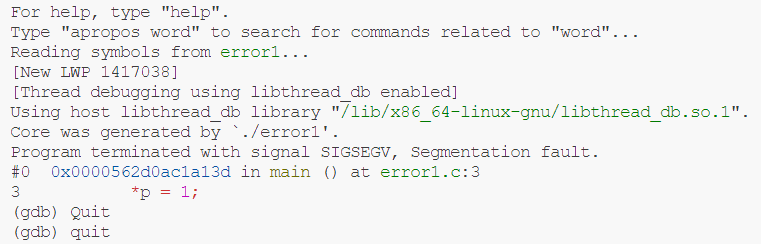
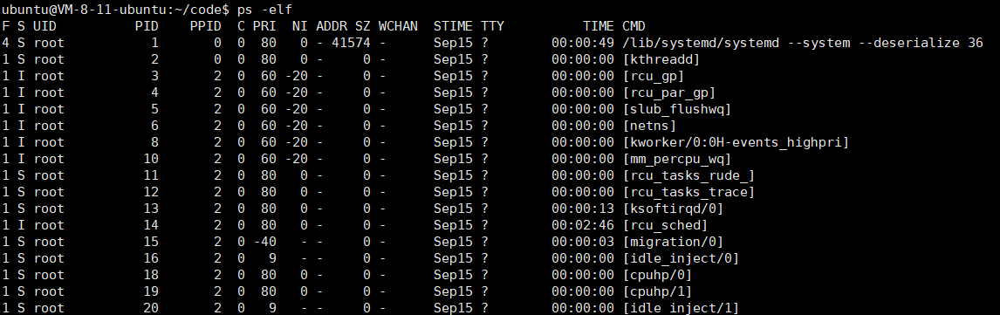
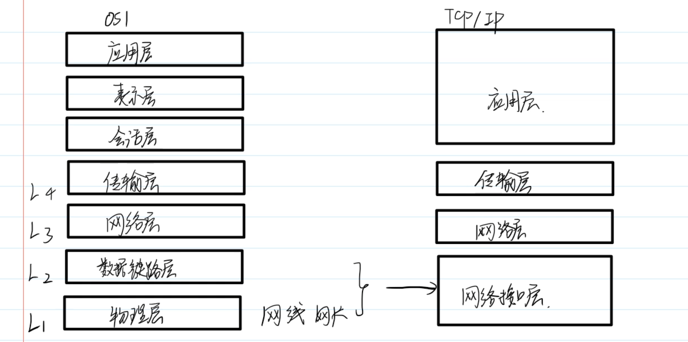

# 0.Makefile


**make的工作方式**

GNU的make工作时的执行步骤如下：（想来其它的make也是类似）

1. 读入所有的Makefile。
2. 读入被include的其它Makefile。
3. 初始化文件中的变量。
4. 推导隐式规则，并分析所有规则。
5. 为所有的目标文件创建依赖关系链。
6. 根据依赖关系，决定哪些目标要重新生成。
7. 执行生成命令。


## 宏

**$@**	表示目标文件

**$?**	表示比目标还要新的依赖文件列表

**$<**	表示第一个依赖文件

**$***	表示目标模式中%以及之前的部分

```makefile
hello : main.cpp hello.cpp factorial.cpp
	$(CC) $(CFLAGS) $@.cpp $(LDFLAGS) -o $@
```


## 定义依赖性

```makefile
hello : main.o factorial.o hello.o
	$(CC) main.o factorial.o hello.o -o hello
```

在这里，我们告诉hello依赖main.o，factorial.o，hello.o，所以每当有任何变化，这些目标文件将采取行动。


同时我们会告诉如何准备.o文件，所以以下依赖也必须定义：

```makefile
main.o : main.cpp functions.h
	$(CC) -c main.cpp
	
factorial.o : factorial.cpp functions.h
	$(CC) -c factorial.cpp

hello.o : hello.cpp functions.h
	$(CC) -c hello.cpp
```


**利用特殊宏对makefile进行优化：**

```makefile
LDFLAGS = -lstdc++

hello : main.o factorial.o hello.o
	$(CC) $? $(LDFLAGS) -o $@

main.o :  main.cpp functions.h
	$(CC) -c main.cpp

factorial.o : factorial.cpp functions.h
	$(CC) -c factorial.cpp

hello.o : hello.cpp functions.h
	$(CC) -c hello.cpp
```


**makefile的隐含规则：**

main.o会默认依赖main.cpp，所以以上的makefile文件可以继续简化：

```makefile
LDFLAGS = -lstdc++

hello: main.o factorial.o hello.o
	$(CC) $^ $(LDFLAGS) -o $@

main.o: functions.h
	$(CC) -c main.cpp

factorial.o: functions.h
	$(CC) -c factorial.cpp

hello.o: functions.h
	$(CC) -c hello.cpp
```


## 条件指令


`ifeq`：相等则执行指令。

`ifneq`：不相等则执行指令。

`ifdef`：定义则执行指令。

`ifndef`：未定义则执行指令。

`else`

`endif`：指令结束条件。每一个条件必须于endif结束。


**用条件指令执行跨平台编译：**

```makefile
libs_for_gcc = -lgnu
normal_libs = 

foo: $(objects)

ifeq ($(CC),gcc)
	$(CC) -o foo $(objects) $(libs_for_gcc)
else
	$(CC) -o foo $(objects) $(normal_libs)
endif
```


## 赋值指令

`=`	直接赋值

`+=`	追加和修改

`:=`	忽略之前的赋值

`?=`	如果前面没有定义，则定义生效


## 文件重新编译

当依赖项比目标新的时候，会触发重新编译。


有些业务场景需要避免重新编译，可以使用

```shell
make -t
```


## make递归使用

假设，你有一个子目录，子目录都有其自己的makefile，并且您希望所在目录的makefile中运行make子目录：

```makefile
subsystem:
	cd subdir && $(MAKE)
	
或者

subsystem:
	$(MAKE) -C subdir
```


**通信变量到子make**

导出特定变量的到子make：

```makefile
export variable...
```


阻止导出：

```makefile
unexport variable...
```


## 头文件在不同目录

声明头文件的路径

```makefile
INCLUDES = -I "/home/zjs/header"
CC = gcc
LIBS = -lm
CFLAGS = -g -Wall
OBJ = main.o factorial.o hello.o

hello: $(OBJ)
	${CC} ${CFLAGS} ${INCLUDES} -o $@ ${OBJ} ${LIBS}
.o.cpp
	${CC} ${CFLAGS} ${INCLUDES} -c $<
```


## 例子

```makefile
OBJS = main.o factorial.o hello.o
CFLAGS = -Wall -g
INCLUDES = -I .
LIBS = -lstdc++

hello: ${OBJS}
	${CC} ${CFLAGS} -o $@ $^ ${LIBS}

.o:.cpp
	${CC} ${CFLAGS} ${INCLUDES} -c $<

clean:
	@rm -f *.o hello
```


# 1.Linux

Linux内核架构图


**内核：**

1.管理硬件资源：CPU，内存，外设

文件管理，内存管理，进程调度，网络通信，硬件驱动

2.为上层应用软件提供运行环境


**系统调用：**内核对上层应用程序提供的接口

**库函数：**对系统调用进行包装，方便程序使用

**shell：**命令解析器，本质是一个程序，用来解析命令，执行命令


## 用户子系统

**特权用户：**root，拥有最高的权限

**普通用户：**

1.sudoers，临时拥有特权用户的权限

2.其他用户


查看所有的用户：

```shell
cat /etc/passwd
```

添加用户：

```shell
sudo useradd -m -s /bin/bash 用户名
# -m 指定家目录
# -s /bin/bash 指定bash为默认的shell
```

删除用户：

```shell
sudo userdel 用户名
```

切换用户：

```shell
su 用户名
```

更改密码：

```shell
sudo passwd 用户名
```


## 文件子系统

虚拟文件系统(VFS)


**bin**(binary)：可执行程序

**dev**(device)：设备文件

**home**：普通用户家目录的根目录

**root**：root用户的家目录

**sbin**(system binary)：和系统相关的可执行程序

**var**(variable)：一般放经常变化的文件，比如日志文件

**etc**：配置文件

**lib**：库文件

**proc**(process)：进程映射文件


打印当前工作目录：

```shell
pwd
```

切换目录：

```shell
cd /	#切换到根目录
cd ~	#切换到家目录
cd ..
cd -	#回到上一次的目录
```

查看环境变量：

```shell
env
```


### 查看文件 ls -l

```shell
ls -l
```

`drwxr-xr-x  19 root root  3940 Sep 15 09:17 dev/`

文件权限|硬链接个数|用户名|用户所属组名|文件大小|修改时间|文件名

**d**：directory

**r**：read

**w**：write

**x**：execute

**-**：没有对应权限

注意：rwx-r-xr-x三组权限，user-group-others


**-**：file

**l**：symbolic link(软链接)

**c**：字符设备

**b**：块设备(硬盘)

**p**：管道文件(进程间通信)

**s**：套接字文件


### 通配符

*****：可以匹配任意多个字符

**?**：可以匹配任意一个字符

**集合：**

[characters]：匹配集合内的任意一个字符	[abc]

[!characters]：匹配集合外的任意一个字符	[!abc]

**类：**

[0-9]：数字

[a-z]：小写字母

[A-Za-z]：字母


### 链接

ln - make links between files

**硬链接**：硬链接是在文件系统中创建一个额外的索引节点（inode），该索引节点与原始文件的索引节点相同。这意味着硬链接与原始文件实际上位于相同的物理位置，它们共享相同的数据块。

**软链接：**是一种特殊类型的文件，它包含对另一个文件或目录的路径的引用。

创建软链接：

```shell
ln -s /home/photos/a.jpg /home/documents/b.jpg
```

请注意，软链接不会复制文件或目录的内容，它只是一个路径的引用。


### 查找文件

**locate**	-find files by name

```shell
locate studio.h
```


**which**	-locate a command(只能查找一个可执行程序)

```shell
which sshd
```


**find**	-search for files in a directory hierachy

1.根据名字查找：

-name "pattern"	

```shell
find / -name "stdio.h"
```

-a(and)	-o(or)	!(逻辑取反)

```shell
#查找linux内核文件夹下所有.c和.h文件
find linux-5.16.12/ -name "*.c" -o -name "*.h"
```

2.根据类型查找：

-type 类型

```shell
#查找当前目录下的所有普通文件
find . -type f
#查找当前目录下名字含有soft并且类型是符号链接的文件
find . -name "*soft*" -a -type l
```

3.根据权限查找：

-perm

```shell
#查找当前目录下权限为664的文件
find . -perm 664
```


### 命令的组合

```shell
mkdir dir4; cd dir4
#把找到的文件依次执行ls -l命令
find /usr/include -name "stdio.h" -exec ls -l {}
```


### 权限

chmod	- change file mode bits


**(1)文字设定法**

`chmod [ugoa][+=-][rwx] file/dir`

```shell
chmod a+x hello.py			#所有类型的用户添加可执行权限
chmod u=r,g=rw,o=r a.txt	
```


### 查看文件

**cat**	- concatenate files and print the standard output

| 文件描述符 |              |        | 文件描述符 |
| ---------- | ------------ | ------ | ---------- |
| stdin      | 标准输入     | 键盘   | 0          |
| stdout     | 标准输出     | 显示器 | 1          |
| stderr     | 标准错误输出 | 显示器 | 2          |


```shell
cat > d.txt		#可在d.txt输入
```

**echo**	- display a line a text


**head/tail**	- 显示头或尾的信息

```shell
tail -n 10 d.txt	#显示最后10行的信息
```


**file**	- determine file type

```shell
file d.txt	#查看文件详细信息
```


**iconv**	- convert text from one character to another

```shell
iconv -f gbk -t utf-8 d.txt 	#从gbk改为utf8编码
```


**grep**	- searches  for  PATTERNS  in  each  FILE.

-E	--正则表达式--

-i	 --忽略项--

-n	--line-number

```shell
#搜索以t开头，以n结尾的单词
grep -nE "\<t[^ ]*e\>" The_Holy_Bible.txt
```


## git


### 生成公钥

```shell
cd ~		#1.退出到用户主目录
cd .ssh/	#2.进入ssh隐藏文件夹
ssh-keygen	#3.生成ssh公钥
```

#4.把公钥添加到github里


### 上传代码

1.修改本地仓库

2.add(将修改添加到缓存，stage)

3.commit(确实修改，将修改的东西更新到本地仓库)

4.pull(把远程仓库的代码拉取下来)

5.解决冲突(ctrl+X)

6.push(上传到远程仓库)


## vim


**vim有三种模式：**

1.普通模式

2.编辑模式

3.视图模式


### 命令模式

**光标移动：**

```shell
ctrl + f:	上一页 forward
ctrl + b:	下一页 backward
H:			页首
L:			页的最后一行
```


**命令模式下编辑文本：**

```shell
#删除
dd:		删除一行
dnd:	删除n行
D:		删除到行位(比如可以删掉注释)
u:		撤销操作
#拷贝
yy:		拷贝一行
#查找和替换
/regex
```


## 编译链


```shell
gcc hello.c -o hello	# -o:给目标文件起名
```

生成汇编代码：

```shell
gcc -E hello.c -o hello.i	#预处理后的文件
gcc -S hello.i -o hello.s	#汇编文件
# 或者直接生成汇编代码
gcc -S hello.c -o hello.s
```


**汇编常用命令**

```assembly
push	#入栈
pop		#出栈
mov		#移动(赋值)
lea		#(load effective address)加载有效地址
call	#函数调用
ret		#函数返回

%rbp	#base pointer 栈帧基址寄存器
%rsp	#stack pointer 栈顶寄存器
%eax	#返回值
```

注意：

以%开头的都是表示**寄存器**

一个栈帧的大小 = %rbp - %rsp


### 生成静态库

1.生成目标文件

```shell
gcc -c add.c -o add.o
```

2.打包成静态库文件

```shell
ar crsv libadd.a add.o
```

3.移动到系统库目录

```shell
sudo cp libadd.a /usr/lib
```

4.加上链接

```shell
gcc test.o -o test -ladd
```


### 生成动态库

1.编译成目标文件，加上`-fPIC`(相对地址→位置无关代码)

```shell
gcc add.c -o add.o -fPIC
```

2.打包

```shell
gcc -shared add.o -o libadd.so
```

3.移动到系统库目录

```shell
sudo cp libadd.so /usr/lib
```

4.加上链接

```shell
gcc test.o -o test -ladd
```


### gcc其他选项

-D：相当于#define DEBUG

```shell
gcc test.c -D DEBUG
```

-I：增加头文件搜索路径

```shell
gcc src/test.c -I include/
```

-O：编译优化

-Wall：开启警告

```shell
gcc src/test.c -I include/ -Wall
```


### gdb

1.用gdb的时候不要开优化，加上`-O0`

2.汇编指令里没有变量的名字，需要补充调试信息`-g`


**gdb的命令**					 

| 命令                               | 描述               |
| ---------------------------------- | ------------------ |
| `list/l [文件名:][行号]|[函数名]`  | 看文件内容         |
| `run/r`                            | 运行程序           |
| `break/b [文件名:][行号]|[函数名]` | 打断点             |
| `continue/c`                       | 继续运行           |
| `step/s`                           | 单步调试           |
| `next/n`                           | 单步调试(跳过函数) |
| `finish`                           | 跳出本次函数调用   |
| `info break/ib`                    | 查看断点信息       |
| `delete [num]`                     | 删除断点           |
| `ignore [num] [count]`             | 忽略num断点count次 |


**在gdb中查看监视**

| 命令            | 描述             |
| --------------- | ---------------- |
| print/p 表达式  | 打印表达式的信息 |
| display 表达式  | 打印表达式的信息 |
| info display    | 展示display信息  |
| undisplay [num] | 取消监视         |


**检查崩溃的程序**

黑匣子：**core文件**(程序崩溃时刻内存的堆栈)

```shell
ulimit -c unlimited
./error1
```

如果显示不出来core文件：

```shell
su root		#切换到root用户
echo core > /proc/sys/kernel/core_pattern
gdb error1 core.1417038
```


空指针导致的崩溃：



栈溢出导致的崩溃：


### makefile

makefile增量编译生成代码。

一种"目标-依赖"，只有目标不存在/目标比依赖旧，才会执行命令。


1.名字必须是Makefile/makefile

2.规则的集合：依赖文件(0-n个)→目标文件(1个)，每个命令前必须写个<tab>键

3.把最终生成的文件作为第一个规则的目标


**makefile基本使用**

```makefile
main:main.o add.o
	gcc main.o add.o -o main
main.o:main.c
	gcc -c main.c -o main.o
add.o:add.c
	gcc -c add.c -o add.o
.PHONY:clean rebuild
clean:
	rm -f main.o add.o main
rebuild:clean main
```


**变量**

**1.自定义变量**：变量名:=值	所有值都是字符串类型

**2.预定义变量**	

**3.自动变量**：同一个变量名，值会随着规则变化而变化

```makefile
OUT:=main
OBJS:=main.o add.o
CC:=gcc
$(OUT):$(OBJS)
	$(cc) $^ -o $@
main.o:main.c
	$(cc) -c $^ -o $@
add.o:add.c
	$(cc) -c $^ -o $@
.PHONY:clean rebuild
clean:
	$(RM) $(OUT) $(OBJS)
rebuild:clean main
```


**用百分号字符管理格式关系**

%：用在第二个规则中，按格式从第一个规则的依赖来匹配


## 文件

狭义：存储在外部存储介质上的数据集合

广义：速度慢，容量大，持久存储


**文件类型：**

普通文件，目录文件，软链接

字符设备文件	鼠标

块设备文件	    磁盘	

管道文件		通信

socket	            网络通信


### **fopen**

`FILE *fopen(const char *pathname, const char *mode);`

| 模式 | 描述                         |
| ---- | ---------------------------- |
| "a"  | append，只写追加             |
| "a+" | 读写追加，打开时处于文件开始 |


### **改变文件权限**

chmod, fchmod, fchmodat - change permissions of a file

`int chmod(const char *pathname, mode_t mode);`

```c
mode_t mode;
sscanf(argv[1],"%o",&mode);
int ret = chmod(argv[2],mode);
```


### **获取工作目录**

getcwd, getwd, get_current_dir_name - get current working directory

`#include <unistd.h>`

`char *getcwd(char *buf, size_t size);`


### **改变工作目录**

chdir, fchdir - change working directory

`#include <unistd.h>`

`int chdir(const char *path);`


### **目录流**

目录流（Directory Stream）是一个计算机编程术语，通常用于操作系统和文件系统编程中。它是一个与文件目录相关的数据结构，用于表示一个目录中的所有文件和子目录的信息。目录流允许程序员以一种有序的方式访问目录中的内容，并执行各种文件和目录操作，如查找、创建、删除文件和目录等。


**打开目录**

opendir, fdopendir - open a directory

`#include <sys/types.h>`
`#include <dirent.h>`

`DIR *opendir(const char *name);`


**目录项**

```c
struct dirent {
ino_t d_ino;       /* Inode number 磁盘*/
off_t d_off;       /*next指针*/
unsigned short d_reclen;    /*本结构体的大小*/
unsigned char  d_type;      /*文件类型 */
char d_name[256]; /*文件的名字*/
};
```

readdir - read a directory

`struct dirent *readdir(DIR *dirp);`


### **无缓冲文件IO**

不带用户态缓冲，但是有内核文件缓冲区


文件描述符**fd**


**open**

open, openat, creat - open and possibly create a file

```c
#include <sys/types.h>
#include <sys/stat.h>
#include <fcntl.h>

int open(const char *pathname, int flags);
int open(const char *pathname, int flags, mode_t mode);
```


**read**

`#include <unistd.h>`

`ssize_t read(int fildes, void *buf, size_t nbyte);`


**write**

pwrite, write — write on a file

`#include <unistd.h>`

`ssize_t write(int fildes, const void *buf, size_t nbyte);`


### 性能问题

linux系统文件函数和c语言库函数的性能上的区别：


使用文件流：

优势：零碎的写入，也可以保证少量的系统调用

劣势：拷贝次数更多


buf越大越好，减少状态切换的次数。


### 内存映射


mmap

在**用户态空间**分配一片内存，该内存直接和外部设备建立映射。

使用*或[]读写内存，**等价于读写文件**。


**内存映射的限制：**

1.文件大小固定(ftruncate)

2.只能是磁盘文件

3.建立映射之前要先open


**函数定义：**

mmap, munmap - map or unmap files or devices into memory

```c
#include <sys/mman.h>
void *mmap(void *addr, size_t length, int prot, int flags, int fd, off_t offset);
int munmap(void *addr, size_t length);
```


### **IO多路复用**

**管道**

named pipe/FIFO

是**进程间通信机制**在文件系统的映射。

`mkfifo`

一个管道的建立需要两个资源，一边开读端，一边开写端。


**两根管道不合适的打开顺序，可能会导致死锁：**

A先打开管道1的读端，B先打开管道2的读端，会发生死锁。

因为A在等待B打开管道1的写端，B在等待A打开管道2的写端。

这是一个循环等待的过程，死锁。


**select函数**

```c
#include <sys/select.h>

int select(int nfds, fd_set *readfds, fd_set *writefds,
fd_set *exceptfds, struct timeval *timeout);

void FD_CLR(int fd, fd_set *set);
int  FD_ISSET(int fd, fd_set *set);	//询问操作
void FD_SET(int fd, fd_set *set);	//加入监听
void FD_ZERO(fd_set *set);			//清空集合
```

**fd_set：**监听集合，整个数组大小1024bytes(1024个文件)，位图。

**轮询：**polling

**回调：**callback


1.创建fd_set

2.设置合适的监听

3.调用select函数，会让进程阻塞

4.当监听的fd中有任何一个就绪时，则select就绪

5.轮流询问所有监听的fd是否就绪(FD_ISSET询问操作)


**select的劣势**


## 进程

在**某一个时刻**，多个进行同时运行，称为**并行**。

在**某一段时间**，多个进行同时运行，称为**并发**。


**进程：**正在运行的程序，os(内存和cpu)资源分配的基本单位。

**pid：**是一个正整数，给用户来标识不同的进程。

**uid：**真实用户标识符

**euid：**有效用户标识符


### 进程的命令

#### ps -elf



**S的含义：**进程的状态


D	不可中断(不会响应信号)

I	  空闲状态

R	运行态或就绪态

S	可中断的睡眠

T	被任务控制信号暂停

t	被调试器暂停

X	死了

Z	僵尸进程(进程已终止，资源未回收)


**STIME：**启动时间

**TTY：**终端

**TIME：**cpu占用总时间

**CMD：**启动进程的命令


#### ps -aux


**VSZ：**virtual size，已经占用的虚拟内存空间

**RSS：**驻留集大小


#### top

查看进程的实时状态


#### 前台和后台

**前台：**可以响应键盘中断的进程

**后台：**不可以响应...


ctrl + c 中止前台进程

kill -9 pid 杀死后台进程


后台到前台：fg

前台到后台：ctrl + z

后台暂停到后台运行：bg


#### crontab

单用户定时任务	`crontab -e`

全局定时任务	    `vim /etc/crontab`


### system

system - execute a shell command

```c
#include <stdlib.h>
int system(const char *command);
```

虽然system是跨平台的，但是它需要创建三个进程。


### fork

fork - create a child process

fork() ：creates  a  new process by duplicating the calling process.

```c
#include <sys/types.h>
#include <unistd.h>

pid_t fork(void);
```

可以通过fork的返回值来走向不同的父子进程分支。

```c
int main(){
    pid_t = pid;
    pid = fork();
    if(pid==0){
        printf("I am child, pid=%d\n",getpid());
    }
    else{
        printf("I am parent	, pid=%d\n",getpid());
        sleep(1);
    }
}
```


### wait

进程的退出，资源由其父进程回收。

如果子进程终止的时候，父进程一直不调用wait，会导致僵尸进程。

僵尸进程：终止了但资源未回收。


### 日志系统

closelog, openlog, syslog, vsyslog - send messages to the system logger

**注意：**syslog和printf的使用方式是一样的，除了多了一个优先级。

```c
#include <syslog.h>

void openlog(const char *ident, int option, int facility);
void syslog(int priority, const char *format, ...);
void closelog(void);

void vsyslog(int priority, const char *format, va_list ap);
```

**日志系统的优先级：**

| 变量名      | 描述                               |
| ----------- | ---------------------------------- |
| LOG_EMERG   | system is unusable                 |
| LOG_ALERT   | action must be taken immediately   |
| LOG_CRIT    | critical conditions                |
| LOG_ERR     | error conditions                   |
| LOG_WARNING | warning conditions                 |
| LOG_NOTICE  | normal, but significant, condition |
| LOG_INFO    | informational message              |
| LOG_DEBUG   | debug-level message                |


### 守护进程

daemon

即使是会话关闭了，进程依然能够持续运行。

**以d结尾：**sshd→守护进程


**守护进程的特点：**

1.创建新会话

2.重置掉cwd和umask

3.关闭所有的文件描述符

```c
void Daemon(){
    //1.创建新会话
    if(fork()!=0){
        exit(0);
    }
    setsid();
    //2.关闭所有的文件描述符
    for(int i = 0; i < 2; ++i){
        close(i);
    }
    //3.重置掉cwd和umask
    chdir("/");
    umask(0);
}

int main(){
    Daemon();
}
```


### **进程间通信**

Inter Process Comminication→IPC

打破进程之间的隔离，从而进程可以共享数据。


**IPC方式**

管道

信号

共享内存

信号量

消息队列


#### 管道

**有名管道：**在文件系统中存在一个管道文件

**匿名管道：**在文件系统中不存在，只用于父子进程间


popen, pclose - pipe stream to or from a process

```c
#include <stdio.h>

FILE *popen(const char *command, const char *type);//"w""r"

int pclose(FILE *stream);
```

"w"：父进程可写入FILE内，子进程把自己的stdin重定向为管道

"r"：父进程可读取FILE，子进程把自己的stdout重定向为管道


#### 信号

一种**软件层面**的异步事件机制。


**信号的默认行为**


**当信号产生时**

信号产生会修改目标进程的**task_struct**(目标认为所有的信号都来自内核)

```c
//回调函数
void sigFunc(int num){
    printf("num = %d\n",num);
}
int main(){
    void (*ret)(int);
    ret = signal(SIGINT,sigFunc);
    while(1){
        
    }
}
```


**阻塞：**让产生的信号不能马上递送，而是处于未决状态。

**未决：**已产生但未递送的信号。


**低速系统调用：**可能陷入永久等待的系统调用


## 线程


**进程的问题：**

1.cpu寄存器要切换

2.虚拟地址和物理地址的映射慢

3.进程间通信很麻烦


**线程：**

轻量级的进程。

是一个正在执行的程序。

同一个进程存在多个线程共享内存资源。


**用户级线程：**cpu调度由进程处理

**内核级线程：**调度由os处理


**线程的优点：**

1.减少了上下文切换的代价

2.不需要页表切换

3.线程之间通信简单(共享内存)


### 创建子线程

pthread_create - create a new thread

```c
#include <pthread.h>

int pthread_create(pthread_t *thread, const pthread_attr_t *attr, void *(*start_routine) (void *), void *arg);
//线程ID，线程属性，线程启动函数，start_routine的参数
```


**代码示例：**

主线程终止，整个进程终止

```c
#include <pthread.h>
#include <stdio.h>
#include <unistd.h>

//此函数相当于子线程的main函数
void *threadFunc(void *arg){
    printf("I am child thread, tid = %lu\n",pthread_self());
}

int main(){
    printf("I am main thread, tid = %lu\n",pthread_self());
    pthread_t tid;
    //创建子线程
    pthread_create(&tid,NULL,threadFunc,NULL);
    //sleep(1);
    return 0;
}
```

多线程想共享就用指针，想传递就用long。


### **线程的终止**

一个进程任一个线程：

1.main return

2.exit

3._exit

4.abort

5.收到信号

整个进程终止，其中的所有线程也终止了


**子线程如何只终止自己？**

从任何位置调用pthread_exit

pthread_exit - terminate calling thread

```c
#include <pthread.h>
void pthread_exit(void *retval);
//子线程的返回值
```


回收线程的资源：pthread_join - join with a terminated thread

```c
#include <pthread.h>
int pthread_join(pthread_t thread, void **retval);
```

`void** retval`：拷贝子线程的终止状态，主调函数申请`void*`的内存，join试图修改主调函数的`void*`(传递地址)


**join和exit的例子**

```c
void *threadFunc(void *arg){
	printf("child thread, tid = %lu\n",pthread_self());
	pthread_exit((void*)23456);
}
int main(){
    printf("main thread, tid = %lu\n",pthread_self());
    pthread_t tid;
    //创建子线程
    pthread_create(&tid,NULL,threadFunc,NULL);
    void* retval;	//申请了8个字节
    pthread_join(tid,&retval);	//阻塞线程直到tid线程结束
    printf("retval = %ld\n",(long)retval);
```


### 线程的取消

给另一个线程发送取消**请求**

```c
int pthread_cancel(pthread_t thread);
```

pthread_cancel不是立刻中止另一个线程

1.cancel会立刻修改目标线程的取消标志位

2.目标线程运行到一些特殊的**取消点**

3.取消点函数调用完成前会终止线程


例子：

```c
void *threadFunc(void *arg){
    printf("child thread, tid = %lu\n",pthread_self());
    pthread_exit((void*)0);
}

int main(){
    printf("main thread, tid = %lu\n",pthread_self());
    pthread_t tid;
    //创建子线程
    pthread_create(&tid,NULL,threadFunc,NULL);
    //给子线程发送一个取消信号
    pthread_cancel(tid);
    void* retval;
    //如果tid是被cancel掉的，retval就是-1
    pthread_join(tid,&retval);
    printf("child return value = %ld\n",(long)retval);
    return 0;
}
```


### 线程资源清理

push和pop必须成对出现

```c
void pthread_cleanup_push(void (*routine)(void *), void *arg);
void pthread_cleanup_pop(int execute);
```

代码示例：

```c
#include <pthread.h>
#include <stdio.h>
#include <unistd.h>
#include <stdlib.h>

void clean1(void* arg){
    printf("I am clean1\n");
    free(arg);
}
void clean2(void* arg){
    printf("I am clean2\n");
    free(arg);
}

void *threadFunc(void *arg){
    printf("child thread, tid = %lu\n",pthread_self());
    int* p1 = malloc(4);    //申请资源后马上将对应清理行为压栈
    pthread_cleanup_push(clean1,p1);
    int* p2 = malloc(4);
    pthread_cleanup_push(clean2,p2);
    pthread_exit(NULL);
    pthread_cleanup_pop(1);
    pthread_cleanup_pop(1);
}

int main(){
    printf("main thread, tid = %lu\n",pthread_self());
    pthread_t tid;
    //创建子线程
    pthread_create(&tid,NULL,threadFunc,NULL);
    pthread_join(tid,NULL);
    return 0;
}
```


### 互斥锁

一个线程可以做加锁操作：

1.若已有任何线程持有锁，加锁的线程会阻塞

2.若未加锁，则加锁，线程继续运行


```c
int pthread_mutex_init(pthread_mutex_t *mutex, const pthread_mutexattr_t, *mutexattr);	//动态初始化

int pthread_mutex_lock(pthread_mutex_t *mutex);	//加锁

int pthread_mutex_unlock(pthread_mutex_t *mutex);//解锁
```


代码示例：

1.封装共享资源(包括锁)

2.所有共享资源的访问要放入**临界区**

```c
#include <pthread.h>
#include <stdio.h>
#include <unistd.h>
#include <stdlib.h>
#define NUM 10000000

typedef struct shareRes{
    pthread_mutex_t mutex;
    int count;
}shareRes_t;

void* threadFunc(void* arg){
    shareRes_t* pShareRes = (shareRes_t*)arg;
    for(int i = 0;i < NUM; ++i){
        pthread_mutex_lock(&pShareRes->mutex);  //加锁
        ++pShareRes->count;
        pthread_mutex_unlock(&pShareRes->mutex);  //解锁
    }
}
int main(){
    shareRes_t shareRes;
    shareRes.count = 0;
    pthread_mutex_init(&shareRes.mutex,NULL);
    pthread_t tid;
    int ret = pthread_create(&tid,NULL,threadFunc,(void*)&shareRes);
    for(int i = 0;i < NUM; ++i){
        pthread_mutex_lock(&shareRes.mutex);  //加锁
        ++shareRes.count;
        pthread_mutex_unlock(&shareRes.mutex);  //解锁
    }
    pthread_join(tid,NULL);
    printf("count = %d\n",shareRes.count);
    pthread_mutex_destroy(&shareRes.mutex);
}
```


### 死锁

线程阻塞，等待永远不可能为真的条件成立。


**死锁的情况：**

**1.持有锁的线程终止了：**

在线程终止的任何分支都要解锁。

如果线程可能被cancel，在加锁之后立刻pthread_cleanup_push


**2.一个线程对同一把锁加锁两次**

解决方法：

上策：不写这种代码

中策：非阻塞加锁

```c
int pthread_mutex_trylock(pthread_mutex_t *mutex);
//未加锁状态，会加锁
//已加锁，trylock会立刻返回
```


### 条件变量

**同步：**事件的执行顺序是固定的(利用mutex实现同步)


1.设计一个条件，决定本线程是否要等待

2.如果不满足，调用**wait**使本线程陷入等待

3.此时，另外的线程会运行，直到将条件改成满足，通知(**signal**)阻塞的线程恢复就绪


**条件变量的接口**


 ```c
 #include <pthread.h>
 #include <stdio.h>
 #include <unistd.h>
 #include <stdlib.h>
 
 typedef struct shareRes_s{
     int flag;
     pthread_cond_t cond;
     pthread_mutex_t mutex;
 }shareRes_t;
 
 void* threadFunc(void *arg){
     shareRes_t* pShareRes = (shareRes_t*)arg;
     
     //先加锁
     pthread_mutex_lock(&pShareRes->mutex);
     //只有在加锁的状态下才能够使用wait
     if(pShareRes->flag == 0){
         pthread_cond_wait(&pShareRes->cond,&pShareRes->mutex);
     }
     //从wait中唤醒的话，说明前面的事件已经完成了
     puts("world");
     //记得解锁
     pthread_mutex_unlock(&pShareRes->mutex);
     pthread_exit(NULL);
 }
 
 int main(){
     //初始化锁和条件变量
     shareRes_t shareRes;
     pthread_mutex_init(&shareRes.mutex,NULL);
     pthread_cond_init(&shareRes.cond,NULL);
     shareRes.flag = 0;
 
     //创建子线程
     pthread_t tid;
     pthread_create(&tid,NULL,threadFunc,(void*)&shareRes);
 
     sleep(1);
     //先执行一个事件，然后唤醒等待在条件变量上的某个线程
     puts("Hello");
     shareRes.flag = 1;
     pthread_cond_signal(&shareRes.cond);
 
     //收尾工作，等待子线程的终止，销毁锁和条件变量
     pthread_join(tid,NULL);
     pthread_cond_destroy(&shareRes.cond);
     pthread_mutex_destroy(&shareRes.mutex);
 }
 ```


**pthread_cond_wait的内部实现**

前一半：

1.判断有没有加锁

2.把自己加入唤醒队列

3.解锁并陷入等待


后一半(收到signal之后)：

1.使自己处于就绪状态

2.醒来之后加锁

3.持有锁之后再继续运行


## 网络编程




**内核协议栈**

传输层	TCP/UDP

网络层	IP

接口层	


**交换机：**L2，扩展广播域

**路由器：**L3，跨越局域网

**IP地址：**定位不同的主机

**MAC地址：**物理地址

**端口号：**定位主机中的进程


**路由器工作原理：**

根据包的目的IP地址，做转发操作。

- 目的IP按位与genmask
- 和desination匹配
- 选择最长匹配进行转发gateway


**NAT技术：**

Network Address Translation，网络地址转换。

IP，端口转换。将内部网络的**私有IP地址**转换为外部网络的**公共IP地址**，这使得多个设备可以使用相同的公共IP地址，缓解IPv4地址枯竭问题。


### TCP

面向连接的协议，可靠，全双工，端到端。

**可靠**

1.确认机制ACK

2.缓冲区，保存已发送未确认的数据

3.定时器

4.序号，为了避免接收端收到重复包

5.ACK包括SEQ的信息


**TCP建立连接**

三次握手的过程中，确认了四个信息


**TCP断开连接**


### socket编程


**socket系统调用**

socket - create an endpoint for communication

```c
#include <sys/types.h>
#include <sys/socket.h>

int socket(int domain, int type, int protocol);
//domain: AF_INET	type:SOCK_STREAM SOCK_DGRAM 	protocol:0
```


**connect函数**

connect - initiate a connection on a socket

```c
#include <sys/types.h>
#include <sys/socket.h>

int connect(int sockfd, const struct sockaddr *addr, socklen_t addrlen);
```


**bind函数**

bind - bind a name to a socket

```c
#include <sys/types.h>          
#include <sys/socket.h>

int bind(int sockfd, const struct sockaddr *addr, socklen_t addrlen);
```

bind一般是给服务端用的。

对于bind而言，addr一定是本地地址。


**listen函数**

listen是说明让socket当做服务端来使用。

listen清空socket的文件对象，建立了半连接队列和全连接队列。


listen - listen for connections on a socket

```c
#include <sys/types.h>        
#include <sys/socket.h>

int listen(int sockfd, int backlog);
```


**accept函数**

从全连接队列中取出一个连接，构建一个新的已连接socket。

accept的本质是一个read，全连接队列若为空，accept就会阻塞。


accept, accept4 - accept a connection on a socket

```c
#include <sys/types.h>          /* See NOTES */
#include <sys/socket.h>

int accept(int sockfd, struct sockaddr *addr, socklen_t *addrlen);
//addr填本地地址/null
//后两个参数可以都填NULL，这样就不会获取客户端的信息了
```


**send函数**

send, sendto, sendmsg - send a message on a socket

send和write是拷贝数据到发送缓冲区，之后的事情由内核协议栈处理

```c
#include <sys/types.h>
#include <sys/socket.h>

ssize_t send(int sockfd, const void *buf, size_t len, int flags);
```


**recv函数**

recv, recvfrom, recvmsg - receive a message from a socket

```c
#include <sys/types.h>
#include <sys/socket.h>

ssize_t recv(int sockfd, void *buf, size_t len, int flags);
```


TCP协议是一种字节流协议，消息之间没有边界。


### **epoll**


**select的缺陷**

1.fd_set的本质是一个位图，容量固定1024。(可以扩容，要重新编译内核)

2.监听和就绪用的是同一个数据结构(使用困难)

3.存在多次大量从用户态到内核态的拷贝

4.采用轮询找到就绪的FD→在海量连接，少量就绪的情况下有极大的性能损耗


**IO多路复用 高性能**

1.**所有监听数据放内核态**，看成一个文件对象(避免了拷贝问题)

2.监听和就绪分离


**epoll函数**-创建文件描述符

epoll_create, epoll_create1 - open an epoll file descriptor

```c
#include <sys/epoll.h>

int epoll_create(int size);
```


**设置监听**

epoll_ctl - control interface for an epoll file descriptor

```c
#include <sys/epoll.h>

int epoll_ctl(int epfd, int op, int fd, struct epoll_event *event);
```


**陷入阻塞**

epoll_wait - wait for an I/O event on an epoll file descriptor

```c
#include <sys/epoll.h>

int epoll_wait(int epfd, struct epoll_event *events,int maxevents, int timeout);
//epoll_wait的返回值是就绪事件的个数
```


给已经打开的fd加上非阻塞属性

```c
#include <unistd.h>
#include <fcntl.h>

int fcntl(int fd, int cmd, ... /* arg */ );
```


**epoll的触发方式**


**设置socket的属性**

```c
#include <sys/types.h>          
#include <sys/socket.h>

int getsockopt(int sockfd, int level, int optname, void *optval, socklen_t *optlen);

int setsockopt(int sockfd, int level, int optname, const void *optval, socklen_t optlen);
```


### 进程池

进程池/线程池的设计思路：

1.提前创建好若干个进程

2.每当有任务到来，分配一个进程

3.任务完成后归还进程

4.整个进程池关闭的时候再销毁


**1.创建子进程**


**2.初始化tcp连接**


**3.父子进程移交连接**

在两个进程之间传递文件对象。

```c
#include <sys/types.h>
#include <sys/socket.h>

ssize_t sendmsg(int sockfd, const struct msghdr *msg, int flags);
```

除了可以传递文本内容，还可以传递控制信息


1.申请内存(堆)


### 线程池

进程池(Nginx，Chrome多进程)

**优点：**一个子进程崩溃，不影响其他子进程

**缺点：**进程间通信太过困难。消耗较多的资源


**线程池的架构**


```c
//threadPool.h
typedef struct task_s{
    int netFd;	//传递文件描述符
    struct task_s *pNext;
}task_t;

typedef struct taskQueue_s{
    task_t *pFront;	//队首指针
    task *pRear;	//队尾指针
    int size;		//队列现在的长度
    pthread_mutex_t mutex;
    pthread_cond_t cond;
}taskQueue_t;

typedef struct threadPool_s{
    pthread_t *tid;	//子线程的数组
    int threadNum;	//子线程的个数
    taskQueue_t taskQueue;
}threadPool_t;
int taskEnqueue(taskQueue_t *pTaskQueue, int netFd);	//入队声明
int taskDeQueue(taskQueue_t *pTaskQueue);
int threadPoolInit(threadPool_t *pThreadPool, int workerNum);	//初始化线程池
```

```c
//taskQueue.c
#include "threadPool.h"
int taskEnqueue(taskQueue_t *pTaskQueue, int netFd){
    task_t *pTask = (task_t*)calloc(1,sizeof(task_t));
    pTask->netFd = netFd;
    if(pTaskQueue->size == 0){
        pTaskQueue->pFront = pTask;
        pTaskQueue->pRear = pTask;
    }
    else{
        pTaskQueue->pRear->pNext = pTask;
        pTaskQueue->pRrear = pTask;
    }
    ++pTaskQueue->size;
    return 0;
}

int taskDeQueue(taskQueue_t *pTaskQueue){
    task_t *pCur = pTaskQueue->pFront;
    pTaskQueue->pFront = pCur->pNext;
    free(pCur);
    --pTaskQueue->size;
    return 0;
}

int threadPoolInit(threadPool_t *pThreadPool, int workerNum){
    pThreadPool->threadNum = workerNum;
    pThread->tid = (pthread_t*)calloc(workerNum,sizeof(pthread_t));
    pThreadPool->taskQueue.pFront = NULL;
    pThreadPool->taskQueue.pRear = NULL;
    pThreadPool->taskQueue.size = 0;
    pThread_mutex-init(&pThreadPool->taskQueue.mutex,NULL);
    pthread_cond_init(&pThreadPool->taskQueue.cond,NULL);
}
```

```c
//worker.c
#include "threadPool.h"

void* handleEvent(void *arg){
    
}
int makeWorker(threadPool_t *pThreadPool){
    for(int i = 0; i < pThreadPool->threadNum; ++i){
        pthread_create(&pThreadPool->tid[i],NULL,handleEvent,(void*)pthreadPool);
    }
}
```

```c
//main.c
#include "threadPool.h"

int main(int argc, char *argv[]){
    int workerNum = atoi(argv[3]);
    threadPool_t threadPool;
    threadPoolInit(&threadPool,workerNum);
    makeWorker(&threadPool);
    int sockFd;
    tcpInit(&sockFd,argv[1],argv[2]);	//初始化tcp连接
    int epfd = epoll_create(1);
    epollAdd(sockFd,epfd);	//把sockFd给epoll监听
}
```


# 2.C++


## 基础


### 宏定义与常量

**宏定义与常量的区别？**

1.发生的时机：

宏定义在预处理时，没有类型检查。

const常量在编译时处理

2.类型检查：

宏定义没有类型检查，只是字符串替换。(虽然也有编译阶段，但此阶段没有检查报错，运行时的错误更难检查)

const有类型检查，更安全

比如：

```cpp
#define kBase 3+4
cout << 5*kBase << endl;	//19
```


**const修饰指针**

```cpp
const int* p1 = &a;		//不能修改指针指向的值
int const * p2 = &a;	//同上

int* const p3 = &a;		//不能修改指针的指向
```

tips：从右向左看，看const修饰的是什么


### 引用

概念：给变量起个别名。

```cpp
int a = 1;
int &ref1 = a;
```

注意：引用是不能独立存在的，必须绑定到一个已存在的对象。


### 参数传递的方式

1.值传递

2.地址传递

3.引用传递


### 强制转换

`static_cast`

常见，把void*转换成其他类型的指针


`const_cast`

去除常量属性，比较诡异，少用


`dynamic_cast`

动态类型转换，只用在多态时


`reinterpret_cast`

不要轻易使用，在任意类型间转换


### inline函数

如果某些函数比较短，可以用inline关键字修饰。

inline函数的定义只能放在头文件中。

因为inline函数是在编译时区替换，还没有链接，所以找不到头文件的，不能放在源文件中。


### 输入输出流


**流中都有缓冲区**

1.全缓冲区：只有当缓冲区满的时候，才会执行刷新操作

2.行缓冲区：碰到换行符的时候，进行刷新

3.非缓冲区：不带缓冲区


### 文件IO

1.文件输入流		`ifstream`

2.文件输出流		`ofstream`

3.文件输入输出流	`fstream`


文件输入流

```cpp
ifstream filename("log.txt");	//读取文件
```


文件输出流

```cpp
ofstream filename;	
filename.open("log.txt");
ofs << "这是写入到文件的文本内容。" << std::endl;
ofs.close();
```

| 常量   | 解释                   |
| ------ | ---------------------- |
| app    | 每次写入前寻位到流结尾 |
| in     | 为读打开               |
| out    | 为写打开               |
| trunc  | 在打开时舍弃流的内容   |
| ate    | 打开后立即寻位到流结尾 |
| binary | 以二进制模式打开       |


### valgrind

内存泄露的检测工具

```shell
valgrind --tool=memcheck --leak-check=full ./a.out
```


## 面向对象


### 构造与析构

对象销毁时，一定会调用析构函数

析构作用：清理类对象成员申请的资源(堆空间)


1.栈对象生命周期结束时，会自动调用析构函数

2.全局对象在main退出时，会自动调用析构函数

3.静态对象在main退出时，会自动调用析构函数


### 对象的拷贝

对象如果未创建：一定要调用的是构造函数

复制构造函数的固定形式：

```cpp
//类名(const 类名 &);
Point pt3(pt);	//显示调用拷贝构造

Point pt4 = pt;	//完成了对象pt的复制，得到新对象pt4
```

系统创建的拷贝构造只是浅拷贝(地址传递)，会引起"double free"的问题

解决方法：

自定义拷贝构造函数(应该拷贝内容)，先申请空间，再拷贝内容


**问题：析构函数的调用与本对象的销毁时一回事吗？**

首先，对象销毁时，一定会调用析构函数。但析构函数的调用，不一定会销毁对象。


**问题：拷贝对象调用时机？**

1.一个已存在的对象初始化另一个对象。

2.当函数参数是对象，形参与实参结合时。

3.当函数的返回值是对象时，执行return语句时。


### 友元

**1.全局函数做友元：**此函数可以访问目标类里面的所有成员

```cpp
class Point{
  friend void display(const Point &pt);
 public:
 protected:
 private:
    int _ix;
    int _iy;
};

Point pt;

void display(const Point &pt){
    pt._ix = 100;
}
```

**2.成员函数做友元**


**3.类做友元：**

```cpp
class A{
  friend class B;
};
```

友元是单向的，不能被继承


### 运算符重载

形式：

```cpp
//函数返回类型 operator运算符(参数列表){
//    
//}

int add(int x, int y){}

Complex operator+(const Complex &lhs, const Complex &rhs){}
```

为了防止用户对标准类型进行运算符重载，C++规定重载的运算符的操作对象至少有一个是**自定义类型**或枚举类型。


**三种重载形式**

1.以普通函数的形式

2.以成员函数的形式

3.以友元函数的形式


**重载函数调用运算符**

必须是成员函数

```cpp
class FunctionObject{
public:
    int operator()(int x,int y){
        return x + y;
    }
}

int main(){
    int a = 3, b = 4;
    //重载了函数调用运算符的类创建的对象称为函数对象
    FunctionObject fo;
    fo(a,b);
}
```


### 继承

```cpp
class 子类类名 : public 父类类名
{
    
};
```

**1.子类在创建过程中的三个步骤：**

1.吸收父类的成员

2.改变父类的成员

3.新增成员


**2.继承的局限性：**

1.友元关系不能被继承

2.构造函数和析构函数不能被继承

3.operator new和operator delete，opeartor=不能被继承


**3.子类对父类成员的访问权限**

三种继承方式：public，protected，private


```cpp
class Point3D : public Point
{
public:
    Point3D(int ix = 0, int iy = 0, int iz = 0)
    : Point(ix,iy)//调用父类构造函数，完成父类数据成员的初始化
    ,_iz(iz)
    {
        
    }
private:
    int _iz;
}
```


# 3.数据库

没有数据库时，数据可以写入到文件里。

有了数据库，数据的组织方面会更加方便。


**数据库的分类**

关系型数据库


非关系型数据库


## mysql数据类型

数值类型，文本/二进制类型，时间日期


## 结构化查询语言


### DDL

数据定义语言。


**1.创建数据库**

```sql
CREATE DATABASE [IF NOT EXISTS] db_name;
```

**2.删除数据库**

```sql
DROP DATABASE [IF EXISTS] db_name;
```

**3.使用数据库**

```sql
USE db_name;
show tables;
```

**4.修改数据库**

```sql
#修改数据库默认字符集编码
ALTER DATABASE db_name DEFAULT CHARACTER SET gbk;
```

**5.创建表**

```sql
CREATE TABLE tab_name(
    field1 datatype,
    field2 datatype,
    field3 datatype
)[character set 字符集 collate 校对规则]
```

**6.修改表结构**

```sql
#添加字段
alter table tb_name add 字段名 datatype;
#删除一个字段
alter table tb_name drop 字段名;
#对字段名进行修改
alter table tb_name change field1 field2 datatype;
#对字段的类型进行修改
alter table tb_name modify 字段名 datatype;
#删除表
drop table tb_name;
```


### DML

Data Manipulation Language

1.在表中插入记录(INSERT)

2.修改某些列的数据(UPDATE)	

3.删除某一些数据(DELETE)


```sql
#对指定列进行数据的添加
insert into person(id,name,chinese,english) 
values(1,'jingliu',100,100);

#update语句修改表中数据
update tb_name set field1 = xxx [where ...]
update person set Physics = 100 where name = '镜流';

#复制表结构
create table newTName like oldTName;

#复制表结构+数据
create table newTName select * from oldTName;

#删除表中的数据
delete from TName [where condition];
```


### **DQL**

Data Query Language

```sql
SELECT [DISTINCT] [* ] |{column1, column2 ,..}
	FROM tb_name [where ..];
```


**枚举查询in**

```sql
select * from person where chinese in(88,70,90,66);
```


**模糊查询like**

通配符 _ ：下划线代表任意一个字符

通配符 %：百分号代表0-n个字符

```sql
select * from person where name like 'z%';
```


**排序操作---order by**

```sql
select * from person order by English desc;
```


**分页查询**

limit m,n


**连接查询**

针对多张表。

左外连接，右外连接。LEFT JOIN

内连接。	INNER JOIN

交叉连接。    JOIN


```sql
select * from person 
inner join sorder on person.id = sorder.s_id; 
```


## 数据的完整性


### **1.实体完整性**

表中的每一行数据是唯一的，不能重复出现的。通过主键来实现

```sql
create table student(
    id int primary key, 
    name varchar(20),
	Chinese int not null,
    Math int not null,
    English int not null,
);
```

**删除主键约束：**

```sql
#1.去掉自增约束
ALTER TABLE tb_name MODIFY field1 datatype;
#2.删除主键
ALTER TABLE tb_name DROP PRIMARY KEY;	
```


### **2.域完整性**

field(字段，列)

每一列必须要符合某种特定的数据类型或约束

**非空约束** NOT NULL 该字段不能为空

**唯一约束** UNIQUE 该字段不允许重复


### 3.参照完整性

外键约束 FOREIGN KEY，**外键**是另一张表的主键

```sql
ALTER tb_name 
ADD CONSTRAINT fkey FOREIGN KEY(s_id) 
REFERENCES student(id);
```


### 数据库备份/恢复

**备份：**

在终端之下 $mysqldump -u root -p 43th>43th.sql


**恢复(复制)：**

先mysql服务器上创建一个空的数据库43th

1.在命令行下：$ mysql -uroot -p 43th>43th.sql

2.进入mysql后：

​	mysql > use 43th;

​	mysql > source 43th.sql;
