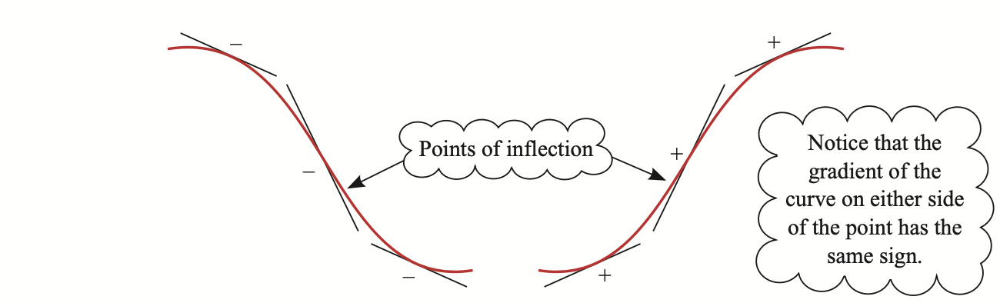

# Chapter 1 Algebra

## 简单代数

### 1.Collecting terms(同类项)

Simplify the expression 2*x* + 4*y* − 5*z* − 5*x* − 9*y* + 2*z* + 4*x* − 7*y* + 8*z*.

Expression = *x* −12*y*+5z

### 2.Removing Brackets(去括号)

Simplify the expression 3(2*x* − 4*y*) − 4(*x* − 5*y*).

Expression = 2*x* + 8y

### 3.Factorisation(因式分解)

Factorise 12*x* − 18*y*.

Expression = 6(2*x* − 3*y*)

### 4.Multiplication(乘法)

### 5.Fractions(分数)

finding the common denominators(寻找公分母)

cancel top and bottoms(上下消元)

## 线性方程

Linear Equation

What is a variable? Find the value of the variable in an expression.

方程中的未知数求解

## 更换主导变量

Changing the subject of a formula

当我们谈论一个公式的 "subject" 时，我们指的是公式中被隔离在等号一侧的变量，通常是我们想要解出或强调的变量

Make *m* the subject of the formula *mv* = *I* + *mu*. 

## 二次方程

二次方程，是一种最高次数为2的多项式方程

It is usual to write a quadratic equation with the right-hand side equal to zero. To solve it, you first factorise the left-hand side if possible, and this requires a particular technique.

### 1.Quadratic factorisation

二次方程因式分解

Factorise *xa* + *xb* + *ya* + *yb*.

*xa*+*xb*+*ya*+*yb* = *x*(*a*+*b*)+*y*(*a*+*b*) = (*x*+*y*)(*a*+*b*)

example that the coefficient of x^2 is not 1.

Factorise 6*x*2 + *x* − 12.

Start by multiplying the two outside numbers together:

6 × (−12) = −72.

Now look for two numbers which add to give +1 (the coefficient of *x*) and multiply to give −72 (the number found above).

(+9) + (−8) = +1	(+9) × (−8) = –72

Splitting the middle term gives

6x^2 +9*x*−8*x*−12=3*x*(2*x*+3)−4(2*x*+3) = (3*x* − 4)(2*x* + 3)

## 求解二次方程

换元法求解方程：

Solve *x*4 – 13*x*2 + 36 = 0

解法：let y = x^2

## 无法因式分解的方程

并不是所有方程都可以被因式分解，比如说 x^2 - 6x + 2.

### 1.图像法

### 2.配方法

Completing the square

利用完全平方公式配方

Solve the equation x^2 − 6*x* + 2 = 0 by completing the square.

解法：

Subtract the constant term from both sides of the equation: 

⇒ x^2 − 6*x* = −2

Take the coefficient of *x*: −6

Halve it: -3

Square the answer: +9

Add it to both sides of the equation:

⇒ x^2 −6x + 9 = −2 + 9

⇒ (*x*−3)^2 = 7

## 二次函数的图像

the graph of *y* = *x*2 − 4*x* + 5 and it has the characteristic shape of a quadratic; it is a parabola.

二次方程 
$$
y = ax^2 + bx +c
$$
的图像是一条抛物线。

## 二次函数公式

The quadratic formula

利用配方，完全平方公式可以得到二次方程y = ax^2 + bx +c的解。
$$
x = \frac{-b\pm\sqrt{b^2-4ac}}{2a}
$$
discriminant 判别式。

△> 0	2个根

△< 0	无实数根

△ = 0	重根

## 联立方程组

Simultaneous Equations.

当有两个变量的时候，需要两个方程才能求解。

当有三个变量的时候，需要三个方程才能求解。

​				...

**Linear Simultaneous equations** 线性方程组
$$
\left\{
\begin{aligned}
6x+y=40	\\
4x+3y=36
\end{aligned}
\right.
$$
方法1：消元法

方法2：替换法

方法3：画图法(两条直线的交叉点)

**Non-Linear Simultaneous equations** 非线性方程组

还是通过替换法可以求解

## 不等式

**Linear inequality 线性不等式**

两边同乘或同除一个**负数**的时候，不等式要**变号**

**Quadratic inequalities 二次不等式**

# Chapter 2 Co-ordinate

## 直线的斜率

The slope of a line is measured by its gradient.

一个直线的斜率是通过它的梯度来衡量的。

斜率 = y轴上的增长 ÷ x轴上的增长
$$
m = \frac{y_2-y_1}{x_2-x_1}
$$

## 平行和垂直

两条直线平行：它们的斜率相等，m1 = m2

两条直线垂直：它们的斜率积为-1，m1*m2 = -1

## 两点间距离

The length of the line AB is
$$
\sqrt{(x_2-x_1)^2+(y2-y_1)^2}
$$

## 连接两点线段的中点

如果有两个点A(x1,y1)和B(x2,y2)在二维空间中，这两个点之间的线段的之点M的坐标将是这**两个点的坐标的算数平均值**。
$$
M(\frac{x_1+x_2}{2},\frac{y_1+y_2}{2})
$$

## 直线的等式

The word *straight* means going in a constant direction, that is with fixed gradient.

直线，它的斜率不变，只要有一个点的坐标，就能找到这条直线的方程。

Ex.Find the equation of the straight line with gradient 2 through the point (0, −5).

**平行于坐标轴的直线**

y=constant x=constant的情况

**y=mx+c形式的方程**

m是斜率，如果c=0，那么这条直线穿过原点。

这种情况只需要一个点的坐标就能算出直线的方程。

## 两条线的相交点

对于两条直线，只有两种情况：

它们是平行的

它们相交在某个点上

*x* + 2*y* = 1 and 2*x* + 3*y* = 4 在同一坐标系中，找到它们相交点的坐标。

解题思路：把这两个方程作为方程组求解。

## 画曲线图像

You can always plot a curve, point by point, if you know its equation. Often, however, all you need is a general idea of its shape and a sketch is quite sufficient.

给出一个方程，是可以通过描点画出它的图像的。

但通常知道它大概的图像就够了。

### **驻点Stationary points**

A turning point is a place where a curve changes from increasing (curve going up) to decreasing (curve going down), or vice versa. 

A *turning point* may be described as a *maximum* (change from increasing to decreasing) or a *minimum* (change from decreasing to increasing). 

Turning points are examples of *stationary points*, where the gradient is zero. 

In general, the curve of a polynomial of order *n* has up to *n* − 1 turning points.

### **与x轴或y轴相交**

The constant term in the polynomial gives the value of *y* where the curve intersects the *y* axis.

多项式的常数项代表y轴与函数的相交点
$$
y = x^8+5x^6+17x^3+23
$$
当x=0时，y=23，因此该函数与y轴在(0,23)处相交。

相似的，如果常数项不存在，那么该函数必然经过原点。
$$
y = x^3+x
$$
一个函数如果是因式分解的形式，很容易看出它与x轴的交点：
$$
y=(x-2)(x-8)(x-9)
$$

### **反比例函数**

An important feature of these curves is that they approach both the *x* and the *y* axes ever more closely but never actually reach them. These lines are described as *asymptotes*(渐近线) to the curves.

### 圆

根据"从圆心到圆上任意一点的距离都相等"，
$$
length=\sqrt{(x_2-x_1)^2+(y_2-y_1)^2}
$$
这个公式用来推导圆的方程：

对于一个圆心在(0,0)上，半径为3的圆来说，
$$
\sqrt{(x-0)^2+(y-0)^2}=3
$$
化简后可得，
$$
x^2+y^2=9
$$

$$
x^2+y^2=r^2
$$

## 直线与曲线相交

当一个直线和一个曲线在同一个平面时，有三种可能性：

**1.*All points of intersection are distinct***

**2.*The line is a tangent to the curve at one (or more) point(s)*** 

In this case, each point of contact corresponds to two (or more) co-incident points of intersection. It is possible that the tangent will also intersect the curve somewhere else.

**3.*The line and the curve do not meet***

The co-ordinates of the point of intersection can be found by solving the two equations simultaneously. If you obtain an equation with no real roots, the conclusion is that there is no point of intersection.

通过解方程组，可以找到相交的点。如果方程没有实数根，说明这两条线没有交点。

# Chapter 3 Sequence and series

## 定义和符号

A *sequence* is a set of numbers in a given order, like
$$
\frac{1}{2},\frac{1}{4},\frac{1}{8},\frac{1}{16},...
$$

Each of these numbers is called a *term* of the sequence. 

When the terms of a sequence are added together, like
$$
\frac{1}{2}+\frac{1}{4}+\frac{1}{8}+\frac{1}{16}+...
$$
the resulting sum is called a ***series***. 

The process of adding the terms together is called *summation* and indicated by the symbol ∑，with the position of the first and last terms involved given as *limits*.
$$
u_1+u_2+u_3+u_4+u_5\space is \space written \space \sum^{5}_{k=1}u_k
$$

## 等差数列

**Arithmetric Progression**等差数列

**公差 common difference**

When the terms of an arithmetic sequence are added together, the sum is called an arithmetic progression, often abbreviated to A.P. An alternative name is an arithmetic series.

当一个等差数列的各项相加时，这个和被称为等差数列的求和arithmetic progression，或者叫等差级数Arithmetic Series。

**Notations**

a：第一项

d：公差

l：最后一项

等差数列的第k项：
$$
u_k=a+(k-1)d
$$
等差数列的n项和：
$$
S_n=\frac{1}{2}n(a+l)
$$

## 等比数列

**Geometric Progression**

首项：a

公比：r

项数：n

**第n项公式：**
$$
u_n=ar^{n-1}
$$
**等比数列的n项和：**
$$
S_n=\frac{a(r^n-1)}{r-1}
$$
或者
$$
S_n=\frac{a(1-r^n)}{1-r}
$$

**无穷等比数列**

Infinite geometric progressions.
$$
1+\frac{1}{2}+\frac{1}{4}+\frac{1}{8}+\frac{1}{16}+...
$$
上面的数列是等比数列，公比是0.5.

求这个数列的n项和：将参数套入公式21，会发现最后的结果是2。

当n趋近于无穷时，n项和趋近于2

一般的等比数列，

当**公比(common ratio)**r在-1和1之间的时候，每项的值会变得越来越小，这种情况，称这个等比数列是**收敛的(convergent)**。

当公比r大于1或小于-1的时候，数列的项会变得越来越大，那么称这个数列是**发散的(divergent)**。

## 二项式展开

A special type of series is produced when a binomial (i.e. two-part) expression 3 like (*x* + 1) is raised to a power. The resulting expression is often called a *binomial expansion*.

 帕斯卡三角/杨辉三角

# Chapter 4 Functions

**Mappings**

1对1，1对多，多对1，多对多

**Functions**

Mappings which are one-to-one or many-to-one are of particular importance, since in these cases there is only one possible image for any object.

 Mappings of these types are called *functions*. 

1对1或多对1的叫作**方程**。

## 复合函数

Composite functions
$$
f(x)=x^2 \\ g(x)=x+1
$$
so,
$$
g(f(x))=x^2+1 \\ f(g(x))=(x+1)^2
$$
Figure below illustrate the relationship between the domains and ranges of the functions f and g, and the range of the composite function gf.

Notice the range of f must be completely contained within the domian of g.(f的值域必须完全包含在g的定义域内)

If this wasn't the case you woulnd't be able to form the composite function of gf because you would be trying to input values into g that weren't in its domain.

如果内层函数的值域大于外层函数的定义域，那么当内层函数的值取到外层函数定义域之外时，该复合函数是无效的。

## 反函数

Inverse functions

For a mapping to be a function which also has an inverse function, every object in the domain must have one and only one image in the range, and vice versa.(一个函数如果想有反函数，必须是一一对应的，如果原函数是一对多，那么反函数就成了多对一了，不成立)

**通过图像判断一个函数有没有反函数**

The curve or line representing a one-to-one function does not double back on itself and has **no turning points.**

It is often helpful to define a function with a restricted domain so that its inverse is also a function.

**反函数的图像**

反函数的图像是原函数的图像关于y=x轴反射的。

To see why this is so, think of a function f(*x*) mapping *a* on to *b*; (*a*, *b*) is clearly a point on the graph of f(*x*). The inverse function maps *b* on to *a* and so (*b*, *a*) is a point on the graph of f −1(*x*).

原函数与反函数的定义域和值域是互换的。

# Chapter 5 Differentiation

## 曲线的斜率

 If you draw the straight line *y* = *mx* + *c* passing along the bottom of the log, then this line is a tangent to the curve at the point of contact.The gradient *m* of the tangent is the gradient of the curve **at the point of contact.**

Figure below shows the part of the graph *y* = *x*^2 which lies between *x* = −1 and *x* = 3. What is the value of the gradient at the point P(3, 9)?

$$
chord (0,0)\space to \space (3,9):m = \frac{9-0}{3-0}=3\\
chord (1,1)\space to \space (3,9):m = \frac{9-1}{3-1}=4\\
chord (2,4)\space to \space (3,9):m = \frac{9-4}{3-2}=5\\
$$
Clearly none of these three answers is exact, but which of them is the most accurate?

明显这三个点全都不准备，那么哪个才是最准确的？

Of the three chords, the one closest to being a tangent is that joining (2, 4) to (3, 9), the two points that are closest together.

这三条弦中，最接近切线的一条是(2,4)到(3,9)这条，因为(2,4)这个点离点P最近。

类似的，可以再取离点P更近的点：

$$
chord (2.7,2.79)\space to \space (3,9):m = \frac{9-2.79}{3-2.7}=5.7\\
chord (2.8,7.84)\space to \space (3,9):m = \frac{9-7.84}{3-2.8}=5.8\\
chord (2.9,8.41)\space to \space (3,9):m = \frac{9-9.41}{3-2.9}=5.9\\
$$
如果再取近一点，比如(2.99,8.9401)和(2.999,8.994001)呢？

从这些点到(3.9)的弦的斜率分别是5.99和5.999。

通过这种方法，你可能会尝试计算点(3,9)到点(3,9)之间的弦的斜率，但这个方程是未定义的因为分母为0。

所以，尽管你可以找一个尽可能接近点P的点来求斜率，但它永远不可能完全等于切线的斜率。

**你现在需要一个从弦到切线的最终办法。**

as point Q tends to point P(3, 9), the chord QP tends to the tangent of the curve at P, and the gradient of QP tends to 6

极限的概念能使我们做到这一点，在点Q趋向于点P(3,9)的时候，弦QP趋向于曲线在P点的斜率，弦QP的斜率趋向于6。

## 求导的定义法

尽管上一节的求斜率方法比画图法(画一个正切来测量斜率)更加准确，但它仍然有些实验性质。

在这一节中，该方法被正式化并进行了扩展。

在y=x^2的曲线上，取一个点P(3,9)和一个接近于(3,9)的点Q。

令Q在X轴上的坐标为**3+h**，h是一个很小的值。根据函数，可得Y轴上的坐标为**(3+h)^2**。

$$
gradient \space of \space PQ \space is \space \frac{(3+h)^2-9}{3+h-3} \\
=\frac{h^2+6h+9-9}{h}\\
=\frac{h(h+6)}{h}\\
=6+h
$$
如果h取0.001，那么PQ的斜率就是6.001，如果h取-0.001，那么斜率就是5.999。

相似的，切线的斜率就在6-h到h+h之间，对于所有接近于0但不等于0的小数值h。

**导数**

目前的研究包括了找到函数y=x^2在一个特定的点(3,9)的斜率，但这并不是通常用来找到某点处斜率的方法。

你可以考虑一个普遍的点(x,y)，然后再把特定的要研究的点对应的值带入。

**例：找到曲线y=x^3在点(x,y)上的斜率。**

**解：**

令P在x轴上取一个普遍的值x，那么在y轴上的值就是x^3。

令x轴上Q的坐标为x+h，那么y轴上的坐标就是(x+h)^3。
$$
弦PQ的斜率=\frac{(x+h)^3-x^3}{x+h-x}\\
=\frac{x^3+3x^2h+3xh^2+h^3-x^3}{h}\\
=\frac{h(3x^2+3xh+h^2)}{h}\\
=3x^2+3xh+h^2
$$
当Q的取值接近于P时，h的值越来越小，并且斜率逼近于在点P的切线斜率：3x^2。

因此，曲线y=x^3在点(x,y)的斜率等于3x^2。

**An alternative notation**

h sometimes replaced by δx, the Greek letter δ is shorthand for 'a small change in' and so δx represents a small change in x, and δy a corresponding small change in y.

In figure below, the gradient of the chord PQ is **δy/δx**。

In the limit as δx→0, δx and δy become infinitesimally small and the value obtained for δy/δx approaches the gradient of the tangent at P.

$$
\lim_{δx→0}\frac{δy}{δx} \space is \space written \space as \space \frac{dy}{dx}\\
$$
In this notation, Wallis's rule becomes
$$
y=x^n⇒\frac{dy}{dx}=nx^n-1
$$
The gradient function, dy/dx or f'(x) is sometimes called the derivative of y with respect to x, and when you find it you have differentiated y with respect to x.

## 利用导数规则求导

定义法求导在实践中是几乎用不到的，它的价值在于给微积分建立一个正式的基础，而不是一个实用工具。

**规则：**
$$
y=c→\frac{dy}{dx}=0
$$

$$
y=f(x)+g(x)→\frac{dy}{dx}=f'(x)+g'(x)
$$

## 切线和法线

现在你知道了怎么找到一个曲线在某一个点上的斜率，你可以利用它来找到在任意点上的切线方程。

### **切线方程**

**例：找到曲线y=x^2+3x+2在点(2,12)的切线方程？**

要找到切线的方程，第一步应该先给原函数求导。
$$
y'=2x+3
$$
由于**一阶导数其实是原函数的斜率**，因此把x=2带入y'可以求出在该点上的斜率。

求解得到斜率m=7，把该点(2,12)以及其斜率导入到切线方程的公式：
$$
y-y_1=m(x-x_1)
$$
得到：
$$
y-12=7(x-2)\\
化简得：\space y=7x-2
$$

### 法线

曲线上的某个点的法线是垂直于这个点上的切线的，根据公式
$$
m_1m_2=-1
$$
可以得到，如果m1是切线的斜率，那么法线的斜率就是**m2=-1/m1**

例：
$$
一个曲线的方程是 \space y=\frac{16}{x}-4\sqrt{x}.该曲线在点(4,-4)的法线与y轴相交于P点，找到P点的坐标？
$$
解题思路：

1.先找到方程的导数。

2.找到在点(4,-4)切线的斜率为-2

3.用m1m2=-1公式，求出在点(4,-4)法线的斜率为1/2

4.将点(4,-4)带入到斜率公式中找到该法线的方程

5.由于该法线和y轴相交，把x=0带入到法线的方程，得到y值，求出该点的坐标。

## 极大值点和极小值点

最大值和最小值点的切线的斜率应该为0.

极大值点和极小值点也被叫作**驻点(stationary points)**，驻点的斜率为0，既没有上升也没有下降。

找到驻点的方法：求导，然后解出m=0时，x的值。然后将x的值代入原函数，找到y轴上的值，就找到了极大值或极小值。

## 增函数和减函数

When the gradient is positive, the function is described as an increasing function. 

When the gradient is negative, it is a decreasing function.

**These terms are often used for functions that are increasing or decreasing for all values of *x*.**

## 拐点

Points of inflection.

It is possible for the value of y' to be zero at a point on a curve without it being a maximum or minimum.(导数为0的点也不一定是极大值或极小值).

This is the case with the curve y=x^3, at the point (0,0).
$$
y=x^3→y'=3x^2 \space and \space when \space x=0,\frac{dy}{dx}=0
$$

下面是一个拐点的示例。总的来说，当一个曲线的**切线穿过了这个曲线**时，拐点就出现了。就算y'不等于0这种情况也有可能会发生。

One way of thinking about a point of inflection is to view the curve from one side and see it as the point where the curve changes from being **concave to convex.**

## 二阶导数

上面是原函数y=f(x)，下面的图像是对应的导函数图像f'(x)。

二阶导数：就是对原函数求导两次。

Notation:
$$
\frac{d}{dx}(\frac{dy}{dx})→\frac{d^2y}{dx^2} \space or \space f''(x)
$$

**二阶导数的作用**

可以利用二阶导数来确定驻点的性质，而不是仅仅检查该点两侧导数的符号变化来判断。

**驻点：**

At P,
$$
\frac{dy}{dx}=0,\frac{d^2y}{dx^2}<0
$$
This tells you that the gradient is 0 and decreasing. It must be going from positive to negative, so P is a maximum point.

At Q,
$$
\frac{dy}{dx}=0,\frac{d^2y}{dx^2}>0
$$
This tells you that the gradient is 0 and increasing. It must be going from negative to positive, so P is a minimum point.

## 链式法则

The Chain Rule.

链式法则用来给复合函数求导。

To find dy/dx for a function of a function, you consider the effect of a small change in x on the two variables, y and u, as follows .

A small change δx in x leads to a small change δu in u and a corresponding change δy in y, and by simple algebra,
$$
\frac{δy}{δx}=\frac{δy}{δu}*\frac{δu}{δx}
$$
In the limit, as δx→0, 
$$
\frac{δy}{δx}→\frac{dy}{dx},\frac{δy}{δu}→\frac{dy}{du}\space and \space \frac{δu}{δx}→\frac{du}{dx}
$$
and so the relationship above becomes 
$$
\frac{dy}{dx}=\frac{dy}{du}*\frac{du}{dx}
$$
This is known as the Chain Rule.

例：
$$
Differentiate \space y=(x^2+1)^{\frac{1}{2}}
$$
解：
$$
y=u^\frac{1}{2},u=x^2+1 \\
\frac{dy}{du}=\frac{1}{2}u^{-\frac{1}{2}}=\frac{1}{2\sqrt{x^2+1}} \\
and \space \frac{du}{dx}=2x.
$$
By the Chain rule, 
$$
\frac{dy}{dx}=\frac{dy}{du}*\frac{du}{dx}\\
=\frac{1}{2\sqrt{x^2+1}}*2x\\
=\frac{x}{\sqrt{x^2+1}}
$$

# Chapter 6 Integration

# Chapter 7 Trignometry

## 三角函数

三角函数最简单的定义：直角三角形的边之间的比值，角θ在0-90度之间。

$$
sin\theta=cos(90^\degree-\theta) \\
cos\theta=sin(90^\degree-\theta)
$$

**30度和60度**

**45度**

**0度和90度**

当Z=90度时，tanZ是未定义的。

## 任意角度的三角函数

三角函数的角度是可以大于90度的，需要改变sin, cos, tan的定义，使他们不必非得是直角三角形。

$$
sin^2\theta+cos^2\theta=1
$$

## sin和cos的图像

$$
cos\theta=sin(\theta+90\degree)
$$

## tan的图像

当角度为±90,270,450...度时，tanθ是未定义的。

其实很好理解，因为圆上的点每次移动到y轴上时，cosθ=x=0，分母为0，因此是未定义的。

## 弧度和弧长

$$
360^\degree=2\pi \space radians
$$

弧长=半径 * 角度

## 扇形圆的面积

**对于任意一个三角形ABC：**

The sine rule：
$$
\frac{a}{sinA}=\frac{b}{sinB}=\frac{c}{sinC}
$$

# Chapter 8 Vectors

**Terminology**

在二维空间中，一个向量通常被表示为**一条带有箭头的直线**。

直线的长度代表了向量的大小，直线与X轴的夹角代表了向量的方向。

**点**

在三维空间中，一个点有三个坐标，xyz。

## 向量的长度

$$
|a|=\sqrt{x^2+y^2+z^2}
$$

## 单位向量

单位向量是一个长度为1的向量。

**找到与向量方向相同的单位向量：**用该向量除以该向量的长度

比如说：找到3i+5j的单位向量
$$
magnitude=\sqrt{3^2+5^2}=\sqrt{34}\\
因此,单位向量是:\frac{3}{\sqrt{34}}i+\frac{5}{\sqrt{34}}j
$$
该向量的长度为1.

## 向量间的夹角

两个向量的点积=a向量大小 * b向量大小 * cosθ
$$
a.b=|a||b|cos\theta
$$

## 互相垂直的向量

如果两个向量垂直，那么它们的夹角就是90度，则cos90度=0

因此，得到结论：
$$
a.b=0
$$

