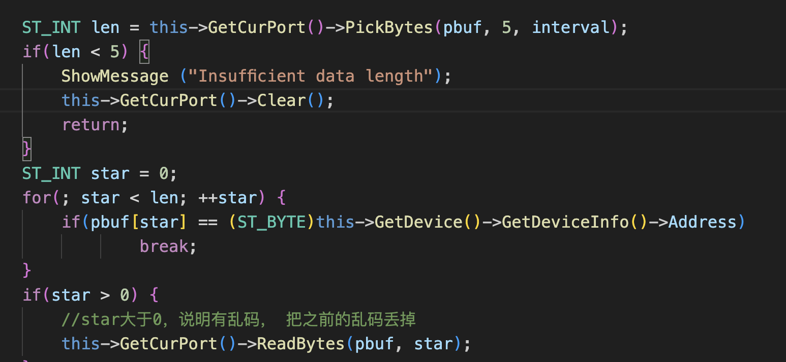

# 数据库


## Channel表

**主表**

channels.db

| 字段名           | 数据类型     | 描述                           | 备注         |
| ---------------- | ------------ | ------------------------------ | ------------ |
| channel_id       | INT          | 自增，主键                     | 通道唯一ID   |
| channel_number   | INT          | 唯一                           | 通道号       |
| channel_name     | VARCHAR(255) | 非空                           | 通道名       |
| channel_type     | INT          | 非空, 1代表问答式，2代表全双工 | 通道类型     |
| channel_protocol | VARCHAR(255) |                                | 通道规约     |
| channel_interval | INT          |                                | 发送间隔(ms) |
| port_type        | INT          | 非空                           | 端口类型     |
| auto_open        | INT          | 1或0                           | 自动打开通道 |
| device_count     | INT          |                                | 设备数量     |
| create_time      | INTEGER      |                                | 创建时间     |
| update_time      | INTEGER      |                                | 更新时间     |


```sqlite
CREATE TABLE channels(
    channel_id INTEGER PRIMARY KEY AUTOINCREMENT,
  	channel_number INT NOT NULL UNIQUE,
    channel_name VARCHAR(255) NOT NULL,
    channel_type INT NOT NULL,
    channel_protocol VARCHAR(255),
    channel_interval INT,
    port_type INT,
    auto_open INT,
    device_count INT,
  	create_time INTEGER,
  	update_time INTEGER
);
```


**串口通道表**

serial_channels.db

| 字段名        | 数据类型    | 描述       | 备注       |
| ------------- | ----------- | ---------- | ---------- |
| channel_id    | INT         | 主键，外键 | 通道唯一ID |
| serial_number | INT         |            | 串口号     |
| baud_rate     | INT         |            | 波特率     |
| parity        | VARCHAR(10) | N,O,E      | 校验位     |
| data_bits     | INT         |            | 数据位     |
| stop_bits     | INT         |            | 停止位     |

```sql
FOREIGN KEY (channel_id) REFERENCES channels(channel_id)
```

channel_id作为channels表的外键


```sql
CREATE TABLE serial_channel(
    channel_id INT PRIMARY KEY,
    serial_number INT,
    baud_rate INT,
    parity VARCHAR(10),
    data_bits INT,
    stop_bits INT,
    FOREIGN KEY (channel_id) REFERENCES channels(channel_id)
);
```


TCP服务端通道表

tcp_server_channel.db

| 字段名        | 数据类型     | 描述       | 备注       |
| ------------- | ------------ | ---------- | ---------- |
| channel_id    | INT          | 主键，外键 | 通道唯一ID |
| local_port    | INT          |            | 本机端口   |
| local_address | VARCHAR(100) |            | 本机IP     |

```sql
FOREIGN KEY (channel_id) REFERENCES channels(channel_id)
```


TCP客户端通道表

tcp_client_channel.db

| 字段名         | 数据类型     | 描述       | 备注       |
| -------------- | ------------ | ---------- | ---------- |
| channel_id     | INT          | 主键，外键 | 通道唯一ID |
| remote_address | VARCHAR(100) |            | 远方IP     |
| remote_port    | INT          |            | 远方端口   |

```sql
FOREIGN KEY (channel_id) REFERENCES channels(channel_id)
```


channel通道类型(port_type)枚举对应表

| 通道类型  | 枚举量 |
| --------- | ------ |
| 串口通道  | 1      |
| TCP客户端 | 2      |
| TCP服务端 | 3      |


## Devices表

| 字段名               | 数据类型     | 描述       | 中文名       | 备注                      |
| -------------------- | ------------ | ---------- | ------------ | ------------------------- |
| device_id            | INTEGER      | 主键，自增 | 设备id       |                           |
| channel_number       | INT          |            | 所属通道号   |                           |
| device_number        | INT          | UNIQUE     | 设备号       |                           |
| device_name          | VARCHAR(255) |            | 设备名       |                           |
| device_address       | INT          |            | 设备地址     |                           |
| device_addressex     | INT          |            | 扩展地址     |                           |
| device_group         | VARCHAR(255) |            | 设备组       | 替换xml中的DeviceTypeID   |
| device_template      | VARCHAR(255) |            | 设备子模板   | 替换xml中的DeviceTypeName |
| device_serial_type   | VARCHAR(255) |            | 设备子系列   |                           |
| device_protocol_file | VARCHAR(255) |            | 设备规约文件 |                           |
| device_protocol_name | VARCHAR(255) |            | 设备规约名   |                           |
| resend_count         | INT          |            | 重发次数     |                           |
| break_count          | INT          |            | 中断次数     |                           |
| run                  | INT          |            | 设备投运     |                           |
| device_count         | INT          |            | 设备数量     |                           |
| channel_id           | INT          | 外键       | 所属通道ID   |                           |

```sql
FOREIGN KEY (channel_number) REFERENCES channels(channel_number)
```


## Variables表

| 中文名     | 字段名         | 数据类型     | 描述      | 备注 |
| ---------- | -------------- | ------------ | --------- | ---- |
| 变量id     | var_id         | INTEGER      | 主键,自增 |      |
| 点号       | point_number   | INT          |           |      |
| 变量名     | var_name       | VARCHAR(100) |           |      |
| 变量全名   | var_fullname   | VARCHAR(100) |           |      |
| 数据类型   | data_type      | INT          |           |      |
| 转换系数   | coefficient    | float        |           |      |
| 当前值     | value          | float        |           |      |
| 所属通道号 | channel_number | INT          |           |      |
| 所属设备号 | device_number  | INT          |           |      |


## Template表


### device_group表

| 中文名     | 字段名            | 数据类型     | 描述      | 备注 |
| ---------- | ----------------- | ------------ | --------- | ---- |
| 设备组id   | id                | INT          | 主键,自增 |      |
| 设备组名字 | device_group_name | VARCHAR(100) |           |      |
|            |                   |              |           |      |


### device_template表

| 中文名       | 字段名               | 数据类型     | 描述      | 备注 |
| ------------ | -------------------- | ------------ | --------- | ---- |
| 模板id       | id                   | INT          | 主键,自增 |      |
| 设备模板名称 | device_template_name | VARCHAR(100) |           |      |
| 设备组id     | device_group_id      | INT          | 外键      |      |
|              |                      |              |           |      |


### device_serial_type表

| 中文名         | 字段名             | 数据类型     | 描述       | 备注 |
| -------------- | ------------------ | ------------ | ---------- | ---- |
| 设备子系列id   | id                 | INT          | 主键，自增 |      |
| 设备子系列名称 | serial_name        | VARCHAR(100) |            |      |
| 设备子系列类型 | serial_type        | INT          |            |      |
| 设备模板id     | device_template_id | INT          | 外键       |      |


### modbus_area表

| 中文名             | 字段名           | 数据类型    | 描述 | 备注 |
| ------------------ | ---------------- | ----------- | ---- | ---- |
| 数据区id           | id               | INT         |      |      |
| 当前数据区名称     | data_area_name   | VARCHAR(30) |      |      |
| 当前数据区地址     | data_area_addr   | INT         |      |      |
| 当前数据区读功能码 | read_code        | INT         |      |      |
| 当前数据区写功能码 | write_code       | INT         |      |      |
| 当前数据区长度     | data_area_len    | INT         |      |      |
| 数据单位块长度     | data_block_len   | INT         |      |      |
| 数据ID偏移量       | data_id_offset   | INT         |      |      |
| 设备子系列ID       | device_serial_id | INT         |      |      |


### modbus_item表

| 中文名     | 字段名      | 数据类型    | 描述       | 备注 |
| ---------- | ----------- | ----------- | ---------- | ---- |
| 数据id     | id          | INT         | 主键，自增 |      |
| 序号       | data_number | INT         |            |      |
| 数据项名称 | data_name   | VARCHAR(30) |            |      |
| 采集类型   | datatype    | INT         |            |      |
| 采集系数   | coefficient | float       |            |      |
| 区内地址   | area_addr   | INT         |            |      |
| 数据长度   | data_len    | INT         |            |      |
| 开始位     | start_bit   | INT         |            |      |
| 结束位     | end_bit     | INT         |            |      |
| 数据编码   | codify_type | INT         |            |      |


# 接口文档


## channel页面


### **添加一个通道**

路由：/channelconfig/addchannel

方法：POST

json格式：

串口通道：

```json
{
    "channel_name": "串口通道1",
    "channel_number": 20,    
    "channel_type": 2,
    "channel_protocol": "COM",
    "channel_interval": 30,
    "port_type": 1,
    "auto_open": 1,
    "is_transfer":0,
  	"serial_number": 1,
  	"baud_rate": 9600,
  	"parity": "none",
  	"data_bits": 8,
  	"stop_bits": 1
}
```

TCP服务端通道：

```json
{
    "channel_name": "TCP服务端通道",
    "channel_number": 9,
    "channel_type": 2,
    "channel_protocol": "MODBUSTCP",
    "channel_interval": 30,
    "port_type": 2,
    "auto_open": 1,
    "is_transfer":0,
  	"local_port": 9001,
    "local_address": "192.168.1.177"
}
```

TCP客户端通道：

```json
{
    "channel_name": "TCP服务端通道",
    "channel_number": 4,
    "channel_type": 3,
    "channel_protocol": "MODBUSTCP",
    "channel_interval": 30,
    "port_type": 2,
    "auto_open": 1,
    "device_count": 10,
  	"remote_port": 9001,
    "remote_address": "192.168.1.177"
}
```


### 删除一个通道

路由：/channelconfig/deletechannel

方法：DELETE

json格式:

```json
{
    "channel_number":1
}
```


### 更新一个通道

路由：/channelconfig/updatechannel

方法：PUT

json格式：

```json
{
    "channel_name": "串口通道1",
    "channel_number": 1,
    "channel_type": 1,
    "channel_protocol": "COM",
    "channel_interval": 3000,
    "port_type": 1,
    "auto_open": 1,
    "device_count": 10,
  	"serial_number": 2,
  	"baud_rate": 115200,
  	"parity": "none",
  	"data_bits": 8,
  	"stop_bits": 1
}
```


### 查询所有通道

路由：/channelconfig/query

方法：GET

BODY：无

json格式：

```json
[
    {
        "auto_open": 1,
        "baud_rate": 9600,
        "channel_interval": 30,
        "channel_name": "串口通道1",
        "channel_number": 1,
        "channel_protocol": "COM",
        "channel_type": 1,
        "data_bits": 8,
        "device_count": 10,
        "parity": 0,
        "port_type": 1,
        "serial_number": 2,
        "stop_bits": 1
    },
    {
        "auto_open": 1,
        "baud_rate": 9600,
        "channel_interval": 30,
        "channel_name": "串口通道1",
        "channel_number": 2,
        "channel_protocol": "COM",
        "channel_type": 1,
        "data_bits": 8,
        "device_count": 10,
        "parity": 0,
        "port_type": 1,
        "serial_number": 2,
        "stop_bits": 1
    }
]
```


## Device页面

### 添加一个设备

路由：/device_config/add_device

方法：POST

json格式：

```json
```


## template页面


### 添加一个设备组

路由：/device_template/add_group

方法：POST

请求json格式：

```json
{
    "device_group_name":"modbus测试设备模板2"
}
```


### 添加一个设备模板

路由：/device_template/add_template

方法：POST

请求json格式：

```json
{
    "device_template_name":"modbus测试设备模板2",
    "device_group_id":1
}
```


### 添加一个设备子系列

路由：/device_template/add_serial_type

方法：POST

请求json格式：

```json
{
    "serial_name":"modbus子系列",
    "serial_type":1,
    "device_template_id":1
}
```


### 添加一个modbus数据区

路由：/device_template/add_modbus_area

方法：POST

请求json格式：

```json
{
    "data_area_name":"YC",
    "data_area_addr":0,
    "read_code":3,
    "write_code":0,
    "data_area_len":10,
    "data_block_len":2,
    "data_id_offset":0,
    "device_serial_id":1
}
```


### 新增一个modbus变量点

路由：/device_template/add_modbus_item

方法：POST

请求json格式：

```json
{
    "data_number":1,
    "data_name":"A相电压",
    "datatype":1,
    "coefficient":0,
    "area_addr":1,
    "data_len":1,
    "start_bit":1,
    "end_bit":1,
    "codify_type":1,
    "modbus_area_id":1
}
```


### 查询所有设备组

路由：/device_template/group_query

方法：GET

返回json数据格式：

```json
[
    {
        "device_group_name": "modbus测试设备模板",
        "id": 1
    },
    {
        "device_group_name": "modbus测试设备模板2",
        "id": 2
    },
    {
        "device_group_name": "modbus测试设备模板2",
        "id": 3
    }
]
```


### 查询所有设备模板

路由：/device_template/template_query

方法：POST

浏览器请求json数据格式：

```json
{"id":1}
```


服务器返回json数据格式：

```json
[
    {
        "device_group_id": 1,
        "device_template_name": "modbus测试设备模板2",
        "id": 1
    }
]
```


### 查询所有设备子系列

路由：/device_template/serial_query

方法：POST

浏览器请求json数据格式：

```json
{
  "device_template_id":1
}
```

服务器响应json数据格式：

```json
[
    {
        "device_template_id": 1,
        "id": 1,
        "serial_name": "modbus子系列",
        "serial_type": 1
    }
]
```


### 查询某系列所有数据区

路由：/device_template/area_query

方法：POST

浏览器请求JSON数据格式：

```json
{
  "id":1,
  "serial_type":1
}
```


**设备信息：**

从设备内目录读文件

**通道配置：**

1.增加超时时间配置



2.协议选择

3.添加UDP通道

4.TCP服务端添加白名单(ip用逗号分隔)


