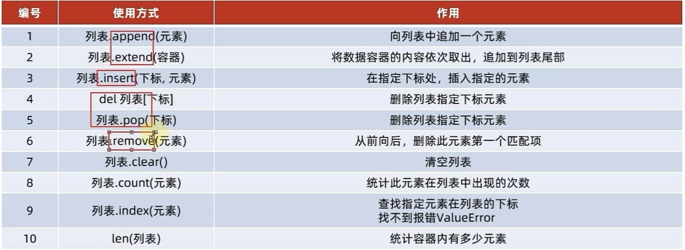
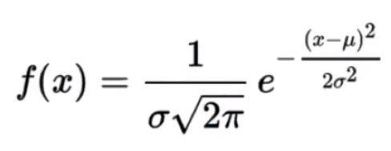

# Python基本语法


## 1.基础


### 字面量

python中常用的有**6**种值的类型

| 类型             | 描述                            |
| ---------------- | ------------------------------- |
| 数字(Number)     | 支持：int, float，complex，bool |
| 字符串(String)   |                                 |
| 列表(List)       | 有序的可变序列                  |
| 元组(Tuple)      | 有序的不可变序列                |
| 集合(Set)        | 无序不重复集合                  |
| 字典(Dictionary) | 无序key-value集合               |


单行注释用：#

多行注释用三个双引号包围："""dd"""

```py
#单行注释


"""多行注释
多行注释
多行注释
多行注释"""
```


### 数据类型

**type()**语句的使用方式：

```python
print(type("我是你爹"))
print(type(666))
print(type(11.345))
```


用变量存储type()的结果：

```py
string_type = print(type("我是你爹"))
int_type = print(type(666))
float_type = print(type(11.345))
```


结论：

python中**变量是没有类型的**

但是变量存储的数据是有类型的


**数据类型转换**

| 语句(函数) | 说明                |
| ---------- | ------------------- |
| int(x)     | 将x转换成一个整数   |
| float(x)   | 将x转换成一个浮点数 |
| str(x)     | 将对象x转换成字符串 |


### 运算符

| 运算符 | 描述   |
| ------ | ------ |
| //     | 取整除 |
| **     | 指数   |


### 字符串

**1.Python中字符串的多种定义方式：**

1. 单引号定义
2. 双引号定义
3. 多行注释定义


**2.字符串拼接**

使用**"+"**号连接字符串变量或字符串字面量即可

```python
print("地址:"+"国王大道")
```


**3.字符串格式化**

```python
class_num = 57
avg_salary = 10000
message = "Py，%s期，工资:%s" %(class_num,avg_salary)
print(message)
```


Python中，支持多种数据类型占位，最常用的三类是：

| 格式符号 | 转化         |
| -------- | ------------ |
| %s       | 转换成字符串 |
| %d       | 转换成整数   |
| %f       | 转换成浮点型 |


**4.字符串格式化-精度控制**

使用辅助符号"m.n"来控制数据的宽度和精度

**m**，控制宽度，

**n**，控制小数点精度，**会进行小数的四舍五入**


**5.快速格式化**

f-string(格式化字符串)

```python
name = "传智播客"
set_up_year = 2006
stock_price = 19.99
print(f"我是{name},我成立于{set_up_year},我今天的股价是{stock_price}")
```

特点：不做精度控制


### 键盘输入

input()语句

```python
print("请告诉我你是谁")
name = input()
```

注意：input语句获得到的输入都是**字符串类型**


## 2.条件和循环


### 1.if语法

```python
age = 15
if age>=18:
    print("我成年了")			#不会打印
    print("即将步入大学生活")	 #不会打印
print("时间过得真快")			  #会打印
```

**注意：没有缩进的语句不受if语句影响**


### 2.while语句

语法：

```python
while 条件:
    print("条件满足，循环继续")
```


### 3.for语句

**语法：**

```python
for 临时变量 in 待处理数据集:
    ...
```

```python
name = "itheima"
for x in name:
    print(x,end="")
```


**range语句**

待处理数据集，严格来说称为**序列类型**。

通过**range**语句，获得一个简单的数字序列。


**语法1：**

range(num)

从0开始，到num结束的数字序列(不含num本身)


**语法2：**

range(num1,num2)

从num1开始，到num2之前


**语法3：**

range(num1,num2,step)

从num1开始，到num2之前，步长为step


## 3.函数

语法：

```python
def 函数名(参数):
    函数体
    return 返回值
```


**None类型：**

如果函数没有返回值，那么结果就是<class 'NoneType'>类型

在if判断上，None等同于False


**局部变量：**

定义在函数体内部的变量，即只在函数体内部生效


**全局变量：**

在函数体内，函数体外都能生效的变量


**global关键字：**

可以把函数内部定义的变量为全局变量

```python
num = 100

def testA():
    print(num)

def testB():
    global num	#设置函数内定义的变量为全局变量
    num = 500
    print(num)
```


### 函数多返回值

```python
def test_return():
    return 1,2
x,y = test_return()
```


### 参数种类

1. **位置参数**

2. **关键字参数**

```python
def user_info(name,age,gender):
	print(f"您的名字是:{name},年龄是:{age}")
    
#关键字传参(可以不按照顺序)
user_info(age=20,name="小明")
```

3. **缺省参数**

```python
def user_info(name,age,gender='男'):
    print(f"您的名字是:{name},年龄是:{age}")
```

4. **不定长参数**

```python
#位置传递的不定长
def user_info(*args):
    print(args)
```

注意：传进的所有参数都被args变量收集，它会根据传进参数的位置合并为一个**元组**。


```python
#关键字传递的不定长
def user_info(**kwargs):
    print(kwargs)
    
#{'name':'TOM','age':18,'id':110}
user_info(name='TOM',age=18,id=110)
```

注意：参数是key-value形式的情况下，所有的kv都会被kwargs接受，同时会根据key-value组成**字典**。


5. **函数作为参数**

```python
def test_func(compute):
    result = compute(1,2)
    print(result)
    
def compute(x,y):
    return x*y
```

这种写法的作用是：传入计算逻辑，而非传入数据


### lambda匿名函数

**def**关键字，可以定义有名字的函数

**lambda**关键字，可以定义**匿名函数**

无名称的匿名函数，只能**临时使用一次**。

```python
#匿名函数定义语法：
#	lambda 传入参数:函数体(一行代码)

test_func(lambda x, y: x+y)
```


## 4.数据容器


### 1.list(列表)

**列表的定义：**

```python
#字面量
[元素1，元素2，元素3，...]
#定义变量
变量名 = [元素1，元素2，元素3，...]
#定义空列表
变量名 = []
变量名 = list()
```

列表中的**元素类型**可以不同


**列表的下标：**

```python
#语法： 列表[下标]
name_list = ['Tom','Lily','Rose']
name = name_list[0]

#下标可以反向索引
#从-1开始依次递减
name1 = name_list[-1]
name2 = name_list[-2]
name3 = name_list[-3]
```


**列表的查询功能：**

在Python中，如果将函数定义为class的成员，那么函数会称之为：方法

```python
#函数
def add(x,y):
    return x+y

#方法
class Student:
    def add(self,x,y):
        return x + y
```





- 查找某元素的下标

```python
#语法： 列表.index(元素)
mylist = ["itheima","itcast","python"]
index = mylist.index("itheima")
print(f"itheima在列表中的下标索引值是:{index}")
```


- 插入元素

在指定的下标位置，插入指定的元素

```python
#语法： 列表.insert(下标,元素)
mylist = [1,2,3]
mylist.insert(1,50)
```


- 追加元素

在列表的尾部插入一个元素

```python
#语法： 列表.append(元素)
mylist = [1,2,3]
mylist.append(50)
```


在列表追加多个元素

```python
#语法： 列表.extend(其他数据容器)
mylist = [1,2,3]
mylist2 = [4,5,6]
mylist.extend(mylist2)	#把mylist2追加到mylist后面
print(mylist)
```


- 删除元素

1.指定下标删除

```python
#del 列表[下标]
del mylist[2]

#列表.pop(下标)，把删除掉的元素返回
element = mylist.pop(2)
```


2.指定元素内容删除

```python
#语法： 列表.remove(元素)
my_list = [1,2,3,2,3]
my_list.remove(2)	#结果是 1,3,2,3

#清空列表 列表.clear()
my_list.clear()
```


- 统计某元素在列表中出现的数量

```python
#列表.count(元素)
mylist.count("itheima")
```


### 2.tuple(元组)

列表是可以修改的。

**元组**一旦定义完成，就**不可以修改**。

列表使用中括号定义，**元组**使用**小括号**定义。

```python
# 变量名称 = (元素,元素,元素)
mytuple = (1,2,3)
```

注意：如果定义的元组只有一个元素，那么要在后面加上逗号

```python
mytuple = (5,)
```


和list一样，元组也可以用**下标**取出元素。


**元组相关操作**

| 方法      | 作用                                         |
| --------- | -------------------------------------------- |
| index()   | 查找某个数据，如果存在返回对应下标，否则报错 |
| count()   | 统计某个数据在当前元组出现的次数             |
| len(元组) | 统计元组内的元素个数                         |


### 3.str(字符串)

字符串是**字符的容器**，一个字符串可以存放任意数量的字符。

和元组一样，字符串是一个**无法修改**的数据容器。


**字符串的替换**

语法：字符串.replace(字符串1,字符串2)

功能：将字符串1替换为字符串2

注意：不是修改字符串本身，而是得到一个新的字符串

```python
new_str = mystr.replace("it","程序")
```


**字符串的分割**

语法：字符串.split(分隔字符串)

功能：按照指定的分隔符，将字符串划分为多个字符串，并存入列表中

注意：字符串本身不变，而且新创建了一个列表对象

```python
my_str = "hello python itheima itcast"
my_str_list = my_str.split(" ")
```


**字符串规整操作**

```python
#1.去前后空格
#语法： 字符串.strip()
my_str = "   itheima and itcast   "
print(my_str.strip())

#2.去前后指定字符串
#语法： 字符串.strip(字符串)
my_str = "12itheima and itcast21"
new_my_str.strip("12")		#去掉字符串1和2
```


**方法汇总：**


### 序列的切片

序列是指：内容连续，有序，可使用下标索引的**一类数据容器**

列表，元组，字符串都可以视为序列。


**切片操作**

从一个序列中，取出一个子序列。


**语法：**	

切片操作不会影响序列本身

```python
#	序列[起始下标:结束下标:步长]	
my_list = [0,1,2,3,4,5,6]
result1 = my_list[1:4]	#步长默认是1，可以不写
```


### 4.set(集合)

集合中元素**不重复**，且**无序**

无序是指：元素存放的顺序和写入的顺序不一样

基本语法：

```python
#定义集合字面量
{元素,元素,...,元素}
#定义集合变量
变量名 = {元素,元素,...,元素}
#定义空集合
变量名 = set()
```


**添加新元素**

```python
# 集合.add(元素)
my_set = {"传智教育","黑马程序员","itheima"}
my_set.add("黑狗程序员")
```


**移除元素**

```python
# 集合.remove(元素)
my_set.remove("黑马程序员")
```


**随机取出元素**

```python
# 集合.pop()
element = my_set.pop()
```


**清空集合**

```python
# 集合.clear()
my_set.clear()
```


**取两个集合的差集**

```python
#语法：集合1.difference(集合2)
#取出集合1有，集合2没有的元素
set1 = {1,2,3}
set2 = {1,5,6}
set3 = set1.difference(set2)	#set3 = {2,3}
```


**合并两个集合**

```python
#语法：集合1.union(集合2)
set1.union(set2)
```


### 5.dict(字典)

字典的定义，同样使用{}，不过存储的元素是一个个的**键值对**。

语法如下：

```python
#定义字典字面量
{key:value,key:value,...,key:value}

#定义字典变量
my_dict = {key:value,key:value,...,key:value}

#定义空字典
my_dict = {}
my_dict = dict()
```


```python
#通过key获取value
my_dict = {"王力宏":99,"周杰伦":88,"林俊杰":77}
score = dict["王力宏"]
```

python中字典的**key不可以重复**

key**不可以**是字典


**字典的嵌套**

```python
#定义嵌套字典
stu_score_dict = {
    "王力宏":{"语文":88,"数学":96,"英语":73},
    "周杰伦":{"语文":38,"数学":66,"英语":49},
    "林俊杰":{"语文":90,"数学":59,"英语":65}
}
#查看学生的语文成绩
score = stu_score_dict["周杰伦"]["语文"]
```


**新增/更新元素**

```python
#语法：字典[key] = value
#新增张学友的考试成绩
my_dict = {"王力宏":99,"周杰伦":88,"林俊杰":77}
my_dict["张学友"] = 66
```


**删除元素**

```python
score = my_dict.pop("周杰伦")
```


**获取全部keys**

```python
#语法： 字典.keys()
keys = my_dict.keys()

#遍历字典1
for key in keys:
    print(f"{key}:{mydict[key]}")
#遍历字典2
for key in my_dict:
    print(f"{key}:{mydict[key]}")
```


**数据容器总结**


**数据容器通用操作**

- 都支持for循环遍历
- len()：元素个数
- max()：最大元素
- min()：最小元素
- 容器互相转换：

list(容器)

str(容器)

tuple(容器)

set(容器)


**容器通用排序**

sorted()

```python
mylist = [1,3,4,2,5]
print(f"列表对象的排序结果:{sorted(mylist)}")
```

反向排序

```python
mylist = [1,3,4,2,5]
print(f"列表排序结果:{sorted(mylist，reverse=True)}")
```


## 5.文件

**open()：**可以打开一个已存在的文件，或创建一个新的文件

```python
#语法： open(name,mode,encoding)
f = open("test.txt","r",encoding="UTF-8")
```

| 文件打开模式 | 含义                                   |
| ------------ | -------------------------------------- |
| r            | 只读方式打开，指针在文件开头，默认模式 |
| w            | 只用于写入，文件原有内容会删除         |
| a            | 用于追加，新的内容会被写入到已有文件中 |


### 读取操作

**read()方法：**文件对象.read(num)

```python
#num表示从文件中读取的数据长度(字节)
print(f"读取10个字节的结果:{f.read(10)}")
```

**readlines()方法：**读取文件的全部行，封装到列表中

```python
lines = f.readlines()
```

**readline()方法：**读取一行内容

```python
line1 = f.readline()
line2 = f.readline()
```

**for循环读取文件行：**

```python
for line in f:
    print(f"每一行数据是:{line}")
```


**close()关闭文件：**

作用：解除文件的占用

```python
f.close()
```


**with open()语法操作文件：**

这样写不需要调用close()方法

```python
with open("test.txt",'r',encoding="UTF-8") as f:
    #对文件的操作
    ...
```


### 写入操作

**write()方法：**

```python
#1.打开文件
f = open('python.txt','w')

#2.文件写入
f.write("hello world")

#3.内容刷新
f.flush()
```

刷新的目的是**避免频繁操作硬盘**

f.write()：写入内存中

f.flush()：从内存写入硬盘中


## 6.异常，模块，包


### 异常

**基本语法：**

```python
try:
    可能发生错误的代码
except:
    如果出现异常执行的代码
```


**捕获指定异常：**

```python
try:
    print(name)
except NameError as e:
    print("出现了变量未定义的异常")
    print(e)
```


**捕获多个异常：**

```python
try:
    可能发生错误的代码
except (NameError,ZeroDivisionError) as e:
    print("出现了变量未定义或除以0的异常") 
```


**捕获所有异常：**

```python
try:
    可能发生错误的代码
except Exception as e:
    print(e)
```


**异常else：**

如果没有出现异常情况下，做的处理

```python
try:
    可能发生错误的代码
except Exception as e:
    print(e)
else:
    print("没有异常,:)")
```


**finally：**

无论如何都会执行的步骤

```python
try:
    可能发生错误的代码
except Exception as e:
    print(e)
else:
    print("没有异常,:)")
finally:
    print("我是finally，有没有异常我都会执行")
    f.close()
```


### 模块

Module，是一个python文件，以.py结尾。

模块能定义函数，类和变量。


**模块的导入方式**

语法：

```python
from 模块名 import 功能名
功能名()
```

```python
#只导入某个模块的某个功能
from time import sleep

print("开始")
sleep(500)
print("结束")
```


**自定义模块**

新建一个python文件，在其他文件import即可。


**all变量**

如果模块中有all变量，当使用'from xxx import *'导入时，只能导入这个列表中的元素

```python
__all__ = ['test_A']
```


**注意事项**

不同模块的同名功能，如果都被导入，那么后导入的会覆盖先导入的


### 包

python包就是一个**文件夹**，该文件夹可用于包含多个模块文件。

逻辑上看，包的本质依然是模块。

```python
import my_package.my_module1
```


## 7.面向对象


### 类和对象

```python
# 设计类
class Student:
    name = None     	#成员属性
    age = None
    tel = None
    __init__(self,name,age,tel):
        self.name = name
        self.age = age
        self.tel = tel
    
    def say_hi(self):	#成员方法
        print(f"大家好，我是{self.name}")


# 基于类创建对象
stu_1 = Student()
stu_2 = Student()

# 对象属性赋值
stu_1.name = "周杰伦"
stu_2.name = "林俊杰"
```


**成员方法的定义语法：**

```python
def 方法名(self,形参1,...,形参N):
    方法体
```

self在定义成员方法时，是必须写的。

用来表示对象自身的意思。


### **构造方法**

`__init__()`，称之为构造方法。

在创建类对象时，会自动执行。

在创建类对象时，将传入参数自动传递给`__init__`方法使用。


### 魔术方法

- **`__init__`构造方法**

- **`__str__`字符串方法：**可以通过`__str__`方法，控制类转换为字符串的行为。

```python
def __str__(self):
   return f"name:{self.name},gender:{self.gender}"
```

- **`__lt__`小于/大于符号比较方法：**重写这个方法，用来比较

```python
def __lt__(self,other):
    return self.age < other.age

print(stu1.age < stu2.age)
```

- **`__le__`小于等于/大于等于符号比较方法**

- **`__eq__`等等符号运算符方法**


### 封装

**私有**

开头以两个下划线开头，就是私有成员

```python
class Phone:
    IMEI = None			#序列号
    producer = None		#厂商
    __current_voltage = None	#当前电压(私有)
    
    def call_by_5g(self):
        print("5G通话已开启")
        
    def __keep_single_core(self):	#私有
        print("让CPU以单核运行")
    
    def call_by_5g(self):
        if self.__current_voltage >= 1:
            print("5g通话已开启")
        else:
            self.__keep_single_core()
            print("电量不足，已设置为单核运行")
```

私有的成员是给**类内部的其他成员**使用的。

类外部创建的类**对象不能直接使用**私有成员。


### 继承

**语法：**

**单继承**

```python
class 类名(父类名):
    类内容体
```


**多继承**

```python
class 类名(父类1,父类2,...,父类N):
    类内容体
```


**pass关键字：**

编写子类的时候，如果什么都不想写，可以用pass来补全代码。


**复写(重写)**

子类继承父类的成员属性和成员方法后，可以进行复写。

```python
class Phone:
    IMEI = None
    producer = "ITCAST"
    
    def call_by_5g(self):
        print("进行5g通话")
        
 
# 定义子类，复写父类成员
class MyPhone(Phone):
    producer = "ITHEIMA"	# 复写父类的成员属性
    
    def call_by_5g(self):
        print("开启CPU单核模式，确保通话时省电")
        print("使用5g网络进行通话")
        print("关闭cpu单核模式确保性能")
```


**如果复写之后依然想调用父类的成员：**

**方式1：**

```python
父类名.成员变量
父类名.成员方法(self)
```

**方式2：**

使用super()调用父类成员

```python
super().成员变量
super().成员方法()
```


### 多态

完成某个行为时，使用不同的对象会得到不同的状态。

```python
class Animal:
    def speak(self):
        pass
    
class Dog(Animal):
    def speak(self):
        print("汪汪汪")

class Cat(Animal):
    def speak(self):
        print("喵喵喵")
```


## 8.Python高阶技巧


### 闭包

**为什么要用闭包？**

一个py文件中的全局变量是有被其他文件中的代码篡改的风险的。可以使用闭包功能解决这个问题。


**修改外部函数变量的值**

需要使用nonlocal关键字修饰外部函数的变量，才可以在内部函数中修改它

```python
def acoount_create(initial_amount=0):
    
    def atm(num,deposit=True):
        nonlocal initial_amount
        if deposit:
            initial_amount += num
        	print(f"存款:+{num},账户余额:{initial_amount}")
        else:
            initial_amount -= num
            print(f"取款:-{num},账户余额:{initial_amount}")
    return atm

# 函数调用
atm = account_create()
atm(100)				# 存100
atm(100)				# 存100
atm(100,deposit=False)	# 取100
```


**优点：**

无须定义全局变量即可实现通过函数，持续的访问，修改某个值

闭包使用的变量的作用域在函数内，难以被错误的调用修改


**缺点：**

由于内部函数持续引用外部函数的值，所以会导致这一部分内存空间不被释放，一直占用内存


### 装饰器

装饰器其实也是一种闭包，其功能就是在**不破坏目标函数原有的代码和功能的前提下，为目标函数增加新功能。**

**装饰器的一般写法：**

```python
def outer(func):
    def inner():
        print("我睡觉了")
        func()
        print("我起床了")
        
    return inner


def sleep():
    print("睡眠中...")
    time.sleep(random.randint(1,5))

fn = outer(sleep)
fn()
```


**装饰器的快捷写法：**

```python
def outer(func):
    def inner():
        print("我睡觉了")
        func()
        print("我起床了")
        
    return inner

@outer
def sleep():
    print("睡眠中...")
    time.sleep(random.randint(1,5))
    
sleep()
```


### 设计模式


**1.单例模式**

某些场景下，需要一个类无论获取多少次类对象，都仅仅提供一个具体的实例，用以节省创建类对象的开销和内存开销。

比如**某些工具类**，仅需要**一个实例**，即可在各处使用。


**单例模式的实现：**

```python
class StrTools:
    pass

str_tool = StrTools()
```


**2.工厂模式**

当需要大量创建一个类的实例时，可以使用工厂模式。

从原生的使用类的构造去创建对象的形式

迁移到，基于工厂提供的方法去创建对象的形式。


```python
class Person:
    pass

class Worker(Person):
    pass

class Student(Person):
    pass

class Teacher(Person):
    pass

class PersonFactory:
    def get_person(self,p_type):
        if p_type == 'w':
            return Worker()
        elif p_type == 's':
            return Student()
        else:
            return Teacher()

# 调用
pf = PersonFactory()
worker = pf.get_person('w')
stu = pf.get_person('s')
teacher = pf.get_person('t')
```


### 多线程

**进程：**就是运行在os上的一个程序，分配进程ID方便系统管理。

**线程：**是进程的实际工作最小单位。


进程之间是内存隔离的，线程之间是内存共享的。


**threading模块**

```python
import threading

thread_obj = threading.Thread([group[,target[,name[,args[,kwargs]]]]])
-group:暂时无用，未来功能的预留
-target:执行的目标任务名
-args:以元组的方式给执行任务传参
-kwargs:以字典的方式给执行任务传参
-name:线程名，一般不用设置
```

例：

```python
def sing(msg):
    while True:
        print(msg)
        time.sleep(1)


def dance(msg):
    while True:
        print(msg)
        time.sleep(1)


if __name__ == '__main__':
    # 创建一个唱歌的线程,以元组的形式传参
    sing_thread = threading.Thread(target=sing,args=("I want to sing",))
    # 创建一个跳舞的线程，以字典的方式传参
    dance_thread = threading.Thread(target=dance,kwargs={"msg":"I am dancing"})

    # 让线程开始干活吧
    sing_thread.start()
    dance_thread.start()
```


### socket

**服务端：**

等待其他进程的连接，可接受发来的消息，可以回复消息

**客户端：**

主动连接服务端，可以发送消息，可以接收回复


服务端示例代码：

```python
import socket

# 1.创建socket对象
socket_server = socket.socket()
# 2.绑定socket_server到指定ip和地址
socket_server.bind(("localhost", 40007))
# 3.服务端开始监听端口
socket_server.listen(1)     # listen方法接收一个整数参数，表示允许连接的数量
# 4.等待客户端连接
# result:tuple = socket_server.accept()
# conn = result[0]        # 客户端和服务端的连接对象
# address = result[1]     # 客户端的地址信息
conn, address = socket_server.accept()    # accept方法返回的是二元元组，accept方法是阻塞方法，等待客户端的连接
print(f"接收到了客户端的连接，客户端的信息是:{address}")

while True:
    # 5.客户端连接后，通过recv方法，接收客户端发送的消息
    data: str = conn.recv(1024).decode("UTF-8")           # recv接收的参数是缓冲区大小，通过decode方法将字节数组转换为字符串对象
    print(f"客户端发来的消息是:{data}")
    # 6.通过conn(客户端连接对象)，调用send方法可以回复消息
    msg = "收到了服务端发来的消息了".encode("ANSI")
    conn.send(msg)
    # 7.conn和socket_server对象调用close()，关闭连接
conn.close()
socket_server.close()
```


客户端示例代码：

```python
import socket

# 1.创建socket对象
socket_client = socket.socket()
# 2.连接到服务端
socket_client.connect(("localhost", 40007))
while True:
    # 3.发送消息
    socket_client.send("你好啊".encode("UTF-8"))
    # 4.接收返回消息
    recv_data = socket_client.recv(1024)   # recv方法是阻塞的
    print(f"服务端回复的消息是:{recv_data.decode('UTF-8')}")
# 5.关闭连接
socket_client.close()

```


### 正则表达式

#### re模块

**match 从头匹配**

```python
import re
s = "python itheima"
result = re.match("python",s)
print(result)
```


**search(匹配规则,被匹配字符串)**

搜索整个字符串，找出匹配的。从前到后，找到第一个后，就停止，不会继续向后。

```python
result = re.search("python",s)   # span=(0,6)
```


**findall(匹配规则,被匹配字符串)**

匹配整个字符串，找出全部匹配项

```python
result = re.findall("python",s)
```


#### 元字符匹配

| 字符 | 功能                                |
| ---- | ----------------------------------- |
| .    | 匹配任意一个字符(除了\n),匹配点本身 |
| []   | 匹配[]中列举的字符                  |
| \d   | 匹配数字，即0-9                     |
| \D   | 匹配非数字                          |
| \s   | 匹配空白，即空格和tab键             |
| \S   | 匹配非空白                          |
| \w   | 匹配单词字符，即a-z,A-Z,0-9,_       |
| \W   | 匹配非单词字符                      |

```python
import re
result = re.findall(r'\d',s) #字符串前带上r代表转义无效
print(result)
```


### 递归

语法：

```python
def func():
    if ...:
        func()
    return ...
```


最典型的递归场景为找出一个文件夹中全部的文件。

```python
import os

def test_os():
    """演示os模块的3个基础方法"""
    print(os.listdir("D:/test"))	#列出路径下的内容
    print(os.path.isdir("D:/test/a")) #判断是不是文件夹
    print(os.path.exists("D:/test")) #判断指定路径是否存在

def get_files_recursion_from_dir(path):
    """从指定的文件夹中使用递归的方式，获取全部文件列表"""
    file_list = []
    if os.path.exists(path):
        for f in os.listdir(path):
            new_path = path + "/" + f
            if os.path.isdir(new_path):
                #进到这里，表明这个目录是文件夹不是文件
                file_list += get_files_recursion_from_dir(new_path)
            else:
                file_list.append(new_path)
                
        else:
            print(f"指定的目录{path}不存在")
            return []
        return file_list
```


# Python数据挖掘


## **jupyter**

基于网页的用于交互计算的应用程序。其可被应用与全过程计算：开发，文档编写，运行代码和展示结果。


在指定的文件夹下，命令行输入`jupyter notebook`


**cell操作**

执行代码：shift+Enter

编辑模式：点击Enter

命令模式：点击Esc

双击D：删除当前cell

A：在当前cell的上面添加cell

B：在当前cell的下面添加cell


## Matplotlib

**什么是Matplotlib？**

专门用于开发2D图表

**为什么学习Matplotlib？**

数据可视化-帮助理解数据，方便更合适的分析方法

js库，D3，Echarts


### 三层结构

**1.容器层**

画板层Canvas

画布层Figure

绘图区/坐标系

**2.辅助显示层**

**3.图像层**


### 折线图(plot)


**1.matplotlib.pyplot模块**

matplotlib.pyplot包含了一系列类似于matlab的**画图函数**。它的函数作用于当前图形(figure)的当前坐标系(axes)。

```python
import matplotlib.plot as plt
```


**2.折线图绘制与显示**

```python
# 1) 创建画布(容器层)
plt.figure(figsize=(20,8),dpi=80)
# 2) 绘制折线图(图像层)
plt.plot([1, 2,3,4, 5, 6 ,7]，[17,17,18,15, 11, 11, 13])
# 3) 保存图像
plt.savefig("test.png")
# 4) 显示图像
plt.show()
```

**figsize：**图像大小

**dpi：**图像清晰度


**完善原始折线图(辅助显示层)**

```python
# 需求：画出某城市11点-12点1小时内每分钟温度变化，范围在15-18度
import random
# 1.准备数据 x y
x= range(60)
y_shanghai = [random.uniform(15,18) for i in x]
# 2.创建画布
plt.figure(figsize=(20,8),dpi=80)
# 3.绘制图像
plt.plot(x,y_shanghai)

# 4.修改x,y刻度
plt.yticks(range(0,40,5))
plt.xticks(x[::5],x_label[::5])
# x的刻度说明
x_label = ["11点{}分".format(i) for i in x]
#添加显示网格
plt.grid(True,linestyle='--',alpha=0.5)
#添加描述信息
plt.xlabel("time variation")
plt.ylabel("temp variation")
plt.title("temp changes from 11a.m to 12 p.m")
# 4.显示图像
plt.show()
```


**完善原始折线图(图像层)**

**需求：再添加一个城市的温度变化**

```python
# 解决方法：再调用一个plot即可
# 准备北京的数据
y_beijing = [random.uniform(1,3) for i in x]
plt.plot(x,y_beijing,label="beijing")
plt.plot(x,y_shanghai，label="shanghai")

#显示图例
plt.legend()
```


**多个坐标系显示(面向对象的画图方法)**

```python
# 需求：画出某城市11点-12点1小时内每分钟温度变化，范围在15-18度
import random
# 1.准备数据 x y
x= range(60)
y_shanghai = [random.uniform(15,18) for i in x]
y_beijing = [random.uniform(1,3) for i in x]
# 2.创建画布
# plt.figure(figsize=(20,8),dpi=80)
figure,axes = plt.subplots(nrows=1,ncols=2,figsize=(20,8),dpi=80)

# 3.绘制图像
x_label = ["11:{}".format(i) for i in x]
axes[0].set_xticks(x[::5],x_label[::5])
axes[0].set_xticklabels(x_label[::5])
axes[0].plot(x,y_beijing,label="beijing")
axes[1].set_yticks(range(10,30,5))
axes[1].plot(x,y_shanghai,label="shanghai")
# 4.修改刻度


axes[0].grid(True,linestyle='--',alpha=0.5)
axes[1].grid(True,linestyle='--',alpha=0.5)

axes[0].set_xlabel("time variation")
axes[0].set_ylabel("temp variation")
axes[0].set_title("temp changes from 11a.m to 12 p.m")

axes[1].set_xlabel("time variation")
axes[1].set_ylabel("temp variation")
axes[1].set_title("temp changes from 11a.m to 12 p.m")

#显示图例
axes[0].legend()
axes[1].legend()
# 4.显示图像
plt.show()
```


**numpy画图**

```python
import numpy as np

x = np.linspace(-1,1,100)
y=2*x*x
#创建画布
plt.figure(figsize=(20,8),dpi=80)
#绘制画像
plt.plot(x,y)

#添加网格显示
plt.grid(linestyle="--",alpha=0.5)

plt.show()
```


### **散点图(scatter)**

```python
#需求：探求房屋面积和房屋价格的关系
import matplotlib.plot as plt

#1、准备数据
x = [225.98,247.07,253.14,457.85,241.58,301.01,20.67,288.64,163.56,120.06,207.83,342.75,147.9,53.06,224.72,29.51,21.61,483.21,245.25,399.25,343.35]
y = [196.63,203.88,210,75,372,74,202.41,247.61,24.9,239.34,49.64,191.74,33,1,140.32,104.15,176.84,288.23,128.79,30.74,400.02,205.35,330.64,283.45]

# 2.创建画布
plt.figure(figsize=(20,8),dpi=80)

# 3.绘制图像
plt.scatter(x,y)

# 4.显示图像
plt.show()
```


### 柱状图(bar)

**应用场景：**数据的对比。

```python
# 1.准备数据

# 2.创建画布
plt.figure(figsize=(20,8),dpi=80)

# 3.柱状图绘制
plt.bar(range(len(movie_names)),tickets)
#修改刻度
x_ticks = range(len(movie_names))
plt.bar(x_ticks,tickets)
plt.xticks(x_ticks,movie_names)
plt.title("电影票房收入对比")
plt.grid(linestyle="--",alpha=0.5)
# 4.显示图像
plt.show()
```


### 直方图(histogram)

**应用场景：**表示数据的分布状况。

直方图的长度代表大小，宽度代表组距。

**X轴：**柱状图展示的是分类数据，直方图展示的是数据区间

```python
#需求：电影时长分布状况

# 1.准备数据
time = []
# 2.创建画布
plt.figure(figsize=(20,8),dpi=80)
# 3.绘制直方图
distance = 2
group_num = int((max(time) - min(time)) / distance)

plt.hist(time,bins=group_num,density=True)
#修改x轴刻度
plt.xticks(range(min(time),max(time)+2,distance))
# 4.显示图像
plt.show()
```


### 饼图(pie)

**应用场景：**显示占比

```python
movie_name = []
place_count = []

# 创建画布
plt.figure(figsize=(20,8),dpi=80)

# 绘制饼图
plt.pie(place_count,labels=movie_name)
plt.axis('equals')		# 保持横纵轴一致
plt.legend()			# 显示图例
# 显示图像
plt.show()
```


### **总结**


## Numpy

Numpy是一个高效的运算工具。

**Numpy**支持常见的**数组和矩阵操作**，对于同样的数值计算任务，使用Numpy比直接使用Python要简洁的多。


**ndarray的优势**

**1.存储风格**

list - 支持不同类型

ndarray - 相同类型

**2.并行化运算**

ndarray支持向量化运算

**3.底层语言**

Numpy底层用**C语言编写**，内部解除了GIL(全局解释器锁)，其对数组的操作速度不受限于Python解释器，**效率远高于纯Python代码**。


### ndarray的属性

| 属性名字         | 属性解释                 |
| ---------------- | ------------------------ |
| ndarray.shape    | 数组维度的元组           |
| ndarray.ndim     | 数组维度                 |
| ndarray.size     | 数组中的元素数量         |
| ndarray.itemsize | 一个数组元素的长度(字节) |
| ndarray.dtype    | 数组元素的类型           |


### 基本操作


#### **1.生成0和1的数组**

```python
# 生成0和1
zero = np.zeros((3,4),dtype="float32")
one = np.ones((3,4),dtype="float32")
```


#### **2.从现有数组生成**

```python
# np.array()
data1 = np.array(score)
# np.asarray()
data1 = np.asarray(score)
# np.copy()
data1 = np.copy(score)
```

array()和copy()是**深拷贝**

asarray()是**浅拷贝**


#### **3.生成固定范围的数组**

```python
np.linspace(0,10,5)		#生成5个数
np.arange(0,10,5)		#固定步长是5
```


#### **4.生成随机数组**

- 均匀分布：Uniform Distribution是概率统计中的重要分布之一。均匀，表示可能性相等的含义。均匀分布在自然情况下极为罕见。

```python
# 生成均匀分布
np.random.uniform(low=-1,high=1,size=1000000)
```

```python
import matplotlib.pyplot as plt
# 创建画布
plt.figure(figsize=(20,8),dpi=80)
# 绘制直方图
plt.hist(data1,1000)
# 显示图像
plt.show()
```


- 正态分布

正态分布是具有两个参数μ和σ的连续型随机变量的分布，第一参数μ是服从正态分布的随机变量的均值，第二个参数σ是此随机变量的方差，所以正态分布记作N(μ,σ)。

μ决定了其位置，其标准差σ。决定了分布的幅度。当μ=0，σ=1时的正态分布是**标准正态分布**。




**方差**

在概率论和统计学中衡量一组数据**离散程度**的度量。


其中M为平均值，n为数据总个数，S为标准差，S^2可以理解为一个整体方差。


**标准差和方差的意义**

可以理解成数据的一个**离散程度**的衡量。

```python
#正态分布
data2 = np.random.normal(loc=1.75,scale=0.1,size=1000000)
```

```python
import matplotlib.pyplot as plt
# 创建画布
plt.figure(figsize=(20,8),dpi=80)
# 绘制直方图
plt.hist(data2,1000)
# 显示图像
plt.show()
```


#### **切片索引**

**例：获取第一个股票的前三个交易日的涨跌幅数据**

```python
stock_change = np.random.normal(loc=0,scale=1,size=(8,10))
# 获取第一个股票前三个交易日的涨跌幅数据
stock_change[0,0:3]
```


#### 形状修改

```python
# 需求：让刚才的股票行，日期列反过来，编程日期行，股票列
stock_change.shape			#检查形状
stock_change.reshape(10,8)	#返回新的array，原始数据没有修改
stock_change.resize(10,8)	#对原始数据进行修改
stock_change.T				#转置，行变列，列变行
```


#### 类型修改

`astype()`

```python
stock_change.astype("int32")
```

`tostring()`

```python
stock_change.tostring()
```


#### 数组去重

```python
temp = np.array([1,2,3,4],[3,4,5,6])
np.unique(temp)
```


### ndarray运算


#### 逻辑运算


