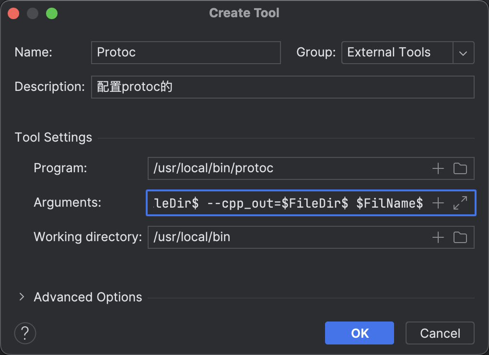

# jsoncpp

```shell
#Linux上安装
git clone https://github.com/open-source-parsers/jsoncpp.git
cd jsoncpp
mkdir build
cd build
cmake ..
make
sudo make install
```

```shell
# 在编译这段代码时，你需要链接JSONCPP库，例如：
g++ -o my_program my_program.cpp -ljsoncpp
```


# protobuf

版本使用[protobuf-cpp-3.21.12.tar.gz](https://github.com/protocolbuffers/protobuf/releases/download/v21.12/protobuf-cpp-3.21.12.tar.gz)


## 1.安装

```shell
tar zxvf protobuf-cpp-3.21.12.tar.gz
cd protobuf-3.21.12/
./configure					#生成Makefile文件
make								#编译Makefile文件
sudo make install		#安装到系统目录下
```

```shell
#动态库安装信息，安装到的位置：
libtool: install: (cd /usr/local/lib && { ln -s -f libprotoc.so.32.0.12 libprotoc.so.32 || { rm -f libprotoc.so.32 && ln -s libprotoc.so.32.0.12 libprotoc.so.32; }; })
libtool: install: (cd /usr/local/lib && { ln -s -f libprotoc.so.32.0.12 libprotoc.so || { rm -f libprotoc.so && ln -s libprotoc.so.32.0.12 libprotoc.so; }; })

#对应可执行程序
/usr/bin/mkdir -p '/usr/local/bin'
  /bin/bash ../libtool   --mode=install /usr/bin/install -c protoc '/usr/local/bin'
libtool: install: /usr/bin/install -c .libs/protoc /usr/local/bin/protoc
```


## 2.配置

找不到动态库

```shell
protoc --version
protoc: error while loading shared libraries: libprotoc.so.32: cannot open shared object file: No such file or directory
```

搜索动态库的位置

```shell
sudo find /usr/local/ -name libprotoc.so
/usr/local/lib/libprotoc.so
```


解决方法：

配置动态库路径

```shell
sudo vim /etc/ld.so.conf
# 加上路径 /usr/local/lib
sudo ldconfig				#操作该命令使配置生效
```


## 3.使用

1.确定数据格式，数据可简单可复杂，比如：

```cpp
//第一种 单一数据类型
int number;

//第二种 复合数据类型
struct Person{
  int id;
  string name;
  string sex;
  int age;
};
```


2.编写`.proto`格式的文件

```protobuf
syntax = "proto3";

message Person
{
    int32 id = 1;
    bytes name = 2;
    bytes gender = 3;
    int32 age = 4;
}
```


3.生成cpp文件

```shell
protoc ./Person.proto --cpp_out=./
```

```shell
ubuntu@VM-8-11-ubuntu:~/code/DataHub/test$ protoc ./Person.proto --cpp_out=./
ubuntu@VM-8-11-ubuntu:~/code/DataHub/test$ ls
CMakeLists.txt  Person.pb.cc  Person.pb.h  Person.proto
```


4.序列化和反序列化

```cpp
//序列化
Person p;
p.set_id(10);
p.set_age(27);
p.set_gender("man");
p.set_name("Alan");
p.mutable_addr()->set_addr("北京市海淀区");

//序列化对象p,最终得到一个字符串
std::string output;
p.SerializePartialToString(&output);

//反序列化数据
Person pp;
pp.ParseFromString(output);
std::cout << pp.id() << ", " << pp.gender() << ", " << pp.name() << ", " << pp.age() << ", " << p.mutable_addr()->addr()<< std::endl;
```


## Clion配置protoc插件

Settings -> external tools ->



参数：`-I $FileDir$ --cpp_out=$FileDir$ $FileName$`

