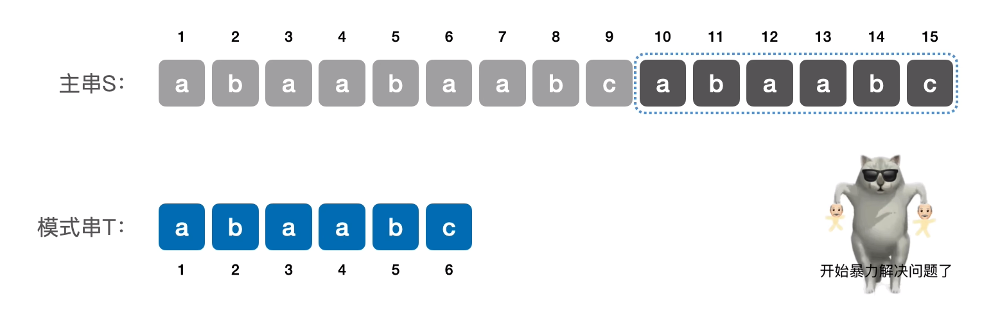
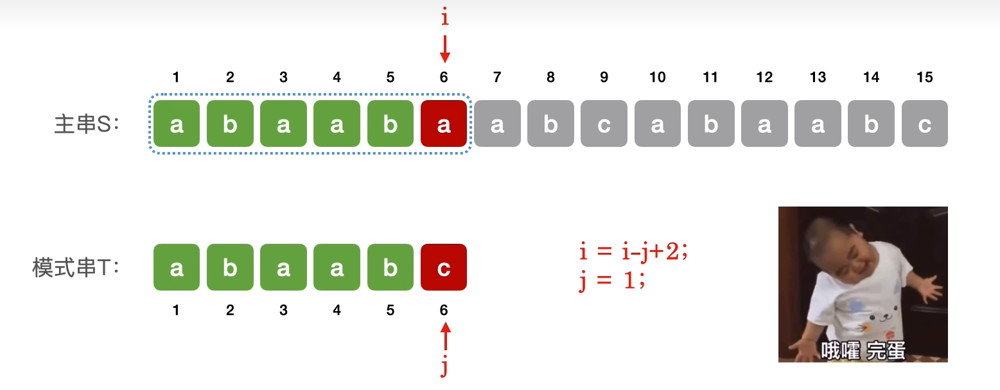
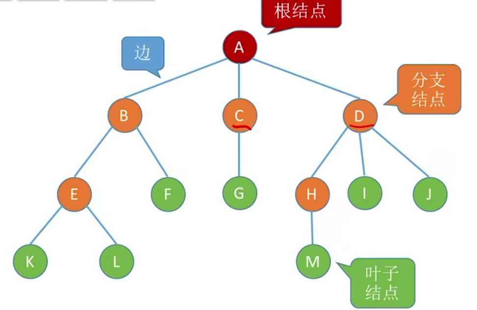
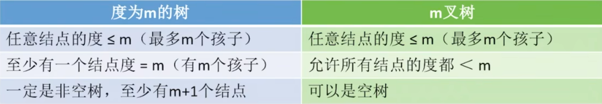
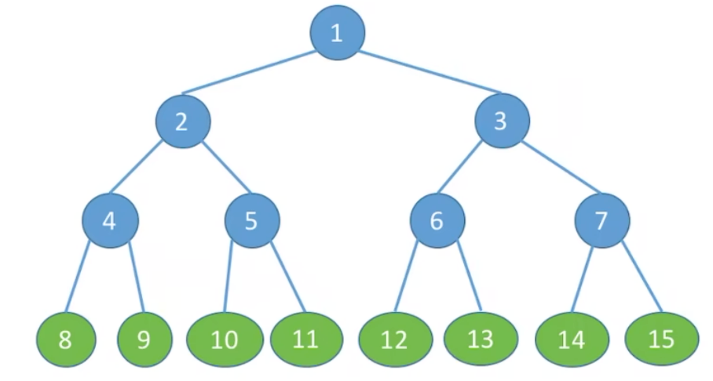
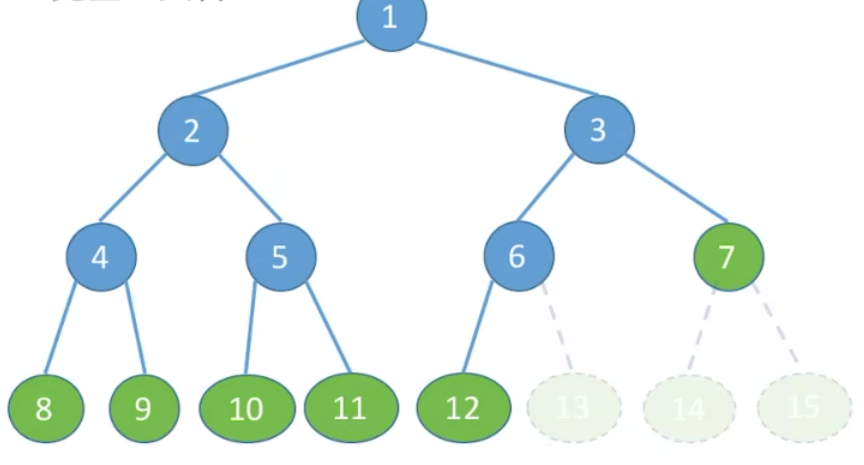
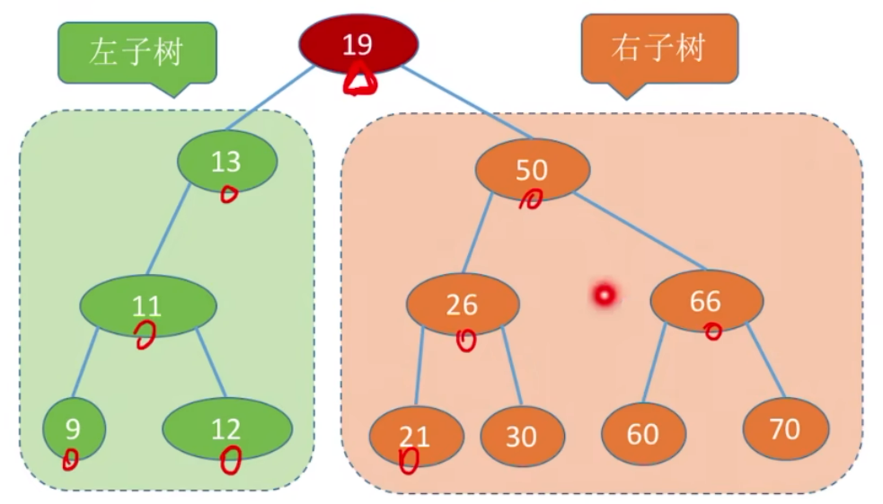
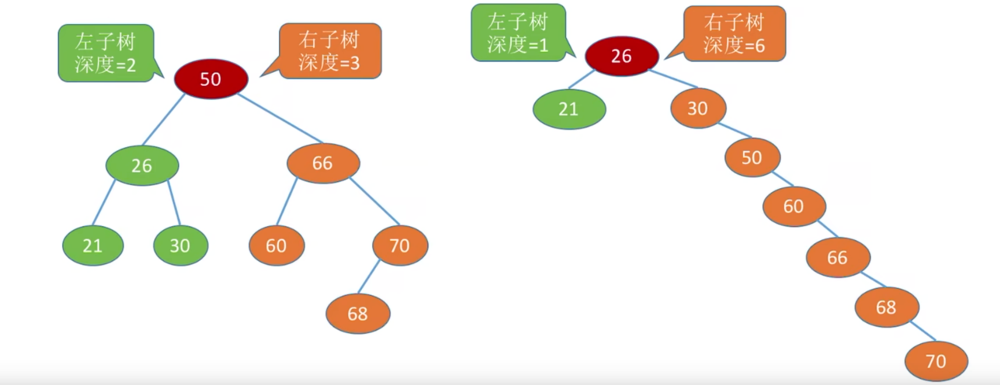
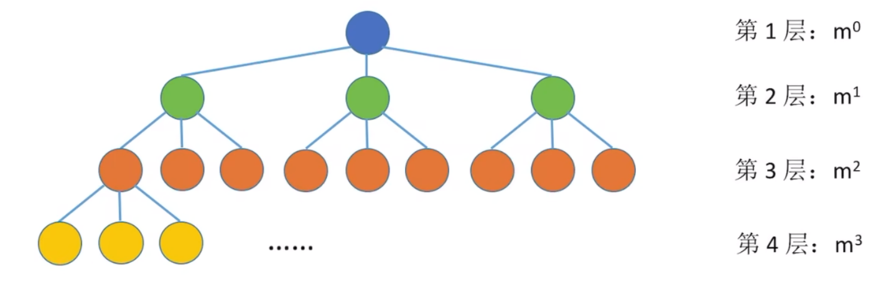
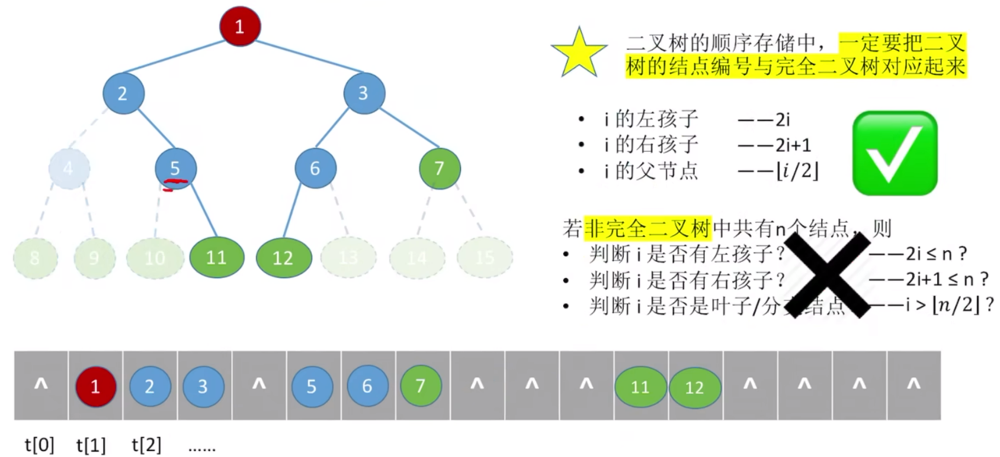

# 数据结构


## 1.线性表


### 顺序表

顺序表的特点：

连续存储，随机访问，大小固定。

```cpp
typedef struct {
    int data[MAX_SIZE];
    int length;
} SeqList;
```

### 链表

链表可分为带头结点和不带头结点，带头结点的链表更方便。

#### 单链表

```cpp
typedef struct LNode{               //定义单链表节点类型
    int data;              //每个节点存放一个数据元素
    struct LNode *next;     //指针指向下一个结点
}LNode,*LinkedList;
```

#### 双链表

```cpp
typedef struct DNode{
    int data;
    struct DNode *prior,*next;//指向下一结点和上一结点
}DNode,*DLinkedList;
```

#### 循环链表

循环链表的最后一个结点后面是头结点。

```cpp
bool InitList(LinkedList &L)
{
    L = (LNode*)malloc(sizeof(LNode));
    if(L==NULL)
        return false;
    L->next = L;
    return true;        //头结点next指向头结点
}
```

头结点的prior指针指向表尾，表尾的next指针指向表头。

```cpp
//创建一个头结点
L = (DNode*)malloc(sizeof(DNode));
if(L==NULL) return false;
L->prior = L;
L->next = L;
return true;
```

#### 静态链表

静态链表分配一整片的内存空间，各个数据元素存放在这片内存空间的某个位置。

静态链表包含了数据值，以及**下一个元素的数组下标**。

```cpp
#define MaxSize 10		//静态链表的最大长度
struct Node{			//静态链表结构类型的定义
  int data;				//存放数据元素
  int next;				//下一个元素的数组下标
};

struct Node a[MaxSize];
```

总结：

静态链表：用数组的方式声明链表。

优点：增，删操作不需要移动大量元素。

缺点：不能随机存取，只能从头结点开始依次往后查找。容量固定不可变。

适用场景：不支持指针的低级语言。


### 栈

栈是只允许在一端进行插入和删除操作的线性表。

**重要术语：**栈顶，栈底，空栈，后进先出(LIFO)


#### **栈的基本操作**

**创/销：**

`InitStack(&S)`：初始化栈，构造一个空栈S，分配内存空间。

`Destroy(&S)`：销毁栈。销毁并释放栈S所占的内存空间。


**增删：**

`Push(&S,x)`：进栈。若栈S未满，将x加入使之称为栈顶。

`Pop(&S,&x)`：出栈。若栈S非空，则弹出栈顶元素，并用x返回。


**查：**

`GetTop(S,&x)`：读取栈顶元素。若栈S非空，则用x返回栈顶元素。


#### 卡特兰数

n个不同元素进栈，**出栈元素**不同排列的个数为
$$
\frac{1}{n+1}\mathrm{C}_n^k
$$
上述公式称为卡特兰数，可采用数学归纳法证明。


#### 顺序栈

```cpp
//定义顺序栈
#define MaSize 10
typedef struct{
    int data[MaxSize];
    int top;			//栈顶指针
}SqStack;

//初始化栈
void InitStack(SqStack &S)
{
    S.top = -1;		//初始化栈顶指针
}

//新元素入栈
bool Push(SqStack &S, ElemType x)
{
    if(S.top==MaxSize-1) return false;	//栈满
    S.data[++S.top] = x;	//先更新栈顶指针，再赋值
    return true;  
}

//出栈操作
bool Pop(SqStack &S, ElemType &x)
{
    if(S.top==-1) return false;	//栈空，不能操作
    x = S.data[S.top--];		//逻辑删除	
    return true;
}
```

出栈操作只是在逻辑上删除了栈顶元素，数据还残留在内存中。


#### 链栈

单链表的头插操作，和头删操作，其实就是一个链栈。

```cpp
typedef struct LinkNode{
    ElemType data;
    struct LinkNode *next;
}*LiStack;
```


### 队列

只允许在一端进行插入，在另一端删除的线性表。

**重要术语：**队头，队尾，空队列。


#### 队列的基本操作

`InitQueue(&Q)`：初始化队列，构造一个空队列Q。

`DestroyQueue(&Q)`：销毁队列。销毁并释放队列Q所占内存空间。


`EnQueue(&Q,X)`：入队，若队列Q未满，将x加入，使之称为**队尾**。

`DeQueue(&Q,&x)`：出队，若队列Q非空，删除对头元素，用x返回。


`GetHead(Q,&x)`：读队头元素，若队列非空，将队头元素赋值给x。


#### 队列的顺序实现

```cpp
#define MaxSize 10
typedef struct{
    ElemType data[MaxSize];
    int front,tail;
}SqQueue;

//初始化队列
void InitQueue(SqQueue &Q)
{
    Q.tail = Q.front = 0;
}

//判断队列是否为空
bool QueueEmpty(SqQueue Q)
{
    return Q.tail == Q.front;
}

//入队
bool EnQueue(SqQueue &Q,ElemType x)
{
    if((Q.tail+1)%MaxSize==Q.front) 
        return false;
    Q.data[Q.tail] = x;
    Q.tail = (Q.tail+1)%MaxSize;
    return true;
}

//出队
bool DeQueue(SqQueue &Q, ElemType &x)
{
    if(Q.tail==Q.front) return false; //队空则报错
    x = Q.data[Q.front];
    Q.front = (Q.front+1)%MaxSize;
    return true;
}

//获得队头元素的值
bool GetHead(SqQueue Q, ElemType &x)
{
    if(Q.tail==Q.front) return false;
    x = Q.data[Q.front];
    return true;
}

//队列元素个数 = (tail+MaxSize-front)%MaxSize
```


#### 队列的链式实现

```cpp
typedef struct LinkNode{
    ElemType data;
    struct LinkNode *next;
}LinkNode;

typedef struct{				//链式队列
    LinkNode *front,*rear;	//队列的队头和队尾指针
}LinkQueue;

//初始化队列(带头结点)
void InitQueue(LinkQueue &Q)
{
    Q.front = Q.rear = (LinkNode*)malloc(sizeof(LinkNode));
}

//判断队列是否为空
bool IsEmpty()
{
    return Q.front==Q.rear;
}

//入队
void EnQueue(LinkQueue &Q,ElemType x)
{
    LinkNode *s=(LinkNode*)malloc(sizeof(LinkNode));
    s->data = x;
    s->next = NULL;
    Q.rear->next = s;	//新结点插入到rear之后
    Q.rear = s;			//修改表尾指针
}

//队头元素出队
bool DeQueue(LinkQueue &Q,ElemType &x)
{
    if(Q.rear==Q.front) return false;	//队列为空
    LinkNode *p = Q.front->next;
    x = p->data;	//用变量x返回队头元素
    Q.front->next = p->next;	//修改头结点的next指针
    if(Q.rear==p) Q.rear = Q.front;	//如果是最后一个结点
    free(p);
    return true;
}
```


### 串

串，即字符串是**字符组成的有限序列**。

**子串：**串中任意个连续的字符组成的子序列。

**主串：**包含子串的串。


#### 串的基本操作

| 基本操作                    | 描述                                          |
| --------------------------- | --------------------------------------------- |
| `StrAssign(&T,chars)`       | 赋值操作。把串T赋值为chars。                  |
| `StrCopy(&T,S)`             | 复制操作。由串S复制得到串T。                  |
| `StrEmpty(S)`               | 判空操作。若S为空串，则返回true，否则false。  |
| `StrLength(S)`              | 求串长。返回串S的元素个数。                   |
| `ClearString(&S)`           | 清空操作。将S清为空串。                       |
| `DestroyString(&S)`         | 销毁串。将串S销毁(回收存储空间)。             |
| `Concat(&T,S1,S2)`          | 串联接。用T返回S1和S2拼接的新串               |
| `SubString(&Sub,S,pos,len)` | 求子串。返回S的第pos字符起长度为`len`的子串。 |


#### 串的顺序存储

```cpp
//静态数组
#define MAXLEN 255		//串的最大容量
typedef struct{
    char ch[MAXLEN];
    int length;			//串的实际长度
}SString;

//动态数组
typedef struct{
    char *ch;	//按串长分配存储区，ch指向串的基地址
    int length;	//串的长度
}HString;

//初始化串
S.ch = (char*)malloc(MAXLEN*sizeof(char));
S.length = 0;
```


#### 串的链式存储

```cpp
typedef struct StringNode{
    char ch;
    struct StringNode *next;
}StringNode,*String;

//上面代码的缺点：存储密码低，每个字符都要存储一个节点
//优化方案：
typedef struct StringNode{
    char ch[4];
    struct StringNode *next;
}StringNode, *String;
//一个节点存4个字符，存储密度提高
```


#### 朴素模式匹配算法

**字符串模式匹配：**在主串中找到与模式串相同的子串，并返回其所在位置。



主串长度为n，模式串长度为m。

朴素模式匹配算法：将主串中所有长度为m的子串依次与模式串对比，知道找到一个完全匹配的子串或所有子串都不匹配为止。

最多对比**n-m+1**个子串。

```cpp
int Index(SString S, SString T)
{
    int i=1, n = StringLength(S), m = StringLength(T);
    SString sub;	//用于暂存子串
    while(i<=n-m+1)
    {
        SubString(sub,s,i,m);	//取出从i开始，长度为m的
        if(StrCompare(sub,T)!=0) ++i;
        else return i;	//返回子串在主串中的位置
    }
    return 0;	//S中不存在与T相等的子串
}
```


**不使用基本操作，直接操作下标的方式：**



若当前子串匹配失败，则主串指针i指向下一个子串的第一个位置，模式串指针j回到模式串的第一个位置。

若`j>T.length`，则当前子串匹配成功，返回当前子串第一个字符的位置：`i - T.length`

```cpp
int Index(std::string S, std::string T)
{
    int i = 0, j = 0;
    while(i<S.length() && j<T.length())
    {
        if(S[i]==T[j]){
            i++,j++;
        }
        else{
            i = i-j+2;
            j=0;        //指针回退后重新开始匹配
        }
    }
    if(j>=T.length())
        return i - T.length();
    else
        return 0;
}
```

朴素模式匹配算法，最坏时间复杂度**O(mn)**


#### KMP算法

KMP算法是根据朴素匹配模式算法的思想升级的算法，通过一个next数组使主串指针不回溯，提高了算法效率。


1. 根据模式串T，求出next数组。
2. 利用next数组进行匹配(主串指针不回溯)。

**KMP优点：**

next数组只和短短的模式串有关，和长长主串无关，主串指针不回溯，提高了算法效率。

```cpp
int Index_KMP(string S, string T, int next[])
{
    int i =1, j = 1;
    while(i<=S.length() && j<=T.length())
    {
        if(j==0||S[i]==T[j])
            ++i,++j;
        else
            j = next[j];
    }
}
```

KMP算法，最坏时间复杂度**O(m+n)**。

其中求**next数组**的时间复杂度为**O(m)**，**模式匹配**过程最坏时间复杂度为**O(n)**。


## 2.树



**非空树的特性：**

有且仅有一个根节点

没有后继结点的称为**叶子节点**

有后继结点的称为**分支节点**

除了根节点，任何节点都有且仅有一个前驱

每个结点可以有0或多个后继


**有序树和无序树：**

**有序树：**逻辑上，树中结点的各子树从左至右是**有次序**的，不能互换

**无序树：**逻辑上，树中结点的各子树从左至右是**无次序**的，可以互换


**森林**：

森林是m棵**互不相交的树**的集合。


### 树的性质

**结点的度(Degree)：**结点有几个分支(孩子)

结点数 = 总度数 + 1





### 二叉树

由一个根结点和两个互不相交的根的**左子树**和**右子树**组成。

左子树和右子树又分别是一棵二叉树。

二叉树是**有序树**。


#### **几个特殊的二叉树**

**1.满二叉树**

一棵高度为h，且含有
$$
2^h -1
$$
个结点的二叉树。



**特点：**

1. 只有最后一层有叶子节点
2. 不存在度为1的结点
3. 按层序从1开始编号，结点i的左孩子为`2i`，右孩子为`2i+1`；结点`i`的父节点为`[i/2]`


**2.完全二叉树**

当且仅当其每个结点都与高度为h的满二叉树中编号为1~n的结点一一对应时，称为完全二叉树。



**特点：**

1. 只有最后两层可能有叶子结点
2. 最多只有一个度为1的结点
3. 按层序从1开始编号，结点i的左孩子为`2i`，右孩子为`2i+1`；结点`i`的父节点为`[i/2]`

4. `i`<=[n/2]为分支结点，`i`>[n/2]为叶子结点


**3.二叉排序树**

一棵二叉树或是空二叉树，或者是具有如下性质的二叉树：

- 左子树上所有结点的关键字均小于根结点的关键字。
- 右子树上所有结点的关键字均大于根结点的关键字。
- 左子树和右子树又歌是一棵二叉排序树。




**4.平衡二叉树**

树上任一结点的左子树和右子树的深度之差**不超过1**。



平衡二叉树能有更高的搜索效率。


#### 二叉树的性质

**性质1：**

设非空二叉树中度为0，1和2的结点个数分别为n0,n1,n2，则
$$
n_0 = n_2 + 1
$$
（叶子结点比二分支结点多一个）


**性质2：**

**二叉树**第`i`层至多有
$$
2^{i - 1}
$$
个结点(`i>=1`)


**m叉树**第`i`层至多有
$$
m^{i-1}
$$
个结点(`i>=1`)




**性质3：**

高度为h的二叉树至多有
$$
2^h - 1
$$
个结点。

---

高度为h的m叉树至多有
$$
\frac{m^{h-1}}{m-1}
$$
个结点。

---

**等比数列求和公式：**
$$
a+aq+aq^2+...+aq^{n-1} = \frac{a^{1-qn}}{1-q}
$$


#### 二叉树的顺序存储

```cpp
#define MaxSize 100
struct TreeNode{
    ElemType value;	//结点中的数据元素
    bool isEmpty;	//结点是否为空
};
TreeNode t[MaxSize];

for(int i=0;i<MaxSize;i++)
	t[i].isEmpty = true;
```

定义一个长度为`MaxSize`的数组t，按照从上至下，从左至右的顺序依次存储**完全二叉树**的各个结点。


**几个重要的基本操作**

| 变量        | 公式   |
| ----------- | ------ |
| `i的左孩子` | 2i     |
| `i的右孩子` | `2i+1` |
| `i的父节点` | `i/2`  |

`i`所在的层次：
$$
\log_2(n+1) 或 \log_2(n)+1
$$



最坏情况：高度为h且只有h个结点的单支树，也至少需要
$$
2^h - 1
$$
个存储单元。

**结论：**二叉树的顺序存储结构，只适合存储完全二叉树。


#### 二叉树的链式存储

```cpp
typedef struct BiTNode{
    ElemType data;					//数据域
    struct BiTNode *lchild,*rchild;	//左，右孩子指针
}BiTNode,*BiTree;

//定义一棵空树
BiTree root = NULL;

//插入根结点
root = (BiTree*)malloc(sizeof(BiTNode));
root->data = {1};
root->lchild = nullptr;
root->rchild = nullptr;

//插入新结点
BiTNode *p = (BiTNode*) malloc(sizeof(BiTNode));
p->data = {2};
p->lchild = nullptr;
p->rchild = nullptr;
root->lchild = p;   //作为根结点的左孩子
```


