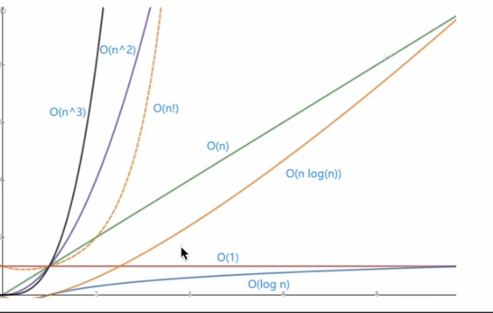

**时间复杂度T(n)：**算法程序在执行时消耗的时间长度，一般与输入数据的规模n有关。

**空间复杂度S(n)：**算法程序在执行时占用的存储单元长度，同样与数据的输入规模n有关。

**大O符号：**用于描述函数渐进行为的数学符号。

|    函数     |    类型    |                        解释                        |
| :---------: | :--------: | :------------------------------------------------: |
|    O(1)     |   常数阶   |                     最快的算法                     |
| O(log~2~n)  |   对数阶   |                 仅次于常数阶的速度                 |
|    O(n)     |   线性阶   |          线性表的插入，删除能达到这个速度          |
| O(nlog~2~n) | 线性对数阶 |      相当于在对数阶算法外层套了一层线性阶循环      |
|   O(n^2^)   |   平方阶   |                    eg:冒泡排序                     |
|   O(n^3^)   |   立方阶   |                                                    |
|   O(2^n^)   |   指数阶   |      斐波那契数列递归算法，包含大量的重复计算      |
|    O(n!)    |    阶乘    | 增长速度比指数阶更大，一般很少有算法能达到这个级别 |

# 线性表

**线性表常用操作**

初始化线性表：初始化，得到一个全新的线性表

获取指定位置的元素：直接获取线性表指定位置上的元素

获取元素的位置：获取某个元素在线性表上的位置

插入元素：在指定位置i上插入一个元素

删除元素：删除指定位置i上的元素

获取长度：返回线性表的长度
