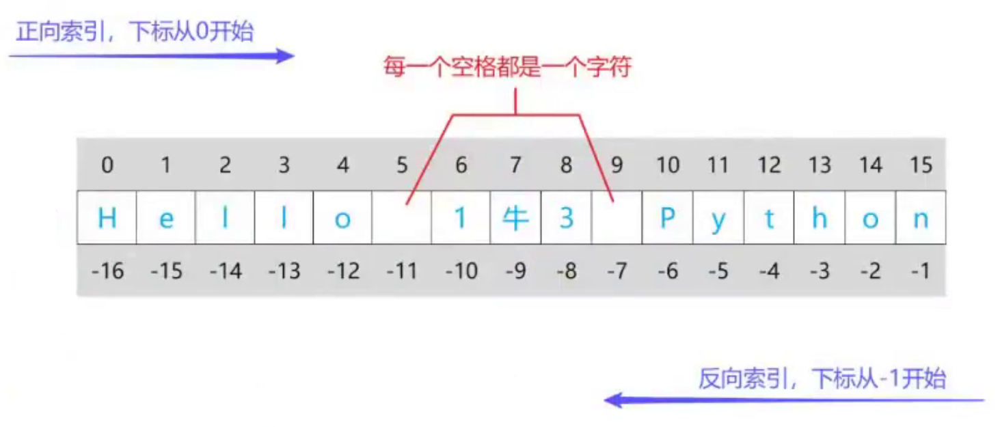
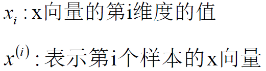
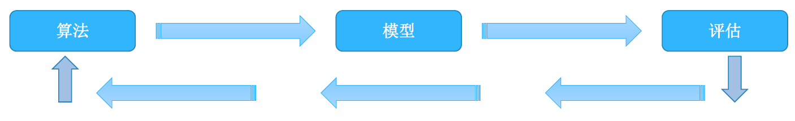
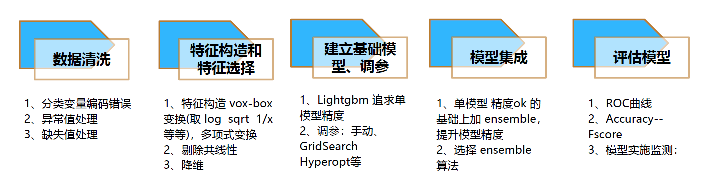
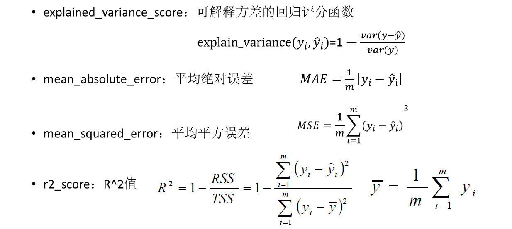

# 1.Python


## 输入&输出


**输入**

input(prompt)

prompt：提示信息，string类型

函数接受一个标准输入数据，返回为string类型

```python
name = input("请输入你的姓名: ")
print(name,"您好，很高兴认识你！")
```


**输出**

- print(*objects, sep=' ', end='\n', file=sys.stdout, flush=False)
- objects：输出的对象，输出多个对象时，需要用逗号分隔，对象会被转成字符串再输出
- sep：输出的对象用什么间隔开来，默认值是一个空格
- end：输出最后用什么结尾，默认值是换行符'\n'
- file：要写入的文件对象，默认为sys.stdout，指向控制台
- flush：通常输出是否被缓存决定于flush，如果flush参数为True，流会被强制刷新


## 序列的切片

六个标准的数据类型中是序列的有：字符串(String)，列表(List)，元组(Tuple)


**序列索引：**

正向索引，下标从0开始

反向索引，下标从-1开始




**切片：**

切片可以访问一个序列的某一个片段。

str[起始索引 : 末尾索引后一位 : 步长]

```python
str[7:9]	# 索引7-8
str[:5]		# 起始索引默认为0
str[::2]	# 结束索引没写，默认为序列长度
```

步长为整数，从左往右

步长为负数，从右往左


**len(str)**：获取字符串str的长度


**注意：**索引会降维度，切片不会降维度


## 基本数据类型

Python 3中有六个标准的数据类型：

- 数字(Number)
- 字符串(String)
- 列表(List)
- 元组(Tuple)
- 字典(Dictionary)
- 集合(Set)


### 数字(Number)

特点：Number是不可变的，它不是序列

分类：int, float, bool, complex


**整数(int)**

理论上可以无限大，无限小。但实际上受内存限制


**浮点数(float)**

带一个小数点，也可以加一个科学计数法标志e或者E，例如：3.14e-10


**布尔型(bool)**

在python 3中，把True和False定义成了关键字，bool型其实是int类型的子类。

bool类在数字运算时，会被看做成1和0


**复数(complex)**

实部+虚部，和数学中a+bi是一样的。但是这里要用j来表示虚部。例如：2+3j


**数字类型转换**

type(object)

- 返回object的类型


int(x)

float(x)

bool(x)

complex(real,imag)


### 字符串(String)

String是不可变的，它是序列

单行字符串

```python
#单引号字符串
str1 = '今天我很开始，因为我起得很早'
#双引号字符串
str2 = "今天我很开心，因为我起得很早"
#三引号字符串
str3 = """今天我很开心，因为我起得很早"""
```


#### **字符串格式化**

①用%格式化

```python
print("您的姓名是: %s\n您的年龄是: %s\n您的地址是: %s" % (name,age,address))
```

②fstring格式

```python
print(f'{num:>8}') 		# 总宽度为8，右对齐，默认空格填充
print(f'{num:0>8}')  	# 总宽度为8，右对齐，使用0填充
print(f'{num:a<8}')  	# 总宽度为8，左对齐，使用a填充
```


#### 字符串对象方法

`str.replace(老字符串, 新字符串 [,count])`

**功能：**用新字符串替换旧字符串并返回

count：要替换的最大次数，默认为1次

```python
s = "Line1 Line2 Line4"
rs = s.replace("Li","b")
```


`str.strip([chars])`

**功能：**从字符串左右两边删除指定的字符序列，默认删除空字符。

```python
str.strip("rw")
```


`str1.startswith(prefix[,start][,end])`

**功能：**判断字符串是否以prefix开头，是则返回True

```python
str1 = "hello world"
print(str1.startswith("h"))			#True
print(str1.startswith("w",6,8))		#True
```


`str1.endswith(suffix[,start][,end])`

**功能：**判断字符串是否以suffix结尾，是则返回True


`str.isalnum()`	    如果学符串中的所有子符都是子母、文字或数子，则返回 True，否则为 False

`str.isalpha()`		  如果字符串中的所有字符都是字母、文字，则返回True，否则为 False

`str.isdigit()` 	   	如果字符串中的所有字符都是数字，则返回 True，否则为 False

`str.isspace()` 		如果字符串中只有空白符(空格、换行符、制表符等)，则返回True，否则为 False


`str.join(iterable)`

iterable：包括string，list，tuple，dict，set等

**功能：**将可迭代对象中的元素(元素必须是字符串类型)以指定的字符连接，返回新的字符串

```python
a = "\\"
s1 = "hello world"
print(a.join(s1))
```


`str.count(sub,start,end)`

**功能：**计算string在字符串str中出现的次数

```python
print("llll".count(ll))
```


`str.find(subl,startl, end])` 			返回从左开始第一次找到指定子字符串时的索引，找不到就返回 -1

`str.rfnd(subl,startl, end]])` 		  返回从右开始第一次找到指定子字符串时的索引，找不到就返回-1

`str.index(subl,startl,end]l)` 		 类似于fnd()，唯一不同在于，找不到就会报错，其他都一样`str.rindex(subl,start,end]l)` 		类似于rfind()，唯一不同在于，找不到就会报错，其他都一样


`str.split(sep=None,maxsplit=-1)`

**sep：**用于分割字符串的分隔符，默认为所有的空白符(空格，换行，制表符等)，并丢弃结果中的**空字符串**

**maxsplit：**最大分隔次数，默认为-1，即分割所有

```python
a = s.split()
```


### 列表(List)

- List是可变的，它是序列
- 在方括号中添加元素，并使用逗号隔开

```python
list1 = ["h","e","l","l","o"," ","1","牛","3"]
# 把 "牛" 改成 "羊"
list1[-2] = "羊"

# 把"牛" "3" 改成"羊" "4"
list[-2:] = ["羊","4"]

# 把右边的可迭代对象中的元素进行操作
list1[-2:] = "1234"
```


`list([iterable])`

将一个iterable对象转换为列表并返回

```python
print(list("China"))		# ['C', 'h', 'i', 'n', 'a']
```


`list.append(x)`

**功能：**在列表的末尾添加一个元素

```python
list = [1,2,3]
list.append(4)
print(list)			# [1, 2, 3, 4]
```

对比list和string的不同：

```python
str1 = "1235"
new_str = str1.replace("5","4")
print(new_str)		# "1234"
```

列表本身是可变的，而字符串本身是不可变的


`list.extend(iterable)`

**功能：**使用iterable中的元素来扩展列表，相当于a[len(a):] = iterable

```python
list = [1,2,3]
list.extend([4,5])
```


`list.insert(element, index)`

**功能：**在给定的位置插入一个元素

```python
list = [1,2,3,4,True,False]
list.insert(4,5)				# [1, 2, 3, 4, 5, True, False]
```


`list.sort([key],reverse=False)`

key：指定一个函数，在排序前，列表每个元素先应用这个函数之后再对原数据进行排序

reverse：默认为False，代表升序，指定为True则降序

对原列表进行排序，无返回值

```python
num_list = [1,-2,5,-3]
num_list.sort()
```


**例：把lis中的元素按照绝对值的大小进行降序**

```python
lis = [-5, 2, 3, 1, 4]
lis.sort(key=abs, reverse=True)
```


### 元组(Tuple)

Tuple和List类似，它也是序列，但Tuple是**不可变**的

**圆括号**中添加元素


**封包：**当把多个元素赋给同一个变量时，会把它们打包成一个元组，这个过程叫封包

```python
tup1 = (1,2,3,"abv")
tup2 = (1,[2,3],(1,2))
```


**tuple([iterable])**

返回一个新的tuple对象，其元素来自于iterable


**元组对象方法**

**注意：**列表中对元素进行修改的方法，元组中都不存在，因为元组是不可变的。


**tuple.index(x)**

**tuple.count(x)**


### **字典(Dictionary)**

字典的每个键值对用冒号:隔开写key:value的格式，写在{}中。

- Dict是可变的，它不是序列。

- 字典的键**必须为不可变**的数据类型：数字，元组，字符串。

- 当键一样的时候，后面的值会覆盖前面的键的值。


```python
dic = {"name": "张三", "age": 18, "gender": "male"}
```


#### 创建字典的6种方式


**①直接在空字典{}里面写键值对**

```python
a = {"name": "张三", "age": 18, "gender": "male"}
print(a)
```

**②定义一个空字典，再往里面添加键值对**

```python
a = dict()
a["姓名"] = "张三"
a["age"] = 18
```

**③把键作为关键字传入**

```python
a = dict(name="张三",age=28)
```

**④可迭代对象方式来构造字典**

```python
# 这里用元组/列表/字典都可以
a = dict([("姓名","张三"),("年龄",28)])
```

**⑤通过zip()把对应元素打包成元组，类似于上一种方法**

```python
a = dict(zip(["姓名","年龄"],["张三",28]))
```


#### 字典对象方法


`dict.keys()`

`dict.values()`

- 返回由字典组成的一个新视图
- 返回的对象是视图对象，这意味着当字典改变时，视图也会相应改变

```python
d1 = {'身高':188,'体重':80,'肤色':'黄色','名字':'张三'}
view = d1.keys()
```


`dict.get(key[,default])`

key：指定的键

default：如果指定的键不存在时

```python
dic = {"身高":180,"体重":80}
value = dic["体","keyError"] # 返回一个字符串keyError
```


`dict.update([other])`

使用来自other的键/值对更新字典，如果键相同，则覆盖原有的键

other：可以是另一个字典对象

```python
dic = {"身高":180,"名字":"张三"}
dic.update([("名字","李四")])
print(dic)
```


`dict.pop(key[, default])`

移除指定的键key，并返回对应的值，如果key不在字典中，则返回default

```python
d1 = {'身高':188,'体重':80,'肤色':'黄色','名字':'张三'}
value = d1.pop("肤色")
print(value)	# 黄色
```


`dict.popitem()`

从字典中移除最后一个键值对，并返回它们构成的元组(键，值)

```python
dic = {'name':'小明','年龄':18,'学历':'本科'}
item = dic.popitem()
```


`dict.copy()`

返回字典的浅拷贝

```python
new_dic = dic.copy()
```


`dict.clear()`

移除字典中所有元素，无返回值


### 集合(Set)

- Set可以改变，它不是序列
- 无序性(集合元素是没有顺序的)
- 不重复性(元素是不重复的)
- 集合里只能包含不可变的数据类型
- 可以使用花括号{}或set()函数创建集合
- 创建空集合必须用set()，因为{}是用来创建空字典的


```python
a = set("abcdefga")
b = set("abc")
c = set("aef")

print(c<=a)	#判断c是否为a的子集
print(c>=a) #判断c是否为a的父集

#差集
print(a-c)

#交集
print(a&b)

#并集
print(a|b)
```


`set([iterable])`

`frozenset([iterable])`

```python
# 集合和冻结集合，冻结集合是不可变的
a = set("abcdefga")
b = fronzenset("abcdefga")
```


`set.add(elem)`

将元素elem添加到集合中

```python
a = {1,2,3}
a.add("hello world")
print(a)
```


`set.remove(elem)`

将元素elem从集合中删除

```python
set1.remove(12)
```


`set.pop()`

从集合中任意删除一个元素

```python
s1.pop()
```


## 浅拷贝&深拷贝

Python中的**赋值语句**不复制对象，只**建立引用关联**，对于可变数据，有时不希望对它进行修改，所以可以把它copy一份，对它的副本进行修改。


````python
import copy as cp
cp.copy()		# 浅拷贝
cp.deepcopy()	# 深拷贝
````


**浅拷贝**

如果浅拷贝对象是**不可变数据类型**，那么和赋值语句等效(没有拷贝的意义)。

如果浅拷贝对象是**可变数据类型**，那么浅拷贝会把该对象复制一份，但是该对象中的**其他所有元素**仍为**引用关系**。


```python
import copy

lis1 = [991, "abc", (9, 993), [994, 995], [888, 887],
{"name": "Tom"}, (996, [997, 998]), (888, (886, 886))]
lis2 = copy.copy(lis1) # 浅拷贝
print(id(lis1))
print(id(lis2))

lis1.append(9)
print(lis1)
print(lis2)
```


**深拷贝**

1. 如果深拷贝对象是**不可变数据类型**(复合类型还需确保其中的所有元素不可变)，那么**拷贝无效**。
2. 如果深拷贝对象带有可变数据类型，深拷贝会把该对象复制一份。
3. 对于其中的元素分别递归的适用于前两点。

```python
# 拷贝无效
import copy
tup1 = (991, "abc")			# 元组本身不可变，内部元素也不可变
tup2 = copy.deepcopy(tup1)
print(id(tup1))
print(id(tup2))
```


```python
# 会发生深拷贝
import copy
# 元组本身不可变，内部元素可变, 最后一个列表发生了拷贝
tup1 = (991, "abc",[11,22,33])
tup2 = copy.deepcopy(tup1)
print(id(tup1))
print(id(tup2))
```


## 运算符

`a += b`

```python
a = [1, 2]
b = a
a += [3, 4]	#inplace操作
print(a)	# [1,2,3,4]
print(b)	# [1,2,3,4]
```


`a = a + b`

```python
a = [1, 2]
b = a
a = a + [3, 4]	#新建操作
print(a)	# [1,2,3,4]
print(b)	# [1,2]
```

增强赋值能够以效率更高的方式处理(不新建)，尽量对元数据进行操作。


### 逻辑运算符

优先级：not > and > or

| 运算符 | 描述                                   |
| ------ | -------------------------------------- |
| and    | 左边为假，返回左边。两边为真，返回右边 |
| or     | 两真，返回左边。两假，返回右边         |
| not    | 返回bool值                             |


### 成员运算符

| 运算符 | 描述     |
| ------ | -------- |
| in     | 在其中   |
| not in | 不在其中 |


### 身份运算符

| 运算符 | 描述                             |
| ------ | -------------------------------- |
| is     | 判断两个标识符是否引用自一个对象 |
| is not | 判断两个标识符是否引用自一个对象 |

ps：判断地址是否相同


### 位运算符

位运算符是把数字转换成二进制来进行计算的

| 运算符 | 描述           |
| ------ | -------------- |
| &      | 按位与运算符   |
| \|     | 按位或运算符   |
| ^      | 按位异或运算符 |
| ~      | 按位取反运算符 |
| <<     | 左移运算符     |
| >>     | 右移运算符     |


进制转换函数


bin(x)：把x转成二进制

oct(x)：把x转成八进制

hex(x)：把x转成十六进制


## random模块

| 函数                                    | 描述                                                         |
| --------------------------------------- | ------------------------------------------------------------ |
| random.random()                         | 返回[0.0,1.0) 范围内的随机浮点数                             |
| random.randint(a, b)                    | 返回 [a,b] 范围内的随机整数                                  |
| random.uniform(a, b)                    | 返回 [a,b]范围内的随机浮点数                                 |
| random.choice(seq)                      | 从非空序列 seq 返回一个随机元素。 如果 seq 为空，则引发IndexError |
| random.sample(population,k)             | 从序列或者集合中随机获取k个元素，以列表形式返回(Python3.9版本,集合中采样已弃用) |
| random.shuffle(x)                       | 将可变序列x 随机打乱位置                                     |
| random.randrange (start,] stop [,step]) | 等效于从 range(start,stop,step) 里随机返回一个元素           |
| random.seed([x])                        | 起固定随机数的作用，x可以是任意数字 (x 可以理解为种子的名字) |


## 循环语句


### **while...else语句**

while执行完后，再执行else

```python
while count < 5:
    print(count,"小于5")
    count+=1
else:
    print(count,"大于或等于5")
```


### **for循环**

`for 变量 in 可迭代对象:`

​    `执行语句...`

```python
lis = [(1, 2), (3, 4), (5, 6)]
for var1, var2 in lis:
    print(var1, var2)
    
# output:    
"""
1 2
3 4
5 6
"""
```

如果变量用不到，可以用**`_`**代替

```python
for _ in range(3):
    print("hello")
```


### **for嵌套循环**

```python
# 打印九九乘法表
for i in range(1,10):
    for j in range(1,i+1):
        print(f"{i} * {j} = {i*j}",end="\t")
    print()
```


### enumerate

用枚举不仅可以遍历元素，还可以拿到索引

```python
lis = ['a', 'bc', 'd']
for index,item in enumerate(lis,start=1):
    print(index,item)
```


### 列表推导式

由一对方括号里面包含一个表达式，后面跟一个for子句，其结果是一个新列表，由表达式根据后面的for和if子句的内容进行求值计算而得出

```python
squares = []
for x in range(10):
    squares.append(x**2)
    
squares = [x**2 for x in range(10)]

lis = [(x,y) for x in range(3) for y in range(4,7)]

# 等价于
lis = []
for x in range(3):
    for y in range(4,7):
        lis.append((x,y))
print(lis)
```


### 内存自动管理问题

**字典/集合**在迭代时改变size，会导致报错：

```python
dic = {"name": "Tom", "age": 18, "height": 188}
for key in dic:
    print(key)
    dic.pop(key)
    print(dic)
# RuntimeError: dictionary changed size during iteration
```


## 函数


**自定义函数**

**格式：**

```python
def func_name():
    func_body
```


**return用法**

return后面可以跟单个对象，多个对象，表达式

```python			
def add(num1,num2):
    return num1 + num2
```


### **参数传递**

---


1. Python参数传递统统都是引用传递
2. 如果传递的实参是**可变数据类型**，函数会同步影响原数据
3. 如果传递的实参时**不可变类型**，函数不会对原数据进行修改


### 参数分类

---


**必须参数**

必须传参，否则报错(实参按照形参的对应位置传递)


**关键字参数**

通过关键字传入值(无所谓顺序)


**默认参数**

默认参数不能写在必须参数的前面，不能写在**kwargs的后面

```python
def info(name,age=18):
    print("姓名:",name)
    print("年龄:",age)
    
info("小明")
```


**不定长参数**

`*args`：将实参打包成元组给函数体调用

```python
def func(b,c,*a):
    print(b,c,a)

func(1,2,3,4,5) # 1->b 2->c 3,4,5->*a
```


`**kwargs`：将实参打包成字典给函数体调用，如果没有值传给它，就是个空字典

```python
def func(a,b,**kwargs):
    print(a,b,**kwargs)
    
func(1,2)
func(1,2,name='Tom', age=18, height=188)
```


**特殊参数**

- 可以用 `/` 和 `*` 来限制参数传递形式
- `/`为仅限位置参数，`*`为仅限关键字参数
- 在他们之后的参数必须以规定的格式传入


### 匿名函数

---


- 格式：`lamda[arg1,[arg2...argN]]:expression`
- 匿名函数的参数可以有多个，但是后面的expression只能有一个
- 匿名函数的返回值就是expression的结果，不需要return
- 匿名函数可以作为一个表达式，而不是一个结构化的代码块

```python
# 定义匿名函数
func = lambda left,right:left+right
func(2,3)
```

可以把匿名函数作为实参传给其他函数调用


### 封包&解包

---


**封包**

将多个值赋给一个变量时，Python会自动将这些值封装成**元组**，这个特性称之为封包：

```python
a = 1, 2, 3, 4
print(a)
```


**解包**

可迭代对象都支持解包

```python
# 解包
a, b, c, d = [1, 2, 3, 4]
print(a)
print(b)
print(c)
print(d)
```

```python
a,*b,c,d = "hello"

*a, = "hello"
print(a) 	#['h','e','l','l','o']
```

```python
def func(arg1,arg2,arg3,arg4,arg5):
    print(arg1,arg2,arg3,arg4,arg5)

a = "hello"
func(*a)	# 解包
```

```python
dic = {'name': 'Tom', 'age': 18, "height": 188}


def func(name, age, height, d=None):
    print(name, age, height, d)


func(**dic)
```


### 命名空间&作用域

---


#### **命名空间**

**定义：**命名空间是一个从名称到对象的映射

**实现：**大部分命名空间当前由Python字典实现

**作用：**提供了在项目中避免名字冲突的一种方法

**描述：**各个命名空间是独立的，没有任何关系。

一个命名空间中不能有重名，但不同的命名空间是可以重名的


**内置命名空间**

包含所有Python内置对象的名称

在解释器启动时创建，持续到解释器终止

```python
import builtins

print(dir(builtins))
```


 **全局命名空间**

- 包含模块中定义的名称，模块的变量名，函数，类，其他导入模块等
- 在模块被读入时创建，持续到解释器退出


**局部命名空间**

- 包含**函数**中定义的名称，记录了函数的变量，参数等
- 一个函数的局部命名空间在这个函数被调用时创建，函数退出时结束


#### 作用域

定义：Python程序可以直接访问命名空间的正文区域

作用：决定了哪一部分区域可以访问哪些特定的名称


**global和nonlocal**

当内部作用域想给外部作用域的变量重新赋值时，可以用`global`或`nonlocal`关键字

```python
def outer():
    a = 2
    def inner():
        global a
        a = 3
    return inner()

a = 1
outer()
print(a)  # a=3
```


```python
def outer():
    a = 2
    def inner():
        nonlocal a
        a = 3
    return inner()

a = 1
outer()
print(a)  # 2
```


#### 递归函数

**定义：**程序调用自身的编程技巧称为递归。

一般来说，递归需要满足2个条件：

- 递归边界条件(终止条件)
- 递归推理(提取重复的子问题，不断向边界条件靠拢)


```python
# 斐波那契数列
# m -> months
def get_rabbits(m):
    if m < 2:
        return 1
    return get_rabbits(m - 1) + get_rabbits(m - 2)
```


### 闭包

- 在函数嵌套的前提下
- 内部函数使用了外部函数的变量(参数)
- 外部函数的返回值是内部函数的引用


**闭包如何理解：**

一般来说，一个函数结束，函数内部的变量，参数都会被释放掉

但闭包则不同，它在外部函数结束时，会把内部函数中用到的外部函数的变量，参数保存到内部函数的`__closure__`属性中，以提供给内部函数使用

```python
def outer(arg):
    
    def inner():
    	return arg + 1
    
    return inner

res = outer(2)
print(res())
```


## 面向对象

**魔术方法：**以双下划线开头，双下划线结尾的方法

魔术方法不需要手动调用，它会在特定的情况下被自动调用

**自动调用条件：**当**实例化**的时候，会自动调用

```python
class Student:
    # 魔术方法
    def __init__(self,name,age,address):
        self.name = name
        self.age = age
        self.address = address

obj = Student("张三",18,"张家巷")		# 实例化
```

实例化 ->自动调用 `__new__` -> 自动调用`__init__`

实例对象是由`__new__`创建和返回的，由`__init__`定制的


### 类，对象，静态方法

**对象方法**隐式地接收了**self**参数，**类方法**隐式地接收了**cls**参数

```python
def eat(self):	# 对象方法
    print(f"{self.name}吃饭")

@classmethod 	# 类方法的装饰器
def sleep(cls):
    print(f"{cls.school}的学生睡觉")

@staticmethod	# 静态方法的装饰器 
def wash():
    pass


stu1 = Student()
# 对象方法调用
stu1.eat()
# 类方法调用
Student.sleep()
# 静态方法调用
Student.wash()
```


**删除属性**

```python
# 删除类的属性
delattr(Person,"eat")
"""等价于 del Person.eat """
```


### 封装

- 在属性或方法前面加`__`开头，声明为私有属性或私有方法
- 私有属性或私有方法只能类内调用
- 但是可以提供公有方法来访问私有属性，或调用私有方法
- 子类无法继承父类的私有属性和私有方法


### 继承

- 所有的类默认继承object
- 子类会拥有父类中所有的非私有属性和方法

```python
# 单继承
class Person:
    ...
    
class Student(Person):
    ...
    
class Worker(Person):
    ...
```

```python
# 多继承
class Ragdoll(Animal,Cat):	# 继承多个父类
```


子类优先使用自己的方法，如果没有再调用父类的方法

使用**super**直接调用父类的方法：

```python
class Cat(Animal):
    def eat(self):
        print(f'猫吃{self.food}')
        super().eat()	# 默认调用当前类的父类
        
# 也可以在外面调用
c = Cat('🐟')
super(Cat,c).eat()		# 调用父类的eat()方法
```


### 多态

具有不同内容的方法可以使用相同的方法名，则可以用一个方法名调用不同内容的方法


### 魔术方法

以两个下划线开头，两个下划线结尾的方法

在特定的情况下，它会被自动调用，不需要手动调用


`__init__(self[,...])`

初始化方法，在实例化过程中调用

```python
class Ex:
    def __init__(self,arg1,arg2):
        print(f"init被调用")
        
Ex("a","b")		# 实例化时调用
```


`__call__(self[,...])`

当实例对象像函数那样被调用时，会自动调用

```python
class Ex:
    def __call__(self,arg1,arg2):
        print(f"__call__被调用")
        
Ex()("a","b")
```


`__getitem__(self, key)`

- 当执行 self[key] 操作时，会调用该方法

```python
class Ex:
    
	def __getitem__(self, key):
		print(f"__getitem__被调用, key: {key}")
		print(["a", "b", "c"][key])
		print({0: "零", 1: "壹", 2: "贰"}[key])
        
e = Ex()
e[2]
```


`__repr__(self) / __str__(self)`

- 实例对象转字符串时，会调用该方法，要求必需返回字符串类型

```python
class Ex:
    
	def __repr__(self):
		return "__repr__被调用"
    
	# def __str__(self):
	# return "__str__被调用"
    
e = Ex()
print(str(e))
print(f"{e}")
print(e) # print会转成字符串再输出
```


`__add__(self, other)`

- 实例对象进行加法操作时会调用该方法，要求只要加法左边有当前类的实例对象即可

```python
class Number:
    
	def __init__(self, num):
		self.num = num
        
	def __add__(self, other):
		return self.num + other
    
n = Number(6)
print(n + 7) # 实例对象在左边
```


`__radd__(self, other)`

- 实例对象进行加法操作时会调用该方法，要求加法右边有当前类的实例对象且左边没有

```python
class Number:
    
	def __init__(self, num):
		self.num = num
        
	def __radd__(self, other):
		return other + self.num
    
n = Number(6)
print(7 + n) # 实例对象在右边
```


`__sub__(self, other)`

- 实例对象进行减法操作时会调用该方法，要求只要减法左边有当前类的实例对象即可

```python
class Number:
    
	def __init__(self, num):
		self.num = num
        
	def __sub__(self, other):
		return self.num - other
n = Number(6)
print(n - 4) # 实例对象在左边
```


`__rsub__(self, other)`

- 实例对象进行减法操作时会调用该方法，要求减法右边有当前类的实例对象且左边没有

```python
class Number:
    
	def __init__(self, num):
		self.num = num
        
	def __rsub__(self, other):
		return other - self.num
    
n = Number(6)
print(4 - n) # 实例对象在右边
```


`__mul__(self, other)`

- 实例对象进行乘法操作时会调用该方法，要求只要乘法左边有当前类的实例对象即可

```python
class Number:
    
	def __init__(self, num):
		self.num = num
        
	def __mul__(self, other):
		return self.num * other
    
n = Number(6)
print(n * 4) # 实例对象在左边
```


- `__rmul__(self, other)`
  实例对象进行乘法操作时会调用该方法，要求乘法右边有当前类的实例对象且左边没有

```python
class Number:
    
	def __init__(self, num):
		self.num = num
	def __rmul__(self, other):
		return other * self.num
    
n = Number(6)
print(4 * n) # 实例对象在右边
```


`__truediv__(self, other)`

- 实例对象进行除法操作时会调用该方法，要求只要除法左边有当前类的实例对象即可

```python
class Number:
    
	def __init__(self, num):
		self.num = num
        
	def __truediv__(self, other):
		return self.num / other
    
n = Number(6)
print(n / 3) # 实例对象在左边
```


`__rtruediv__(self, other)`

- 实例对象进行除法操作时会调用该方法，要求除法右边有当前类的实例对象且左边没有

```python
class Number:
    
	def __init__(self, num):
		self.num = num
        
	def __rtruediv__(self, other):
		return other / self.num
    
n = Number(6)
print(3 / n) # 实例对象在右边
```


## 异常


### 处理异常

#### `try...except...`

- 如果try子句发生了异常，则跳过该子句剩下的部分，执行except子句
- 如果except子句没有指定异常类型，则可以处理try中的所有异常类型
- 如果except子句指定了异常类型，则只能处理对应的异常类型

```python
def div(a, b):
    try:
        c = a / b
        print(c)
    except:
        print("try子句里发生了异常")
```

```python
def div(a,b):
	try:
		a[100]
		c=a/b
		print(c)

	except TypeError:
    	print('try子句里面发生了类型异常')
	except ZeroDivisionError:
        print('try子句里面发生了除零异常')
	except IndexError:
		print('try子句里面发生了索引异常')
```


#### `try...except...else...`

else子句将在try中没有发生任何异常的情况下执行

```python
def div(a, b):
    try:
        c = a / b
        print(c)
    except:
        print("try子句里发生了异常")
    else:
        print("try子句中没有任何毛病")
```


#### `try...except...as`

```python
def div(a, b):
    try:
        c = a / b
        print(c)
    except ZeroDivisionError as e:
        print(e)
```


#### `try...finally...`

finally子句将作为try语句结束前的最后一项任务被执行

```python
def div(a, b):
    try:
        c = a / b
        print(c)
    except ZeroDivisionError as e:
        print(e)
    finally:
        print("I'm inevitable")
```


### assert断言

---

assert用于判断一个表达式，在表达式为False的时候触发断言`AssertionError`异常

```python
num = int(input("请输入一个整数:"))
assert num != 1
```


## 迭代器&生成器


**都有哪些可迭代对象？**

string, list, tuple, dict, set, range


**迭代器有哪些？**

```python
rev = reversed([2,3,4,5])

zp = zip([2,3,4],[4,5,6])

mp = map(abs,[-1,-2,-3])

ft = filter(None,[0,1,2,3])

enum = enumerate([2,3,4,5])
```


**迭代器缺点：**

- 取值不如按照索引灵活，只能往后取，不能往前
- 除非取尽，否则无法获取迭代器的长度


### 可迭代对象

只要满足其中一个条件即可：

- 支持**迭代协议**(有`__iter__()`方法)
- 支持**序列协议**(有`__getitem__()`方法，且数字参数从0开始)


### 迭代器

支持**迭代器协议**，即同时满足下面两个条件：

- 实现`__iter__()`方法
- 实现`__next__()`方法


**格式：**`for 变量 in 可迭代对象:`

1. for语句在执行时，会自动调用可迭代对象中的`__iter__()`方法，返回一个迭代器对象。
2. 每循环一次，该迭代器对象都会调用一次`__next__()`魔术方法，通过它来逐一返回元素，返回的元素赋值给变量`i`


**重要结论**

一个迭代器只能**从头到尾迭代一次**

```python
lis = [1,2,3,4]

rsvd = reversed(lis)

for i in rsvd:
    print(i)    # 4 3 2 1

for i in rsvd:
    print(i)    # 没有输出
```


可迭代对象可以迭代任意次


### 生成器

生成器写法类似于标准的函数写法，不同点在于：

生成器用 yield 语句返回数据，而标准的函数用 return 语句返回数据


yield 语句返回数据之后会挂起函数的状态，并会记住上次执行语句时的所有数据值，方便每次在生成器调用__next__()方法时，从上次挂起的位置恢复继续执行，而 return 语句返回一次数据之后，函数就结束了


**生成器表达式**

- 生成器表达式所用语法类似列表推导式，只是外层为圆括号而非方括号
- 生成器表达式相比完整的生成器函数来说更紧凑，相比列表推导式则更为节省内存，因为列表推导式是一次构建一个结果列表，而生成器表达式返回的是一个生成器，再根据对生成器的处理函数按需迭代产生结果

```python
# 列表推导式
list1 = [i for i in range(5)]
print(type(list1)) # <class 'list'>
print(sum(list1)) # 10
print(sum(list1)) # 10

# 生成器表达式
gt1 = (i for i in range(5))
print(type(gt1)) # <class 'generator'>
```


`iter()`：iter函数可以把目标转换成迭代器

`next(iterator[,default])`

通过调用 iterator 的 __next__() 方法获取下一个元素。如果迭代器耗
尽，则返回给定的 default，如果没有默认值则触发 StopIteration

```python
str_iterator = iter("abcd")
print(next(str_iterator)) # "a"
print(next(str_iterator)) # "b"
print(next(str_iterator)) # "c"
print(next(str_iterator)) # "d"
print(next(str_iterator, "ef")) # 迭代耗尽, 返回 "ef"
print(next(str_iterator)) # 迭代耗尽, 触发 StopIteration
```


## 模块&包

每一个模块都有一个`__name__`属性，当其值是`__main__`时，说明该模块自身在运行。


```python
# 测试模块
if 
__name__ = '__main__':
    func()
```


### 包

Python包其实就是一个文件夹，只是多了一个`__init__.py`文件

在同一个包中，不允许两个模块同名。


**小结**

---

- 数据可以封装在容器(列表，元组，字符串，字典，集合)
- 代码可以封装在函数中
- 函数和数据可以封装在类中
- 以上都可以打包在模块中
- 多个模块可以放在包里
- 多个包可以打包在库里


## 文件和路径


从文件编码的角度来看，文件可以分为**文本文件**和**二进制文件**

**文本文件：**txt，html，json等

**二进制文件：**图片，音频，视频等


`open(file, mode='r', encoding=None)`

- file：文件路径（相对路径或绝对路径）
- mode：文件打开的模式，默认为 'r' 模式
- encoding：编码方式（只用在文本模式下），通常设置为 'UTF-8'
- 打开 file 对应的文件，返回一个文件对象


**mode 常用模式：**


| 模式 | 描述                                                         |
| ---- | ------------------------------------------------------------ |
| r    | 以只读方式打开文件，文件的指针将会放在文件开头               |
| w    | 打开一个文件只用于写入。会覆盖原有记录                       |
| x    | 新建一个文件只用于写入，如果文件已存在会报错                 |
| a    | 打开一个文件用于追加                                         |
| +    | 如果要以读写模式打开，加上 + 即可，比如：r+、w+、x+、a+      |
| b    | 默认为文本模式，如果要以二进制模式打开，加上 b 即可，比如：rb、rb+、wb、wb+ |


### **file 常用对象方法**

`file.read(size=-1)`

- 从 file 中读取至多 size 个**字符**并返回
- 如果 size 为负值或 None，则读取至 EOF（End Of File）

```python
with open(r"./t01.txt") as file:
	print(file.read(5))
	print(file.read(2))
	print(file.read())
```


`file.write(s)`

- 将字符串 s 写入到流并返回写入的字符数


`file.flush()`

刷新缓冲区，即将缓冲区中的数据立刻写入文件，同时清空缓冲区，不需要被动的等待缓冲区写入。一般情况下，文件关闭后会自动刷新缓冲区，但有时你需要在关闭前刷新它，这时就可以使用 flush() 方法

```python
import time
file = open(r"./t01.txt", mode='a')
file.write('\n123456789')
time.sleep(5) # 要等到关闭文件时才把数据从缓冲区写入文件
file.close() # 关闭文件，自动刷新缓冲区，数据才写入文件

file = open(r"./t01.txt", mode='a')
file.write('\n123456789')
file.flush() # 刷新缓冲区，数据立刻写入文件
time.sleep(5)
file.close()
```


`file.close()`

- 刷新缓冲区并关闭该文件。如果文件已经关闭，则此方法无效
- 文件关闭后，对文件的任何操作（如：读取或写入）都会引发ValueError

```python
file = open(r'./t01.txt')
print(file.read())
file.close()
file.close() # 多次调用该方法，只有第一个调用才会生效
file.read() # 引发ValueError
```


`file.readline(size=-1)`

- 从文件中读取并返回一行，如果指定了 size，将至多读取 size 个字符

```python
with open("./t01.txt") as file:
	print(file.readline())
	print(file.readline(1))
	print(file.readline())
```


`file.readlines(hint=-1)`

- 从文件中读取并返回包含多行的列表
- hint：默认为 -1，代表读取所有行（也可以指定读取的字符数，如果要读取的字符数超过一行，则按照两行读取，超过两行则按照三行读取，依次类推）

```python
with open("./t01.txt") as file:
	print(file.readlines())
    
with open("./t01.txt") as file:
	print(file.readlines(11))
```


`file.writelines(lines)`

- lines：Iterable[str]
- 向文件写入一个字符串序列，不会自动添加分隔符

```python
tup = ("a\n", 'bc\n', "def")
with open(r"./t01.txt", mode="w") as file:
	file.writelines(tup)
```


### with语句

```python
file = open(r'./t01.txt', mode='w')
file.write('hello world')
file.close()
```

这种写法有一个潜在问题，如果在调用 write 的过程中出现了异常，则会导致 close 方法无法被正常调用，导致资源占用的浪费


用 with 语句将会是一种更加简洁、优雅的方式：

```python
with open(r'./t01.txt', mode='w') as file:
	file.write('hello world')
```


### 路径操作

---

`os.getcwd()`

- 返回表示当前工作目录的字符串

```python
import os
print(os.getcwd())
```


`os.listdir(path)`

- 返回 path 指定的文件夹包含的文件或文件夹的名字的列表

```python
import os

li = os.listdir(os.getcwd())
print(li)
```


`os.mkdir(path)`

只创建 path 中的最后一级目录，所以要保证所需要的中间目录是存在的

如果最后一级目录已存在，则抛出 FileExistsError 异常

```python
import os

os.mkdir(os.getcwd() + "/MyDir")
```


`os.makedirs(name, exist_ok=False)`

- 递归创建目录，并且还会自动创建到达最后一级目录所需要的中间目录
- 如果 exist_ok 为 False (默认值)，则如果目标目录已存在将引发FileExistsError

```python
import os

os.makedirs('./dir1/dir2/dir3')
```


`os.remove(path)`

- 移除 path 对应的文件；如果 path 是目录或者文件不存在，都会引发异常

```python
import os

os.remove('./dir1/dir2/a.txt')
```


`os.path.join(path, *paths)`

- 智能地拼接一个或多个路径部分

```python
import os

print(os.path.join("./dir3/dir2", "dir1/a.txt"))
```


### json格式

字符串可以很轻松地写入文件并从文件中读取出来，而其他类型（比如：字典）复杂的数据会变得相当麻烦，因为 read() 方法返回字符串。


**注意：**json 中的键值对的键，永远是 str 类型。当一个对象被转化为 json 时，字典中所有的键都会被强制转换为字符串，导致当字典被转换为 json 然后转换回字典时可能和原来不相等。

```python
import json

info = {"name":"Tom","age":18,1:"one"}
print(type(info),info)

with open("./json.txt",mode='w') as file:
    json_str = json.dumps(info)
    file.write(json_str)

with open("./json.txt",mode='r') as file:
	content = file.read()
	res = json.loads(content)
	print(type(res))        # dict
```


**读取json文件：**

```python
import json

with open('./TestFile.json') as file:
	content = json.load(file)
    
obj_list = content["outputs"]["object"]
for item in obj_list:
	print(item["name"])
	print(item["bndbox"])
```


### xml文件

XML文件格式是**纯文本格式**。

XML文档的第一句是声明语句，紧接着声明后面建立的第一个元素是根元素（有且只有一个），其他元素都是这个根元素的子元素，每个XML元素包括一个开始标签，一个结束标签，以及两个标签之间的内容。


```python
import xml.etree.ElementTree as ET
tree = ET.parse(r"./TestFile.xml") # 将XML文档解析为元素树
root = tree.getroot() # 返回该树的根元素, 即 <doc>
obj = root.find("outputs").find("object") # 找到对应的子元素

for item in obj:
	name = item.find("name")
	print(name.text)
	bndbox = item.find("bndbox")
    
for item in bndbox:
	print(item.tag) # tag：标签（尖括号之间的内容）
	print(item.text) # text：文本（标签之间的内容）
```


## 正则表达式

正则表达式（Regular Expression），是对字符串操作的一种"逻辑公式"，它是由一些特定的字符组成的一个"**匹配规则**"，可以对要匹配的字符串指定该"规则"。


建议在写任何正则表达式时，使用原始字符串。


**普通字符**

- 大多数字母和字符一般都会和自身匹配

```python
import re

p = re.compile(r"test123")
print(p.search("atest123b"))
```


**特殊字符(元字符)**

- 有些字符它们和自身并不匹配，而是匹配一些与众不同的东西或者影响正则表达式的其他部分（对其重复或改变含义）
- 元字符：. ^ $ * + ? { } [ ] \ | ( )
- 匹配除了换行符以外的任意一个字符
- DOTALL 模式下，它将匹配包括换行符的任意一个字符


### 使用正则表达式

```python
import re

string = "abcdef"
```


# 2.NumPy


**NumPy 数组和 Python 列表的区别：**

- NumPy 数组中的元素都需要具有**相同的数据类型**
- NumPy 数组在创建时具有**固定的大小**，与 Python 的列表（可以动态增长）不同，更改数组的大小将创建一个新的数组


## 创建数组


| NDARRAY常用属性描述 | 描述                                       |
| ------------------- | ------------------------------------------ |
| ndarray.ndim        | 秩，即轴的数量或维度的数量                 |
| ndarray.shape       | 数组的形状                                 |
| ndarray.size        | 数组元素的总个数                           |
| ndarray.dtype       | ndarray 对象的元素类型                     |
| ndarray.itemsize    | ndarray 对象中每个元素的大小，以字节为单位 |


```python
lis = [[1,2,3],[4,5,6],
      [1,2,3],[4,5,6],
      [1,2,3],[4,5,6]]
res = np.array(lis)
print(res.shape)		# (3,2,3)
```


### **从现有的数据创建**

`np.array(object,dtype=None)`

- object：array_like，类似于数组的对象。如果object是标量，则返回包含object的0维数组
- dtype：data-type，数组所需的数据类型。如果没有给出，会从输入数据推断数据类型
- 创建一个数组对象并返回（ndarray实例对象）

```python
a1 = [1,2,3]
np.array(a1)
print(a1)
```


`np.asarray(a, dtype=None)`

- 类似于 np.array，主要区别是当 a是 ndarray 且 dtype 也匹配时，np.asarray不执行复制操作，而 np.array 仍然会复制出一个副本，占用新的内存

```python
a = np.array([1,2,3])
arr1 = np.array(a,dtype=np.int32)	# 执行复制操作
arr= np.asarray(a,dtype=np.int32)	# 不执行复制操作
```


`np.copy(a)`

- a：array_like
- 返回给定对象的数组副本

```python
import numpy as np

a1 = [1, 2, 3]
arr1 = np.copy(a1)
print(arr1)
```


### 从形状或值创建

`np.zeros(shape, dtype=np.float64)`

- 返回给定形状和类型的新数组，并用零填充

```python
import numpy as np

print(np.zeros((2, 3)))
print(np.zeros((2, 3), dtype=np.int32))
```


`np.ones(shape, dtype=np.float64)`

- 返回给定形状和类型的新数组，并用1填充

```python
import numpy as np

print(np.ones((2, 3)))
print(np.ones((2, 3), dtype=np.int32))
```


`np.full(shape, fill_value, dtype=None)`

- 返回给定形状和类型的新数组，并用 fill_value 填充

```python
import numpy as np

print(np.full((2, 3), 6))
print(np.full((2, 3), 6.))
print(np.full((2, 3), 6., dtype=np.int32))
```


`np.identity(n, dtype=np.float64)`

- 返回 n*n 的单位数组（主对角线为1，其他元素为0的方形数组）

```python
import numpy as np

print(np.identity(3))
print(np.identity(3, dtype=np.int32))
```


### 从数值范围创建数组

`np.arange([start,] stop[, step,], dtype=None)`

- 返回给定区间内的均匀间隔值构成的数组

```python
import numpy as np

print(np.arange(3))
print(np.arange(3.0))
print(np.arange(3, 7))
print(np.arange(3, 7, dtype=np.float64))
print(np.arange(3, 7, 2))
print(np.arange(7, 3, -2))
print(np.arange(3, 7, 0.5))
```


`np.linspace(start, stop, num=50, endpoint=True, retstep=False, dtype=None)`

- num：生成的样本数量
- endpoint：如果为 True, stop 为最后一个样本。否则，不包括在内
- retstep：如果为 True，返回 (samples, step)， step 是样本之间的间隔
- dtype：如果没有给出dtype，则从 start 和 stop 推断数据类型。推断出的 dtype 永远不会是整数；即使参数会产生一个整数数组，也会选择 np.float64
- 把给定区间分成 num 个均匀间隔的样本，构成数组并返回（等差数
  列）

```python
import numpy as np

print(np.linspace(1, 50))
print(np.linspace(1, 10, num=10))
print(np.linspace(1, 10, num=10, endpoint=False))
print(np.linspace(1, 10, num=10, retstep=True))
print(np.linspace(1, 10, num=10, dtype=np.int32))
```


`np.logspace(start, stop, num=50, endpoint=True, base=10.0,dtype=None)`

- start：序列的起始值为：base ** start
- stop：序列的终止值为：base ** stop
- num：生成的样本数量
- endpoint：如果为 True, stop 为最后一个样本。否则，不包括在内
- base：对数 log 的底数
- dtype：如果没有给出dtype，则从 start 和 stop 推断数据类型。推断出的 dtype 永远不会是整数；即使参数会产生一个整数数组，也会选择 np.float64
- 把给定区间分成 num 个按对数尺度均匀间隔的样本，构成数组并返回（等比数列）

```python
import numpy as np

print(np.logspace(2.0, 3.0, num=4))
print(np.logspace(0, 9, 10, base=2))
```


## 基本运算

算术和比较操作 ndarrays 被定义为逐元素操作

```python
import numpy as np

a = np.array([[1, 2], [3, 4], [5, 6]])
print(a + 2)
```


## 广播机制

- 数组的秩不同，后缘维度相同或者不同的维度有1，可以广播
- 数组的秩相同，后缘维度不同的维度有1，可以广播

```python
import numpy as np

arr1 = np.array([1,2,3,4,5,6])
arr2 = np.reshape(arr1,(2,3))
print(arr1.shape)
print(arr2.shape)
```


## 索引和切片

数组的索引和切片与 Python 中序列的索引和切片操作基本类似，不同点在于：

- 数组切片不会复制内部数组数据，只会生成原始数据的**新视图**
- 数组支持多维数组的多维索引和切片

```python
import numpy as np

arr1 = np.arange(10)
print(arr1)			# [0 1 2 3 4 5 6 7 8 9]
view = arr1[3:7]
print(view)			# [3 4 5 6]

arr1[5] = 777		
print(view)			# [3	4	777	6]
```


## 常用操作

`np.reshape(a, newshape)`

- 在不更改数据的情况下为数组赋予新的形状


```python
import numpy as np

print(np.reshape([1, 2, 3, 4, 5, 6], 6))
print(np.reshape([1, 2, 3, 4, 5, 6], (6, )))
print(np.reshape([1, 2, 3, 4, 5, 6], (2, 3)))

arr = np.array([1, 2, 3, 4, 5, 6])
print(np.reshape(arr, (2, 3)))
print(arr.reshape((2, 3, 1)))
```


`ndarray.flatten()`

- 返回扁平化到一维的数组


```python
import numpy as np

a = np.array([[1,2], [3,4]])
print(a.flatten())
```


`ndarray.T`

- 转置数组


```python
import numpy as np

a = np.array([[1,2], [3,4]])
print(a)
print(a.T)

a = np.array([1, 2, 3, 4])
print(a)
print(a.T)
```


`np.swapaxes(a, axis1, axis2)`

- 交换数组的两个轴


```python
import numpy as np

x = np.array([[1, 2, 3]])
print(x)
print(x.shape)
y = np.swapaxes(x, 0, 1)
print(y.shape)
print(y)

x = np.arange(6).reshape((1, 2, 3))
print(x)
print(x.shape)
y = np.swapaxes(x, 0, 2)
print(y)
print(y.shape)
```


# 3.Pandas

Pandas能够快速得从**不同格式的文件中加载数据**（比如 CSV 、Excel文件等），然后将其转换为可处理的对象。

Pandas 在 ndarray 的基础上构建出了两种更适用于数据分析的存储结构，分别是 **Series**（一维数据结构）和 **DataFrame**（二维数据结构)。

在操作 Series 和DataFrame 时，基本上可以看成是 NumPy 中的一维和二维数组来操作，**数组的绝大多数操作它们都可以适用**。


## Series

Series是一种一维数据结构，每一个元素都带有一个索引，与 NumPy中的一维数组类似。


Series 可以保存任何数据类型，比如整数、字符串、浮点数、Python对象等，它的索引默认为整数，从 0 开始依次递增。


### 创建 Series 对象

`pd.Series(data=None, index=None, dtype=None, name=None)`

- data：array-like, dict, or scalar value
- index：必须是不可变数据类型，允许相同。不指定时，默认为从 0 开始依次递增的整数
- dtype：数据类型，如果没有指定，则会自动推断得出
- name：设置 Series 的名称

```python
import pandas as pd
import numpy as np

ser = pd.Series(np.array([3, 4, 5]))	#一维	
print(ser)

""" dict创建:默认用字典的键作为index, 值作为数据 """
d = {'a': 1, 'b': 2, 'c': 3}
ser = pd.Series(data=d) # index=['a', 'b', 'c'] 可省略
print(ser)
```


### 访问 Series 数据

**两种方式：**位置索引访问、索引标签访问


**位置索引访问**

```python
import numpy as np
import pandas as pd

d = np.array([1, 2, 3, 4, 5])
ser = pd.Series(data=d, index=('a', 'e', 'c', 'd', 'e'))
print(ser)
print(ser[1])
print(ser[1:3])
print(ser[:-2:2])
print(ser[[2, 1, 3]])
```


**索引标签访问**

```python
import numpy as np
import pandas as pd

d = np.array([1, 2, 3, 4, 5])
ser = pd.Series(data=d, index=('a', 'e', 'c', 'd', 'e'))
print(ser)
print(ser['c'])
print(ser['e'])

""" 索引标签切片时, 右边不是开区间哦 """
print(ser['a':'d']) # ser['e':'d']报错，因为'e'不唯一
print(ser[:'c':2])
print(ser[['c', 'e', 'd']])
```


### 修改 Series 索引

可以通过给 index 属性重新赋值达到修改索引的目的

```python
import pandas as pd

ser = pd.Series([4, 7, -5, 3], index=['a', 'b', 'c',
'd'])
print(ser)
ser.index = ['aa', 'bb', 'cc', 'dd'] # 修改原数据
print(ser)
```


### 修改 Series 数据

可以通过索引和切片的方式修改数据

```python
import pandas as pd

ser = pd.Series([2, 3, 4, 5], index=['a', 'b', 'c', 'd'])
ser['a'] = 8
print(ser)
ser['b':'d'] = 9
print(ser)
ser['b':'d'] = [1, 1, 1]
print(ser)
```


### 重新索引

`Series.reindex(index=None, fill_value=np.NaN)`

- index：要获取数据的索引，传入列表
- fill_value：填充的缺失值（标量），默认为 np.NaN
- 返回重新索引组成的新的 Series 对象
- 注意：reindex操作的series对象不能有重复的索引

```python
import numpy as np
import pandas as pd

d = np.array([1, 2, 3, 4, 5])
ser = pd.Series(data=d, index=('a', 'e', 'c', 'd', 'b'))
print(ser)

new_ser = ser.reindex(index=['a', 'b', 'c', 'd', 'e'])
print(new_ser)
```


### Series 常用属性

| 属性   | 描述                                      |
| ------ | ----------------------------------------- |
| dtype  | 返回 Series 对象数据类型                  |
| empty  | 判断 Series 对象是否为空                  |
| name   | 返回 Series 对象名称                      |
| size   | 返回 Series 中的元素数量                  |
| values | 以 ndarray 数组的形式返回 Series 中的数据 |
| index  | 返回 index                                |

```python
import pandas as pd

d = [1, 2, 3, 4]
ser = pd.Series(data=d, index=['a', 'b', 'c', 'd'],
name="Test-Series")
print(ser.dtype)
print(ser.empty)
print(ser.name)
print(ser.size)
print(ser.values)
print(ser.index)
```


### Series 常用方法

`Series.head(n=5)`

- 返回前 n 行数据
- 如果 n 为负数，则等价于 Series[:n]

```python
import pandas as pd
import numpy as np

ser = pd.Series(np.random.randn(7))
print(ser)
print(ser.head()) # 返回前5行数据
print(ser.head(3)) # 返回前3行数据
print(ser.head(-2)) # 等价于ser[:-2]
```


`Series.tail(n=5)`

- 返回后 n 行数据
- 如果 n 为负数，则等价于 Series[-n:]

```python
import pandas as pd
import numpy as np

ser = pd.Series(np.random.randn(7))
print(ser)
print(ser.tail()) # 返回后5行数据
print(ser.tail(3)) # 返回后3行数据
print(ser.tail(-2)) # 等价于ser[2:]
```


`Series.isnull() / Series.notnull()`

- 检测 Series 中的缺失值

```python
import pandas as pd
import numpy as np

ser = pd.Series([1, 2, 5, np.nan])
print(ser)
print(ser.isnull())
print(ser.notnull())
```


### Series 的运算

Series 保留了 NumPy 中的数组运算，且 Series 进行数组运算的时候，索引与值之间的映射关系不会发生改变。在进行 Series 和 Series 的运算时，把两个Series 中索引一样的值进行运算，其他不一样的做并集，对应的值为 NaN

```python
import pandas as pd

ser1 = pd.Series([15, 20], index=["a", "b"])
print(ser1 + 1)
print(ser1 - 1)
print(ser1 * 2)
print(ser1 / 2)

ser2 = pd.Series([1, 2], index=["c", "a"])
print(ser1 + ser2)
print(ser1 - ser2)
print(ser1 * ser2)
print(ser1 / ser2)
```


## DataFrame

DataFrame 是一种表格型的二维数据结构，既有行索引（index），又有列索引（columns），且默认都是从0开始递增的整数。


### 创建对象

`pd.DataFrame(data=None, index=None, columns=None, dtype=None)`

- data：array-like, dict, or DataFrame
- index：行索引。不指定时，默认为从 0 开始依次递增的整数
- columns：列索引。不指定时，默认为从 0 开始依次递增的整数
- dtype：数据类型，如果没有指定，则会自动推断得出

```python
import numpy as np
import pandas as pd

""" 嵌套列表创建DataFrame对象 """
d = [['Tom', 17], ['Bob', 18], ['Linda', 26]]
df = pd.DataFrame(data=d, index=['p1', 'p2', 'p3'],
columns=['name', 'age'])
print(df)
```


**字典嵌套列表：**

```python
""" 字典嵌套列表创建DataFrame对象:
字典data中, 所有键对应的值的元素个数必须相同
默认情况下，字典的键被用作列索引 """
d = {'name': ['Tom', 'Bob', 'Linda'], 'age': [17, 18,
26]}
df = pd.DataFrame(data=d, index=['p1', 'p2', 'p3'])
print(df)
```


### 访问数据

索引获取列数据，切片获取行数据

```python
import pandas as pd

d = {'name': ['Tom', 'Bob', 'Linda'], 'age': [17, 18,
26], 'height': [172, 176, 188]}

df = pd.DataFrame(data=d, index=['p1', 'p2', 'p3'])
print(df)

# 索引获取列数据
print(df['age'])
print(df[['age', 'name']])

# 切片获取行数据
print(df[0: 1]) # 下标切片左闭右开
print(df['p1': 'p2']) # 标签切片两边都是闭区间
```


**loc指定标签获取数据**

```python
import pandas as pd

d = {'name': ['Tom', 'Bob', 'Linda'], 'age': [17, 18,
26], 'height': [172, 176, 188]}
df = pd.DataFrame(data=d, index=['p1', 'p2', 'p3'])
print(df)

""" loc允许接两个参数分别是行和列, 且只能接收标签索引 """
# 选取行索引为'p1'的数据
print(df.loc['p1'])

# 选取行索引为'p2'且列索引为'age'的数据
print(df.loc['p2', 'age'])

# 选取行索引为'p2'且列索引分别为'age'和'name'的数据
print(df.loc['p2', ['age', 'name']])

# 选取行索引分别为'p3'和'p2'且列索引分别为'age'和'name'的数据
print(df.loc[['p3', 'p2'], ['age', 'name']])
```


**iloc指定下标获取数据**

```python
""" iloc允许接两个参数分别是行和列, 且只能接收整数索引 """
# 选取行索引为0的数据
print(df.iloc[0])

# 选取行索引为1且列索引为1的数据
print(df.iloc[1, 1])

# 选取行索引为1且列索引分别为1和0的数据
print(df.iloc[1, [1, 0]])

# 选取行索引分别为2和1且列索引分别为1和0的数据
print(df.iloc[[2, 1], [1, 0]])
```


### **修改数据**

- 对访问的数据重新赋值，即可修改数据；如果访问数据不存在，则会添加数据
- 如果修改时用下标访问，替换的数据不需要指定索引；如果修改时用标签访问，需要指定索引

```python
import pandas as pd

d = {'name': ['Tom', 'Bob', 'Linda'], 'age': [17, 18,
26], 'height': [172, 176, 188]}
df = pd.DataFrame(data=d, index=['p1', 'p2', 'p3'])
print(df)
```


# 4.机器学习


A program can be said to learn from experience E with respect to some class of tasks T and performance measure P , If its performance at tasks in T, as measured by P, improves with experience E.

对于某给定的任务T，在合理的性能度量方案P的前提下，某计算机程序可以自主学习任务T的经验E；随着提供合适、优质、大量的经验E，该程序对于任务T的性能逐步提高。


## **基本概念**

**输入：**x∈X(属性值，特征属性)

**输出：**y∈Y(目标值)

**拟合：**构建的算法模型符合给定数据的特征

**欠拟合：**算法不太符合样本的数据特征

**过拟合：**算法太符合样本数据的特征，对于实际生产中的数据特征无法拟合

**常用符号：**






**算法(T)：**根据业务需要和数据特征选择的相关算法， 也就是一个数学公式

**模型(E)：**基于数据和算法构建出来的模型

**评估/测试(P)：**对模型进行评估的策略


**数据分析：**数据分析是指用适当的统计分析方法对收集的大量数据进行分析，并提取有用的信息，以及形成结论

**数据挖掘：**一般指从大量的数据中通过算法搜索隐藏于其中的信息的过程。通常通过统计、检索、机器学习、模式匹配等诸多方法来实现这个过程。

**机器学习：**是数据分析和数据挖掘的一种比较常用、比较好的手段。


**建模步骤**




### **机器学习分类**


#### **有监督学习**

用已知某种或某些特性的样本作为训练集，以建立一个数学模型，再用已建立的模型来预测未知样本，此种方法被称为有监督学习，是最常用的一种机器学习方法。是从**标签化**训练数据集中推断出模型的机器学习任务。(有y值，label)


**1.分类算法**

通过分类模型，将样本数据集中的样本映射到某个给定的类别中(在模型构建之前，类别信息已经确定了。)


**2.回归算法**

反映了样本数据集中样本的属性值的特性，通过函数表达样本映射的关系来发现属性值之间的依赖关系。在机器学习中，回归算法用于训练模型，使其能够根据输入的特征预测一个或多个连续性数值型的输出。


#### **无监督学习**

与监督学习相比，无监督学习的**训练集中没有人为的标注的结果**，在非监督的学习过程中，数据并不被特别标识，学习模型是为了推断出**数据的一些内在结构**。(无y值)


**聚类算法**

通过聚类模型，将样本数据集中的样本分为几个类别，属于同一类别的样本相似性比较大


**异常检测**

找到异常数据点


**降维**

压缩数据量


#### **半监督学习**

考虑如何利用**少量的标注样本**和**大量的未标注样本**进行训练和分类的问题，是有监督学习和无监督学习的结合


### 机器学习开发流程

• 数据收集
• 数据预处理
• 特征提取
• 模型构建
• 模型测试评估


#### 数据清洗和转换

对数据进行初步的预处理，需要将其转换为一种适合机器学习模型的表示形式，比如：包含数值数据的**向量或者矩阵**

- 将类别数据编码成为对应的数值表示(一般使用1-of-k\哑编码方法)
- 从文本数据中提取有用的数据(一般使用词袋法或者TF-IDF)

- 处理图像或者音频数据(像素、声波、音频、振幅等<傅里叶变换>)
- 对特征进行正则化、标准化，以保证同一模型的不同输入变量的取值范围相同
- 数值数据转换为类别数据以减少变量的值，比如年龄分段
- 对数值数据进行转换，比如对数转换
- 对现有变量进行组合或转换以生成新特征(基于对数据以及对业务的理解)，比如平均数 (做
  虚拟变量)，需要不断尝试才可以确定具体使用什么虚拟变量。


#### 模型训练及测试

- 模型选择：对特定任务最优建模方法的选择或者对特定模型最佳参数的选择。
- 在训练数据集上运行模型(算法)并在测试数据集中测试效果，迭代进行数据模型的修改，这种方式被称为交叉验证(将数据分为训练集和测试集，使用训练集构建模型，并使用测试集评估模型提供修改建议)
- 模型的选择会尽可能多的选择算法进行执行，并比较执行结果
- 模型的测试一般以下几个方面来进行比较，在分类算法中常见的指标分别是准确率/召回率/精准率/F值(F1指标)

1. **准确率(Accuracy)**=提取出的正确样本数/总样本数
2. **召回率(Recall)**=正确的正例样本数/样本中的正例样本数——覆盖率
3. **精准率(Precision)**=正确的正例样本数/预测为正例的样本数
4. **F值**=`(Precision*Recall*2) / (Precision+Recall)` (即F值为正确率和召回率的调和平均值)


#### 模型评估

**回归结果度量**




## KNN

K近邻(K-nearst neighbors, KNN)是一种基本的机器学习算法，所谓k近邻，就是k个最近的邻居的意思，说的是每个样本都可以用它最接近的k个邻居来代表。

KNN算法既可以应用于分类应用中，也可以应用在回归应用中。

KNN在分类预测时，一般采用**多数表决法**。

而在做回归预测时，一般采用**平均值法**。


### **KNN算法原理**

1. 从训练集合中获取**K个**离待预测样本距离最近的样本数据；

2. 根据获取得到的K个样本数据来预测当前待预测样本的目标属性值。


### **KNN三要素**

**K值的选择：**一般根据样本分布选择一个较小的值，然后
通过交叉验证来选择一个比较合适的最终值。太小容易过拟合，太大容易欠拟合。

**距离的度量：**一般使用欧氏距离(欧几里得距离)。

**决策规则：**在分类模型中，主要使用多数表决法或者加权多数表决法；在回归模型中，主要使用平均值法或者加权平均值法。


### **KNN分类预测规则**

在KNN分类应用中，一般采用多数表决法或者加权多数表决法。

- **多数表决法：**每个邻近样本的**权重一样**，最终预测的结果为出现类别最多的那个类。
- **加权多数表决法：**每个邻近样本的**权重不一样**，一般情况下采用权重和距离成反比的方式来计算，也就是说最终预测结果是出现权重最大的那个类别


### **KNN回归预测规则**

- **平均值法：**每个邻近样本的权重是一样的，也就是说最终预测的结果为所有邻近样本的目标属性值的均值
- **加权平均值法：**每个邻近样本的权重是不一样的，一般情况下采用权重和距离成反比的方式来计算，也就是说在计算均值的时候进行加权操作


### **KNN算法实现方式**

KNN算法的重点在于找出K个最邻近的点，主要方式有以下几种：

**蛮力实现(brute)：**计算预测样本到所有训练集样本的距离，然后选择最小的k个距离得到K个最邻近点。缺点是当特征数比较多的时候，算法的效率比较低。

**KD树(kd_tree)：**KD树算法中，首先是对训练集数据进行建模，构建KD树，然后再根据建好的模型来获取邻近样本数据。


### KD Tree构建方式

1. KD树采用从m个样本的n维特征中，分别计算n个特征取值的方差，用方差最大的第k维特征n_k作为根结点。
2. 对于这个特征，选择取值的中位数n_kv作为样本的划分点，小于该值的样本划分到左子树，大于该样本的划分到右子树。
3. 对左右子树采用同样的方式找方差最大的特征最为根结点，递归即可产生KD树。

