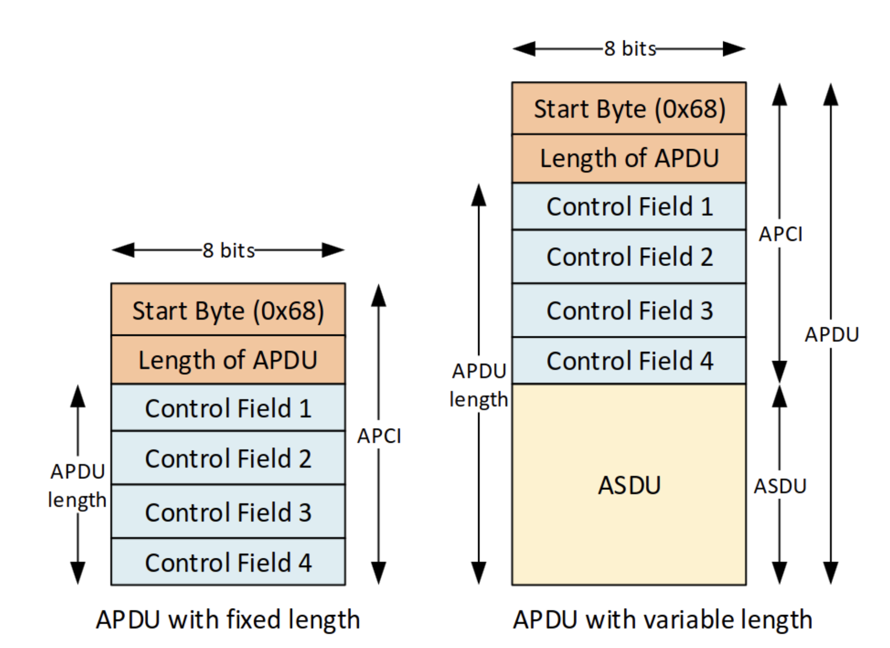
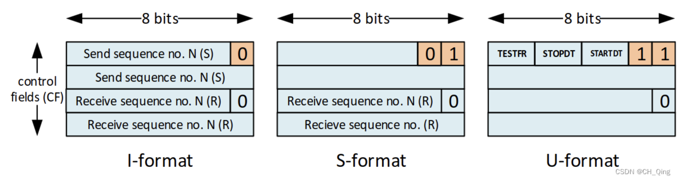
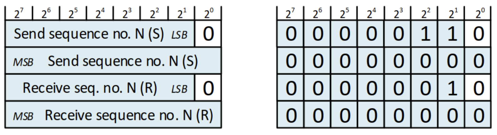
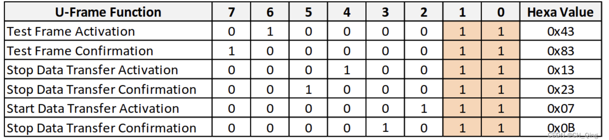

# 1.基本概念

IEC60870-5-104 是一种电力自动化系统中常用的通信协议，使用 TCP/IP协议作为底层通信协议，用于监视和控制电力系统中的各种设备，如变电站、发电机、开关等。


## 1.1控制站/受控制站

IEC104 协议是基于TCP的应用层协议。其架构为client/Server 模式。 

TCP Server 负责和实际的硬件控制，数据采集，命令执行等功能，因此也叫受控制站/分站， IEC101 中还被叫做Slave。

TCP Client 负责远程控制，获取server采集的数据，配置server等，因此也叫控制站，IEC101 中还被叫做Master。


## 1.2平衡/非平衡模式


**非平衡模式：**

在该模式下，只有控制站（client）才能启动一次消息传输，受控站（server） 只能响应控制站（client）的请求。

在这种模式下，控制站（client）通过依次轮询 所控制的 受控站（server）来获取对应的业务数据。


**平衡模式：**

当使用平衡模式传输时，**每个站（client和server）都可以启动消息传输**。

**在IEC104 协议中，平衡模式是最常用的。**


## 1.3基础应用功能


### 1.3.1数据采集

iec104 协议中，**所有的数据都被缓存在受控站中（Server）**，因为数据产生的速度可能会比传输的速度更快。


**非平衡模式下：**受控站（Server）总是等待控制站发送的数据polling请求，并给以回应(一问一答，不问不答)。


**平衡模式下：**受控站（Server）既可以回应 控制站 的各种请求， 也可以当数据产生变化时，或者周期性上报对象值时，主动将对应的数据传输给控制站（client)。 现总结该模式下受控站（Server）的数据采集行为如下：

- 当数据对像的值产生改变时，受控站（Server）主动上报其产生的数据；
- 当周期性上报数据时，受控站（Server）主动上报其产生的数据；
- 回应控制站（client)的控制命令，如总召唤等；
- 回应读请求；


### 1.3.2事件采集

受控站（Server）的应用层级事件会自动发生。其在平衡传输模式和非平衡模式下采集方式和数据采集完全相同。


### 1.3.3召唤

- **总召唤/general interrogation (GI)**
  总召唤命令会请求受控站（Server）中**所有群组的所有数据**对象的值的更新给控制站。
- **群组召唤**
  在受控站（Server）端，数据对象可以通过配置COT的值为20～36来设定数据对象的召唤群组。20代表总召唤，**21～36 分别对应INRO1～INRO16，分别对应16个召唤群组**。控制站（client) 在召唤时，可以通过指定召唤群组，来让该召唤组中的数据对象值更新。


### 1.3.4时钟同步

系统初始化完成后，控制站（client)应该应当发送一次一次时钟同步指令， 此后，通过发送时钟同步命令（C_CS ACT）来周期性地重新同步时钟。


### 1.3.5遥控

**直控命令（Single command）**

**直控命令实际上就是去掉选择命令，直接发执行命令**。一般来说保护压板、保护复归为直控；
直控的一般流程如下: 主站下发执行命令→装置回执行确认报文。


**选控命令（Select and execute）**

**Select 阶段：**
控制站发送一个该命令的Select的操作，受控站会检查该命令该命令是否正确，确认该命令是否已经有正确的执行操作。并把结论返回给控制站。
**execute阶段：**
Select 返回预期时，执行命令。执行完成后， 装置回执行确认报文。


# 2.帧结构

IEC104 基于TCP/IP 传输，是一个应用层协议， 其帧结构被称为 **APDU**，APDU 一般由 APCI 和 ASDU组成。


## 2.1APDU

Application Protocol Data Unit

应用协议数据单元，**也就是一个iec104 的协议帧**的官方叫法。**一个APDU（也就是协议帧），可以只包含一个APCI， 或者 一个APCI + ASDU。**

```shell
APDU = APCI
or
APDU = APCI+ASDU
```

APDU 的最大长度为255byte。


## 2.2APCI

Application Protocol Control Information

应用控制信息，类似于帧头，由一个1byte 的起始字节0x68 + 1 byte ADPU 的长度 + 4 个1 byte控制位域（CF）组成。




APCI中第一个控制位域(CF1)的最低2bit，确定了帧的格式，IEC104定义了三种格式的帧。如下图所示：



### **I-帧 **

**(information transfer format)**, last bit of CF0 是0

它用于控制RTU（server， slave） 和 类SCADA（master， client）之间的信息传输，其位可变长度。

I-format 的数据帧（APDU）总是包含ASDU。

 I-format 的控制位域表明了消息的方向，其包含了两个15bit 的序号数字，每个方向上，每个APDU的**序号数字**都会被**有序的加1**。并且在0～32767之间循环。

- 发送器在发送一个iFrame后，会将发送端的发送序号自动加1，同时将该iFrame保存在发送缓冲区中， 直到它接受到一个ADPU，该APDU中接收序号表明接收到发送端发送的对应发送序号&以下的iFrame，这些iFrame会被从发送缓冲区移除。

- 接受器接收到一个iFrame后，会将接收端的接收序号自动加1，当接收序号到达设定的数量后，会给发送端回应一个sFrame 的Ack。如果在一定的时间内，接收端接收的iFrame 未到达该设定的数量，接收端也会发送一个sFrame的Ack。如果接收端在一定的时间内都处于idle状态，且存在没有回应的iFrame, 接收端就会给其回应一个sFrame的Ack。
- TCP 连接建立后，发送/接收序号应当被置0；

发送/接收序号由CF位域由LSB 和MSB 构成，I-Format的帧序号只有15bit， 如下图所示：



比如：序列0x06 0x00 0x02 0x00 会被解释为N(S) = 3 N(R) = 1。第三个APDU被source发送并且等待接收方的第一个APDU。


### S-帧

**S-format (numbered supervisory functions)**, last bits of CF1 是 01

一般作为一个/多个iFrame的Ack ， 固定APDU 长度。

**S-format APDU 只有APCI， 没有ASDU。**


### U-帧

**U-format (unnumbered control functions)**, last bits of CF2 是 11

被用于有序的控制功能， 固定APDU 长度。

U-format 的APDU只有一个APCI，没有ASDU。其功能包括TESTFR(测试帧), STOPDT (停止数据传输) or STARTDT (开启数据传输，它们可以同时被激活。其CF1的二进制值，如下图所示：



uFrame 用于STARTDT（开启数据传输），STOPDT（关闭数据传输）和TESTFR（测试帧）的激活&确认机制。


**激活数据发送**

**STARTDT和STOPDT 用于client/master去控制Server去开启/关闭数据传输**；

当连接建立时，默认是处于STOPDT状态的。客户端通过这个连接是不能发送仍何用户数据的（uFrame是可以发送的）。

客户端必须发送一个**STARTDT 激活（STARTDT activate）**指令去激活用户数据的传输，服务器端将会回应一个**STARTDT 确认（STARTDT confirm）**消息。

只有client才可以发送STARTDT 激活指令。当连接建立好后，client 才可以向server 发送STARTDT激活指令，该指令只能被发送一次。激活后，该连接才可以在仍何时间发送仍何消息， 直到连接被STOPDT激活指令终止。


**心跳连接**

client & server必须周期性地发送**TESTFR 激活（TESTFR activate）**指令，对应的**TESTFR确认（TESTFR confirm）**帧必须被回应。

在一定的时间内，连接没有数据传输时，client/server 就可以启动这个测试进程。


## 2.3ASDU格式

ASDU包含两个主要的段：**数据单元识别符**（长度固定为6Byte）， 和**数据段**。

**数据段由一个或者多个信息对象构成**。数据单元识别符定义了数据的类型，提供数据标识的寻址，包含额外的信息，如传输原因等。

每一个ASDU可以传输最大127个信息对象。 ASDU 的结构如下：


