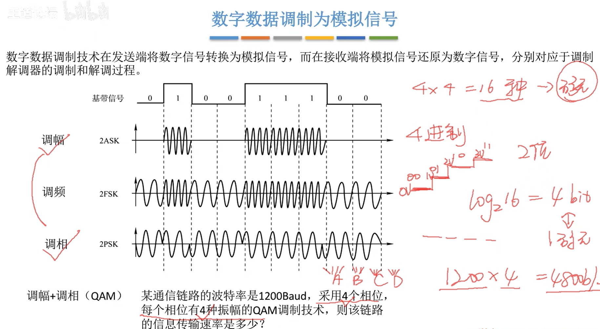
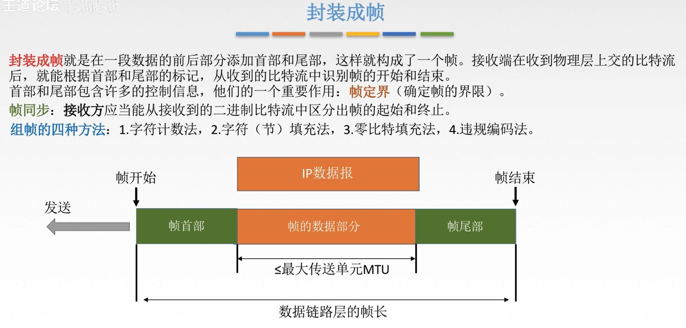
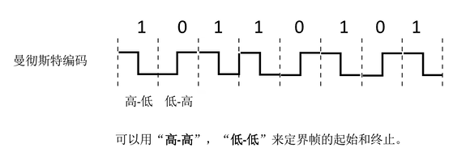
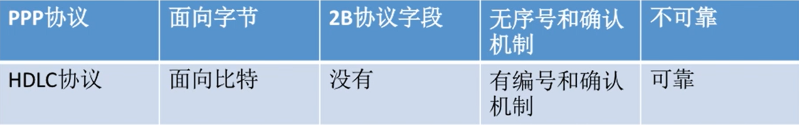
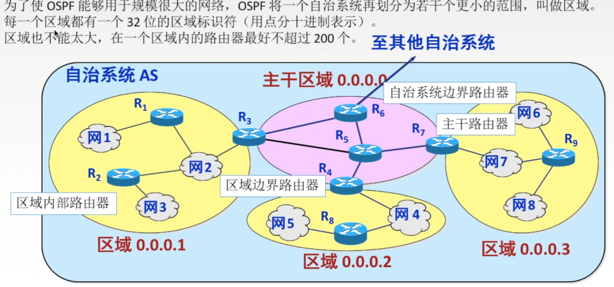
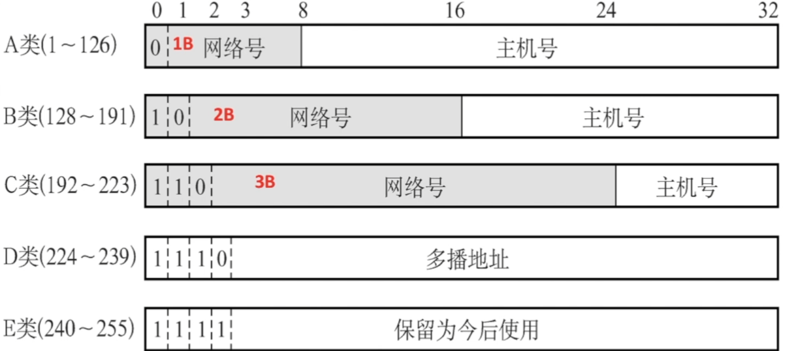
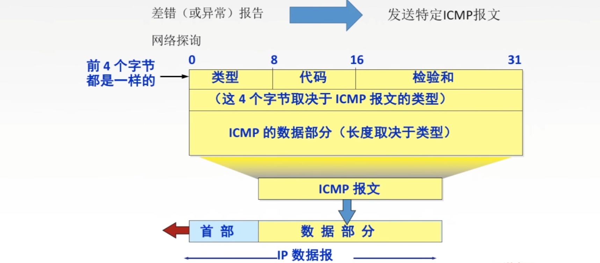
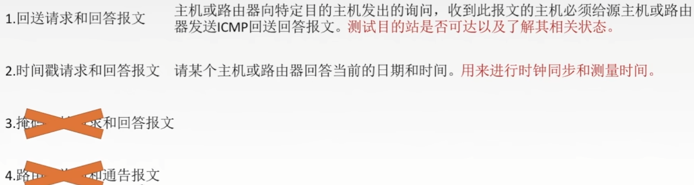

# 数据结构


## **逻辑关系**

**集合：**数据元素属于同一个集合

**线性结构：**数据元素之间存在着**一对一**的**线性关系**

**树型结构：**数据元素之间存在着**一对多**的**层次关系**

**图结构：**数据元素之间存在着**多对多**的**任意关系**


## **存储结构**

**顺序存储结构：**

用一组连续的存储单元依次存储数据元素，数据元素之间逻辑关系由元素的存储位置表示。


**链接存储结构：**

用一组任意的存储单元存储数据元素，数据元素之间的逻辑关系用指针来表示。


数据的逻辑结构属于用户视图，是面向问题的。

数据的存储结构是属于实现的视图，是面向计算机的。


## 算法分析

常见的阶的比较：

Ο(1)＜Ο(log2n)＜Ο(n)＜Ο(nlog2n)＜Ο(n^2)＜Ο(n^3)＜…


各种语句和模块分析应遵循的规则：

1.赋值语句或读写语句：O(1)。

2.语句序列：运行时间由加法确定，该序列中耗时最多的语句的运行时间。

3.分支语句：运行时间由条件测试(通常为O(1))加上分支中运行时间最长的语句的运行时间。


## 线性表

**定义：** 

由n(>=0)个**性质相同**的元素组成的序列。


**特征：**

**有限性：**线性表中数据元素**个数**是有穷的。

**相同性：**线性表中元素**数据类型**是相同的。

**相继性：**a1无前驱，an无后继。


### 线性表的操作

**L**是类型为LIST**线性表实例**。

**x**的**型**为ElemType的元素**实例**。

**p**为**位置变量**。

所有操作描述为：

1. Insert(x,p,L)
2. Locate(x,L)
3. Retrieve(p,L)
4. Delete(p,L)
5. Previous(p,L)
6. Next(p,L)
7. MakeNull(L)
8. First(L)
9. END(L)


### **顺序表**

把线性表的元素按照**逻辑顺序**依次存放在**数组**的**连续**单元内；

再用一个**整形量**表示最后一个元素所在单元的下标，即**表长**。

是一种**随机访问存取**结构，也就是可以随机存取表中的任意元素，其存储位置可由一个简单直观的公式来表示。

```cpp
//类型定义
struct LIST{
    ElemType elements[max];
    int last;
};
//位置类型
typedef int position;
//线性表的实例
LIST L;
//元素和长度
L.elements[p];	//L的第p个元素
L.last; //L的长度，最后元素的位置
```

**时间性能分析：**

因为插入一个元素，后面的元素要向后挪一位。

删除一个元素，后面的元素要向前挪一位，因此：

**最好情况：**

基本语句执行0次，时间复杂度为O(1)。

**最坏情况：**

基本语句执行n次，时间复杂度为O(n)。

**平均情况：**


**缺点：**长度固定，插入和删除麻烦。


### 单链表

一个线性表由若干个结点组成，每个结点含有**两个域**：

1. 存放元素的**信息域**

2. 存放后继结点的**指针域**

***逻辑次序和物理次序不一定相同。***

需要**额外空间**来存储**元素之间的关系**。


**存储结构的定义：**

```cpp
//结点结构
struct celltype{
    ElemType element;
    celltype *next;
};
typedef celltype *LIST; //线性表的型
typedef celltype *position; //位置型
```

**带头结点的单链表：**


好处：无论链表是空还是非空，头结点都存在，而不是null


# 计算机网络


## 物理层

### 基本概念

物理层的主要任务：确定与传输媒体接口有关的一些特性--->定义标准

1. **机械特性：**定义物理连接的特性，规定物理连接时所采用的规格，接口形状，引线数目，引脚数量和排列情况。
2. **电气特性：**规定传输二进制时，线路上信号的电压范围，阻抗匹配，传输速率和距离限制等。
3. **功能特性：**指明某条线上出现的某一电平表示何种意义，接口部件的信号线的用途。
4. **规程特性：**(过程特性)定义各条物理线路的工作规程和时序关系。


**数据通信相关术语：**

**数据：**传送信息的实体，通常是有意义的符号序列。

**信号：**数据的电气/电磁表现形式，是数据在传输过程中的**存在形式**。

**信源：**产生和发送数据的源头。

**信宿：**接收数据的终点。

**信道：**信号的传输媒介。一般用来表示向某一个方向传送信息的介质，因此一条通信路线往往包含一条发送信道和一条接收信道。


**三种通信方式：**

1. 单工通信：只有一个方向的通信而没有反向的交互，仅需要**一条信道**。
2. 半双工通信：通信的双方都可以发送或接收消息，但任何一方都不能同时发送和接收，需要**两条信道**。
3. 全双工通信：通信双方可以同时发送和接收信息，也需要**两条信道**。


**两种传输方式：**

串行传输：速度慢，费用低，适合远距离

并行传输：速度快，费用高，适合近距离


**码元：**

码元是指用一个**固定时长**的**信号波形**(数字脉冲)，代表不同离散数值的基本波形，是数字通信中数字信号的计量单位，这个时长内的信号称为k进制码元，而该时长称为码元宽度。当码元的离散状态有M个时，此时码元为M进制码元。

**1码元可以携带多个比特的信息量**。例如，在使用二进制时，只有两种不同的码元，一种代表0状态，一种代表1状态。

K进制码元---4进制码元 ---> 码元的离散状态有四种 ---> 四种高低不同的信号波形 00, 01, 10, 11


**速率：**

速率也叫数据率，是指数据的**传输速率**，表示单位时间内传输的数据量。可以用**码元传输速率**和**信息传输速率**表示。

**码元传输速率：**表示单位时间内数字通信系统所传输的码元个数(也可以称为信号变化的次数)，单位是**波特**。1波特表示数字通信系统每秒传输一个码元。这里的码元可以是多进制的，也可以是二进制的，但码元速率与进制无关。

**信息传输速率：**别名信息速率，比特率。表示单位时间内数字通信系统传输的二进制码元个数(比特数)，单位是比特/秒。


**带宽：**表示在单位时间内从网络的某一点到另一点所能通过的"**最高数据率**"，常用来表示网络的通信线路所能传输数据的能力。单位是b/s。


### 奈氏准则


影响是真程度的因素：

1. 码元传输速率
2. 信号传输距离
3. 噪声干扰
4. 传输媒体质量


**奈氏准则：**

在理想低通(无噪声，带宽受限)条件下，为了避免码间串扰，极限码元传输速率为2W Baud，W是信道带宽，单位是Hz。


### 香农定理


信噪比 = 信号的平均功率/噪声的平均功率，常记为S/N，并用分贝(dB)作为度量单位，即：


香农定理：在带宽受限且有噪声的信道中，为了不产生误差，信息的数据传输速率有上限值。


### 编码与调制


**注意：**曼彻斯特编码中，每一个码元被调成两个电平，因此数据传输速率只有调制速率的1/2。


**差分曼彻斯特编码：**

常用于局域网传输，其规则是：若码元为1，则前半个码元的电平与上一个码元的后半个码元的电平相同，若为0，则相反。

该编码的特点是：在每个码元的中间，都有一次电平的跳转，可以实现自同步，且抗干扰性强于曼彻斯特编码。





### 传输介质

**导向性传输介质：**

1. **双绞线**
2. **同轴电缆**

基带同轴电缆 --- 用于传输基带数字信号

宽带同轴电缆 --- 用于传送宽带信号

3. **光纤**

光纤通信就是利用光导纤维传递光脉冲进行通信。有光脉冲表示1，无光脉冲表示0。

**特点：**

传输损耗小，中继距离长，对远距离传输特别经济

抗雷电和电磁干扰性能好

无串音干扰，保密性好，也不容易被窃听或截取数据

体积小，重量轻

带宽大，通信量大


**非导向性传输介质：**

1. **无线电波：**信号向所有方向传播
2. **微波：**信号固定方向传播
3. **红外线，激光：**信号固定方向传播


### 物理层设备


## 链路层


**数据链路层功能：**

加强物理层传输原始比特流的功能，将物理层提供的可能出错的物理连接改造成为**逻辑上无差错的数据链路**，使之对网络层表现为一条无差错的链路。


功能1：为网络层提供服务。无确认无连接服务，有确认无连接服务，有确认面向连接服务。(有连接一定有确认)

功能2：链路管理，即连接的建立，维持，释放(用于面向连接的服务)

功能3：组帧

功能4：流量控制。限制发送方速度

功能5：差错控制(帧错/位错)


### 封装成帧




### 透明传输


**1.字符计数法**

帧首部使用一个计数字段(第一个字节，8位)来标明帧内字符数。


**2.字符填充法**


**3.零比特填充法**


**4.违规编码法**




**总结：**

由于字节计数法中Count字段的脆弱性(其值若有差错将导致灾难性后果)及字符填充实现上的复杂性和不兼容性，目前较普遍使用的帧同步法是**比特填充**和**违规编码法**。


### 差错控制

差错从何而来？


#### 1.奇偶校验

给原数据位添加一位，使得：

奇校验："1"的个数为奇数

偶校验："1"的个数为偶数


奇偶校验的特点：只能检查出奇(偶)数个比特错误，检错能力为50%


#### 2.CRC校验

循环冗余简单思想：


**生成多项式：**被除数

**FCS：**冗余码/FCS帧检验序列


**发送端-计算冗余码：**

(1)**加0** ：假设生成多项式G(x)的阶为r，则加r个0。

(2)**模2除法**：(异或)。数据加0后除以多项式，余数为冗余码(FCS)。

最终发送的数据是**原数据后面加上FCS余数**。


**接收端-检验数据：**

接收到的数据除以同样的除数，然后检查得到的余数R。

如果R为0，判定帧无差错，接受。


#### 3.海明码

海明码：**发现双**比特错，**纠正单**比特错


**1.确定校验码位数r**

海明不等式：


r为冗余信息位，k为信息位


**2.确定校验码和数据的位置**


### 流量控制

**较高的发送速度**和**较低的接收能力**的不匹配，会造成传输出错。

链路层的流量控制是点对点的。

传输层的流量控制是端到端的。

**链路层控制手段：**接收方收不下就不回复确认。

**传输层控制手段：**接收端给发送端一个窗口公告。


#### 1.停止等待协议

发送窗口大小=1，接收窗口大小=1

每发送一帧就停止发送，等待对方的确认，在收到确认后再发送下一帧。

 

**为什么要有停止-等待协议？**

除了比特出差错，底层信道还会出现丢包问题。为了实现流量控制。

**研究停止等待协议的前提？**

虽然现在常用全双工通信方式，但为了讨论问题方便，仅考虑一方发送数据，一方接收数据。

**有差错情况：**

**1.数据帧丢失或出错：**


**2.ACK丢失：**


**3.ACK迟到**


**信道利用率：**

发送方在一个发送周期内，有效地发送数据所需要的时间占整个发送周期的比率。

**信道利用率  = (L/C)/T**

T：发送周期，L：T内发送L比特数据，C：发送方数据传输率

信道吞吐率 = 信道利用率 * 发送方的发送速率


#### 2.后退N帧协议(GBN)

发送窗口大小>1，接收窗口大小=1

**停止等待协议的弊端：**信道利用率太低，发送完一帧就得开始等待接收方确认。


**发送窗口：**发送方维持一组连续的允许发送的帧的序号。

**接收窗口：**接收方维持一组连续的允许接收帧的序号。


**GBN发送方必须响应的三件事**

**1.上层的调用**

上层要发送数据时，发送方先检查发送窗口是否已满，如果**未满**，则产生一个帧并将其发送；如果窗口**已满**，发送方只需要将数据返回给上层，暗示上层窗口已满。上层等一会再发送。(实际实现中，发送方可以缓存这些数据，窗口不满时再发送帧)。

**2.收到了一个ACK**

GBN协议中，对n号帧的确认采用**累计确认**的方式，标明接收方已经收到n号帧和它之前的全部帧。

**3.超时事件**

如果出现超时，发送方重传所有已发送但是未被确认的帧。


**接收方要做的事**

如果正确收到n号帧，并且按序，那么接收方为n帧发送一个ACK，并将该帧的数据部分交付给上层。


其余情况都丢弃帧，并为最近按序接收的帧重新发送ACK。接收方无需缓存任何失序帧，只需要维护同一个信息：**expectedseqnum**(下一个按序接收的帧序号)。


**滑动窗口长度**

若采用n个比特对帧编号，那么发送窗口的尺寸应满足：


因为发送窗口尺寸过大，就会使得接收方无法区别新帧和旧帧。


**GBN协议重点总结**

1.累计确认(偶尔捎带确认)。

2.接收方只按序接收帧，不按序就会被丢弃。

3.确认序列号最大的，按序到达的帧。

4.发送窗口最大为2^n - 1，接收窗口大小为1。


#### 3.选择重传协议(SR)

发送窗口大小>1，接收窗口大小>1


**GBN协议的弊端：**累计确认--->批量重传

**解决方法：**设置单个确认，同时加大接收窗口，设置接收缓存，缓存乱序到达的帧。


**SR发送方必须响应的三件事：**

**1.上层的调用**

从上层收到数据后，SR发送方检查下一个可用于该帧的序号，如果序号位于发送窗口内，则发送数据帧。

否则就像GBN一样，要么将数据缓存，要么返回给上层之后再传输。

**2.收到了一个ACK**

如果收到ACK，加入该帧序号在窗口内，则SR发送方将那个被确认的帧标记为已接收。

如果该帧序号是窗口的下界(最左边第一个窗口对应的序号)，则窗口向前移动到具有最小序号的未确认帧处。

如果窗口移动了并且有序号在窗口内的未发送帧，则发送这些帧。


**3.超时事件**

每个帧都有自己的定时器，一个超时事件发生后只重传一个帧。 


**SR接收方要做的事**

**来者不拒(窗口内的帧)：**SR接收方将确认一个正确接收的帧而不管其是否按序。失序的帧将被缓存，并返回给发送方一个该帧的确认帧，直到所有帧都被接收为止。这时才可以将一批帧按序交付给上层，然后向前移动滑动窗口。


**滑动窗口长度**

发送窗口最好等于接收窗口


**SR协议重点总结**

1.对数据帧逐一确认，收一个确认一个

2.只重传出错帧

3.接收方有缓存


### 信道划分介质访问控制

**传输数据使用的两种链路**

**点对点链路：**两个相邻节点通过一个链路相连，没有第三者。

应用：ppp协议，常用于**广域网**。

**广播式链路：**所有主机共享通信介质。

应用：早期的总线以太网，无线局域网，常用于**局域网**。


**介质访问控制：**

就是采取一定的措施，使得两对节点之间的通信不会发生互相干扰的情况。


**信道划分介质访问控制：**

将使用介质的每个设备与来自同一信道的其他设备的**通信隔离开**，把**时域和频域**资源合理地分配给网络上的设备。


**多路复用：**把多个信号组合在一条物理信道上进行传输。


#### 静态划分信道

**频分多路复用FDM**

用户在分配到一定的频带后，在通信过程中自始至终都占用这个频带。**频分复用的所有用户在同样的时间占用不同的带宽(频率带宽)资源。**


**时分多路复用TDM**

将时间划分为一段段等长的时分复用帧。每一个时分复用的用户在每一个TDM帧中占用**固定序号的时隙**，所有用户轮流占用信道。


频分复用 -- "并行"

时分复用 -- ""并发

**改进的时分复用 -- 统计时分复用STDM**


**波分多路复用WDM**

波分多路复用就是**光的频分多路复用**。

在一根光纤中传输多种不同波长(频率)的光信号，由于波长(频率)不同，所以各路光信号互不干扰。

最后再用波长分解复用器将各路波长分解出来。


**码分多路复用**

码分多址**(CDMA)**是码分复用的一种方式。

一个比特分为多个码片/芯片(chip)，每一个站点被指定一个唯一的m位的芯片序列。

发送1时站点发送芯片序列，发送0时发送芯片序列反码。

**如何不打架：**多个站点同时发送数据的时候，要求各个站点芯片序列相互正交。

**如何合并：**各路数据在信道中被线性相加。

**如何分离：**合并的数据和源站**规格化内积**。


#### 动态分配信道

动态媒体接入控制/多点接入。

特点：信道并非在用户通信时固定分配给用户。


**随机访问介质访问控制**

所有用户可随机发送信息，发送信息时占全部带宽。(冲突)


##### ALOHA

纯ALOHA协议思想：不监听信道，不按时间槽发送，随机重发。

**冲突如何检测？**

如果发生冲突，接收方在就会检测出差错，然后不予确认，发送方在一定时间内收不到就判断发生冲突。

**冲突如何解决？**

超时后等以随机时间再重传。


**时隙ALOHA协议**

协议思想：把时间分成若干个相同的时间片，所有用户在时间片开始时刻同步接入网络信道，若发生冲突，则必须等到下一个时间片开始时刻再发送。控制想发就发的随意性。


**关于ALOHA要知道的事**

1.纯ALOHA比时隙ALOHA吞吐量更低，效率更低。

2.纯ALOHA想法就发，时隙ALOHA只有在时间片段开始时才能发。


##### CSMA

载波监听多路访问协议CSMA (carrier sense multiple access)


CS：载波监听，每一个站在发送数据之前要检测一下总线上是否有其他计算机在发送数据。

根据总线上的电压摆动值来判断是否有超过2个站在发送数据。


**CSMA协议思想：**在发送帧之前，监听信道。


**1-坚持CSMA思想：**如果一个主机要发送消息，那么先监听信道。

​	空闲则直接传输，不必等待。

​	忙则一直监听，直到空闲马上传输。

如果有冲突(一段时间内未收到肯定回复)，则等待一个随机时长再监听，重复上述过程。

**优点：**只要媒体空闲，站点就会马上发送，避免了媒体利用率的损失。

**缺点：**假如有两个或以上的站点有数据要发送，冲突就不可避免。


**非坚持CSMA：**

非坚持指的是对于监听信道**忙**之后就不继续监听。

非坚持CSMA思想：如果一个主机要发送消息，那么它先监听信道。

空闲则直接传输，不必等待。

忙则等待一个随机的时间之后再进行监听。

**优点：**采用随机的重发延迟时间可以比较少冲突发生的可能性。

**缺点：**可能存在大家都在延迟等待过程中，使得媒体可能处于空闲状态，媒体使用率降低。


**p-坚持CSMA：**

p-坚持指的是对于监听信道空闲的处理。

p-坚持CSMA思想：如果一个主机要发送消息，那么它先监听信道。

空闲则以p概率直接传输，不必等待；概率1-p等待到下一个时间槽再传输。

忙则等待一个随机的时间之后再进行监听。

**优点：**技能像非坚持算法一样减少冲突，又能像1-坚持算法那样减少媒体空闲时间。

但是：发生冲突后还是要坚持把数据帧发送完，造成了浪费。


**三种CSMA对比总结**


##### CSMA-CD

载波监听多点接入/碰撞检测CSMA/CD 

(carrier sense multiple access with collision detection)

**CS：**载波监听，每一个站点在**发送数据之前**以及**发送数据时**都要检测一下总线上是否有其他计算机在发送数据。

**MA：**多点接入，表示许多计算机以多点接入的方式连接在一根总线上。

**CD：**碰撞检测，边发送边监听，适配器变发送数据边检测信道上信号电压的变化情况，以便判断自己在发送数据时其他站是否也在发数据。


**传播时延对载波监听的影响**


**如何确定碰撞后的重传时机？**

截断二进制指数规避算法：

1.确定基本退避时间为争用期2τ

2.定义参数k，它等于重传次数，但k不超过10，即k=min[重传次数,10]。当重传次数不超过10时，k等于重传次数。当重传次数超过10时，k就不再增大一直等于10。

3.从离散的整数集合[0,1,2^k - 1]中随机取出一个数r，重传所需要的退避时间就是r倍的基本退避时间，即2rτ。

4.当重传达到**16**次仍不能成功时，说明网络太拥挤，认为此帧永远无法正确发出，抛弃此帧并向高层报告出错。


**最小帧长问题**


以太网规定最短帧长为64B，凡是长度小于64B的都是由于冲突而异常终止的无效帧。


##### CSMA-CA

载波监听多点接入/碰撞避免CSMA/CA (carrier sense multiple access with collision avoidance)

**CA：**使用于无线局域网。


**CSMA-CA工作原理**

1.发送数据前，先检测信道是否空闲。

2.空闲则发出**RTS**(request to send)，RTS包括发射端地址，接收端地址，下一份数据将持续发送的时间等信息；信道忙则等待。

3.接收端接收到RTS后，将响应**CTS**(clear to send)。

4.发送端收到CTS后，开始**发送数据帧**(同时预约信道：发送方告知其他站点自己要传多久数据)。

5.接收端接收到数据帧后，将用CRC检验数据是否正确，正确则响应**ACK帧**。

6.发送方收到ACK就可以进行下一个数据帧的发送，若没有则一直重传至规定重发次数为止(采用**二进制指数规避算法**来确定随机的推迟时间)。


**CSMA-CD和CSMA-CA比较**

相同点：

都属于CSMA的思路，其核心是先听再说。两个在接入信道之前都需要进行监听。当发现信道空闲后，才能进行接入。	

不同点：

**1.传输介质不同：**CSMA-CD用于**总线式以太网**，而CSMA-CA用于**无线局域网**。

**2.载波检测方式不同：**因传输介质不同，两种检测方式也不同。CSMA-CD通过电缆中电压的变化来检测，当数据发生碰撞时，电缆中的电压就会随着发生变化；而CSMA-CA采用能量检测，载波检测和能量载波混合检测三种检测信道空闲的方式。

3.CD协议检测冲突，CA协议避免冲突，二者出现冲突后都会进行**有限的重传**。


#### 介质访问控制

信道划分介质访问控制(MAC Multiple Control)协议：

​	基于**多路复用**技术划分资源。

​	**网络负载重：**共享信道效率高，且公平

​	**网络负载轻：**共享信道 效率低。


随机访问MAC协议：（**冲突**）

​	用户根据意愿随机发送信息，发送信息时可独占信道带宽。	

​	网络负载重：产生冲突开销

​	网络负载轻：共享信道效率高，单个节点可利用信道全部带宽。


轮询访问MAC协议/轮流协议/轮转访问MAC协议：

既要**不产生冲突**，又要发送时**占全部带宽**。

**1.轮询协议**


问题：

1.轮询开销

2.等待延迟

3.单点故障


**2.令牌传递协议**

令牌：一个特殊格式的MAC控制帧，不含任何信息。控制信道的使用，确保同一时刻只有一个节点独占信道。

每个节点都可以在**一定的时间内**获得**发送数据的权利**。

问题：

1.令牌开销

2.等待延迟

3.单点故障

应用于令牌环网(物理星型拓扑，逻辑环形拓扑)。

采用令牌传送方式的网络常用于负载较重，通信量较大的网中。


### PPP协议

点对点协议**PPP(Point-to-Point Protocol)**是目前使用最广泛的数据链路层协议，用户使用拨号电话接入因特网时一般都是用PPP协议。

只支持全双工链路。


**PPP协议的三个组成部分**

1.一个将IP数据报封装到串行链路(同步串行/异步串行)的方法。

2.链路控制协议**LCP**：建立并维护数据链路连接。(身份验证)

3.网络控制协议**NCP**： ppp可支持多种网络控制协议，每个不同的网络层协议	都要一个相应的NCP来配置，为网络层协议建立和配置逻辑连接。


#### **PPP协议的帧格式**


### HDLC协议

高级数据链路控制协议(High-Level Data Link Control)，是一个在同步网上传输数据，**面向比特的数据链路层协议**。

数据报文可透明传输，用于实现透明传输的**"0比特插入法"**易于硬件实现。

采用全双工通信

所有帧采用CRC检验，对信息帧进行顺序编号，可防止漏收或重份，传输可靠性高。


#### HDLC的站

**主站，从站，复合站**

主站：主要功能是发送命令帧，接收响应帧。

从站：主要功能是接收由主站发来的命令帧，向主站发送响应帧。

复合站：主要功能是既能发送，又能接收命令帧和响应帧，负责整个链路控制。


**三种数据操作方式：**

1.正常响应方式

2.异步平衡方式

3.异步响应方式


#### HDLC的帧格式





### 链路层设备

#### **物理层扩展以太网**

1.

2.


#### **链路层扩展以太网**

**网桥&交换机**

**网桥**根据**MAC帧的目的地址**对帧进行**转发**和**过滤**。当网桥收到一个帧时，并不向所有接口转发此帧，而是先检查此帧的目的MAC地址，然后再确定将该帧转发到哪一个接口，或者是把它丢弃。


**透明网桥：**透明是指以太网上的站点并不知道所发送的帧将经过哪几个网桥，是一种即插即用设备--自学习。


**源路由网桥：**在发送帧时，把详细的最佳路由信息(路由最少/时间最短)放在帧的首部中。

**方法：**源站以广播方式向欲通信的目的站发送一个**发现帧**。


**多接口网桥 -- 以太网交换机**


**直通式交换机**

查完目的地址就立刻转发。

延迟小，可靠性低，无法支持具有不同速率的端口的交换。

**存储转发式交换机**

将帧放入高速缓存，并检查是否正确，正确则转发，错误则丢弃。

延迟大，可靠性高，可以支持具有不同速率的端口的交换。


#### **冲突域和广播域**

**冲突域：**在同一个冲突域中的每一个节点都能收到所有被发送的帧。简单的说就是同一时间内只能有一台设备发送信息的范围。

**广播域：**网络中能接受任一设备发出的广播帧的所有设备的集合。简单的说如果一个站点发出一个广播信号，所有能接受到这个信号的设备范围称为一个广播域。


## 网络层

主要任务是把**分组**从源端传到目的端，为分组交换网上的不同主机提供通信服务。网络层传输单位是**数据报**。

**功能1：**路由选择与分组转发(最佳路径)

**功能2：**异构网络互联

**功能3：**拥塞控制

若所有节点都来不及接受分组，而要丢弃大量分组的话，网络就处于**拥塞**状态。因此要采取一定措施，缓解这种拥塞。

解决方法1：开环控制(静)

解决方法2：闭环控制(动)


### 局域网

Local Area Network：简称LAN，是指在**某一区域内**由多台计算机互联形成的计算机组，使用**广播信道**。


**特点：**

1.覆盖的地理范围较小，只在一个相对独立的局部范围内联，如一座集中的建筑群内。

2.使用专门铺设的传输介质(双绞线，同轴电缆)进行联网，数据传输速率高(10Mb/s ~ 10Gb/s)。

3.通信延迟时间短，误码率低，可靠性高。

4.各站为平等关系，共享传输信道。

5.多采用分布式控制和广播式通信，能进行广播和组播。

决定局域网的主要要素：**网络拓扑**，**传输介质**与**介质访问控制方法**。	


**局域网拓扑结构**


**局域网传输介质**

有线局域网：双绞线，同轴电缆，光纤...

无线局域网：电磁波


**局域网介质访问控制方法**

**1.CSMA/CD：**常用于总线型局域网，也用于树形网络

**2.令牌总线：**常用于总线型局域网，也用于树形网络

它是把总线型或树形网络中的各个工作站按**一定顺序**(如接口地址大小)排列形成一个逻辑环。只有令牌持有者才能控制总线，才有发送信息的权力。

**3.令牌环：**用于环形局域网，如令牌环网


**局域网的分类**

**1.以太网：**采用IEEE802.3标准。物理拓扑为星型/扩展星型，逻辑上是环型。

**2.令牌环网：**物理上采用星型，逻辑上是环形(过时)

**3.FDDI网(Fiber Distributed Data Interface)：**物理上采用双环拓扑结构，逻辑上是环型拓扑结构。

**4.ATM网(Asynchronous Transfer Mode)：**较新型的单元交换技术，使用53字节固定长度的单元进行交换。

**5.无线局域网(Wireless Local Area Network，WLAN)：**采用IEEE802.11标准。


**IEEE802标准**

局域网，城域网标准。广泛使用的有以太网，令牌环网，无线局域网等。

IEEE802.3：**以太网介质访问控制**协议(CSMA/CD)及物理层技术规范。

IEEE802.5：**令牌环网**(Token-Ring)的介质访问控制协议及物理层技术规范。

IEEE802.8：**光纤**技术咨询组，提供有关光纤联网的技术咨询。

IEEE802.11：**无线局域网(WLAN)**的介质访问控制协议及物理层技术规范。


**MAC子层和LLC子层**

IEEE802标准所描述的局域网参考模型只对应OSI参考模型的**数据链路层和物理层**，它将数据链路层划分为**逻辑链路层LLC子层**和**介质访问控制MAC子层**。


**逻辑链路层LLC子层：**

LLC负责识别网络层协议，然后对它们进行封装。

LLC报头告诉数据链路层一旦帧被接收到时，应该对数据包做什么处理。

为网络层提供服务：无确认无连接，面向连接，带确认无连接，高速传送。	


**MAC子层：**

数据帧的封装和卸装，帧的寻址和识别，帧的接收与发送，链路的管理，帧的差错控制等。

MAC子层的存在屏蔽了不同物理链路种类的差异性。


### 以太网

以太网是指**基带总线局域网规范**。以太网使用**CSMA/CD**技术。

以太网在局域网各种技术中占统治地位：

1.造价低廉

2.是应用最广泛的局域网技术

3.比令牌环网，ATM网便宜简单

4.满足网络速率要求：10Mb/s ~ 10Gb/s


**以太网提供的无连接，不可靠的服务**

**无连接：**发送方和接收方之间无"握手过程"。

**不可靠：**不对发送方的数据帧编号，接收方不向发送方进行确认，差错帧直接丢弃，差错纠正由高层负责。

以太网只实现无差错接收，不实现可靠传输。


**以太网传输介质与拓扑结构的发展**


#### 10BASE-T以太网

10BASE-T是传送**基带信号**的双绞线以太网，T表示采用双绞线，现10BASE-T	采用的是**无屏蔽双绞线**(UTP)，传输速率是**10Mb/s**。


#### 适配器和MAC地址

计算机与外界有局域网的连接是通过**通信适配器**的。


在局域网中，硬件地址又称为物理地址，或MAC地址。

**MAC地址：**每个适配器有一个全球唯一的48位二进制地址，前24位代表厂家(由IEEE规定)，后24位厂家自己指定。常用6个十六进制数表示。


#### 以太网MAC帧


#### 高速以太网

速率>= 100Mb/s的以太网称为高速以太网。

**1.100BASE-T以太网**

在双绞线上传送100Mb/s基带信号的星型拓扑以太网，仍使用IEEE802.3的CSMA/CD协议。支持全双工和半双工，可在全双工方式下工作而无冲突。

**2.吉比特以太网**

在**光纤或双绞线**上传送1Gb/s信号。

支持全双工和半双工，在全双工方式下工作而无冲突。

**3.10吉比特**

10吉比特以太网在**光纤**上传送10Gb/s信号。只支持全双工，无争用问题。


### 无线局域网

IEEE802.11是**无线局域网**通用的标准，它是由IEEE所定义的无线网络通信的标准。


**802.11的MAC帧头格式**


无线局域网分两类：

1.有固定的基础设施的无线局域网

2.无固定的基础设施的自组织网络


### 广域网

广域网(**WAN**，Wide Area Network)，通常跨接很大的物理范围，所覆盖的范围从几十到几千公里，它能连接多个城市或国家，或跨越几个洲并能提供远距离通信，形成国际性的远程网络。

广域网的通信子网主要使用**分组交换**技术。广域网的通信子网可以利用公用分组交换网，卫星通信网和无线分组交换网，它将分布在不同地区的**局域网或计算机系统**互联起来，达到**共享资源**的目的。

因特网是世界范围内最大的广域网。


局域网只覆盖链路层和物理层。


### 数据交换方式


**为什么要数据交换？**


#### 电路交换


**特点：**独占资源。

**优点：**通信时延小，有序传输，没有冲突，实时性强

**缺点：**建立连接时间长，线路独占，灵活性差，无差错控制能力


#### 报文交换

**报文：**源应用发送的信息整体。


**优点：**

1.无需建立连接

2.存储转发，动态分配路线

3.线路可靠性较高

4.线路利用率较高

5.多目标服务

**缺点：**

1.有存储转发时延

2.报文大小不定，需要网络节点有较大缓存空间


#### **分组交换**

**分组：**把大的数据块分割成小的数据块。


**优点：**

1.无需建立连接

2.存储转发，动态分配路线

3.线路可靠性较高

4.线路利用率较高

5.相对于报文交换，存储管理更加容易

**缺点：**

1.有存储转发时延

2.需要传输额外的信息量

3.乱序到目的主机时，需要对分组排序重组


**报文交换&分组交换**


**三种数据交换方式比较总结**


**几种传输单元名词解析**


##### 数据报方式

为网络层提供**无连接服务**。

**无连接服务：**不事先为分组的传输确定传输路径，每个分组独立确定传输路径，不同分组传输路径可能不同。

**每个分组携带源和目的地址**

**路由器根据分组的目的地址转发分组：**基于路由协议/算法构建转发表；检索转发表；每个分组独立选路。


##### 虚电路方式

为网络层提供**连接服务**。

**连接服务：**首先为分组的传输确定传输路径(建立连接)，然后沿改路径传输系列分组，系列分组传输路径相同，传输结束后拆除连接。

**虚电路：**一条源主机到目的主机类似于电路的路径(逻辑连接)，路径上所有节点都要维持这条虚电路的建立，都维持一张虚电路表，每一项记录了一个打开的虚电路的信息。


**数据报&虚电路**


### 路由算法

**最佳路由**："最佳"只能是相对于某一种特定要求下得出的较为合理的选择而已。


**路由算法的分类**


**分层次的路由选择协议**

1.因特网规模很大

2.很多单位不想让外界知道自己的路由选择协议，但还想连入因特网


**自治系统AS：**在单一的技术管理下的一组路由器，而这些路由器使用一种AS内部的路由选择协议和共同的度量已确定分组在该AS内的路由，同时还使用一种AS之间的路由协议以确定在AS之间的路由。

一个AS内的所有网络都属于一个行政单位来管辖，一个自治系统的所有路由器在本自治系统内都必须连通。


**路由选择协议分类**


#### RIP协议

RIP是一种分布式的基于**距离向量**的路由选择协议，是因特网的协议标准，最大优点是**简单**。

RIP协议要求网络中每一个路由器都维护从**它自己到其他每一个目的网络的唯一最佳距离纪录**(即一组距离)。

**距离：**通常为跳数，即从源端口到目的端口所经过的路由器个数，经过一个路由器条数加1.特别的，从一路由器到直接连接的网络距离为**1**。RIP允许一条路由最多只能包含**15**个路由器，因此距离为**16表示网络不可达**。


RIP协议只适用于小型互联网。


1.仅和**相邻路由**器交换信息。

2.路由器交换的信息是**自己的路由表**。

3.每**30秒**交换一次路由信息，然后路由器根据新信息更新路由表。若超过180s没有收到邻居路由器的通告，则判定邻居没了，并更新自己路由表。

路由器刚开始工作时，只知道直接连接网络的距离，接着每一个路由器也只和数目非常有限的相邻路由器交换并更新路由信息。

经过若干次更新后，所有路由器最终都会知道到达本自治系统任何一个网络的最短距离和下一跳路由器的地址，即**"收敛"**。


**距离向量算法**

1.修改相邻路由器发来的RIP报文中**所有表项**。

对地址为**X**的相邻路由器发来的RIP报文，修改此报文中的所有项目：把下一跳字段中的地址改为X，并把**所有的"距离"字段+1**。


2.对修改后的RIP报文中的每一个项目，进行以下步骤：

(1)R1路由表中若没有Net3，则把该项目填入R1路由表

(2)R1路由表中若有Net3，则查看下一跳路由器地址：

​	若下一跳是X，则用收到的项目替换源路由表中的项目；

​	若下一跳不是X，原来距离比从X走的距离远则更新，否则不作处理。

3.若180s还没有收到相邻路由器X的更新路由表，则把X记为不可达的路由器，即把距离设置为16。

4.返回。


**RIP协议报文格式**


#### OSPF协议

开发最短路径优先OSPF协议。

OSPF最主要的特征就是使用分布式的**链路状态协议**。


**OSPF特点：**

1.使用**洪泛法**向自治系统内**所有路由器**发送信息，即路由器通过输出端口向所有相邻的路由器发送信息，而每一个相邻路由器又再次将次信息发往其所有的相邻路由器。

2.发送的信息就是与本路由器**相邻的所有路由器的链路状态**(本路由器和哪些路由器相邻，以及该链路的度量/代价--费用，距离，时延，带宽等)。

3.只有当**链路状态发生变化**时，路由器才向所有路由器洪泛发送此信息。

最后，所有路由器都能建立一个**链路状态数据库**，即**全网拓扑图**。


**链路状态路由算法**

1.每个路由器发现它的邻居节点[HELLO问候分组]，并了解邻居节点的网络地址。

2.设置到它的每个邻居的成本度量metric。

3.构造[DD数据库描述分组]，向邻站给出自己的链路状态数据库中的所有链路状态项目的摘要信息。

4.如果DD分组中的摘要自己都有，则邻站不作处理；如果没有的或是更新的，则发送[LSR链路状态请求分组]请求自己没有的和比自己更新的信息。

5.收到邻站的LSR分组后，发送[LSU链路状态更新分组]进行更新。

6.更新完毕后，邻站返回一个[LSAck链路状态确认分组]进行确认。

只要一个路由器的链路状态发生变化：

5.泛洪发送[LSU链路状态更新分组]进行更新。

6.更新完毕后，其他站返回一个[LSAck链路状态确认分组]进行确认。

7.使用Dijkstra根据自己的链路状态数据库构造到其他节点的最短路径。


**OSPF的区域**




**OSPF分组**


**OSPF其他特点**

1.每隔**30min**，刷新一次数据库中的链路状态。

2.由于一个路由器的链路状态只涉及到与相邻路由器的连通状态，因而与整个互联网的规模并无直接关系。因此当**互联网规模很大**时，OSPF 协议要比距离向量协议 RIP 好得多。

3.OSPF不存在坏消息传的慢的问题，它的**收敛速度很快**。


#### **BGP协议**

外部网关协议典型代表：BGP协议


**BGP协议交换信息的过程**

BGP 所交换的网络可达性的信息就是要到**达某个网络所要经过的一系列 AS**。当 BGP 发言人互相交换了网络可达性的信息后，各 BGP 发言人就根据所采用的策略从收到的路由信息中找出到达各 AS 的较好路由。


**BGP协议交换信息的过程**

主干网还可发出通知：“要达到网络N5,N5,N6,N7可沿路径(AS1,AS2)”。


**BGP协议报文格式**

一个BGP 发言人与其他自治系统中的 BGP 发言人要交换路由信息，就要**先建立TCP 连接**，即通过TCP传送，然后在此连接上交换 BGP 报文以建立 BGP 会话(session)，利用 BGP 会话交换路由信息


**BGP协议的特点**

BGP 支持 **CIDR**，因此BGP 的路由表也就应当包括目的网络前缀、下一跳路由器，以及到达该目的网络所要经过的各个自治系统序列。

在 BGP 刚刚运行时，BGP 的邻站是交换整个的 BGP 路由表。但以后只需要在**发生变化时更新有变化的部分**。这样做对节省网络带宽和减少路由器的处理开销都有好处。


**BGP4的四种报文**

**1.OPEN报文：**用来与相邻的；另一个BGP发言人建立关系，并认证发送方。

**2.UPDATE报文：**通告新路径或撤销原路径。

**3.KEEPALIVE报文：**在无UPDATE时，周期性证实邻站的连通性，也作为OPEN的确认。

**4.NOTIFICATION报文：**报告先前报文的差错，也被用于关闭连接。


**三种协议比较**


**三种路由协议比较**


### IP协议

**TCP/IP协议栈**


#### **数据报格式**


TCP协议字段值：6

UDP协议字段值：17


#### 数据报分片


**最大传送单元MTU**

链路层数据帧可封装数据的上限。

以太网的MTU是1500字节。

如果所传送的数据报长度超过某链路的MTU值：则使用分片。


总长度是1B

片偏移单位是8B

首部长度是4B


#### IPv4地址


**分类的IP地址**

**IP地址：**全世界唯一的**4字节标识符**，标识路由器主机的接口。

IP地址::={<网络号>,<主机号>}

点分十进制：11011111000000010000000100000001=223.1.1.1


**IP地址分类**





**特殊IP地址**


**私有IP地址**


#### NAT网络地址转换

网络地址转换**NAT**(Network Address Translation)：在**专用网**连接到**因特网**的路由器上安装NAT软件，安装了NAT软件的路由器叫**NAT路由器**，它至少有一个有效的**外部全球IP地址**。

 


#### 子网划分

分类的IP地址的弱点：

1.IP地址空间的利用率有时很低。

2.两级IP地址不够灵活。


解决方法：子网划分


**子网掩码**

只要是网络号就写全1，只要是主机号就写全0


子网掩码与IP地址逐位相与，就得到了子网网络地址。


**特殊十进制数对应的二进制数：**


**使用子网时分组的转发**


#### **无分类地址CIDR**

误分类域间路由选择CIDR：

1.消除了传统的A,B,C类地址以及划分子网的概念。


CIDR记法：IP地址后加上"/"，然后写上网络前缀的位数。e.g. 128.14.32.0**/20**


2.融合子网地址与子网掩码，方便子网划分。

CIDR把**网络前缀都相同**的连续IP地址组成一个"CIDR地址块"。

128.14.35.7/20是某CIDR地址块中的一个地址。


**构成超网**

将多个子网聚合成一个较大的子网，叫做构成超网，或路由聚合。

方法：将网络前缀缩短。


**最长前缀匹配**

使用CIDR时，查找路由表可能得到几个匹配结果，应选择具有最长网络前缀的路由。前缀越长，地址块越小，路由越具体。


#### ARP协议

由于在实际网络的链路上传送数据帧时，最终**必须使用MAC地址**。

**功能：**完成主机或路由器IP地址到MAC地址的映射（解决下一跳走哪的问题）


**ARP协议使用过程：**

检查**ARP高速缓存**，有对应表项则写入MAC帧，没有则用目的MAC地址为FF-FF-FF-FF-FF-FF的帧封装并**广播ARP请求分组**，**同一局域网中**所有主机都能收到该请求。目的主机收到请求后就会向源主机单播一个ARP响应分组，源主机收到后将此映射写入ARP缓存(10-20min更新一次)。


**ARP协议4种典型情况：**

1.主机A发给**本网络**上的主机B：用ARP找到主机B的硬件地址。

2.主机A发给**另一网络**上的主机B：用ARP找到本网络上的一个路由器(网关)的硬件地址。

3.路由器发给**本网络**的主机A：用ARP找到主机A的硬件地址。

4.路由器发给**另一网络**上的主机B：用ARP找到本网络上的一个路由器的硬件地址。


**发送数据的过程**


#### DHCP协议


**主机如何获得IP地址？**


动态主机配置协议DHCP是**应用层**协议，使用**客户/服务器**方式，客户端和服务端通过**广播**方式进行交互，基于**UDP**。DHCP提供**即插即用**联网的机制，主机可以从服务器动态获取IP地址，子网掩码，默认网关，DNS服务器名称和IP地址，允许**地址重用**，支持**移动用户加入网络**，支持在用**地址续租**。


**DHCP工作流程**


#### ICMP协议

网际控制报文协议ICMP

ICMP协议支持主机或路由器：




##### **ICMP差错报告报文**


**ICMP差错报告报文数据字段**


**不应发送ICMP差错报文的情况**

1.对**ICMP差错报告报文**不再发送ICMP差错报告报文。

2.对一个分片的数据报片的所有**后续数据报片**都不发送ICMP差错报告报文。

3.对具有**组播地址**的数据报都不发送ICMP差错报告报文。

4.对具有特殊地址(如127.0.0.1或0.0.0.0)的数据报不发送ICMP差错报告报文。


##### ICMP询问报文




**ICMP的应用**


#### IPv6

**为什么使用IPv6？**


**IPv6数据报格式**


**IPv6和IPv4**


**IPv6地址表示形式**


**IPv6基本地址类型**

 


**IPv4向IPv6过度的策略**


#### IP组播


**IP组播地址**


##### 硬件组播

同单播地址一样，组播IP地址也需要相应的组播MAC地址在本地网络中实际传送帧。组播MAC地址以十六进制值**01-00-5E**打头，余下的6个十六进制位是根据IP组播组地址的最后23位转换得到的。

TCP/IP协议使用的以太网多播地址的范围是：


##### IGMP协议

网际组管理协议IGMP


**IGMP工作的两个阶段**


##### 组播路由选择协议

组播路由协议目的是找出以源主机为根节点的组播转发树。

构造树可以避免在路由器之间兜圈子。

对不同的多播组对应于不同的多播转发树；同一个多播组，对不同的源点也会有不同的多播转发树。


**组播路由选择协议常使用的三种算法：**

基于链路状态的路由选择

基于距离-向量的路由选择

协议无关的组播(稀疏/密集)


#### 移动IP

**动态IP：**通过使用DHCP协议，在一个局域网内部的一台主机可以动态的获得一个IP地址。


**移动IP：**移动IP技术是移动结点(计算机/服务器)以**固定的网络IP地址**，实现跨越不同网段的**漫游**功能，并保证了基于网络IP的网络权限在漫游过程中不发生任何改变。


**移动结点：**具有永久IP地址的移动设备。

**归属代理(本地代理)：**一个移动结点拥有的就“居所”称为归属网络，在归属网络中代表移动节点执行
移动管理功能的实体叫做归属代理。

**外部代理(外地代理)：**在外部网络中帮助移动节点完成移动管理功能的实体称为外部代理。

**永久地址 (归属地址/主地址) ：**移动站点在归属网络中的原始地址。

**转交地址 (辅地址) ：**移动站点在外部网络使用的临时地址。


**移动IP通信过程**


### 网络层设备


#### 路由器

路由器是一种有多个输入端口和多个输出端口的专用计算机，其任务是转发分组。


**输入端口对线路上收到的分组的处理**


**输出端口将交换结构传送来的分组发送到线路**


若路由器处理分组的速率赶不上分组进入队列的速率，则队列的存储空间最终必定减少到0，这就使后面再进入队列的分组由于没有存储空间而只能被丢弃。

路由器中的输入或输出队列产生溢出是造成分组丢失的重要原因。


**三层设备的区别**


**路由表与路由转发**

路由表根据**路由选择算法**得出的，主要用途是路由选择，总用软件来实现。


转发表由路由表得来，可以用软件实现，也可以用特殊的硬件来实现。转发表必须包含完成转发功能所必需的信息，在转发表的每一行必须包含从要到达的目的网络到输出端口和某些MAC地址信息的映射。


## 传输层


