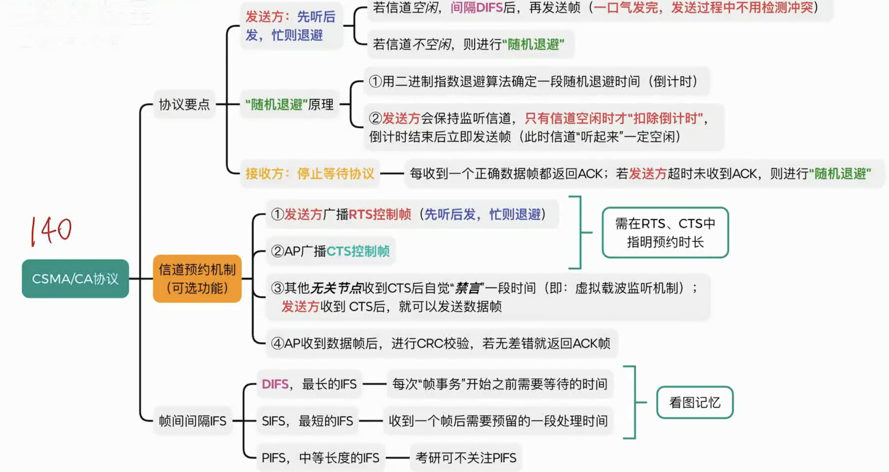
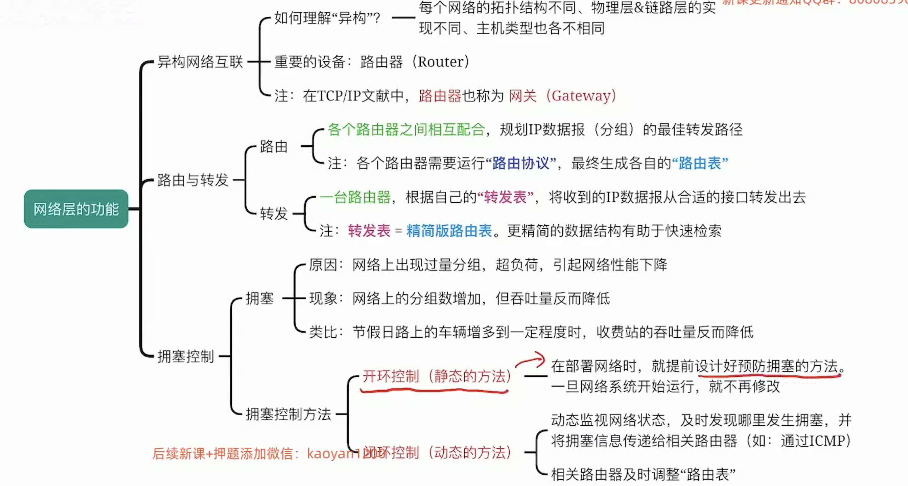
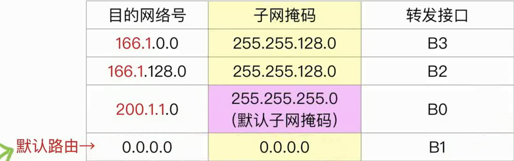
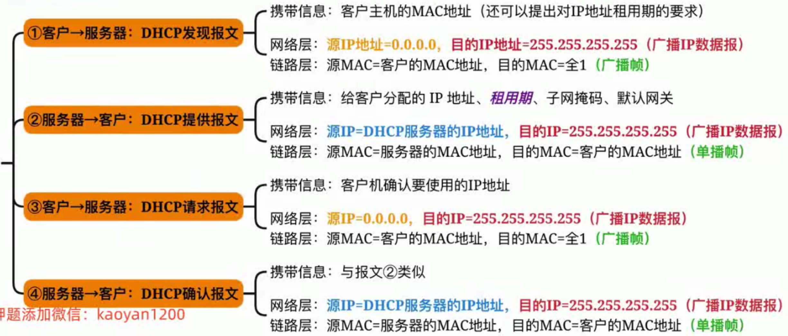

# 计算机网络

## 1.计算机网络体系结构

### **1.1计算机网络的概念**

计算机网络是将一个众多**分散的，自治的**计算机系统，通过通信设备与线路连接起来，由功能完善的软件实现**资源共享**和**信息传递**的系统。

**计算机网络，互连网，互联网的区别**

**计算机网络(Computer Networking)：**由若干**结点(node)**和连接这些结点的**链路(link)**组成。

结点可以是计算机，交换机，路由器等。

链路可以是有线链路，无线链路。

**互连网(internet)：**

可以把两个或多个计算机网络互相连起来，形成规模更大的计算机网络，也可成为**"互连网"**。

**互联网(Internet)：**

ISP：Internet Service Provider，即互联网服务提供商(如中国电信/移动/联通)

互联网必须使用**TCP/IP**通信协议

互连网可以使用任意协议。

### 1.2计网的组成和功能

**组成：**

硬件：主机(端系统)，通信设备(交换机，路由器)，通信链路(光纤，网线，同轴电缆)，网络适配器(网卡)

软件

协议：由硬件，软件共同实现

 

### 1.3电路交换，报文交换，分组交换

**电路交换：**

1.建立连接 (尝试占用通信资源)

2.通信(一直占用通信资源)

3.释放连接(归还通信资源)

电路交换的优点：

专用的物理通路，在通信的全部时间内，两个用户始终占用端到端的线路资源。数据直送，**传输速率高**。

电路交换的缺点：

建立/释放连接，需要额外的时间开销。

没有差错控制。

**报文交换：**

报文交换的优点：

- 通信前不需要建立连接
- 通信线路可以灵活分配
- 用户无需独占整条链路，线路利用率高
- 交换结点支持差错控制

报文交换的缺点：

- 报文不定长，不方便存储转发管理 
- 长报文存储转发时间开销大，缓存开销大
- 长报文容易出错，重传代价高

**分组交换：**

分组交换的优点：

分组定长，方便存储转发管理

分组的存储转发时间开销小，缓存开销小

分组不易出错，重传代价低

分组交换的缺点：

相比报文交换，控制信息占比增加

相比电路交换，依然存在存储转发时延

报文被拆分成多个分组，传输过程中可能出现失序，丢失等问题，增加处理的复杂度

### 1.4计算机网络的分类

**按分布范围分类**

**按传输技术分类**

- 广播式网络
- 点对点网络

**按拓扑结构分类**

**总线型结构：**数据广播式传输，存在总线竞争问题

**星型结构：**

**网状结构：**数据通过各中间结点逐一存储转发，属于点到点传输

典型代表：由众多路由器构建的广域网

### 1.5计网的性能指标

- 速率，带宽，吞吐量
- 时延，时延带宽积，往返时延
- 信道利用率

#### **1.速率**

指连接到网络上的节点在信道上传输数据的速率。也称数据率和比特率，数据传输速率。

单位：bit/s,b/s或**bps**

#### **2.带宽**

某信道所能传送的**最高数据率**

单位：**bps**

#### **3.吞吐量(Throughput)**

指**单位时间**内通过某个网络的**实际数据量**。

吞吐量受带宽限制，受复杂的网络负载情况影响。

#### **4.时延(Delay)**

指数据从网络的一端到另一端所需的时间。

#### **5.时延带宽积**

#### **6.往返时延RTT(Round Trip Time)**

#### **7.信道利用率**

### 1.6计网分层结构

#### PDU，SDU，PCI

协议数据单元(PDU)：对等层次之间传送的数据单位。

服务数据单元(SDU)：为完成上一层实体所要求的功能而传送的数据。

协议控制信息(PCI)：控制协议操作的信息。

#### OSI参考模型

**1.物理层**

**2.数据链路层**

**3.网络层**

**4.传输层**

**复用和分用：**发送端几个高层实体复用一条低层的连接，在接收端再进行分用。

其他功能：差错控制，流量控制，连接建立与释放，可靠传输管理。

**5-7.层**

**总结：各层次数据传输单位**

#### TCP/IP参考模型

**TCP/IP各层功能**

## 2.物理层

物理层任务：实现相邻节点之间比特的传输。

### 2.1通信基础

**信源，信宿，信号，信道**

信源：数据的发送方

信宿：数据的接收方

信号：数据

信道：信号传输的通道

**码元**

每一个信号就是一个码元(如果在一个信号周期内，只有可能出现2种信号，那么这个码元就是二进制码元)。

二进制码元：每个码元可以携带1比特的信号。

如果一个周期内可能出现K种信号：
$$
1码元 = log_2Kbit
$$

**速率**

### 2.2信道的极限容量

**噪声**

对信道产生干扰，影响信道的数据传输效率。

#### **奈奎斯特定理**

#### 香农定理

### 2.3编码和调制

编码：二进制数据→数字信号

调制：二进制数据→模拟信号

**常用的编码方法**

**常用的调制方法**

### 2.4传输介质

#### 有线传输介质

##### 双绞线

##### 同轴电缆

##### 光纤

#### 无限传输介质

### 2.5物理层设备

#### **中继器(Reapeater)**

#### 集线器(Hub)

**冲突域：**如果两台主机同时发送数据会导致"冲突"，则这两台机器处于同一个"冲突域"。

处于同一冲突域的主机在发送数据前需要进行"信道争用"。

## 3.数据链路层

**数据链路层**使用**物理层**提供的比特传输服务

**数据链路层**为**网络层**提供服务，将网络层的**IP数据报(分组)**封装成帧，传输给下一个相邻结点。

### **3.1数据链路层的功能**

#### **1.封装成帧**

**帧定界：**如何让接收方能够确定帧的界限

**透明传输：**接收方链路层要能从收到的帧恢复原始SDU，让网络层"感受不到"将分组封装成帧的过程

#### 2.差错控制

发现并解决一个帧内部的位错(丢弃/纠错)

#### 3.可靠传输

发现并解决帧错：

#### 4.流量控制

控制发送方发送帧的速率不要太快，使接收方来得及接收

#### 5.介质访问控制

**广播信道**需要实现此功能：逻辑上是总线型的拓扑，多个结点需争抢传输介质的使用权

**点对点通信**通常不需要实现此功能，点对点信道通常意味着两个结点之间有专属的传输介质，不用争抢

### 3.2封装成帧

**1.字符计数法**

**2.字节填充法**

加帧头(SOH)和帧尾(EOT)

**3.零比特填充法**

**发送方**需要对帧的数据部分进行**处理**，每当遇到连续的5个1，就填充一个0

**接收方**需要对帧的数据部分进行**逆处理**，每当遇到5个1，就删除后面的0

**4.违规编码法**

### 3.3差错控制

#### 奇偶校验码

奇校验码：整个校验码(有效信息+校验位)中"1"的个数为奇数。

偶校验码：整个校验码(有效信息+校验位)中"1"的个数为偶数。

硬件实现原理：异或运算

奇偶校验仅能检测出奇数位错误，无纠错能力

#### 循环冗余(CRC)校验

思想：

数据发送，接受方约定一个"除数"。

**K个信息位+R个校验位**作为**被除数**，添加校验位后需保证除法的余数为0。

收到数据后，进行除法检查余数是否为0。

#### 海明码

海明码设计思路：将信息分组进行偶校验，多个校验位。

### 3.4流量控制&可靠传输

**较高的发送速度**和**较低的接收能力**不匹配，会造成传输出错(接收方缓存不够)，因此流量控制也是数据链路层的一项重要工作。

数据链路层的流量控制是点对点的。

数据链路层流量控制手段：接收方收不到则不回复确认。

#### 滑动窗口机制

#### 停止等待协议(S-W)

#### 后退N帧协议(GBN)

#### 选择重传协议(SR)

### 3.5介质访问控制

多个节点共享同一个"总线型"广播信道时，可能发生"信号冲突"。

应该怎么控制各个节点对传输介质的访问，才能减少冲突，甚至避免冲突？

#### 信道划分

##### 时分复用(TDM)

**TDM的缺点：**

每个节点最多只能分配到信道总带宽的1/m

如果某节点暂不发送数据，会导致被分配的"时隙"闲置，信道利用率低

##### 统计时分复用

**STDM的优点：**

如果需要时，一个节点可以在一段时间内获得所有的信道带宽资源

如果某节点暂不发送数据，可以不分配"时隙"，信道利用率更高

##### 频分复用(FDM)

频分复用(Frequency Division Multiplexing,FDM)是将信道的总频带划分为多个子频带，每个子频带作为一个子信道，每对用户使用一个子信道进行通信。

#### 随机访问控制

##### ALOHA协议

发送数据冲突时，随机等待一段时间后再重传。

##### CSMA协议

CSMA(Carrier Sense Multiple Access)，载波**监听**多路访问协议。

CSMA在ALOHA协议基础上提出改进：在发送数据之前，先监听信道是否空闲，只有信道空闲时，才会尝试发送。

**1-坚持CSMA协议**

一直坚持监听信道，直到信道空闲。

优点：信道利用率高

缺点：当多个节点都准备好时，一旦信道空闲，会有多个节点同时发送数据，冲突概率大。

**非坚持CSMA协议**

优点：当多个节点都准备好数据时，如果信道不空闲，则各个节点会推迟一段时间再尝试，从而错开发送数据，降低冲突概率。

缺点：信道刚恢复空闲时，可能不会被立即利用，导致信道利用率低。

**p-坚持CSMA协议**

优点：折中方案，降低冲突概率的同时，提升信道利用率。

**总结**

##### CSMA-CD协议

以前的有线局域网用集线器，属于**总线型结构**。

现在的使用交换机，属于**星型结构**。

##### CSMA-CA协议

Collision Avoidance 冲突避免

CSMA-CA协议，用于IEEE802.11无线局域网(WIFI)

AP(Access Point)接入点，连接的无线WIFI热点。

**什么是AP？**

所有的移动站点都需要和固定站点AP进行通信。

#### 轮询访问控制

**历史背景**

只有获得令牌(Token)的节点才可以发送数据。

如果获得了令牌，但是没有数据发送，就将令牌传递下一个节点。

ps：过时的技术 - -

### 3.6局域网

局域网分类：

1.有线局域网(LAN)

2.无线局域网(WLAN)

**以太网(用交换机连接)：**

1.物理上，逻辑上都有星型

2.双绞线

3.全双工(不用争抢信道，也就不需要介质访问控制)

**光纤以太网：**

1.点对点(用于交换机/中继器之间的传输)

2.光纤

3.全双工(不用争抢信道，也就不需要介质访问控制)

**无线局域网(WLAN)：**

WIFI/802.11：

1.IEEE 802.11定义为星型(1个AP+N台移动设备)

2.无线

3.CSMA/CA协议

**网络适配器：**

要点：

1.负责把帧发送到局域网。(将ip数据报封装成帧，有可能由主机完成，也可能是网络适配器)
2.负责从局域网收帧。

3.需要根据接入的局域网类型，按照标准实现数据链路层+物理层功能。

4.需要完成数据的串/并行转换。

5.需要支持帧缓冲。 

#### 以太网IEEE802.3

**同轴电缆：**只能支持半双工

**双绞线：**半双工/全双工

**光纤：**只支持全双工

**V2标准的以太网MAC帧**

口诀：662N4

MAC地址是数据链路层的概念。

路由器/交换机都有MAC地址，而集线器没有MAC地址。

**冲突域和广播域**

以太网交换机隔离冲突域，但不隔离广播域

路由器既隔离冲突域，也隔离广播域

集线器既不隔离冲突域，也不隔离广播域

#### 无线局域网802.11

**无线局域网的分类**

有固定基础设施的无线局域网：如802.11无线局域网(WIFI)

无固定基础设施的移动自组织网络(比如 AirDrop)

**802.11帧分类**

#### VLAN虚拟局域网

1.局域网内任何一个节点发出的广播，都会被广播至所有节点。可能出现广播风暴。

2.不安全，局域网内可能会有一些敏感节点。

**802.1Q帧的作用**

#### 以太网交换机

**特点：**工作在数据链路层，可以根据目的MAC地址转发帧。

##### **自学习功能**

回顾：V2标准的以太网MAC帧：6 6 2 N 4 收 发 协 数 验

**交换表：**

初始为空，记录MAC地址，插入交换机的端口号的对应关系。

每收到一个帧，就将发送方的MAC地址+端口号更新到交换表。

1.如果不知道"接收方"在哪，就把帧广播到除了入口外的其他端口

2.如果知道"接收方"在哪，就直接把帧精准转发至某个端口

交换表中每个表项有**"有效时间"**，过期表项自动作废。

**直通交换 vs 存储转发交换**

### 3.7广域网

WAN(Wide Area Network)，通常跨接很大的物理范围，所覆盖的范围从几十公里到几千公里，它能连接多个城市或国家，或横跨几个洲并能提供远距离通信，形成国际性的远程网络。

广域网的通信子网主要使用分组交换技术。广域网的通信子网可以利用公用分组交换网，卫星通信网和无线分组交换网，它将分布在不同地区的局域网计算机系统互连起来，打到资源共享的目的。如因特网是世界范围内最大的广域网。

#### ppp协议

点对点协议ppp(Point to Point Protocol)是目前使用最广泛的数据链路层协议，用户使用拨号电话接入因特网时一般使用ppp协议。

**ppp协议的三个组成部分**

1.一个将IP数据包封装到串行链路的方法。

2.链路控制协议LCP：建立并维护数据链路连接。(身份验证)

3.网络控制协议NCP：ppp可支持多种网络层协议，每个不同的网络层协议都要一个相应的NCP来配置，为网络层协议建立和配置逻辑连接。

## 4.网络层

网络层为传输层提供服务，将传输层的数据封装成**"IP数据报"**，网络层中的路由器根据IP数据报首部中的**源IP地址**，**目的IP地址**进行"分组转发"。因此，网络层实现了"主机到主机"的传输。

### **4.1网络层的功能**

- **异构网络互联**
- **路由与转发**
- **拥塞控制**

### 4.2 IPv4

#### 4.2.1 IPv4分组

**IP数据报的格式**

以太网MAC帧记忆口诀：6 6 2 N 4，收发协数验

**重要概念：**一个链路层数据帧能承载的最大数据量称为**最大传送单元(MTU)**。如以太网的MTU=1500B

如果一个IP数据报的总长度，超出了数据下一段链路的MTU，就需要分片。

**IP数据报的分片问题**

#### 4.2.2 IP地址

IPv4是1981年发明的，当时只有政府，学校，军队等大机构会使用互联网。因此，地址数仅设计了**32bit**(2的32次方约等于42亿)

每个主机需要配置默认网关(也就是所在路由器的IP)。

通过ARP协议可以根据IP地址查到所对应的MAC地址。

一个MAC帧，从发送端到接收端，源IP地址和目的IP地址一直没变过，但是MAC地址一直在改变。

**一些特殊的地址**

#### 4.2.3 子网划分

子网划分之前，IP地址分为两级结构：<网络号，主机号>

子网划分之后，IP地址分为三级结构：<网络号，子网号，主机号>

**原理：**把原来的主机号抠出来n个比特来作为子网号(那么就能划分出2的n次方个子网)。

**子网掩码**

**作用：**用子网掩码，ip地址**逐位与**算出<网络号，子网号>(可合称为网络前缀)

只有网络前缀相同的IP地址，才归属于同一个网络。

**默认子网掩码和默认路由：**

**子网掩码的CIDR记法**

xxx.xxx.xxx.xxx/17

代表前17个比特全部是1

**总结**

#### 4.2.4 CIDR

**传统IP地址分配方案有什么缺陷？**

**无分类CIDR编址**

相比传统IP分配方案，更加灵活，利用率更高。

**定长子网划分有什么缺陷？**

定长子网划分：在申请一个IP地址块后，把nbit主机号的前k bit抠出来作为子网号，这样就能划分出2的k次方个定长子网。(每个子网包含的ip地址块大小相同，都包含2的n-k次方个地址)

缺点：每个子网一样大

#### 4.2.5 路由聚合

对于一个路由转发表，如果几条路由表项的转发接口相同，部分网络前缀也相同，那么可以将这几项路由表项聚合为1条。

这种地址的聚合叫路由聚合，也叫构成超网。

#### 4.2.6 NAT

网络地址转换

**如何缓解IP地址不够用的问题？**

NAT路由器

作用：转发IP数据报时，进行内网IP，外网IP的相互转换

NAT表，记录地址转换关系

NAT路由器包含传输层的功能

#### 4.2.7 ARP

地址解析协议

ARP协议用于查询同一网络中的<IP地址，MAC地址>之间的映射关系

**MAC地址回顾**

MAC地址(48bit)，是网络适配器出厂时分配好的，全球唯一。

因此**一个主机至少有一个MAC地址。**

一台路由器有多个转发接口，每个接口背后都是一个网络适配器，因此**路由器有多个MAC地址。**

**ARP**

作用：在一个局域网内部，可以通过ARP协议查询到一个IP地址对应的MAC地址

ARP表(ARP缓存)：

1. 记录(IP-MAC)的映射关系
2. 一个数据结构(每台主机，每台路由器都有自己的ARP表)
3. 需要定期更新ARP表项

过程：

 广播找人，单播回复。

#### 4.2.8 DHCP

动态主机配置协议

**DHCP的作用：**给刚接入网络的主机动态分配IP地址，配置默认网关，子网掩码

**CS模型：**

客户端：主机

服务端：DHCP服务器

1.主机向网络广播，带上自己的源IP(0.0.0.0)，目的端口号为67(DHCP服务器专用)

2.DHCP响应，MAC帧为单播(知道对方MAC地址)，IP数据报为广播(不知道对方IP)

3.主机依然向网络广播，会告诉网络上的所有DHCP服务器，自己选用的是哪个DHCP服务器分配的IP

4.DHCP服务器向主机发送单播帧，确认

### 4.3 IPv6

### 4.4 路由算法/协议

OSPF路由协议，RIP路由协议用于自治系统的内部

BGP路由协议用于边界网关

### 4.5 IP组播(多播)

IP数据报的三种传输方式

单播：点对点

广播：点对多点

多播：点对多点

## 5.传输层

### 5.1传输层的服务

**端口号**

**端口号**主要与**网络服务**和**网络通信**有关，通常存在于需要与外部设备、客户端、或者其他服务进行通信的程序中。

两台主机的端口号是独立的。

TCP, UDP的端口号也是独立的。

**套接字** 

socket = (IP地址:端口号)

TCP：面向连接的，可靠的端到端的服务

UDP：无连接的，不可靠的端到端的服务 

### 5.2 UDP

- UDP首部很小，只占**8B**
- UDP每一次传输一个**完整的报文**，不支持报文自动拆分，重装
- UDP是无连接的，不可靠的，也不支持拥塞控制
- UDP支持一对一(单播IP数据报)，一对多传输(广播/多播数据报)

**UDP数据报格式**

**UDP检验**

1. 传输层的UDP协议在计算检验和之前，先添加伪首部
2. 把伪首部，首部，数据部分以16bit为一组，进行二进制加法(最高位产生的进位要回卷)
3. 将最终的加法结果逐位取反，得到16位校验和，将其填入UDP首部
4. 去掉伪首部，并将UDP数据报交给网络层，封装成IP数据报

### 5.3 TCP

TCP是面向字节流的。无论传输多少个报文，在TCP看来都是一连串的字节流。

MSS：Maximum Segment Size，最大段长。

#### TCP报文段

**序号(Seq)：**用于标记数据部分第一个字节在原始字节流中的位置

**确认号(ack或ack_seq)：**用于反馈，表示序号在该确认号之前的所有字节都已正确收到

**数据偏移(Data Offset)：**4bit，表示TCP首部长度，以X4B为单位

**保留：**6bit，暂时没啥用，通常全部设置为0

**URG：**紧急位，让URG=1时，表示紧急指针有效，表示紧急数据，应该插队发送

**PSH：**PSH=1时，表示希望接收方尽快回复(用于交互式通信)

**RST：**1 bit，RST=1时，表示出现严重差错(如主机崩溃)，必须释放连接。

**SYN：**同步位，SYN=1时表示这是一个连接请求或接受报文。

**FIN：**当FIN=1时，表示发送方的数据已经发送完毕，要求释放传输连接。

**窗口(rwnd)：**接收窗口大小。

**选项(长度可变)：**商定MSS 

#### TCP连接管理

- SYN, ACK, FIN, seq, ack_seq的值为多少？
- 每发出/收到一个握手/挥手报文段后，进程的TCP状态转换
- 建立连接，释放连接的最短耗时分析

##### 建立连接

##### 释放连接

MSL：Maximum Segment Lifetime，最长报文段寿命。是由TCP协议规定的一个固定时间长度。

#### TCP可靠传输

可靠传输&流量控制

#### TCP拥塞控制

