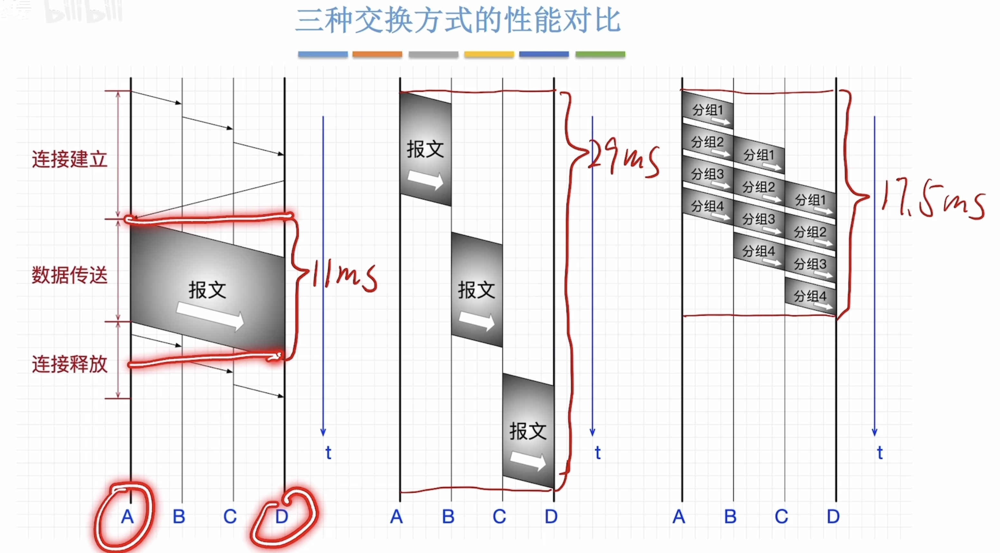

# 计算机网络

## 1.计算机网络体系结构

### **1.1计算机网络的概念**

计算机网络是将一个众多**分散的，自治的**计算机系统，通过通信设备与线路连接起来，由功能完善的软件实现**资源共享**和**信息传递**的系统。

**计算机网络，互连网，互联网的区别**

**计算机网络(Computer Networking)：**由若干**结点(node)**和连接这些结点的**链路(link)**组成。

结点可以是计算机，交换机，路由器等。

链路可以是有线链路，无线链路。

**互连网(internet)：**

可以把两个或多个计算机网络互相连起来，形成规模更大的计算机网络，也可成为**"互连网"**。

**互联网(Internet)：**

ISP：Internet Service Provider，即互联网服务提供商(如中国电信/移动/联通)

互联网必须使用**TCP/IP**通信协议

互连网可以使用任意协议。

### 1.2计网的组成和功能

**组成：**

硬件：主机(端系统)，通信设备(交换机，路由器)，通信链路(光纤，网线，同轴电缆)，网络适配器(网卡)

软件

协议：由硬件，软件共同实现

 

### 1.3电路交换，报文交换，分组交换

**电路交换：**

1.建立连接 (尝试占用通信资源)

2.通信(一直占用通信资源)

3.释放连接(归还通信资源)

电路交换的优点：

专用的物理通路，在通信的全部时间内，两个用户始终占用端到端的线路资源。数据直送，**传输速率高**。

电路交换的缺点：

建立/释放连接，需要额外的时间开销。

没有差错控制。

**报文交换：**

报文交换的优点：

- 通信前不需要建立连接
- 通信线路可以灵活分配
- 用户无需独占整条链路，线路利用率高
- 交换结点支持差错控制

报文交换的缺点：

- 报文不定长，不方便存储转发管理 
- 长报文存储转发时间开销大，缓存开销大
- 长报文容易出错，重传代价高

**分组交换：**

分组交换的优点：

分组定长，方便存储转发管理

分组的存储转发时间开销小，缓存开销小

分组不易出错，重传代价低

分组交换的缺点：

相比报文交换，控制信息占比增加

相比电路交换，依然存在存储转发时延

报文被拆分成多个分组，传输过程中可能出现失序，丢失等问题，增加处理的复杂度

### 1.4计算机网络的分类

**按分布范围分类**

**按传输技术分类**

- 广播式网络
- 点对点网络

**按拓扑结构分类**

**总线型结构：**数据广播式传输，存在总线竞争问题

**星型结构：**

**网状结构：**数据通过各中间结点逐一存储转发，属于点到点传输

典型代表：由众多路由器构建的广域网

### 1.5计网的性能指标

- 速率，带宽，吞吐量
- 时延，时延带宽积，往返时延
- 信道利用率

**1.速率**

指连接到网络上的节点在信道上传输数据的速率。也称数据率和比特率，数据传输速率。

单位：bit/s,b/s或**bps**

**2.带宽**

某信道所能传送的**最高数据率**

单位：**bps**

**3.吞吐量(Throughput)**

指**单位时间**内通过某个网络的**实际数据量**。

吞吐量受带宽限制，受复杂的网络负载情况影响。

