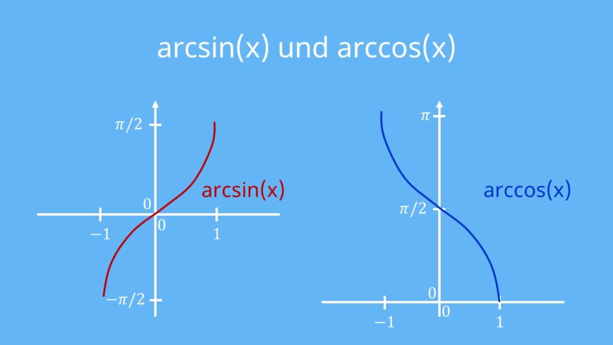
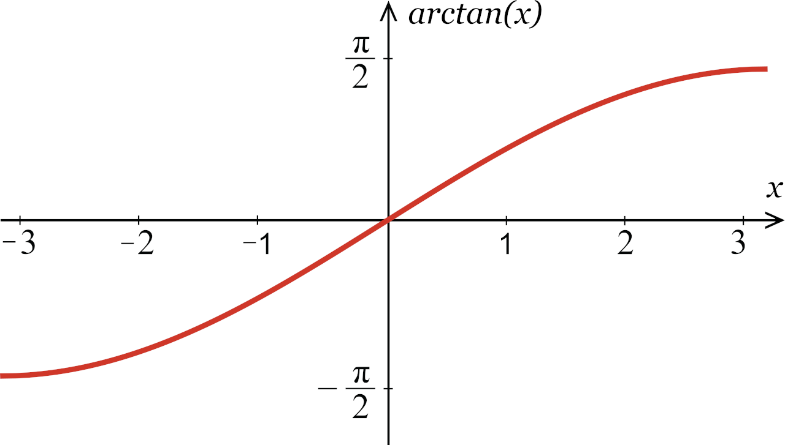

# 0.数学基础

## 1.三角函数

**弧度制：**半径为r的圆心角α所对的弧长为l，则α=l/r(弧度或rad)

角度制与弧度制互换：π rad = 180°

**6个三角函数：**

任意一个点P(x,y)：
$$
sinx = \frac{y}{r}\quad\quad cosx=\frac{x}{r}\quad\quad tanx = \frac{y}{x}\quad\quad (r=\sqrt{x^2+y^2})
$$

$$
\cot x = \frac{1}{\tan x} \quad\quad\sec x = \frac{1}{\sin x}\quad\quad\csc x = \frac{1}{\cos x}
$$

**注意：**躺在y轴上的角的正切值没有意义
$$
tanx = \frac{sinx}{cosx}\quad(x\neq k\pi+\frac{\pi}{2})
$$

### 正余弦函数

"五点法"画函数y=Asin(ωx+α)的图像

1.列表

| ωx+α         | 0    | π/2  | π    | 3π/2 | 2π   |
| ------------ | ---- | ---- | ---- | ---- | ---- |
| y=Asin(ωx+α) | 0    | 1    | 0    | -1   | 0    |
| x            |      |      |      |      |      |

2.描点

3.连线

**1.周期性**

T=2π

**2.奇偶性**

正弦函数是奇函数

余弦函数是偶函数

**3.对称性**

奇函数对于原点对称

偶函数对于y轴对称

**4.单调性**

画图理解。。。

**5.最值**

[-1,1]

### 正切函数

### 特殊角的值

### **诱导公式**

**任意角的三角函数的正负：**

一全正，二正弦，三正切，四余弦

口诀：奇变偶不变，符号看象限
$$
1.将诱导公式中括号内的角写作k* \frac{\pi}{2}\pm\alpha(k∈Z)\quad 
$$

$$
2.k为奇数，函数名变;k为偶数，函数名不变\quad\quad\quad\quad
$$

$$
3.一旦开始使用诱导公式，把\alpha一律当做锐角对待\quad\quad
$$

诱导公式大全：
$$
sin(2k\pi+\alpha)=sin\alpha\quad cos(2k\pi+\alpha)=cos\alpha\quad tan(2k\pi+\alpha)=tan\alpha
$$

$$
sin(-\alpha)=-sin\alpha\quad cos(-\alpha)=cos\alpha\quad tan(-\alpha)=-tan(\alpha)
$$

$$
sin(\pi-\alpha)=sin\alpha\quad cos(\pi-\alpha)=-cos\alpha\quad tan(\pi-\alpha)=-tan\alpha
$$

$$
sin(\pi+\alpha)=-sin\alpha\quad cos(\pi+\alpha)=-cos\alpha\quad tan(\pi+\alpha)=tan\alpha
$$

$$
sin(\frac{\pi}{2}-\alpha)=cos\alpha\quad cos(\frac{\pi}{2}-\alpha)=sin\alpha\quad tan(\frac{\pi}{2}-\alpha)=\frac{1}{tan\alpha}
$$

$$
sin(\frac{\pi}{2}+\alpha)=cos\alpha\quad cos(\frac{\pi}{2}+\alpha)=-sin\alpha\quad tan(\frac{\pi}{2}+\alpha)=-\frac{1}{tan\alpha}
$$

### 辅助角公式

$$
形如y=asinx+bcosx的式子，可引入辅助角\alpha将其合成为
$$

$$
asinx+bcosx=\sqrt{a^2+b^2}sin(x+\phi)(其中tan\alpha=\frac{b}{a})
$$

或者
$$
asinx+bcosx=\sqrt{a^2+b^2}cos(x-\phi)(其中tan\alpha=\frac{a}{b})
$$
**注意：**只有**同角**的正余弦的线性表示，才可以使用辅助角公式

### **两角和与差公式**

$$
sin(\alpha\pm\beta)=sin\alpha cos\beta \pm cos\alpha sin\beta\quad
$$

$$
cos(\alpha\pm\beta)=cos\alpha cos\beta \mp sin\alpha sin\beta
$$

$$
tan(\alpha\pm\beta)=\frac{tan\alpha\pm tan\beta}{1\mp tan\alpha*tan\beta}
$$

**注意：**根据前两个公式，可以推导出第三个公式

### 二倍角公式

$$
sin2x=2sinxcosx\quad sin^2x=\frac{1-cos2x}{2}\quad cos^2x=\frac{1+cos2x}{2}
$$

$$
tan2x=\frac{2tanx}{1-tan^2x}
$$

### **平方和公式**

$$
sin^2x + cos^2x=1\quad\quad\tan^2x+1=sec^2x\quad\quad\cot^2+1=csc^2x
$$

## 2.反三角函数

反函数和原函数的图像关于**y=x**对称

**arcsin(x)**
$$
y=sin(x) \quad x\in(-\infin,+\infin) \quad y\in[-1,1]
$$

$$
y=arcsin(x) \quad x\in[-1,1] \quad y\in[-\frac{\pi}{2},\frac{\pi}{2}]
$$

**arccos(x)**
$$
y=cos(x) \quad x\in(-\infin,+\infin)\quad y\in[-1,1]
$$

$$
y=arccos(x)\quad x\in[-1,1]\quad y\in[0,\pi]
$$

**arctan(x)**
$$
y=tan(x)\quad y\in(-\infin,+\infin)
$$

$$
y=arctan(x)\quad x\in(-\infin,+\infin)\quad y\in(-\frac{\pi}{2},\frac{\pi}{2})
$$

# 1.微积分

## 1.2数列极限

**数列极限的定义：**
$$
{x_n}是数列,\forall\epsilon>0,当n>N时,|x_n-a|<\epsilon,a是极限
$$

**数列极限的性质：**

1. 收敛数列的极限唯一

2. 收敛数列一定有界

3. 收敛数列具有保号性

4. 收敛数列的任一子数列收敛于同一极限

说明：

由此性质可知，若数列有两个子数列收敛于不同的极限，则原数列一定发散

## 1.3函数极限

**定义**
$$
f(x)在x_0的去心邻域内有定义,\exist A,\forall\epsilon>0,0<|x-x_0|<\delta时,\\|f(x)-A|<\epsilon,{\lim}\limits_{x\rightarrow\ x_0}f(x)=A
$$

$$
1.x \rightarrow x_0,f(x)极限存在\iff左右极限均存在且相等
$$

$$
2.x\rightarrow\infin,\forall\epsilon>0,\exist正数X,|x|>X时，|f(x)-A|<\epsilon\\{\lim}\limits_{x\rightarrow\ \infin}f(x)=A
$$

**性质**

1.函数极限唯一性

2.局部有界性
$$
{\lim}\limits_{x\rightarrow\ x_0}f(x)=A,\exist M>0,\delta>0,使得0<|x-x_0|<\delta时,\\|f(x)|\leq M
$$
3.局部保号性
$$
{\lim}\limits_{x\rightarrow\ x_0}f(x)=A,A>0,\exist\delta>0,使得0<|x-x_0|<\delta时，\\f(x)>0
$$

## 1.4无穷大与无穷小

**无穷小：**函数值趋于0叫无穷小
$$
x\rightarrow x_0(x\rightarrow\infin),f(x)极限是0，叫f(x)是x\rightarrow x_0(x\rightarrow \infin)时无穷小
$$

**无穷大：**函数值趋近于无穷(正或负)
$$
{\lim}\limits_{x\rightarrow\ x_0}f(x)=\infin
$$

$$
如果f(x)是无穷大，那么\frac{1}{f(x)}是无穷小\\如果f(x)是无穷小，那么\frac{1}{f(x)}是无穷大
$$

## 1.5极限运算法则

定理一：有限个无穷小的和还是无穷小

定理二：有界函数与无穷小的乘积是无穷小

定理三：
$$
limf(x)=A\quad limg(x)=B \quad \\(1)lim[f(x)\pm g(x)]=limf(x)\pm limg(x)=A\pm B\\(2)lim[f(x)*g(x)]=limf(x)*limg(x)\\(3)lim\frac{f(x)}{g(x)}=\frac{limf(x)}{limg(x)}(B\neq0)
$$
定理四：
$$
如果f(x)>g(x)，则limf(x)\geq limg(x)
$$

## 1.6极限存在准则

