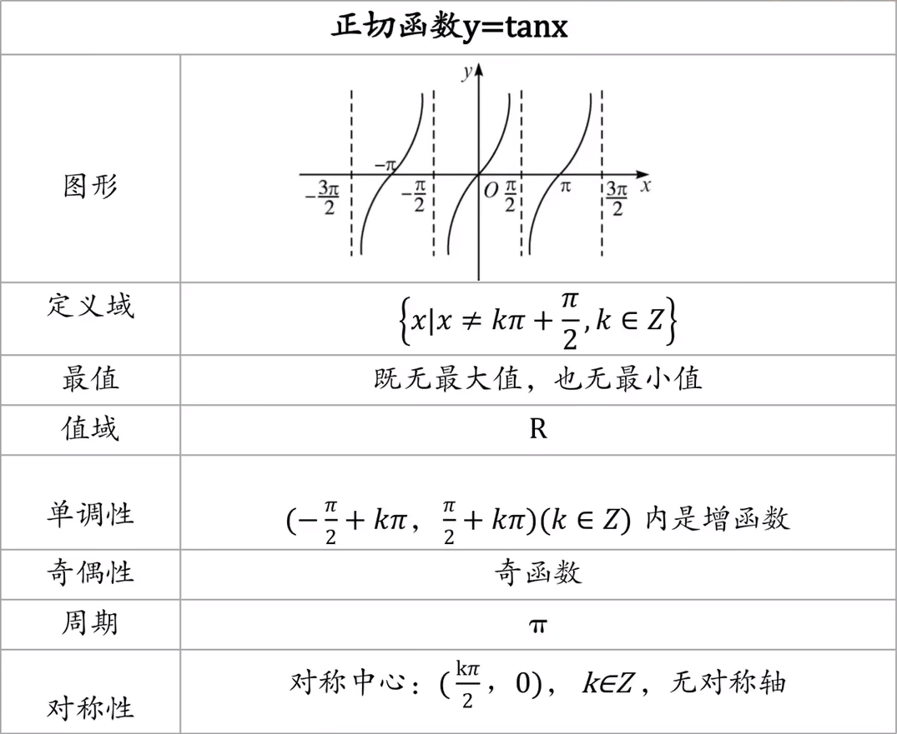
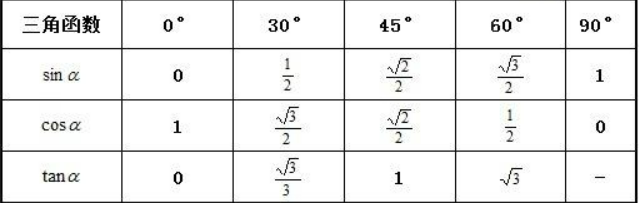
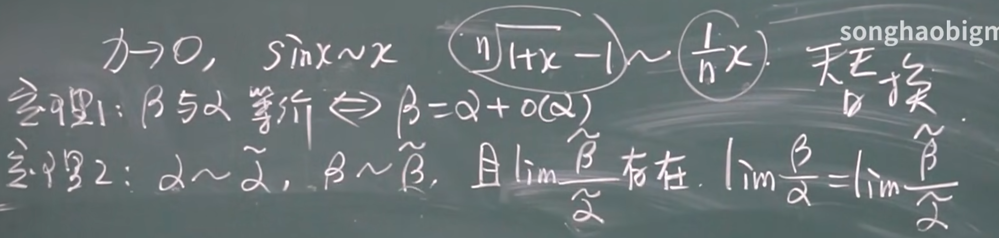
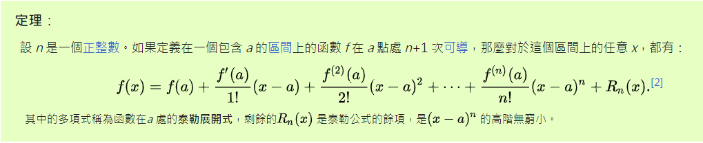

# 0.数学基础

## 1.三角函数

**弧度制：**半径为r的圆心角α所对的弧长为l，则α=l/r(弧度或rad)

角度制与弧度制互换：π rad = 180°

**6个三角函数：**

任意一个点P(x,y)：
$$
sinx = \frac{y}{r}\quad\quad cosx=\frac{x}{r}\quad\quad tanx = \frac{y}{x}\quad\quad (r=\sqrt{x^2+y^2})
$$

$$
\cot x = \frac{1}{\tan x} \quad\quad\sec x = \frac{1}{\sin x}\quad\quad\csc x = \frac{1}{\cos x}
$$

**注意：**躺在y轴上的角的正切值没有意义
$$
tanx = \frac{sinx}{cosx}\quad(x\neq k\pi+\frac{\pi}{2})
$$

### 正余弦函数

"五点法"画函数y=Asin(ωx+α)的图像

1.列表

| ωx+α         | 0    | π/2  | π    | 3π/2 | 2π   |
| ------------ | ---- | ---- | ---- | ---- | ---- |
| y=Asin(ωx+α) | 0    | 1    | 0    | -1   | 0    |
| x            |      |      |      |      |      |

2.描点

3.连线

**1.周期性**

T=2π

**2.奇偶性**

正弦函数是奇函数

余弦函数是偶函数

**3.对称性**

奇函数对于原点对称

偶函数对于y轴对称

**4.单调性**

画图理解。。。

**5.最值**

[-1,1]

### 正切函数

### 特殊角的值

### **诱导公式**

**任意角的三角函数的正负：**

一全正，二正弦，三正切，四余弦

口诀：奇变偶不变，符号看象限
$$
1.将诱导公式中括号内的角写作k* \frac{\pi}{2}\pm\alpha(k∈Z)\quad 
$$

$$
2.k为奇数，函数名变;k为偶数，函数名不变\quad\quad\quad\quad
$$

$$
3.一旦开始使用诱导公式，把\alpha一律当做锐角对待\quad\quad
$$

诱导公式大全：
$$
sin(2k\pi+\alpha)=sin\alpha\quad cos(2k\pi+\alpha)=cos\alpha\quad tan(2k\pi+\alpha)=tan\alpha
$$

$$
sin(-\alpha)=-sin\alpha\quad cos(-\alpha)=cos\alpha\quad tan(-\alpha)=-tan(\alpha)
$$

$$
sin(\pi-\alpha)=sin\alpha\quad cos(\pi-\alpha)=-cos\alpha\quad tan(\pi-\alpha)=-tan\alpha
$$

$$
sin(\pi+\alpha)=-sin\alpha\quad cos(\pi+\alpha)=-cos\alpha\quad tan(\pi+\alpha)=tan\alpha
$$

$$
sin(\frac{\pi}{2}-\alpha)=cos\alpha\quad cos(\frac{\pi}{2}-\alpha)=sin\alpha\quad tan(\frac{\pi}{2}-\alpha)=\frac{1}{tan\alpha}
$$

$$
sin(\frac{\pi}{2}+\alpha)=cos\alpha\quad cos(\frac{\pi}{2}+\alpha)=-sin\alpha\quad tan(\frac{\pi}{2}+\alpha)=-\frac{1}{tan\alpha}
$$

### 辅助角公式

$$
形如y=asinx+bcosx的式子，可引入辅助角\alpha将其合成为
$$

$$
asinx+bcosx=\sqrt{a^2+b^2}sin(x+\phi)(其中tan\alpha=\frac{b}{a})
$$

或者
$$
asinx+bcosx=\sqrt{a^2+b^2}cos(x-\phi)(其中tan\alpha=\frac{a}{b})
$$
**注意：**只有**同角**的正余弦的线性表示，才可以使用辅助角公式

### **两角和与差公式**

$$
sin(\alpha\pm\beta)=sin\alpha cos\beta \pm cos\alpha sin\beta\quad
$$

$$
cos(\alpha\pm\beta)=cos\alpha cos\beta \mp sin\alpha sin\beta
$$

$$
tan(\alpha\pm\beta)=\frac{tan\alpha\pm tan\beta}{1\mp tan\alpha*tan\beta}
$$

**注意：**根据前两个公式，可以推导出第三个公式

### 二倍角公式

$$
sin2x=2sinxcosx\quad sin^2x=\frac{1-cos2x}{2}\quad cos^2x=\frac{1+cos2x}{2}
$$

$$
tan2x=\frac{2tanx}{1-tan^2x}
$$

### **平方和公式**

$$
sin^2x + cos^2x=1\quad\quad\tan^2x+1=sec^2x\quad\quad\cot^2+1=csc^2x
$$

## 2.反三角函数

反函数和原函数的图像关于**y=x**对称

**arcsin(x)**
$$
y=sin(x) \quad x\in(-\infin,+\infin) \quad y\in[-1,1]
$$

$$
y=arcsin(x) \quad x\in[-1,1] \quad y\in[-\frac{\pi}{2},\frac{\pi}{2}]
$$

**arccos(x)**
$$
y=cos(x) \quad x\in(-\infin,+\infin)\quad y\in[-1,1]
$$

$$
y=arccos(x)\quad x\in[-1,1]\quad y\in[0,\pi]
$$

**arctan(x)**
$$
y=tan(x)\quad y\in(-\infin,+\infin)
$$

$$
y=arctan(x)\quad x\in(-\infin,+\infin)\quad y\in(-\frac{\pi}{2},\frac{\pi}{2})
$$

# 1.微积分

## 极限

### 1.2数列极限

**数列极限的定义：**
$$
{x_n}是数列,\forall\epsilon>0,当n>N时,|x_n-a|<\epsilon,a是极限
$$

**数列极限的性质：**

1. 收敛数列的极限唯一

2. 收敛数列一定有界

3. 收敛数列具有保号性

4. 收敛数列的任一子数列收敛于同一极限

说明：

由此性质可知，若数列有两个子数列收敛于不同的极限，则原数列一定发散

### 1.3函数极限

**定义**
$$
f(x)在x_0的去心邻域内有定义,\exist A,\forall\epsilon>0,0<|x-x_0|<\delta时,\\|f(x)-A|<\epsilon,{\lim}\limits_{x\rightarrow\ x_0}f(x)=A
$$

$$
1.x \rightarrow x_0,f(x)极限存在\iff左右极限均存在且相等
$$

$$
2.x\rightarrow\infin,\forall\epsilon>0,\exist正数X,|x|>X时，|f(x)-A|<\epsilon\\{\lim}\limits_{x\rightarrow\ \infin}f(x)=A
$$

**性质**

1.函数极限唯一性

2.局部有界性
$$
{\lim}\limits_{x\rightarrow\ x_0}f(x)=A,\exist M>0,\delta>0,使得0<|x-x_0|<\delta时,\\|f(x)|\leq M
$$
3.局部保号性
$$
{\lim}\limits_{x\rightarrow\ x_0}f(x)=A,A>0,\exist\delta>0,使得0<|x-x_0|<\delta时，\\f(x)>0
$$

### 1.4无穷大无穷小

**无穷小：**函数值趋于0叫无穷小
$$
x\rightarrow x_0(x\rightarrow\infin),f(x)极限是0，叫f(x)是x\rightarrow x_0(x\rightarrow \infin)时无穷小
$$

**无穷大：**函数值趋近于无穷(正或负)
$$
{\lim}\limits_{x\rightarrow\ x_0}f(x)=\infin
$$

$$
如果f(x)是无穷大，那么\frac{1}{f(x)}是无穷小\\如果f(x)是无穷小，那么\frac{1}{f(x)}是无穷大
$$

**无穷小的比较：**
$$
lim\frac{\beta}{\alpha}=0\quad 高阶无穷小 \quad \beta=o(\alpha)\\lim\frac{\beta}{\alpha}=\infin\quad 低阶无穷小\\lim\frac{\beta}{\alpha}=C\neq0\quad同阶无穷小
$$

**等价无穷小替换**

### 1.5极限运算法则

定理一：有限个无穷小的和还是无穷小

定理二：有界函数与无穷小的乘积是无穷小

定理三：
$$
limf(x)=A\quad limg(x)=B \quad \\(1)lim[f(x)\pm g(x)]=limf(x)\pm limg(x)=A\pm B\\(2)lim[f(x)*g(x)]=limf(x)*limg(x)\\(3)lim\frac{f(x)}{g(x)}=\frac{limf(x)}{limg(x)}(B\neq0)
$$
定理四：
$$
如果f(x)>g(x)，则limf(x)\geq limg(x)
$$

### 1.6极限存在准则

**准则1：**

$$
数列描述:有数列{x_n},{y_n}\\(1)\exist n_0\in N,n>n_0时，y_n\leq x_n \leq z_n\\(2){\lim}\limits_{n\rightarrow\ \infin}y_n=a,{\lim}\limits_{n\rightarrow\ \infin}z_n=a\\则{\lim}\limits_{n\rightarrow\ \infin}x_n=a
$$

$$
函数描述:\\(1)g(x)\leq f(x)\leq h(x)\\(2)limg(x)=A,limh(x)=A\\则limf(x)=A
$$

**准则2：**

单调有界数列必有极限

**两个重要极限**
$$
\begin{flalign*}
&(1){\lim}\limits_{x\rightarrow\ 0}\frac{sinx}{x}&\\&(2){\lim}\limits_{x\rightarrow\ \infin}(1+\frac{1}{x})^x=e\quad {\lim}\limits_{x\rightarrow\ 0}(a+x)^\frac{1}{x}=e
\end{flalign*}
$$

### 1.7函数的连续性

**增量(改变量)：**

当x的改变量趋近于0时，y的改变量的极限是0，是为连续
$$
\begin{flalign*}
&{\lim}\limits_{\Delta x\rightarrow\ 0}\Delta y={\lim}\limits_{\Delta x\rightarrow\ 0}(f(x_0+\Delta x)-f(x_0))=0&\\&{\lim}\limits_{ x\rightarrow\ x_0}f(x)=f(x_0)&
\end{flalign*}
$$
**连续条件：**

(1)有极限

(2)有定义

(3)极限=函数值

**连续的几何含义：**连续函数的图形是一个连续且不间断的曲线

**间断点：**

无穷间断点，可去间断点，震荡间断点，跳跃间断点

第一类间断点：左右极限都存在

第二类间断点：左右极限至少有一个不存在

## 导数

### 2.1导数定义

$$
\begin{flalign*}
&y=f(x)在x_0的邻域内有定义，x_0处取\Delta x，如果{\lim}\limits_{\Delta x\rightarrow\ x_0}\frac{f(x)-f(x_0)}{x-x_0}存在，&\\&那么就叫做y在x_0处可导，记作f^`(x_0),\frac{dy}{dx}|_{x=x_0}&
\end{flalign*}
$$

**单侧导数**
$$
可导\iff左右导数皆存在且相等
$$

**可导的几何含义：**函数曲线光滑

可导一定连续，连续不一定可导

### 2.2求导法则

**和差积商**
$$
\begin{flalign*}
&(u\pm v)'=u'\pm v'&\\
&(uv)'=u'v+uv'&\\
&(\frac{u}{v})'=\frac{u'v-uv'}{v^2}&
\end{flalign*}
$$

**三角函数的导数**
$$
(tanx)'=sec^2x\quad (cotx)^2=-csc^2x\quad (secx)'=secxtanx\\(cscx)'=-cscxcotx \quad (log_ax)'=\frac{1}{xlna} \quad (lnx)'=\frac{1}{x} \\(a^x)'=a^xlna \\(arcsinx)'=\frac{1}{\sqrt{1-x^2}}\quad (arccos)'=-\frac{1}{\sqrt{1-x^2}}\\ (arctanx)'=\frac{1}{1+x^2}\\(uvw)'=u'vw+uv'w+vuw'
$$

**链式法则**
$$
\begin{flalign*}
&定理:u=g(x)可导，y=f(u)在u处可导，y=f[g(x)]可导&\\ &\frac{dy}{dx}=f'(u)g'(x)&
\end{flalign*}
$$

**高阶导数**
$$
\frac{d^2y}{dx^2}
$$

## 微分

$$
可微\iff可导\\导数可以看做两个微分的商:\frac{dy}{dx}\\dy=f'(x)dx
$$

### 微分中值定理

驻点：导数等于0的点

**罗尔定理：**

f(x)满足：

(1)在[a,b]连续

(2)在(a,b)可导

(3)f(a)=f(b)
$$
\begin{flalign*}&则至少\exist \xi\in(a,b),f'(\xi)=0&\end{flalign*}
$$

**拉格朗日中值定理：**

f(x)满足：

(1)在[a,b]连续

(2)在(a,b)可导
$$
\begin{flalign*}
&(a,b)至少有一点\xi，使得f(b)-f(a)=f'(\xi)(b-a)&
\end{flalign*}
$$

**柯西中值定理：**

若f(x)和F(x)
$$
\begin{flalign*}
&(1)在[a,b]连续&\\
&(2)在(a,b)可导&\\
&(3)\forall x\in(a,b),F'(x)\neq0&\\
&至少有一点\xi,使得\frac{f(b)-f(a)}{F(b)-F(a)}=\frac{f'(\xi)}{F'(\xi)}&
\end{flalign*}
$$

### 洛必达法则

**定理1:**
$$
\begin{flalign*}
&(1)x\rightarrow a时，f(x)\rightarrow 0,F(x)\rightarrow 0&\\
&(2)在a的去心邻域内,f'(x),F'(x)存在且F'(x)\neq 0&\\
&(3){\lim}\limits_{x\rightarrow\ a}\frac{f'(x)}{F'(x)}存在(或无穷大)&\\
&则{\lim}\limits_{x\rightarrow\ a}\frac{f(x)}{F(x)}={\lim}\limits_{x\rightarrow\ a}\frac{f'(x)}{F'(x)}&
\end{flalign*}
$$

**定理2：**
$$
\begin{flalign*}

&(1)x\rightarrow \infin时，f(x)\rightarrow 0,F(x)\rightarrow 0&\\
&(2)在a的去心邻域内,f'(x),F'(x)存在且F'(x)\neq 0&\\
&(3){\lim}\limits_{x\rightarrow\ a}\frac{f'(x)}{F'(x)}存在(或无穷大)&\\
&则{\lim}\limits_{x\rightarrow\ a}\frac{f(x)}{F(x)}={\lim}\limits_{x\rightarrow\ a}\frac{f'(x)}{F'(x)}&
\end{flalign*}
$$

### 泰勒公式

### 函数性质

#### 单调性

$$
x<0,y'<0,单调减\\
x>0,y'>0,单调增
$$

#### 凹凸性

正凹负凸
$$
f''(x)正,凹\\
f''(x)负,凸
$$

$$

$$

## 不定积分

$$
\int f(x)dx=F(x)+C
$$

**不定积分的性质**
$$
\int [f(x)+g(x)]dx=\int f(x)+\int g(x)
$$

$$
\int kf(x)dx=k\int f(x)dx
$$

### **一类换元积分法**

第一类换元法的基本思想是配凑的思想。

### **二类换元积分法**

### **分部积分法**

$$
\int udv = uv -\int vdu
$$

选择u的顺序：LIATE

**L**ogarithmic, 

**I**nverse Trigonometric, 

**A**lgebraic, 

**T**rigonometric, 

**E**xponential

## 定积分

积分只与f(x)和[a,b]有关，与积分变量无关

定理一：只要连续，就可积

定理二：有界，有有限个间断点，可积

### 定积分性质

$$
1)b=a,\int_{a}^{b}f(x)=0\\
2)\int_{a}^{b} f(x)dx = -\int_{b}^{a}f(x)dx
$$

$$
性质1:\int_{a}^{b}(\alpha f(x)+\beta g(x))dx=\alpha\int_{a}^{b} f(x)dx+\beta \int_{a}^{b} g(x)dx
$$

$$
性质2:a<c<b\quad \int_{a}^{b} f(x)dx=\int_{a}^{c} f(x)dx+\int_{c}^{b} f(x)dx
$$

$$
性质3:f(x)\equiv 1,\int_{a}^{b} 1dx=b-a
$$

$$
性质4:f(x)\ge0,\int_{a}^{b} f(x)dx\ge0\\f(x)\le0,\int_{a}^{b} f(x)dx\le0
$$

**定积分中值定理**
$$
f(x)连续,\exist \alpha\in[a,b],\int_{a}^{b} f(x)dx = f(\alpha)(b-a)\\f(\alpha)=\frac{1}{b-a}\int_{a}^{b} f(x)dx,平均值
$$

**积分上限求导公式**
$$
\int_{\psi(x)}^{\phi(x)} f(t)dt=f(\phi(x))\psi'(x)-f(\psi(x))\psi'(x)
$$

**牛顿-莱布尼茨公式**
$$
\int_{a}^{b} f(x)dx=F(x)|_a^b=F(b)-F(a)
$$

### 换元积分法

函数的元换了，范围也要跟着换

**重要结论**
$$
[-a,a],f(x)是偶函数，\int_{-a}^{a}f(x)dx=2\int_{0}^{a}f(x)dx
$$

$$
[-a,a],f(x)是奇函数，\int_{-a}^{a}f(x)dx=0
$$

### 分部积分法

### 广义积分

$$
\int_{-\infin}^{+\infin}f(x)dx=\int_{-\infin}^{0}f(x)dx+\int_{0}^{+\infin}f(x)dx
$$

